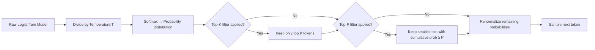
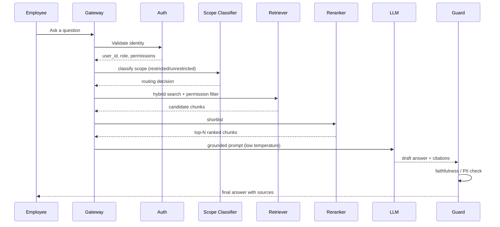
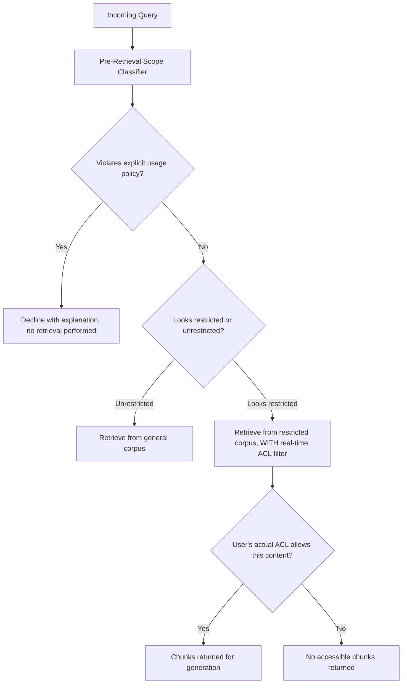
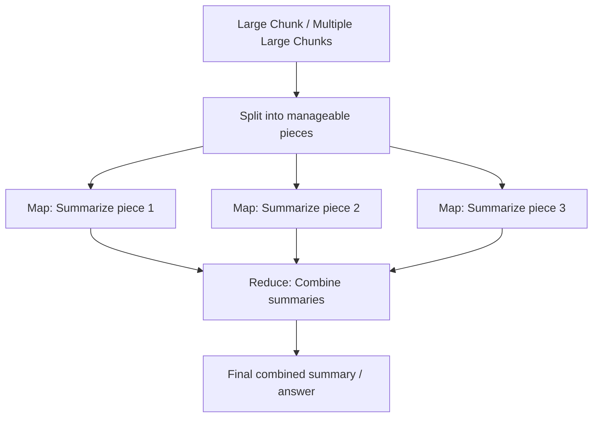
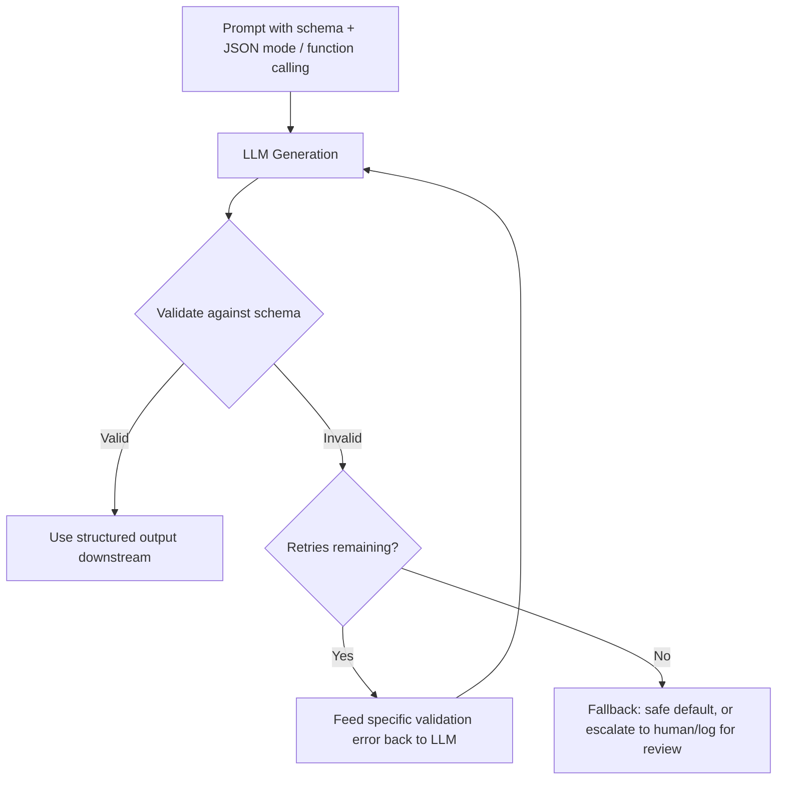
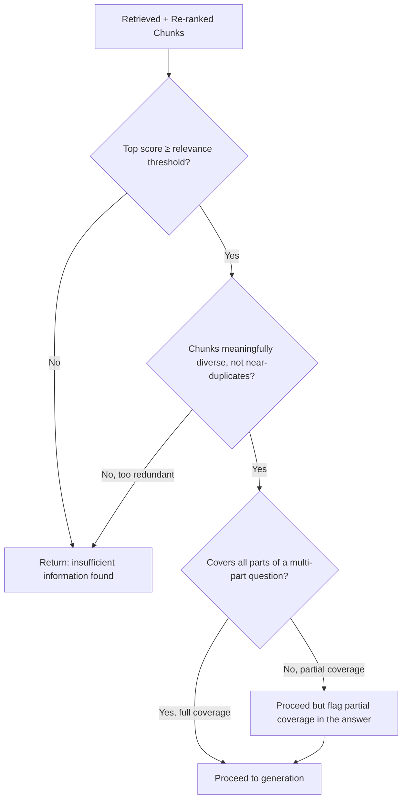

# LLM Sampling, RAG Design, Function Calling & Evaluation — Interview Notes

> Companion notes covering LLM decoding parameters (temperature, Top-K, Top-P), practical RAG system design questions, function calling mechanics, and pre-generation evaluation — written in the same beginner-friendly, "why not just what" style as the rest of this interview prep set.

## Table of Contents

- [Part A: LLM Sampling Parameters](#part-a-llm-sampling-parameters)
  - [A.1 What is Temperature?](#a1-what-is-temperature-in-llms)
  - [A.2 Top-K and Top-P — Difference & Use Cases](#a2-top-k-and-top-p--difference--use-cases)
- [Part B: RAG & System Design](#part-b-rag--system-design)
  - [B.1 Designing a RAG System for an Employee's Question](#b1-designing-a-rag-system-for-an-employees-question)
  - [B.2 Restricted vs. Unrestricted Questions — Before Retrieval](#b2-handling-restricted-vs-unrestricted-questions-before-retrieval)
  - [B.3 Handling Large Chunks in a RAG Pipeline](#b3-handling-large-chunks-in-a-rag-pipeline)
  - [B.4 Forcing Fixed-Format Output (JSON / CSV)](#b4-ensuring-fixed-format-output-json--csv)
- [Part C: Function Calling](#part-c-function-calling-llm)
  - [C.1 What is Function Calling?](#c1-what-is-function-calling-in-llms)
  - [C.2 How Does the LLM Decide Which Function to Call?](#c2-how-does-an-llm-decide-which-function-to-call)
  - [C.3 Validating Incorrect / Partial Function Responses](#c3-validating-and-handling-incorrect-or-partial-function-responses)
- [Part D: Evaluation & Metrics](#part-d-evaluation--metrics)
  - [D.1 Evaluating Retrieved Chunks Before Generation](#d1-evaluating-retrieved-chunks-before-generation)
  - [D.2 Evaluation Metrics: Recall@K, Precision@K & More](#d2-evaluation-metrics-recallk-precisionk--more)
- [Consolidated Cheat Sheet & Interview Ready](#consolidated-cheat-sheet--interview-ready)

---

# Part A: LLM Sampling Parameters

## A.1 What is Temperature in LLMs?

### ⚡ Quick Summary

**What is it?** Temperature is a number that controls how "random" or "focused" an LLM's next-token choice is. It works by reshaping the model's probability distribution over possible next tokens before a token is actually picked.

**Why is it used?**
- The same model can be asked for very different things — a precise factual answer versus a creative story — and these need different points on the determinism-vs-variety spectrum.
- Without any control, you're stuck choosing between always picking the single most likely token (repetitive, robotic) or sampling raw probabilities as-is (can occasionally pick a bizarre, unlikely token).
- Temperature gives one simple dial to move along that spectrum.

**How does it work?** The model produces raw scores (logits) for every possible next token. Temperature divides those logits by a value `T` before converting them into probabilities (via softmax). Dividing by a small `T` (< 1) exaggerates the gaps between scores, making the top token even more dominant. Dividing by a large `T` (> 1) shrinks the gaps, making the distribution flatter and more tokens competitive.

**Key points to remember**
- `T = 0` → effectively greedy decoding (always the single most likely token, fully deterministic).
- `T = 1` → the distribution is used as the model produced it, unmodified.
- `T < 1` → sharper, more focused, more repeatable output.
- `T > 1` → flatter, more diverse, more surprising (and riskier) output.
- Temperature reshapes probabilities; it doesn't remove any tokens from consideration — that's what Top-K/Top-P do (see A.2).

**One-line interview answer**
> "Temperature scales the logits before softmax — low temperature sharpens the distribution toward the most likely token for consistent, factual output, high temperature flattens it for more diverse, creative output, and temperature zero approximates greedy decoding."

### 🧠 Build from the Basics

**Problem:** An LLM's raw output for "what comes next" is a probability distribution over its entire vocabulary. Left alone, you have two bad extremes: always take the top pick (boring, repetitive, gets stuck in loops) or sample exactly as trained (can occasionally produce something nonsensical from the distribution's long tail).

**Why was this needed?** Different tasks sit at different points on this spectrum — code generation and data extraction want consistency; brainstorming and creative writing want variety. One fixed sampling behavior can't serve both well.

**Solution:** Add a single tunable parameter that reshapes the distribution's "sharpness" before sampling, letting the same underlying model serve both ends of the spectrum.

**Core idea:** `softmax(logits / T)` — dividing by a number less than 1 makes big scores look even bigger relative to small ones; dividing by a number greater than 1 makes them all look more similar.

### 🔍 Detailed Explanation — Why It Works This Way

**Why does dividing by T < 1 sharpen the distribution?** Softmax is sensitive to the *relative* gaps between logits, not their absolute size. Dividing all logits by a number less than 1 effectively multiplies the gaps between them (e.g., dividing by 0.5 is the same as doubling the differences), so after softmax, the already-highest-scoring token pulls even further ahead in probability.

**What happens at the extremes?**
- As `T → 0`, the distribution collapses toward a one-hot vector on the single highest-logit token — this is mathematically the same behavior as greedy decoding. (Implementations special-case `T = 0` rather than literally dividing by zero.)
- As `T → ∞`, all logits get squashed toward zero difference, and the distribution approaches uniform random selection across the entire vocabulary — coherence breaks down well before this extreme is reached.

**Trade-off:** Low temperature gives consistency and factual reliability but risks repetitive, "stuck" output for open-ended tasks. High temperature gives variety and creativity but risks incoherent or factually unreliable output. **When would you choose differently?** Factual QA, code generation, structured data extraction, and RAG-grounded answers typically want low temperature (0–0.3); creative writing, brainstorming, and varied marketing copy typically want higher temperature (0.7–1.2); a general-purpose assistant often defaults to a moderate value (~0.7) as a balance.

### 💻 Practical Example

```python
# Anthropic API example
response = client.messages.create(
    model="claude-...",
    temperature=0.1,   # low: consistent, factual — good for a RAG QA endpoint
    messages=[{"role": "user", "content": "What is our refund policy for late claims?"}]
)

response_creative = client.messages.create(
    model="claude-...",
    temperature=0.9,   # high: varied, exploratory — good for brainstorming taglines
    messages=[{"role": "user", "content": "Give me 5 creative taglines for a coffee brand."}]
)
```

### 🚨 Common Mistakes

- **Assuming `T = 0` alone guarantees fully deterministic output** across all providers/settings — some systems still have minor non-determinism from batching/hardware, even at `T = 0`.
- **Using high temperature for a factual RAG system** because "it makes answers more interesting" — this directly increases hallucination risk in exactly the use case where grounding matters most.
- **Treating temperature as the only lever** — it's almost always used *together* with Top-K/Top-P, not instead of them (see A.2).

### 🎯 Interview Q&A

**🟢 Q: What does temperature = 0 do?** *Short answer:* Approximates greedy decoding — always picks the highest-probability token, fully deterministic. *Follow-up:* "Is it ever risky?" — It can get stuck in repetitive loops on some prompts, since there's no randomness to break out of a degenerate pattern.

**🟡 Q: Why not just always use a low temperature for reliability?** *Short answer:* Low temperature reduces variety and can make output feel repetitive or overly rigid for open-ended tasks; the right value depends on whether the task rewards consistency or exploration. *Follow-up:* "How would you choose a value for a production RAG assistant?" — Start low (0.1–0.3) for factual grounding, and validate against your evaluation suite (see Part D) rather than guessing.

**🔴 Q: How does temperature interact with Top-K/Top-P — does order matter?** *Short answer:* Temperature reshapes the probability distribution first; Top-K/Top-P then filter *which* tokens remain eligible from that reshaped distribution before final sampling. *Follow-up:* "What happens if you set a high temperature but a very restrictive Top-P?" — Top-P will still cut off the long tail temperature just fattened, so the practical effect is dampened — this is exactly why these parameters need to be tuned together, not independently.

---

## A.2 Top-K and Top-P — Difference & Use Cases

### ⚡ Quick Summary

**What is it?** Two different techniques for *truncating* the set of candidate next-tokens before sampling — cutting off the improbable "tail" of the distribution so an unlucky low-probability token doesn't get picked and derail the output.
- **Top-K** keeps a **fixed number** (K) of the highest-probability tokens.
- **Top-P** (nucleus sampling) keeps the **smallest set** of top tokens whose cumulative probability exceeds a threshold P.

**Why is it used?** Even after temperature scaling, the distribution still technically assigns some non-zero probability to thousands of unlikely tokens — sampling directly from that full distribution occasionally produces an incoherent choice. Truncating the candidate pool before sampling avoids this without making output fully deterministic.

**How does it work?**
- *Top-K:* sort tokens by probability, keep only the top K, renormalize probabilities among those K, sample.
- *Top-P:* sort tokens by probability descending, keep adding tokens until their cumulative probability crosses P, renormalize that (dynamically-sized) set, sample.

**Key points to remember**
- Top-K's cutoff size is **fixed**, regardless of how confident or uncertain the model is at that step.
- Top-P's cutoff size is **dynamic** — a very confident (peaked) distribution might only need 2–3 tokens to reach P=0.9; a very uncertain (flat) distribution might need dozens.
- This adaptiveness is why Top-P is generally considered more robust than Top-K alone.
- Many production systems use **both together** — Top-K as a coarse, cheap pre-filter, Top-P as the finer, distribution-aware filter.

**One-line interview answer**
> "Top-K keeps a fixed number of highest-probability tokens; Top-P keeps a dynamically-sized set based on cumulative probability, adapting to how confident the model is at each step — which is why Top-P is generally preferred for coherence, though many systems combine both."

### 🧠 Build from the Basics

**Problem:** A fixed-size cutoff (Top-K) doesn't account for how the probability mass is actually distributed at a given step — sometimes the model is very sure (one token dominates), sometimes it's genuinely uncertain (many tokens are similarly plausible).

**Why was this needed?** If the model is very confident and you use a fixed K=40, you might still be including 39 implausible tokens that shouldn't realistically be candidates. If the model is uncertain and you use the same K=40, you might be excluding reasonable 41st/42nd-place candidates that deserved consideration.

**Solution:** Instead of a fixed count, use a cumulative-probability threshold that naturally shrinks the candidate set when the model is confident and grows it when the model is uncertain.

**Core idea:** "Keep adding the next most likely token until you've captured P% of the total probability mass" — the size of that set is a *consequence* of the distribution's shape, not a fixed input.

### 🔍 Detailed Explanation — Why Top-P Is Often Preferred

**Numeric walkthrough:** Suppose the model's next-token probabilities (already temperature-scaled) are `[0.40, 0.30, 0.15, 0.10, 0.05]` for the top 5 candidates.
- **Top-K = 3** keeps `[0.40, 0.30, 0.15]` (renormalized to sum to 1), regardless of how much probability mass that captures (here, 85%).
- **Top-P = 0.9** keeps adding until cumulative ≥ 0.9: `0.40 + 0.30 = 0.70`, `+ 0.15 = 0.85`, `+ 0.10 = 0.95` ≥ 0.9 → keeps **4 tokens**, capturing 95% of the mass.

**Why does the difference matter?** In a highly confident step (say, probabilities `[0.85, 0.05, 0.03, 0.02, ...]`), Top-P=0.9 would keep just 1–2 tokens, correctly recognizing there's little real ambiguity — while Top-K=3 would still force 3 candidates into contention, artificially inflating the chance of picking a much less likely token.

**Trade-off:** Top-K is computationally trivial and predictable but can be wrong in both directions depending on the model's per-step confidence. Top-P adapts to the distribution shape but is slightly more computationally involved (requires a cumulative sum) and its "right" threshold still needs tuning per use case.

**When would you use each?** Top-K alone is fine for simpler, less quality-sensitive applications where predictability of candidate-pool size matters more than adaptiveness. Top-P is generally the better default for maintaining coherence in open-ended generation. Combining both (Top-K as a hard ceiling for efficiency, Top-P as the adaptive filter within that ceiling) is common in production serving stacks.

### 📊 The Full Sampling Pipeline (Temperature + Top-K + Top-P Together)



### 🧩 Explain the Diagram

**Step 1 — Logits → Temperature:** Temperature is applied first, reshaping the *entire* distribution's sharpness before any candidates get removed — this is why temperature and Top-P interact (a flatter distribution after high temperature means Top-P needs more tokens to reach the same cumulative threshold).

**Step 2 — Softmax → Top-K → Top-P, in sequence:** Filters are typically applied in this order — Top-K first as a cheap, fixed-size pre-filter (if used), then Top-P as a finer, adaptive filter on what remains. Both are optional; many systems use only Top-P, or only Top-K, or neither (raw temperature sampling).

**Step 3 — Renormalize before sampling:** After removing tokens, the remaining probabilities no longer sum to 1 — they must be renormalized so the final sampling step is a valid probability draw over just the surviving candidates.

**Step 4 — Sample:** Only at the very end is an actual token randomly drawn, from the final filtered-and-renormalized distribution — everything before this point was about *shaping which tokens are even eligible* and *how much weight each carries*.

### 🚨 Common Mistakes

- **Setting Top-P very low (e.g., 0.5) expecting more "safety"** — this can make output overly repetitive/restrictive since even reasonable alternative phrasings get excluded.
- **Setting Top-K very high thinking it's "safer than no filter"** — for a peaked, confident distribution, a large K still leaves many implausible tokens technically eligible.
- **Tuning temperature and Top-P independently without testing them together** — their combined effect isn't always intuitive from each parameter in isolation.

### 🎯 Interview Q&A

**🟢 Q: What's the core difference between Top-K and Top-P?** *Short answer:* Top-K keeps a fixed number of top tokens; Top-P keeps a dynamically-sized set based on cumulative probability. *Follow-up:* "Which adapts to model confidence?" — Top-P.

**🟡 Q: Why might Top-P produce better output than Top-K in practice?** *Short answer:* Because it responds to how peaked or flat the distribution actually is at each step, rather than forcing the same candidate-pool size regardless of the model's real uncertainty. *Follow-up:* "Is there ever a case Top-K is preferable?" — When you need predictable, bounded computation/candidate-pool size regardless of distribution shape, or for simpler applications where this nuance doesn't matter.

**🔴 Q: How would you tune temperature, Top-K, and Top-P together for a production RAG QA system where consistency matters but robotic repetition is undesirable?** *Short answer:* Start with a low-to-moderate temperature (0.2–0.4) to keep answers grounded, use Top-P around 0.9–0.95 as the primary adaptive filter, and either skip Top-K or set it loosely (e.g., 40–50) as just a computational safety net rather than the main control. *Detailed:* The goal is to eliminate the incoherent long tail without over-constraining legitimate phrasing variety — validate the final combination against your evaluation suite (faithfulness, answer relevancy) rather than picking values from intuition alone. *Follow-up:* "How would you detect if your settings are too restrictive?" — Watch for repetitive or oddly truncated-feeling phrasing across many generations, or a spike in "I don't know" responses to answerable questions.

---

# Part B: RAG & System Design

## B.1 Designing a RAG System for an Employee's Question

### ⚡ Quick Summary

**What is it?** A walkthrough of exactly what should happen, step by step, from the moment an employee types a question until they receive a grounded, permission-safe answer.

**How does it work? (the full flow)**
1. **Identify the employee** (auth/SSO) and resolve their permissions.
2. **Classify the query's scope** — restricted vs. unrestricted, general knowledge vs. internal (see B.2).
3. **Retrieve** relevant chunks using hybrid search (dense + keyword), with the permission filter applied *inside* the retrieval query.
4. **Re-rank** the shortlist for precision.
5. **Assemble a grounded prompt** with the question, retrieved context, and citation instructions.
6. **Generate** the answer with an appropriately low temperature for factual reliability (see Part A).
7. **Guardrail-check** the output (faithfulness, PII, policy) before it's shown.
8. **Return the answer with citations**, so the employee can verify the source.

**Key points to remember**
- Permission enforcement happens *inside* the retrieval call, never as an afterthought.
- Every step exists to catch a specific failure mode of the step before it (bad retrieval → re-ranking; unfaithful generation → guardrail check).
- The design should degrade gracefully — "I don't have information on this" is a valid, safe output when retrieval finds nothing good enough.

**One-line interview answer**
> "I'd resolve identity and permissions first, classify the query's scope, run permission-filtered hybrid retrieval and re-ranking, generate a grounded answer at a low temperature with mandatory citations, and run a faithfulness/guardrail check before returning anything — with an explicit 'I don't know' fallback if retrieval doesn't find good enough context."

### 🔍 Detailed Explanation — Why Each Step Exists

**Why identify the employee before anything else?** Every downstream decision (what can be retrieved, what tone/detail level is appropriate) depends on who's asking — doing this first also lets you fail fast (reject an invalid session) before spending any compute on retrieval or generation.

**Why classify scope before retrieving?** It determines *which* index/corpus should even be searched, and whether the question should be blocked outright — see B.2 for the full reasoning.

**Why hybrid search, not just one method?** Employee questions range from conceptual ("how do I request parental leave") to exact-term ("what does error E4021 mean") — dense embeddings handle the former well, BM25 keyword search handles the latter, and combining them (via Reciprocal Rank Fusion) covers both without picking one at the expense of the other.

**Why re-rank after retrieval?** The first-pass retrieval (dense + sparse) is optimized for speed across a huge index; a slower, more accurate cross-encoder re-ranker is only run on the small shortlist, giving a final precision boost without the cost of running it against everything.

**Why enforce a low temperature at generation?** An internal Q&A assistant is a factual-reliability use case (see A.1) — creativity/variety isn't a goal here, consistency and grounding are.

**Why guardrail-check *after* generation, when the prompt already said "only use the context"?** System prompt instructions are a strong nudge, not an unbreakable rule — models can still deviate under ambiguous retrieval or edge-case phrasing, so an independent post-generation check catches what the instruction alone might miss.

### 📊 Sequence Diagram



### 🧩 Explain the Diagram

**Step 1 — Auth resolves before classification, classification resolves before retrieval:** Each step's output is required input for the next — you can't classify scope meaningfully without knowing the user's role, and you shouldn't retrieve before knowing which corpus/permissions apply.

**Step 2 — Retriever → Reranker → LLM is a precision funnel:** Each stage narrows and refines the candidate set — broad-but-fast retrieval, then narrow-but-accurate re-ranking, then generation only over the final, small, high-quality context.

**Step 3 — Guard sits between LLM and the Employee, not before generation:** Faithfulness/PII checking is inherently a *post-generation* check — you can't verify what the model actually said until it's said it — which is why this checkpoint exists at the very end of the chain, right before the answer is delivered.

### 💻 Practical Example

**Requirement:** An employee asks, *"What's the process for filing an expense report over $500?"*

**Flow in practice:** Auth confirms the employee is in the Finance-adjacent access group. The scope classifier tags this as an unrestricted, general-policy question (no PII, no client data). Hybrid retrieval pulls the relevant sections of the expense policy handbook. Re-ranking surfaces the specific "high-value expense approval" clause. Generation (temperature 0.2) produces a grounded answer citing the handbook section and page. The guardrail check confirms every claim traces back to the retrieved clause. The employee receives the answer plus a link to the source policy page.

### 🚨 Common Mistakes

- **Skipping the scope classification step** and running every query through the same retrieval path regardless of sensitivity.
- **Generating at a high temperature** for a factual internal-knowledge assistant, increasing hallucination risk unnecessarily.
- **No explicit "insufficient information" fallback** — letting the LLM guess when retrieval genuinely found nothing relevant.

### 🎯 Interview Q&A

**🟡 Q: Why put a re-ranking step between retrieval and generation instead of just increasing top-k from the first retrieval pass?** *Short answer:* First-pass retrieval is optimized for speed across the whole index and isn't as precise as a cross-encoder; re-ranking adds precision cheaply because it only runs on a small shortlist, not the whole corpus. *Follow-up:* "What if you skipped re-ranking entirely?" — You'd likely need a larger top-k to compensate, feeding more (and noisier) context into the LLM, which increases both cost and hallucination risk from irrelevant context.

**🔴 Q: How would this design change for a question that spans multiple documents (e.g., "compare our parental leave policy across our US and EU offices")?** *Short answer:* Retrieval needs to ensure diverse coverage, not just top-k by relevance score alone — techniques like maximal marginal relevance (MMR) or explicitly retrieving per-sub-topic (US policy, EU policy separately) prevent the top-k from being dominated by near-duplicate chunks from just one region's documents. *Follow-up:* "How would you detect this need automatically?" — A query decomposition step (breaking a multi-part question into sub-questions) before retrieval, similar in spirit to the agentic workflow pattern of breaking a goal into subtasks.

---

## B.2 Handling Restricted vs. Unrestricted Questions — Before Retrieval

### ⚡ Quick Summary

**What is it?** A classification step that runs *before* any retrieval happens, deciding whether a question should be answered using the general/unrestricted corpus, routed to a permission-filtered restricted corpus, or blocked/redirected outright — as distinct from (and in addition to) the ACL filtering that happens *during* retrieval itself.

**Why is it used?**
- **Efficiency**: no reason to query a sensitive, tightly-permissioned index for a question that's clearly general knowledge.
- **Reduced exposure surface**: the restricted index is only ever touched when actually necessary, minimizing the number of code paths that ever handle sensitive content.
- **Policy enforcement beyond permissions**: some questions should be declined regardless of the asker's permissions (e.g., a question that's technically askable by an HR-role employee but violates a stated usage policy) — permission and *policy* are related but distinct checks.

**How does it work?**
1. The raw query is passed to a lightweight classifier (a small model or a rules/embedding-similarity-based system) *before* retrieval begins.
2. The classifier estimates: does this look like it needs restricted/internal content, and does it match any explicitly disallowed pattern?
3. Based on the result, the query is routed to the unrestricted corpus, the restricted corpus (still further filtered by the user's actual ACL at retrieval time), or rejected with an explanation.

**Key points to remember**
- **This pre-retrieval classifier is a UX/efficiency/policy layer — it is not the actual security boundary.** The real security enforcement still happens as an ACL filter *inside* the retrieval query itself (defense in depth) — never rely on the classifier alone to prevent unauthorized access.
- A classifier can be wrong in both directions: false positive (blocking a legitimate question) hurts usability; false negative (letting a restricted-leaning question through to unrestricted retrieval) is a lesser risk *only if* ACL filtering at retrieval remains intact as the real safeguard.
- This step is about routing and policy, not the final permission decision.

**One-line interview answer**
> "I run a lightweight scope classifier before retrieval to route the query to the right corpus and catch outright-disallowed requests early — but that classifier is a UX and efficiency layer, not the security boundary; the actual enforcement still happens as an ACL filter inside the retrieval query itself, as defense in depth."

### 🔍 Detailed Explanation — Why This Has to Be Two Separate Checks

**Why not rely on the pre-retrieval classifier alone?** A classifier operating only on the query text, without knowledge of the specific user's exact permissions, can't make a fully correct authorization decision — it can only make a reasonable *routing* guess. **What happens if you treat it as the sole safeguard?** A classifier error (and all classifiers have a non-zero error rate) becomes a direct security bypass, with no second layer to catch the failure — this is exactly the "single point of failure" problem that defense-in-depth design principles exist to avoid (see the Guardrails and Access Control topics for the same underlying philosophy).

**Why do it before retrieval at all, then, if it's not the real security boundary?** Two genuine benefits remain even though it's not the security layer: (1) efficiency — avoiding an unnecessary query against a more tightly-controlled, possibly slower or more expensive index for questions that obviously don't need it, and (2) policy enforcement that's broader than pure access control — e.g., declining to help with a request that's technically within the user's data access rights but violates a stated acceptable-use policy (like asking the assistant to draft something outside its intended scope).

**Trade-off:** Adding a pre-retrieval classification step adds a small amount of latency and another component that can itself fail or misclassify — worth it because the efficiency and policy benefits outweigh that cost, *as long as* it's correctly understood as a complementary layer, not a replacement for retrieval-time ACL enforcement.

### 📊 Flow Diagram



### 🧩 Explain the Diagram

**Step 1 — Classification happens first, before any index is touched:** This is the entire point of "before retrieval" — the routing decision is made purely from the query text (and known user role), prior to any search execution.

**Step 2 — Two genuinely different checks, shown as two separate diamonds:** The "Policy" check and the "Scope" check are asking different questions — one is about whether this should be answered *at all*, the other is about *where* to look for the answer. Conflating them into one check would blur an important distinction.

**Step 3 — The restricted path still has its own ACL check downstream:** Notice that even after being routed to the restricted corpus, there's a *second*, independent check (`ACLCheck`) against the user's actual real-time permissions — this is the visual proof that the pre-retrieval classifier never bypasses the retrieval-time security boundary; it only decides which door to knock on first.

### 🚨 Common Mistakes

- **Treating the pre-retrieval classifier as sufficient access control** — the most dangerous mistake in this design, since it collapses defense-in-depth into a single, failable layer.
- **Conflating "policy violation" with "permission denial"** — these should generally produce different user-facing messages, since one is about the content of the request itself and the other is about the specific user's access rights.
- **No fallback path for classifier uncertainty** — an ambiguous query should default toward the more restrictive/cautious routing, not the more permissive one.

### 🎯 Interview Q&A

**🟡 Q: If retrieval-time ACL filtering already protects restricted content, why bother classifying before retrieval at all?** *Short answer:* Efficiency (avoid unnecessary queries to sensitive indexes) and broader policy enforcement (declining requests that are out of scope regardless of technical access rights) — not because it's the security mechanism itself. *Follow-up:* "What's the actual security mechanism?" — The ACL filter applied inside the retrieval query, checked against the specific user's real-time permissions.

**🔴 Q: How would you handle a query that's genuinely ambiguous — could reasonably be either restricted or unrestricted?** *Short answer:* Default to the more cautious routing (treat it as potentially restricted) when ambiguous, since the downside of an unnecessary restricted-corpus query is much smaller than the downside of skipping a needed permission check. *Detailed:* This mirrors the "fail closed" principle from access control design — when uncertain, choose the option that fails toward safety, not convenience. *Follow-up:* "How would you improve classifier accuracy over time?" — Log classification decisions (with appropriate privacy handling) and periodically review misclassifications against actual outcomes to retrain or adjust the classifier's rules/prompt.

---

## B.3 Handling Large Chunks in a RAG Pipeline

### ⚡ Quick Summary

**What is it?** Techniques for dealing with chunks that are still too large even after normal chunking (see the companion Chunking Strategies notes) — either because a document's natural structural unit (like a full contract section) is inherently large, or because you deliberately chose larger chunks for context and now need to manage the downstream consequences.

**Why is it a problem?**
- Large chunks dilute the embedding — a vector representing a huge block of text is a blurry average of everything in it, hurting retrieval precision for a specific sub-topic within that block.
- Large chunks cost more tokens (and money) when fed into the LLM's context, and increase risk of the "lost in the middle" effect within just that single chunk.
- Fewer, larger chunks also mean *coarser* retrieval — you might retrieve one giant chunk that's 90% irrelevant just because 10% of it matched.

**How do you handle it? (the main techniques)**
1. **Hierarchical / parent-child chunking** — index small, precise child chunks for search, but link them to the larger parent section for context at generation time (search precisely, generate with context).
2. **Chunk summarization for embedding** — embed a *summary* of the large chunk (cheap, semantically focused) while keeping the raw large chunk available for generation only if actually needed.
3. **Map-reduce / refine summarization** — for a large chunk (or set of large chunks) that must be processed together, summarize each piece independently ("map"), then combine those summaries ("reduce"), rather than stuffing everything raw into one prompt.
4. **Sliding window with overlap at generation time** — if the large chunk must be processed in full, break it into overlapping windows processed sequentially, carrying forward relevant state between windows.
5. **Selective long-context use** — for the rare case where one specific large chunk truly needs to be read in full, use a long-context model just for that document, rather than architecting the whole system around long-context stuffing.

**One-line interview answer**
> "I handle large chunks with hierarchical parent-child indexing as the default — small, precise chunks for search, linked to a larger parent for generation context — and fall back to map-reduce summarization or a sliding window when a single chunk genuinely needs to be processed as a whole."

### 🔍 Detailed Explanation — Why Each Technique Exists

**Why does hierarchical chunking solve the core tension?** It directly separates two competing needs — precision (small chunks match specific queries better) and context (the LLM needs enough surrounding material to answer correctly) — by using different-sized chunks for each job, rather than forcing one chunk size to serve both purposes and inevitably compromising on one.

**Why summarize for embedding specifically, rather than just embedding the raw large chunk?** A summary distills the chunk down to its core topic(s), producing a sharper, less diluted embedding — search quality improves because the vector isn't averaged across a lot of tangential content. **What happens if you skip this?** The chunk's embedding ends up representing "a bit of everything," making it harder for a specific, narrow query to match it strongly compared to a smaller, more focused chunk.

**Why map-reduce instead of just stuffing everything into a bigger context window?** Map-reduce processes each piece independently first (map), which is more parallelizable and keeps each individual LLM call's context small and focused, then combines the results (reduce) — this generally produces more reliable summarization than asking a single call to reason over a huge stuffed context all at once, and sidesteps the lost-in-the-middle problem entirely by never presenting all the raw content together.

**Trade-off of map-reduce:** More LLM calls (map step is per-chunk) means more cost and latency compared to one large call — but it typically produces better-quality output and avoids the accuracy degradation of stuffing. **When would you choose differently?** For content genuinely small enough to fit comfortably in context without dilution risk, a single call is simpler and cheaper — reserve map-reduce for cases where the combined content is large enough that stuffing would meaningfully risk quality.

### 📊 Map-Reduce Flow Diagram



### 🧩 Explain the Diagram

**Step 1 — Split before anything else:** The large content is broken into pieces small enough for a single LLM call to handle comfortably and accurately — this is the same underlying principle as chunking during ingestion, just applied at generation/processing time instead.

**Step 2 — Map step runs independently, in parallel:** Each piece is summarized on its own, with no piece's processing depending on another's — this is what makes map-reduce parallelizable and keeps each individual call's context focused and manageable.

**Step 3 — Reduce combines only the distilled summaries, not the raw content:** By the time information is combined, it's already been compressed — the final "Reduce" call reasons over concise summaries rather than the original, much larger raw text, sidestepping the lost-in-the-middle risk of ever stuffing everything together at once.

### 🚨 Common Mistakes

- **Always defaulting to bigger chunks "to preserve context"** without considering the retrieval-precision cost of dilution.
- **Stuffing multiple large chunks directly into one prompt** instead of using map-reduce, risking lost-in-the-middle degradation.
- **Forgetting to keep a link from the summary-embedded chunk back to its raw content** — if the summary is all that's searchable, you lose the ability to retrieve and use the actual detailed content when needed.

### 🎯 Interview Q&A

**🟡 Q: Why would embedding a summary of a large chunk improve retrieval, when the summary has less detail than the original?** *Short answer:* Less detail in the embedding is actually the point — a summary is more topically focused, producing a sharper, less diluted vector that matches a specific query more precisely than an embedding averaged across a large, varied chunk. *Follow-up:* "Doesn't this risk losing detail the user actually needed?" — That's why the raw large chunk stays linked and available for the generation step even though only the summary was searchable — search precision and generation completeness are handled by two different representations of the same content.

**🔴 Q: When would you choose sliding-window processing over map-reduce for a single very large document?** *Short answer:* When the content has strong sequential dependencies (e.g., a narrative or a technical process where later sections build on earlier ones) that map-reduce's independent, parallel summarization would break, since map-reduce treats each piece in isolation. *Detailed:* Sliding window carries forward relevant state between windows, preserving sequential context that pure map-reduce discards by design — the trade-off is that sliding window processing is inherently sequential (can't parallelize as easily) and is more sensitive to how much state is carried forward. *Follow-up:* "How would you decide how much overlap/carried-forward state to use in a sliding window?" — Empirically, based on how much prior context is actually needed to correctly interpret a given window — tuned against a task-specific evaluation rather than an arbitrary default.

---

## B.4 Ensuring Fixed-Format Output (JSON / CSV)

### ⚡ Quick Summary

**What is it?** Techniques to reliably make an LLM's output conform to a strict, machine-parseable structure (like valid JSON matching a schema, or well-formed CSV rows) instead of free-form natural language — critical whenever the output feeds directly into another system rather than being read by a human.

**Why is it needed?** Downstream systems (databases, APIs, automated pipelines) need output they can parse deterministically — a beautifully-written but structurally inconsistent response breaks automation, even if a human would understand it fine.

**How does it work? (in order of reliability, from weakest to strongest)**
1. **Prompt engineering alone** — explicit format instructions plus few-shot examples showing the exact desired structure. Cheapest, least reliable.
2. **Structured output / JSON mode / function calling with a schema** — many LLM APIs support declaring a target schema, and the model is specifically guided (or constrained) toward producing output matching it. Reliable and widely available.
3. **Grammar/schema-constrained decoding** — the token sampling process itself is constrained so that only tokens keeping the output valid against a grammar/schema are ever considered, making invalid output structurally impossible. Most reliable, requires lower-level model/API support (tools like Outlines, Guidance, or provider-native structured output features).
4. **Post-hoc parsing + validation + retry loop** — parse the raw output, validate against the target schema, and if invalid, feed the specific validation error back to the model and ask it to correct its output, bounded by a retry limit (the same pattern used for function calling error handling).

**Key points to remember**
- Prompting alone is the weakest guarantee — always add a validation layer, even when using JSON mode.
- The retry-with-error-feedback pattern (from function calling) applies directly here too.
- Constrained/grammar-based decoding is the strongest guarantee but isn't always available depending on the model/provider.

**One-line interview answer**
> "I layer these — schema-guided structured output (JSON mode or function calling) as the primary mechanism, backed by post-hoc validation and a retry-with-error-feedback loop as a safety net, and I reach for grammar-constrained decoding when it's available and the reliability bar is very high."

### 🔍 Detailed Explanation — Why Layering Matters

**Why isn't prompting alone sufficient?** Free-form generation is fundamentally probabilistic — even with a clear instruction and examples, the model can occasionally drift (a missing comma, an extra explanatory sentence before the JSON, a field name typo) especially under longer or more complex generation. **What happens if you trust it blindly?** A downstream parser throws an exception on malformed output, and if there's no fallback, the whole pipeline breaks for that request.

**Why does structured output / JSON mode improve reliability?** These features typically bias or directly constrain generation toward the declared schema at the model or API level, rather than relying purely on the model interpreting a natural-language instruction — this closes much of the gap prompting alone leaves open.

**Why still add post-hoc validation even when using JSON mode?** JSON mode commonly guarantees *syntactically valid JSON* but doesn't always guarantee it matches your *specific* schema (right field names, correct types, required fields present) — validating against your actual schema catches this gap. **Trade-off:** validation adds a small amount of processing per response, which is a trivial cost compared to the risk of a downstream system silently consuming malformed data.

**Why is grammar-constrained decoding the strongest option?** It operates at the token-sampling level itself — at each step, only tokens that keep the output on a valid path through the target grammar/schema are even eligible for sampling, making invalid output structurally impossible rather than just statistically unlikely. **Trade-off:** requires specific library/API support and can be more restrictive to set up, so it's often reserved for the highest-reliability-bar use cases rather than the default.

### 📊 Flow Diagram



### 🧩 Explain the Diagram

**Step 1 — Schema is part of the prompt from the start:** The best results come from telling the model the target structure upfront (via JSON mode/function-calling schema), not just hoping post-hoc correction will fix a poorly-instructed generation every time.

**Step 2 — Validate is a hard gate, not a suggestion:** Nothing proceeds to "Use structured output downstream" without passing validation — this mirrors the exact same discipline as validating function-calling arguments before execution.

**Step 3 — The retry loop feeds back the *specific* error, not a generic "try again":** Just like the function-calling error-handling pattern, giving the model concrete information about what was wrong (e.g., "field 'amount' must be a number, got a string") produces far better self-correction than a vague retry prompt.

**Step 4 — Bounded retries with a defined fallback:** Same principle as every other retry loop in this guide — never let this loop run unbounded, and always have an explicit, safe fallback (a default value, a human escalation, or a logged failure) for when retries are exhausted.

### 💻 Practical Example

```python
from pydantic import BaseModel, ValidationError
import json

class ClaimSummary(BaseModel):
    claim_id: str
    amount: float
    status: str

def get_structured_output(prompt, max_retries=2):
    for attempt in range(max_retries + 1):
        raw = llm_call(prompt, response_format="json")  # JSON mode
        try:
            return ClaimSummary.model_validate(json.loads(raw))
        except (ValidationError, json.JSONDecodeError) as e:
            prompt = f"{prompt}\n\nYour previous response had this error: {e}. Please correct it."
    return None  # exhausted retries — caller must handle fallback
```

### 🚨 Common Mistakes

- **Trusting JSON mode alone without schema validation** — syntactic validity isn't the same as matching your actual required schema.
- **Generic retry prompts** ("that didn't work, try again") instead of feeding back the specific validation error.
- **No bounded retry limit**, risking the same infinite-loop risk discussed for function calling and agentic workflows.
- **No fallback plan for exhausted retries** — silently failing is worse than a clear, logged failure state.

### 🎯 Interview Q&A

**🟡 Q: If a model supports JSON mode, why do you still need a separate validation step?** *Short answer:* JSON mode typically guarantees syntactically valid JSON, not that it matches your specific schema (correct fields, types, required values) — validation catches that gap. *Follow-up:* "What's an example of syntactically valid but schema-invalid JSON?" — `{"claim_id": 123, "amount": "high"}` is valid JSON but fails a schema expecting `claim_id` as a string and `amount` as a number.

**🔴 Q: For a very high-reliability use case (output feeds directly into an automated financial system with no human review), how would you push reliability even further than JSON mode plus validation?** *Short answer:* Use grammar/schema-constrained decoding if available, so invalid output is structurally impossible rather than just statistically unlikely, and keep the validation + bounded-retry layer as defense in depth even on top of that. *Detailed:* No single layer should be trusted alone for a zero-tolerance use case — constrained decoding reduces the failure rate dramatically, but validation still catches the residual edge cases (like a schema mismatch the constraint didn't account for), and a human-review fallback should exist for whatever tiny failure rate remains. *Follow-up:* "What if constrained decoding isn't available for your model/provider?" — Fall back to the JSON-mode-plus-validation-plus-retry pattern, and consider adding a stricter automated review step (e.g., a second model pass specifically checking the output against business rules) before it reaches the downstream system.

---

# Part C: Function Calling (LLM)

## C.1 What is Function Calling in LLMs?

### ⚡ Quick Summary

**What is it?** A mechanism letting an LLM request that your application execute a specific, predefined function with specific arguments, instead of only generating free-form text — the model says "call `get_balance(account_id=1042)`," your code runs it, and the real result is fed back into the conversation.

**Why is it used?**
- Gives the model access to live, accurate, system-specific data it couldn't otherwise know.
- Converts the model from "a text generator" into "an orchestrator directing real systems," enabling genuinely useful automation.
- Structured calls are far more reliable to parse and validate than trying to extract intent from free-form text.

**How does it work?**
1. Functions are described to the model as a schema (name, description, typed parameters).
2. The model outputs a structured call (name + arguments) when it determines one is needed.
3. Your application validates and executes the call.
4. The result is returned to the model, which uses it to produce the final natural-language answer.

**One-line interview answer**
> "Function calling lets the model request a structured action — name plus arguments — that my application validates and executes on its behalf, then feeds the real result back so the model can produce an answer grounded in actual data instead of guessing."

*(Full detail, sequence diagram, and validation handling in C.2 and C.3.)*

---

## C.2 How Does an LLM Decide Which Function to Call?

### ⚡ Quick Summary

**What is it?** The mechanism by which a model, given a set of available function descriptions and the current conversation, selects which (if any) function to invoke — mechanically, this is just the model's ordinary next-token generation process, applied to a structured output format, conditioned on the function descriptions provided as context.

**Why does it work this way?** The model has no separate "decision engine" distinct from its language modeling — function selection is treated as another generation task: given the conversation and the available function schemas (name + natural-language description + parameters), the model predicts which function name (and what arguments) best continues the interaction, the same way it predicts which word comes next in ordinary text.

**Key points to remember**
- **Description quality directly determines selection accuracy** — ambiguous or overlapping descriptions between two functions materially increase the chance of the wrong one being picked, since the model is essentially doing semantic matching against those descriptions.
- **When there are too many functions to fit in context comfortably** (or too many to avoid confusing the model), a retrieval step — embedding function descriptions and retrieving only the top-N most relevant to the current query — is commonly used *before* presenting them to the model at all, reducing both cost and confusion.
- **This is a probabilistic selection, not a deterministic lookup** — the model can still pick a suboptimal or wrong function, especially when descriptions are similar, which is exactly why validation and graceful error handling (C.3) matter.

**One-line interview answer**
> "Mechanically, function selection is just next-token generation constrained to a structured format — the model matches the user's intent against the function descriptions it's been given in context, so description quality directly determines accuracy, and when there are too many functions to fit comfortably, I pre-filter with an embedding-similarity retrieval step before ever showing them to the model."

### 🔍 Detailed Explanation

**Why does description quality matter so much?** Since the model is essentially doing semantic matching between the user's request and each function's description, two functions with vague or overlapping descriptions (e.g., "get customer info" and "get customer details") give the model a genuinely ambiguous choice — this isn't a flaw in the model, it's a natural consequence of relying on language-level matching rather than a hardcoded, unambiguous mapping.

**What happens with a very large number of available functions?** Beyond a certain count, presenting every function's full schema in context becomes expensive (token cost) and can degrade selection accuracy — the model has more to compare against, more opportunity for confusion between similarly-described functions, and less effective attention per option. **How is this solved?** A retrieval step: embed each function's description in advance, embed the incoming query, and retrieve only the top-N most semantically relevant functions to actually present to the model for that specific request — the same retrieval principle used throughout RAG, applied to *tool descriptions* instead of documents.

**Trade-off:** Pre-filtering with retrieval adds a small amount of latency (an embedding search) but meaningfully improves accuracy and reduces token cost once function count grows large — for a small, fixed set of functions (say, under ~15-20), this pre-filtering step is usually unnecessary overhead.

### 🎯 Interview Q&A

**🟡 Q: What determines whether the model picks the right function among several similar ones?** *Short answer:* Primarily the clarity and distinctiveness of each function's description — since selection is fundamentally a semantic-matching process against those descriptions. *Follow-up:* "How would you debug a case where the wrong function keeps getting picked?" — Review the two functions' descriptions for overlapping language, and rewrite them to more clearly and distinctly state their specific purpose and when each applies.

**🔴 Q: How would you scale function calling to a system with hundreds of available tools/functions?** *Short answer:* Add a retrieval pre-filtering step — embed all function descriptions in advance, and for each incoming query, retrieve only the top-N most relevant functions to actually present to the model, rather than including all of them in every request. *Detailed:* This mirrors standard RAG retrieval, just applied to tool descriptions instead of documents, and solves both the token-cost problem and the accuracy-degradation problem that comes from showing the model too many, potentially confusable, options at once. *Follow-up:* "What if the right function isn't in the top-N retrieved?" — This is a real risk that needs to be measured (similar to Recall@k for document retrieval) — tune N and the retrieval quality against a labeled eval set of (query, correct-function) pairs.

---

## C.3 Validating and Handling Incorrect or Partial Function Responses

### ⚡ Quick Summary

**What is it?** The set of safeguards ensuring a function call the model requests is only executed if it's genuinely valid, and that failures (bad arguments, tool errors, timeouts) are handled gracefully rather than crashing the interaction or executing something unsafe.

**How does it work?**
1. **Schema validation** — check the model's arguments against a strict schema before executing anything.
2. **Retry-with-error-feedback** — if invalid, feed the *specific* error back to the model so it can self-correct, rather than a generic retry.
3. **Bounded retries** — cap attempts (e.g., 2–3), then fall back to a clarifying question or safe default.
4. **Idempotency keys** — for any function with side effects, prevent a retry from double-executing the action.
5. **Timeouts/circuit breakers** — fail fast if a tool is slow/down, rather than hanging the conversation.
6. **Human confirmation** — for high-risk/irreversible actions, require explicit approval regardless of how confident the model's call looks.

**One-line interview answer**
> "I never execute a function call unvalidated — schema validation first, then bounded retries with the specific error fed back to the model, idempotency keys for anything with side effects, and a human-approval gate for high-risk or irreversible actions, since model confidence is never itself a safety signal."

### 🔍 Detailed Explanation — Why Each Safeguard Exists

**Why schema validation before execution, always?** Models can produce malformed JSON, wrong types, or outright hallucinated parameter values — validation is the cheapest and earliest point to catch this, before any real system is touched.

**Why feed the specific error back instead of a generic retry?** The model often *can* self-correct given concrete information about what went wrong (e.g., "client_id must be numeric, got a string") — a generic "try again" gives it no new information to act on and is far less effective.

**Why bound retries?** Without a cap, a persistently malformed call (perhaps due to a genuinely ambiguous original request) can loop indefinitely, burning cost without ever resolving — a hard cap with a defined fallback (ask the user, or return a graceful failure) prevents this.

**Why idempotency keys specifically for side-effect functions?** Retries (whether from network issues or the bounded-retry loop above) can cause the "same" call to be attempted twice — without an idempotency mechanism, this risks a duplicate real-world action (double-charging, duplicate email).

**Why human confirmation independent of model confidence?** A confidently-generated, schema-valid call can still be the *wrong* action (e.g., correct format, wrong recipient) — schema validity confirms structural correctness, not correctness of intent, so risk classification needs to depend on what the action actually does, not on how convincing the request looks.

### 🚨 Common Mistakes

- **Executing calls immediately upon receiving them**, without any validation step.
- **Generic retries with no error context fed back to the model.**
- **Missing idempotency handling** on any function with real-world side effects.
- **Treating a well-formed call as inherently safe** — structural correctness and safety are two different properties.

### 🎯 Interview Q&A

**🟡 Q: What's the difference between a validation failure and an execution failure, and why handle them differently?** *Short answer:* A validation failure happens before the real system is ever touched (bad arguments caught by your schema check); an execution failure happens after a real call was attempted (the tool itself errored or timed out) — both use the "feed error back, bounded retry" pattern, but a validation failure is cheap/safe to retry freely within budget, while an execution failure (especially for a side-effecting function) needs the added protection of idempotency to avoid duplicate real-world effects. *Follow-up:* "Would you retry an execution failure the same way as a validation failure?" — The retry pattern is similar, but for any function with side effects, the retry must be idempotent-safe, which isn't a concern for a pure validation retry that never touched the real system.

**🔴 Q: How would you design safeguards for a function that both reads and writes data depending on its arguments (e.g., an 'update_record' function that could accidentally be called with read-only intent)?** *Short answer:* Split it into two distinctly-named, separately-scoped functions (e.g., `get_record` and `update_record`) rather than one function with dual behavior — this makes risk classification unambiguous (writes always get the stricter safeguards) and also improves the model's function-selection accuracy (see C.2), since a single ambiguous function is inherently harder to describe clearly. *Follow-up:* "What if legacy constraints mean you can't split the function?" — At minimum, require an explicit, separately-validated 'write intent' argument that triggers the full write-path safeguards (idempotency, human approval) whenever present, so the write-risk path can't be silently triggered by an ambiguous or default-valued argument.

---

# Part D: Evaluation & Metrics

## D.1 Evaluating Retrieved Chunks Before Generation

### ⚡ Quick Summary

**What is it?** A runtime **quality gate** applied to the retrieved chunks themselves, *before* they're ever passed to the LLM for generation — distinct from offline evaluation metrics (D.2), which measure system quality over a labeled test set. This is about deciding, per-query, whether what was just retrieved is actually good enough to generate an answer from.

**Why is it used?**
- If retrieval genuinely found nothing relevant, letting the LLM try to answer anyway invites hallucination — better to explicitly say "insufficient information."
- Catches retrieval-quality problems (weak matches, redundant near-duplicate chunks, incomplete coverage of a multi-part question) at the moment they'd actually affect a real answer, not just in aggregate offline testing.

**How does it work? (the main checks)**
1. **Relevance score threshold** — if the top re-ranked result's score is below a set threshold, treat this as "no good context found" rather than proceeding to generation.
2. **Redundancy/diversity check** — if the retrieved chunks are all near-duplicates of each other, that's a signal retrieval isn't actually finding varied relevant information, even if each individual chunk looks "relevant."
3. **Coverage check** — for a multi-part question, verify retrieved chunks collectively address the different sub-parts, not just one aspect repeatedly.
4. **Freshness/staleness check** — compare each chunk's last-updated timestamp against how current the answer needs to be, flagging outdated content for time-sensitive questions.

**One-line interview answer**
> "Before generation, I apply a quality gate to the retrieved chunks themselves — a relevance-score threshold, a redundancy check so near-duplicate chunks don't masquerade as good coverage, and a freshness check for time-sensitive questions — and if the gate fails, I return 'insufficient information' instead of letting the LLM generate from weak context."

### 🔍 Detailed Explanation — Why Gate Before Generation, Not After

**Why not just let generation happen and catch problems with the post-generation faithfulness check instead?** You could catch some issues that way, but it's strictly more expensive (you've already paid for a full generation call) and it's reactive rather than preventive — a pre-generation gate stops a doomed request before spending that cost, and directly addresses the *cause* (bad context) rather than just detecting the *symptom* (an unfaithful answer) after the fact.

**Why does a redundancy check matter, given that duplicate chunks would each individually pass a relevance threshold?** A set of 5 near-identical chunks retrieved for a multi-faceted question gives the *appearance* of good coverage (5 relevant hits) while actually providing no more information than a single chunk would — the redundancy check specifically catches this false sense of confidence that a naive top-k relevance check alone would miss.

**Trade-off:** Adding this gate means some legitimate questions will occasionally be declined (a false "insufficient information" when the retrieved context, though below threshold, might actually have been adequate) — **when would you tune the threshold differently?** For a low-stakes, exploratory internal tool, a lower/more permissive threshold might be acceptable to maximize helpfulness; for a high-stakes domain (medical, legal, financial), a stricter threshold that declines more often is the safer trade-off, since a wrong answer costs far more than an occasional unnecessary decline.

### 📊 Flow Diagram



### 🧩 Explain the Diagram

**Step 1 — Three sequential gates, not one combined check:** Each diamond tests a genuinely different failure mode (weak relevance, redundant coverage, incomplete multi-part coverage) — testing them separately makes it possible to give a more specific, useful response in each failure case, rather than a single generic rejection.

**Step 2 — The first two gates can hard-stop generation; the third only flags it:** Notice `CoverCheck` doesn't block generation the way the first two do — partial coverage of a multi-part question can still produce a genuinely useful (if incomplete) answer, so the better response is to proceed while explicitly flagging the gap, rather than refusing to answer anything at all.

**Step 3 — Everything converges on "Proceed to generation" only after passing what's relevant:** This is the actual quality gate doing its job — generation is reserved for context that's been verified as adequate, not attempted on every retrieval result by default.

### 🚨 Common Mistakes

- **Only checking the top-1 result's relevance score** without considering whether the full retrieved set is redundant or covers the whole question.
- **Setting one universal relevance threshold across all use cases** rather than calibrating it to the actual stakes of the domain.
- **No distinction between a hard-stop failure (nothing relevant found) and a soft-flag issue (partial coverage)** — treating everything as pass/fail loses useful nuance.

### 🎯 Interview Q&A

**🟡 Q: Why check for redundancy among retrieved chunks if they're all individually relevant?** *Short answer:* Individually-relevant but near-duplicate chunks create a false impression of good coverage while providing no more actual information than a single chunk — the redundancy check catches this specifically. *Follow-up:* "How would you measure redundancy in practice?" — Compare pairwise similarity between the retrieved chunks' embeddings; a cluster of very high mutual similarity signals redundancy.

**🔴 Q: How would you calibrate the relevance threshold for a new domain without an existing eval set?** *Short answer:* Start with a manually-reviewed sample of representative queries and their retrieved chunks, label each as "adequate" or "inadequate" for generation, and set the threshold at the score that best separates the two groups — then continue refining it against real production outcomes over time. *Detailed:* This turns threshold-setting into an empirical, measurable process rather than an arbitrary starting guess, and connects directly to the same Recall@k/Precision@k discipline used for offline retrieval evaluation (D.2). *Follow-up:* "How would you monitor if the threshold needs adjusting over time?" — Track the rate of 'insufficient information' responses and spot-check a sample to see if they were genuinely necessary or overly conservative, adjusting if the rate drifts unexpectedly.

---

## D.2 Evaluation Metrics: Recall@K, Precision@K & More

### ⚡ Quick Summary

**What is it?** The specific, measurable metrics used to score *retrieval* quality against a labeled test set — a set of (query, known-relevant-chunk) pairs — so retrieval performance can be tracked objectively and compared across system changes, separate from generation-quality metrics.

**Why is it used?**
- Lets you detect a retrieval regression (e.g., after a chunking change) without guessing from anecdotal bad answers.
- Provides an objective way to compare two retrieval configurations (different embedding models, different chunk sizes, hybrid vs. dense-only) on the same footing.

**Key metrics**

| Metric | What it measures | Formula (conceptual) |
|---|---|---|
| **Precision@k** | Of the top-k retrieved chunks, how many were actually relevant | (relevant chunks in top-k) / k |
| **Recall@k** | Of all relevant chunks that exist, how many did we find in the top-k | (relevant chunks in top-k) / (total relevant chunks) |
| **MRR** (Mean Reciprocal Rank) | How high up the *first* relevant result appeared, averaged across queries | mean of (1 / rank of first relevant result) |
| **NDCG** (Normalized Discounted Cumulative Gain) | Rewards relevant results appearing *higher* in the ranking, not just present anywhere in top-k | discounted relevance score, normalized against the ideal ranking |

**Key points to remember**
- **Precision** answers "how much of what I retrieved was useful"; **Recall** answers "how much of what's useful did I retrieve" — they can trade off against each other (a very large k tends to raise recall but lower precision).
- **MRR** specifically cares about the *first* relevant hit's position — useful when only one good answer is really needed, not necessarily many.
- **NDCG** is the most nuanced — it cares about the whole ranking order, not just presence/absence within top-k.
- If answers are bad, **check Recall@k first** — no prompt engineering or generation-side fix helps if the relevant chunk was never retrieved at all.
- These are complemented (not replaced) by generation-side metrics — faithfulness/groundedness, answer relevancy, and LLM-as-judge — for evaluating what the LLM did with what was retrieved.

**One-line interview answer**
> "Precision@k and Recall@k are my baseline retrieval metrics — precision for how much of what I retrieved was actually useful, recall for how much of what's useful I actually found — supplemented by MRR when only the first good hit matters and NDCG when the full ranking order matters, and I always check Recall@k first when diagnosing a bad answer, since no downstream fix helps a missed retrieval."

### 🔍 Detailed Explanation — Why You Need More Than One Metric

**Why isn't Precision@k alone sufficient?** A system could achieve perfect Precision@1 (the single top result is always relevant) while still missing several other genuinely relevant chunks that never made it into the top results at all — precision alone can't tell you about what was *missed*.

**Why isn't Recall@k alone sufficient either?** A system could achieve perfect Recall@20 (finds every relevant chunk, eventually) while burying the genuinely most useful result at rank 18, surrounded by 17 mostly-irrelevant results — recall alone doesn't reward good *ordering*.

**Why does MRR matter separately from Precision/Recall?** For use cases where the user (or the downstream LLM) really only needs *one* good source (a quick factual lookup), what matters most is how quickly the first relevant result appears — MRR captures this directly, while Precision@k and Recall@k don't specifically reward an early first hit over a late one within the same top-k.

**Why is NDCG considered the most complete single metric?** It accounts for both *whether* relevant items were retrieved and *where* they rank, weighting higher-ranked relevant items more heavily than lower-ranked ones — this makes it sensitive to ranking quality in a way plain Precision/Recall@k, which just checks membership within the top-k cutoff, isn't.

**Trade-off of tracking all four:** More metrics mean more to compute and interpret, but each captures a genuinely different failure mode — a mature evaluation setup typically tracks several of these together rather than picking just one, precisely because no single number tells the whole story.

### 💻 Practical Example

**Setup:** A labeled eval set has 50 (query, relevant-chunk-IDs) pairs. After a chunking strategy change, the team re-runs evaluation.

```python
def precision_at_k(retrieved, relevant, k):
    top_k = retrieved[:k]
    hits = len(set(top_k) & set(relevant))
    return hits / k

def recall_at_k(retrieved, relevant, k):
    top_k = retrieved[:k]
    hits = len(set(top_k) & set(relevant))
    return hits / len(relevant) if relevant else 0

# Before change: Recall@5 = 0.89, Precision@5 = 0.62
# After change:  Recall@5 = 0.62, Precision@5 = 0.58
# → Recall dropped significantly → retrieval regression, likely from the chunking change
```

**Result:** The clear drop in Recall@5 pinpoints the regression to retrieval (specifically, likely the chunking change reducing how much relevant content ends up captured per chunk), directing the team to investigate and likely revert or adjust the chunking change rather than tuning prompts or the generation model.

### 🚨 Common Mistakes

- **Only tracking one metric** (commonly just Precision@k) and missing what it structurally can't reveal (like recall gaps).
- **Using a stale or unrepresentative eval set**, giving a false sense of stable performance while real usage patterns have shifted.
- **Not separating retrieval metrics from generation metrics** when diagnosing a quality regression — conflating the two makes it much harder to identify the actual cause.
- **Ignoring NDCG/ranking quality** when only membership-based metrics (Precision/Recall@k) are tracked, missing regressions where relevant content is still found but now ranked much lower.

### 🎯 Interview Q&A

**🟢 Q: What's the difference between Precision@k and Recall@k?** *Short answer:* Precision@k measures how much of what you retrieved was actually relevant; Recall@k measures how much of everything relevant you actually managed to retrieve. *Follow-up:* "Can you have high precision and low recall at the same time?" — Yes — e.g., retrieving just 1 highly relevant chunk (Precision@1 = 1.0) while missing 9 other relevant chunks that exist (low recall).

**🟡 Q: If you could only track one retrieval metric, which would you pick and why?** *Short answer:* Recall@k, because a missed relevant chunk is unrecoverable downstream — no amount of re-ranking or prompt engineering can produce a correct answer from content that was never retrieved in the first place. *Follow-up:* "What would you add as a close second?" — NDCG, since it also captures ranking quality, which affects whether the truly best result gets meaningful attention from the re-ranker and LLM even when it's technically present somewhere in the retrieved set.

**🔴 Q: How would you build and maintain a labeled eval set for Recall@k/Precision@k measurement in a system where 'ground truth relevance' isn't obvious?** *Short answer:* Start with a sample of real (anonymized) production queries, have subject-matter experts label which chunks are genuinely relevant for each, and treat this as a living dataset — refreshed periodically as query patterns evolve, and expanded over time using flagged production failures as new labeled examples. *Detailed:* Ground-truth relevance is inherently subjective in some domains, so documenting clear labeling guidelines (not just "relevant/not relevant" but concrete criteria) improves consistency across different labelers and over time. *Follow-up:* "How often should this eval set be refreshed?" — Whenever usage patterns shift meaningfully, or on a regular cadence (e.g., quarterly) — a stale eval set can look stable while no longer representing real user needs.

---

# Consolidated Cheat Sheet & Interview Ready

## 📝 Cheat Sheet (everything on one page)

**Sampling parameters**
- Temperature: reshapes distribution sharpness (`T=0` → greedy, `T>1` → more random). Low for factual/RAG, high for creative.
- Top-K: fixed-size candidate cutoff. Top-P: dynamic, cumulative-probability cutoff — generally the more robust default.
- Order of operations: logits → temperature → Top-K → Top-P → renormalize → sample.

**RAG design**
- Full employee-query flow: auth → scope classification → permission-filtered hybrid retrieval → re-rank → grounded generation (low temp) → guardrail/faithfulness check → cited answer.
- Restricted/unrestricted classification before retrieval is a UX/efficiency/policy layer — the real security boundary is the ACL filter *inside* the retrieval query.
- Large chunks: hierarchical parent-child indexing as default; map-reduce or sliding window when a chunk must be processed as a whole.
- Fixed-format output: schema-guided structured output (JSON mode/function calling) + validation + bounded retry-with-error-feedback; grammar-constrained decoding for the highest reliability bar.

**Function calling**
- Never execute unvalidated. Feed specific errors back, bounded retries, idempotency keys for side effects, human approval for high-risk actions.
- Function selection is semantic matching via next-token generation against provided descriptions — description quality drives accuracy; retrieval-pre-filter tool descriptions at large scale.

**Evaluation**
- Pre-generation chunk quality gate: relevance threshold, redundancy check, coverage check, freshness check — decline generation on failure rather than guessing.
- Retrieval metrics: Precision@k (usefulness of what you found), Recall@k (completeness — check this first on a bad answer), MRR (first-hit position), NDCG (full ranking quality).

## 🎯 Interview Ready

### One-line answers, all topics
- **Temperature:** Scales logits before softmax — low for consistency, high for variety, zero for greedy decoding.
- **Top-K/Top-P:** Fixed vs. dynamic candidate-pool truncation — Top-P adapts to model confidence, generally preferred.
- **RAG design:** Auth → classify → permission-filtered hybrid retrieve → re-rank → grounded generate → guardrail check → cited answer.
- **Restricted/unrestricted routing:** A pre-retrieval efficiency/policy layer, never a substitute for retrieval-time ACL enforcement.
- **Large chunks:** Hierarchical parent-child indexing by default; map-reduce/sliding window when full-chunk processing is unavoidable.
- **Fixed-format output:** Schema-guided generation + validation + bounded retry-with-error-feedback, with constrained decoding for the highest bar.
- **Function calling:** Model proposes a structured call; application validates and executes; results feed back for the final answer.
- **Function selection:** Semantic matching against provided descriptions — quality of descriptions drives accuracy.
- **Partial/incorrect responses:** Validate, retry-with-specific-error-feedback (bounded), idempotency for side effects, human approval for high-risk actions.
- **Pre-generation chunk evaluation:** A quality gate (relevance, redundancy, coverage, freshness) before letting the LLM generate at all.
- **Retrieval metrics:** Precision@k, Recall@k, MRR, NDCG — check Recall@k first when an answer is bad.

### 5 things I must remember across this whole set
1. Sampling parameters (temperature, Top-K, Top-P) interact — tune and validate them together, not independently.
2. Pre-retrieval classification and retrieval-time ACL filtering are two different layers — never conflate them.
3. Large-chunk handling and fixed-format output both rely on the same core pattern: generate → validate → bounded retry with specific feedback.
4. Function calling safety depends on the action's risk, not the model's apparent confidence.
5. Always separate retrieval-quality diagnosis (Recall@k, pre-generation gating) from generation-quality diagnosis — they require different fixes.

### Most likely follow-up questions across this set
1. How do temperature and Top-P interact when tuned together?
2. What's the actual security boundary in a restricted/unrestricted RAG design — and what isn't?
3. Why does hierarchical chunking solve the precision-vs-context tension better than just picking one chunk size?
4. Why isn't JSON mode alone sufficient for guaranteed structured output?
5. How does an LLM actually decide which function to call, mechanically?
6. Why check Recall@k before tuning prompts when an answer is wrong?

### One thing interviewers may challenge me on
Across nearly every topic in this set, the recurring challenge is **"why isn't the first, simplest layer enough on its own?"** — whether that's temperature alone, JSON mode alone, a pre-retrieval classifier alone, or model confidence alone. The strongest consistent answer is always the same underlying principle: **no single layer is fully reliable, so validate, gate, and layer safeguards — treating each mechanism as one part of a defense-in-depth design, not a complete solution by itself.**
