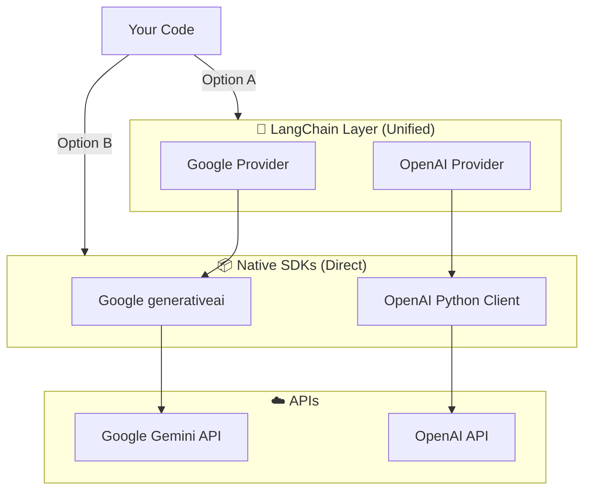
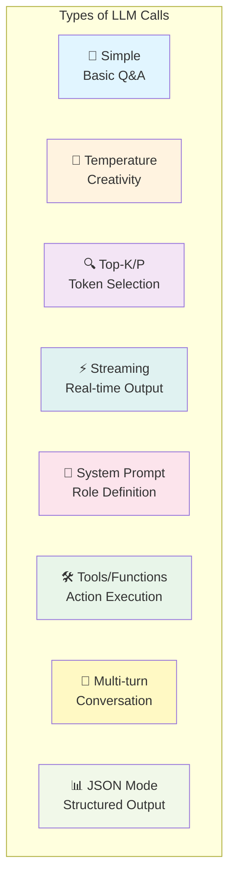
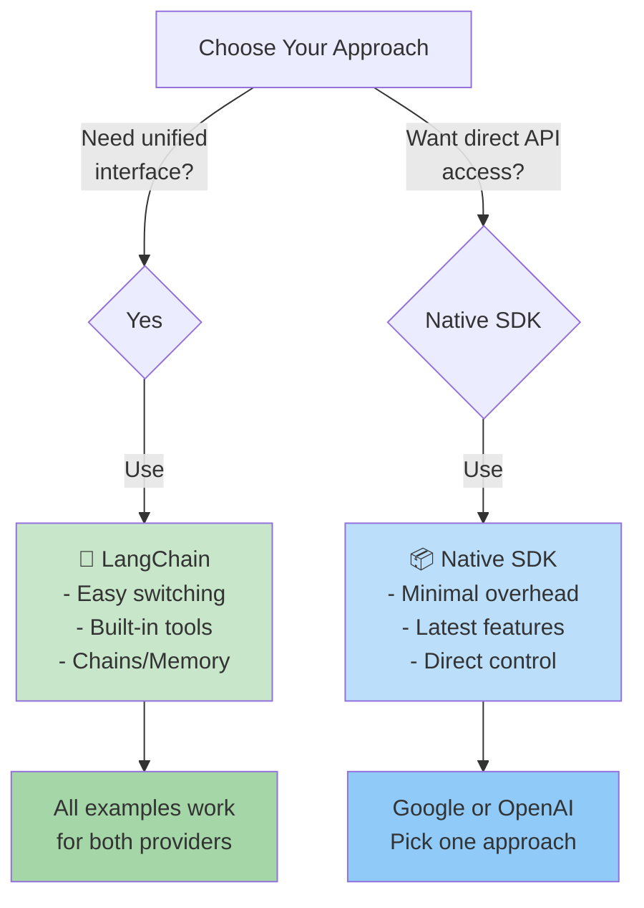
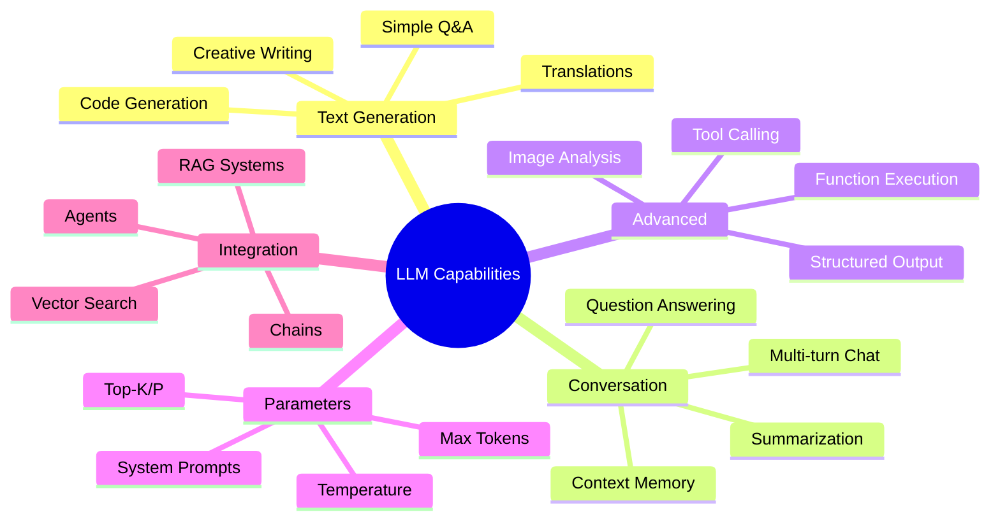

# Complete Guide: LLM Providers & APIs

Master multiple ways to call LLMs with Google Gemini and OpenAI GPT. Choose your approach: unified LangChain interface or native SDKs.

---

## Table of Contents

### Quick Links
- [Architecture Overview](#architecture-overview)
- [Installation](#installation)

### 🔗 LangChain Approach
- [1. Simple Call](#1-simple-call)
- [2. Temperature Control](#2-temperature-control-creativity)
- [3. Top-K & Top-P Sampling](#3-top-k--top-p-sampling)
- [4. Streaming Response](#4-streaming-response)
- [5. System Prompt & User Prompt](#5-system-prompt--user-prompt)
- [6. Tools & Function Calling](#6-tools--function-calling)
- [7. Multi-turn Conversation](#7-multi-turn-conversation-langchain)
- [Provider Switching](#switching-providers-with-langchain-)

### 📦 Native Google SDK
- [1. Simple Call (Google)](#1-simple-call-google)
- [2. Temperature Control (Google)](#2-temperature-control-google)
- [3. Top-K & Top-P Sampling (Google)](#3-top-k--top-p-sampling-google)
- [4. Streaming Response (Google)](#4-streaming-response-google)
- [5. System Prompt & User Prompt (Google)](#5-system-prompt--user-prompt-google)
- [6. Multi-turn Conversation (Google)](#6-multi-turn-conversation-google)
- [7. Tools & Function Calling (Google)](#7-tools--function-calling-google)

### 📦 Native OpenAI SDK
- [1. Simple Call (OpenAI)](#1-simple-call-openai)
- [2. Temperature Control (OpenAI)](#2-temperature-control-openai)
- [3. Top-P Sampling (OpenAI)](#3-top-p-sampling-openai)
- [4. Streaming Response (OpenAI)](#4-streaming-response-openai)
- [5. System Prompt & User Prompt (OpenAI)](#5-system-prompt--user-prompt-openai)
- [6. Multi-turn Conversation (OpenAI)](#6-multi-turn-conversation-openai)
- [7. Tools & Function Calling (OpenAI)](#7-tools--function-calling-openai)
- [8. JSON Mode (OpenAI Only)](#8-json-mode-openai-only-)

### Reference
- [Call Types Explained](#call-types-explained)
- [What Else is Possible?](#what-else-is-possible)
- [Troubleshooting](#troubleshooting)
- [Resources](#resources)

---

## Architecture Overview



---

## Installation

```bash
# Install all dependencies
pip install -r requirements.txt

# Or minimal setup
pip install python-dotenv openai google-generativeai
```

Environment setup in `.env`:
```
GOOGLE_API_KEY=your_key_here
OPENAI_API_KEY=your_key_here
```

---

# 🔗 LANGCHAIN APPROACH (Unified Interface)

**Best for:** Complex workflows, agent systems, chaining, easy provider switching

### Why LangChain?
- Single interface for multiple providers
- Built-in memory management
- Composable chains (LCEL)
- Easy to add tools/functions

---

## 1. Simple Call

**Concept:** Basic question-answer without any parameters.

```python
from langchain_openai import ChatOpenAI
from langchain_google_genai import ChatGoogleGenerativeAI
import os

# Switch provider with single line
provider = os.getenv("LLM_PROVIDER", "openai")

if provider == "google":
    llm = ChatGoogleGenerativeAI(model="gemini-3.6-flash")
else:
    llm = ChatOpenAI(model="gpt-3.5-turbo")

# Simple call - works the same for both
response = llm.invoke("What is Python?")
print(response.content)
```

---

## 2. Temperature Control (Creativity)

**Concept:** Temperature controls randomness. High = creative, Low = deterministic.

- `temperature=0.0` → Deterministic (always same answer)
- `temperature=0.7` → Balanced (default)
- `temperature=1.0+` → Creative (varied answers)

```python
from langchain_openai import ChatOpenAI

# Creative response - high temperature
llm_creative = ChatOpenAI(
    model="gpt-3.5-turbo",
    temperature=0.9  # Very creative
)

response = llm_creative.invoke("Write a creative name for a coffee shop")
print(response.content)

# Deterministic response - low temperature
llm_precise = ChatOpenAI(
    model="gpt-3.5-turbo",
    temperature=0.1  # Precise, consistent
)

response = llm_precise.invoke("Calculate 2 + 2")
print(response.content)
```

---

## 3. Top-K & Top-P Sampling

**Concept:** Control which tokens the model considers:
- **top_k**: Only consider top K most likely tokens
- **top_p**: Only consider tokens with cumulative probability ≤ p

```python
from langchain_openai import ChatOpenAI

llm = ChatOpenAI(
    model="gpt-3.5-turbo",
    temperature=0.7,
    model_kwargs={
        "top_p": 0.9,      # Use 90% probability mass
        "top_k": 40,       # Consider top 40 tokens
    }
)

response = llm.invoke("Describe the future of AI")
print(response.content)
```

---

## 4. Streaming Response

**Concept:** Get response token-by-token in real-time instead of waiting for complete response.

```python
from langchain_openai import ChatOpenAI

llm = ChatOpenAI(model="gpt-3.5-turbo")

# Stream response directly
print("Streaming response:")
for chunk in llm.stream("Tell me a story"):
    print(chunk.content, end="", flush=True)
```

---

## 5. System Prompt & User Prompt

**Concept:** System prompt sets the AI's role/behavior. User prompt is the question.

```python
from langchain_core.prompts import ChatPromptTemplate
from langchain_openai import ChatOpenAI

llm = ChatOpenAI(model="gpt-3.5-turbo")

# Define roles with prompt template
prompt = ChatPromptTemplate.from_messages([
    ("system", "You are a helpful Python expert. Answer all questions about Python programming."),
    ("user", "{question}")
])

# Chain prompt + LLM
chain = prompt | llm

# Ask question
response = chain.invoke({"question": "What is a decorator in Python?"})
print(response.content)
```

---

## 6. Tools & Function Calling

**Concept:** Let the AI call functions to perform actions (weather, calculations, etc.)

```python
from langchain_openai import ChatOpenAI
from langchain_core.tools import tool

# Define tools
@tool
def get_weather(location: str) -> str:
    """Get current weather for a location"""
    return f"Weather in {location}: 72°F, Sunny"

@tool
def calculate(expression: str) -> str:
    """Calculate a math expression"""
    return str(eval(expression))

tools = [get_weather, calculate]

# Create LLM with tools
llm = ChatOpenAI(model="gpt-3.5-turbo")
llm_with_tools = llm.bind_tools(tools)

# Ask LLM to use tools
response = llm_with_tools.invoke("What's the weather in Paris and what is 2+2?")
print(response)
```

---

## 7. Multi-turn Conversation (LangChain)

**Concept:** Keep conversation history for context-aware responses.

```python
from langchain_core.messages import HumanMessage, AIMessage
from langchain_openai import ChatOpenAI

llm = ChatOpenAI(model="gpt-3.5-turbo")

# Maintain conversation history
messages = [
    HumanMessage(content="What are benefits of Python?"),
    AIMessage(content="Python is great for AI, web development, etc."),
    HumanMessage(content="How does it compare to JavaScript?")
]

# LLM remembers the context
response = llm.invoke(messages)
print(response.content)
```

---

## Switching Providers with LangChain ⚡

**This is LangChain's superpower:**

```python
import os
from langchain_openai import ChatOpenAI
from langchain_google_genai import ChatGoogleGenerativeAI
from langchain_core.prompts import ChatPromptTemplate

provider = os.getenv("LLM_PROVIDER", "openai")

# Create LLM based on provider
if provider == "google":
    llm = ChatGoogleGenerativeAI(
        model="gemini-3.6-flash",
        temperature=0.7
    )
else:
    llm = ChatOpenAI(
        model="gpt-3.5-turbo",
        temperature=0.7
    )

# Rest of code works exactly the same!
prompt = ChatPromptTemplate.from_template("Explain {topic}")
chain = prompt | llm
response = chain.invoke({"topic": "quantum computing"})
print(response.content)
```

Just change `LLM_PROVIDER` in `.env` and your code works with a different model! ✨

---

# 📦 NATIVE GOOGLE SDK

**Best for:** Direct API access, minimal overhead, latest features

### Installation

```bash
pip install google-generativeai
```

---

## 1. Simple Call (Google)

```python
import google.generativeai as genai
import os

genai.configure(api_key=os.getenv("GOOGLE_API_KEY"))
model = genai.GenerativeModel("gemini-3.6-flash")

response = model.generate_content("What is Python?")
print(response.text)
```

---

## 2. Temperature Control (Google)

```python
import google.generativeai as genai

model = genai.GenerativeModel("gemini-3.6-flash")

# Creative response
response = model.generate_content(
    "Write a creative name for a coffee shop",
    generation_config=genai.types.GenerationConfig(
        temperature=0.9
    )
)
print("Creative:", response.text)

# Deterministic response
response = model.generate_content(
    "Calculate 2 + 2",
    generation_config=genai.types.GenerationConfig(
        temperature=0.1
    )
)
print("Precise:", response.text)
```

---

## 3. Top-K & Top-P Sampling (Google)

```python
import google.generativeai as genai

model = genai.GenerativeModel("gemini-3.6-flash")

response = model.generate_content(
    "Describe the future of AI",
    generation_config=genai.types.GenerationConfig(
        temperature=0.7,
        top_k=40,
        top_p=0.9
    )
)
print(response.text)
```

---

## 4. Streaming Response (Google)

```python
import google.generativeai as genai

model = genai.GenerativeModel("gemini-3.6-flash")

# Stream response token by token
response = model.generate_content(
    "Tell me a story",
    stream=True
)

for chunk in response:
    print(chunk.text, end="", flush=True)
print()
```

---

## 5. System Prompt & User Prompt (Google)

```python
import google.generativeai as genai

model = genai.GenerativeModel(
    "gemini-3.6-flash",
    system_instruction="You are a Python expert. Answer all questions about Python."
)

response = model.generate_content("What is a decorator?")
print(response.text)
```

---

## 6. Multi-turn Conversation (Google)

**Concept:** Maintain conversation history across multiple messages.

```python
import google.generativeai as genai

model = genai.GenerativeModel("gemini-3.6-flash")

# Start a conversation
chat = model.start_chat(history=[])

# First message
response1 = chat.send_message("What are the benefits of Python?")
print("AI:", response1.text)

# Follow-up (AI remembers context)
response2 = chat.send_message("How does it compare to JavaScript?")
print("AI:", response2.text)

# The chat object maintains history automatically
```

---

## 7. Tools & Function Calling (Google)

```python
import google.generativeai as genai

tools = [
    genai.Tool(
        function_declarations=[
            genai.FunctionDeclaration(
                name="get_weather",
                description="Get weather for a location",
                parameters=genai.Schema(
                    type=genai.Type.OBJECT,
                    properties={
                        "location": genai.Schema(type=genai.Type.STRING)
                    }
                )
            )
        ]
    )
]

model = genai.GenerativeModel("gemini-3.6-flash", tools=tools)
response = model.generate_content("What's the weather in Paris?")
print(response.text)
```

---

# 📦 NATIVE OPENAI SDK

**Best for:** Direct API access, JSON mode, latest features

### Installation

```bash
pip install openai
```

---

## 1. Simple Call (OpenAI)

```python
from openai import OpenAI
import os

client = OpenAI(api_key=os.getenv("OPENAI_API_KEY"))

response = client.chat.completions.create(
    model="gpt-3.5-turbo",
    messages=[
        {"role": "user", "content": "What is Python?"}
    ]
)
print(response.choices[0].message.content)
```

---

## 2. Temperature Control (OpenAI)

```python
from openai import OpenAI

client = OpenAI()

# Creative
response = client.chat.completions.create(
    model="gpt-3.5-turbo",
    messages=[{"role": "user", "content": "Write a creative coffee shop name"}],
    temperature=0.9
)
print("Creative:", response.choices[0].message.content)

# Deterministic
response = client.chat.completions.create(
    model="gpt-3.5-turbo",
    messages=[{"role": "user", "content": "Calculate 2 + 2"}],
    temperature=0.1
)
print("Precise:", response.choices[0].message.content)
```

---

## 3. Top-P Sampling (OpenAI)

**Note:** OpenAI uses `top_p`, not `top_k`

```python
from openai import OpenAI

client = OpenAI()

response = client.chat.completions.create(
    model="gpt-3.5-turbo",
    messages=[{"role": "user", "content": "Describe the future of AI"}],
    temperature=0.7,
    top_p=0.9  # Only consider tokens with cumulative prob ≤ 0.9
)
print(response.choices[0].message.content)
```

---

## 4. Streaming Response (OpenAI)

```python
from openai import OpenAI

client = OpenAI()

stream = client.chat.completions.create(
    model="gpt-3.5-turbo",
    messages=[{"role": "user", "content": "Tell me a story"}],
    stream=True
)

for chunk in stream:
    if chunk.choices[0].delta.content:
        print(chunk.choices[0].delta.content, end="", flush=True)
print()
```

---

## 5. System Prompt & User Prompt (OpenAI)

```python
from openai import OpenAI

client = OpenAI()

response = client.chat.completions.create(
    model="gpt-3.5-turbo",
    messages=[
        {"role": "system", "content": "You are a Python expert"},
        {"role": "user", "content": "What is a decorator?"}
    ]
)
print(response.choices[0].message.content)
```

---

## 6. Multi-turn Conversation (OpenAI)

```python
from openai import OpenAI

client = OpenAI()

# Maintain messages list for context
messages = []

# First turn
messages.append({"role": "user", "content": "What are benefits of Python?"})
response1 = client.chat.completions.create(
    model="gpt-3.5-turbo",
    messages=messages
)
ai_response1 = response1.choices[0].message.content
messages.append({"role": "assistant", "content": ai_response1})
print("AI:", ai_response1)

# Second turn (context is in messages)
messages.append({"role": "user", "content": "Compare to JavaScript"})
response2 = client.chat.completions.create(
    model="gpt-3.5-turbo",
    messages=messages
)
print("AI:", response2.choices[0].message.content)
```

---

## 7. Tools & Function Calling (OpenAI)

```python
from openai import OpenAI

client = OpenAI()

# Define tools
tools = [
    {
        "type": "function",
        "function": {
            "name": "get_weather",
            "description": "Get weather for a location",
            "parameters": {
                "type": "object",
                "properties": {
                    "location": {"type": "string"}
                }
            }
        }
    }
]

response = client.chat.completions.create(
    model="gpt-3.5-turbo",
    messages=[{"role": "user", "content": "What's the weather in Paris?"}],
    tools=tools,
    tool_choice="auto"
)
print(response)
```

---

## 8. JSON Mode (OpenAI Only) 🎯

**Concept:** Force response to be valid JSON.

```python
from openai import OpenAI
import json

client = OpenAI()

response = client.chat.completions.create(
    model="gpt-3.5-turbo",
    messages=[{
        "role": "user",
        "content": "Respond in JSON with fields: answer, confidence"
    }],
    response_format={"type": "json_object"}
)

# Response is guaranteed to be valid JSON
result = json.loads(response.choices[0].message.content)
print(json.dumps(result, indent=2))
```

---

# Call Types Explained

## Visual Comparison



## Parameter Reference Table

| Type | LangChain | Google SDK | OpenAI SDK | Typical Values |
|------|-----------|-----------|-----------|-----------------|
| **Temperature** | `temperature` | `temperature` | `temperature` | 0.0-2.0 |
| **Top-K** | `model_kwargs` | `top_k` | ❌ Not available | 20-40 |
| **Top-P** | `model_kwargs` | `top_p` | `top_p` | 0.8-0.95 |
| **Streaming** | `.stream()` | `stream=True` | `stream=True` | Boolean |
| **System Prompt** | `from_messages()` | `system_instruction` | `role: system` | String |
| **Tools** | `.bind_tools()` | `tools=[]` | `tools=[]` | List |
| **Max Tokens** | `max_tokens` | `max_output_tokens` | `max_tokens` | Integer |

---

# Decision Flow Chart



---

# What Else is Possible?



---

# Troubleshooting

### API Key Not Found
```python
import os
from dotenv import load_dotenv

load_dotenv()
api_key = os.getenv("GOOGLE_API_KEY")
if not api_key:
    raise ValueError("Add GOOGLE_API_KEY to .env file")
```

### Model Not Found
- **Google**: Check at https://makersuite.google.com/app/apikey
- **OpenAI**: Check at https://platform.openai.com/docs/models

### Rate Limiting
```python
import time

for prompt in prompts:
    response = llm.invoke(prompt)
    time.sleep(1)  # Add delay between calls
```

### Streaming Hangs
- Ensure `stream=True` is set
- Use `.stream()` for LangChain
- Check internet connection

---

# Quick Reference Files

| Purpose | File |
|---------|------|
| **LangChain Examples** | [google_llm_langchain_example.py](google_llm_langchain_example.py) |
| **LangChain + OpenAI** | [openai_llm_langchain_example.py](openai_llm_langchain_example.py) |
| **Native Google SDK** | [google_sdk_example.py](../../google_sdk_example.py) |
| **Native OpenAI SDK** | [openai_sdk_example.py](../../openai_sdk_example.py) |
| **SDK Comparison** | [SDK_COMPARISON.md](../../SDK_COMPARISON.md) |

---

# Resources

| Resource | Link |
|----------|------|
| **LangChain Docs** | https://python.langchain.com/ |
| **Google Gemini API** | https://ai.google.dev/ |
| **OpenAI API Docs** | https://platform.openai.com/docs |
| **Models Comparison** | [SDK_COMPARISON.md](../../SDK_COMPARISON.md) |

---

**Pro Tip**: Start with native SDK to learn the concepts, then use LangChain when building production systems! 🚀
