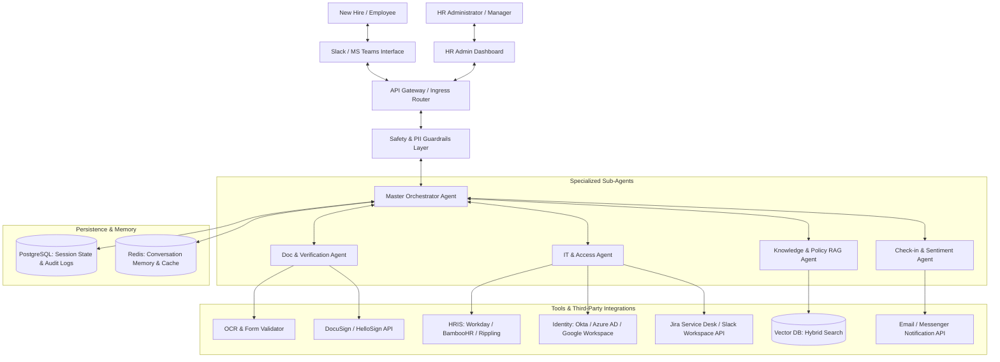
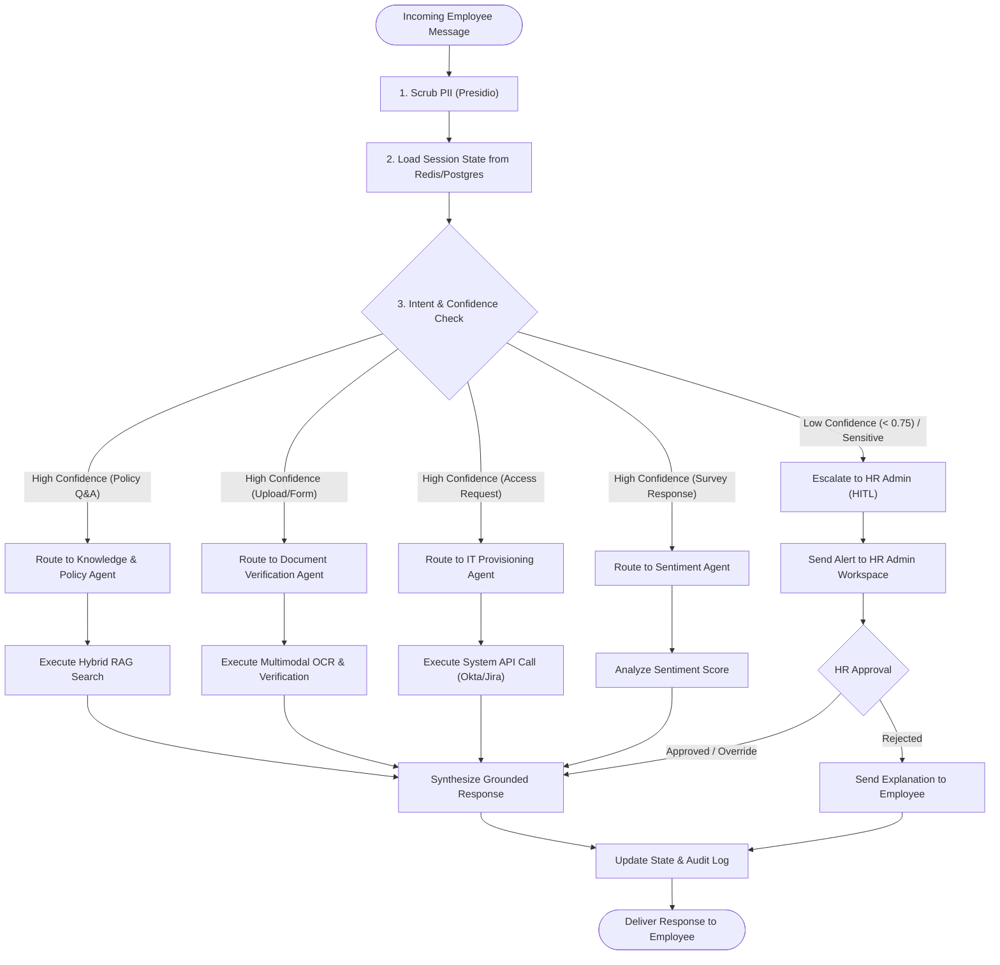
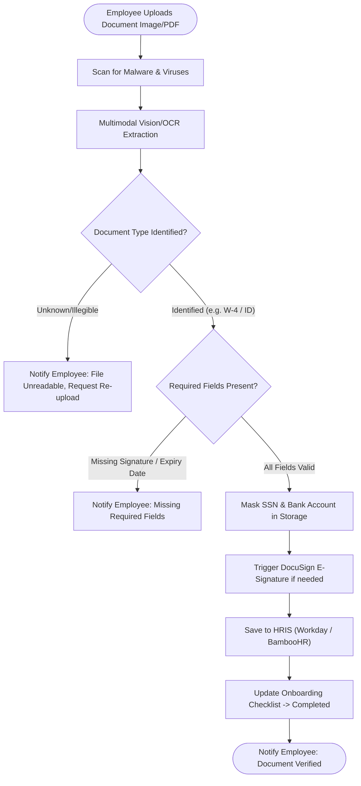
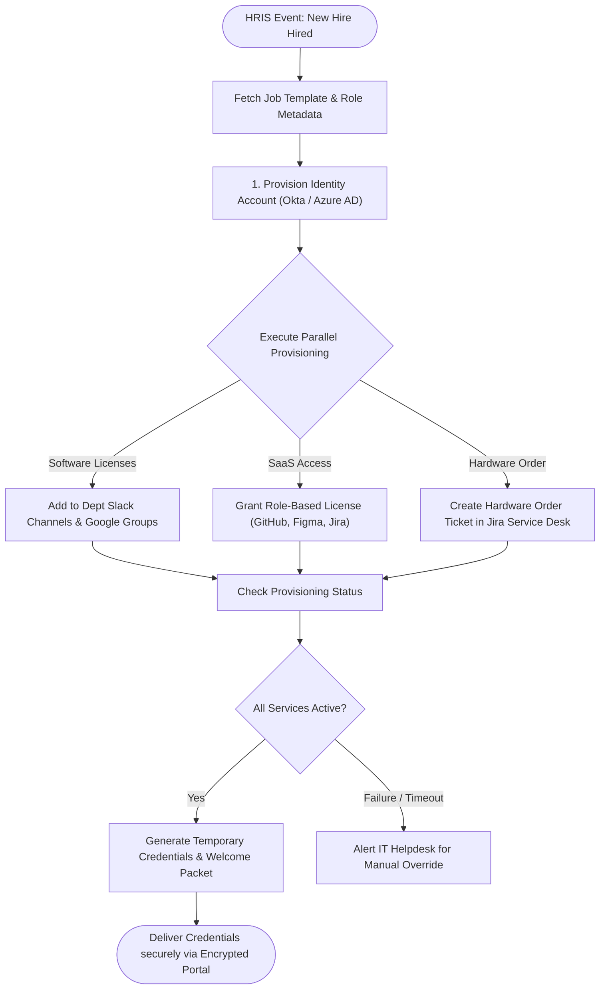
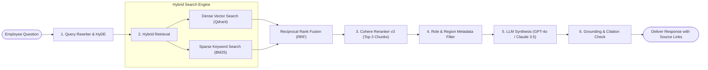
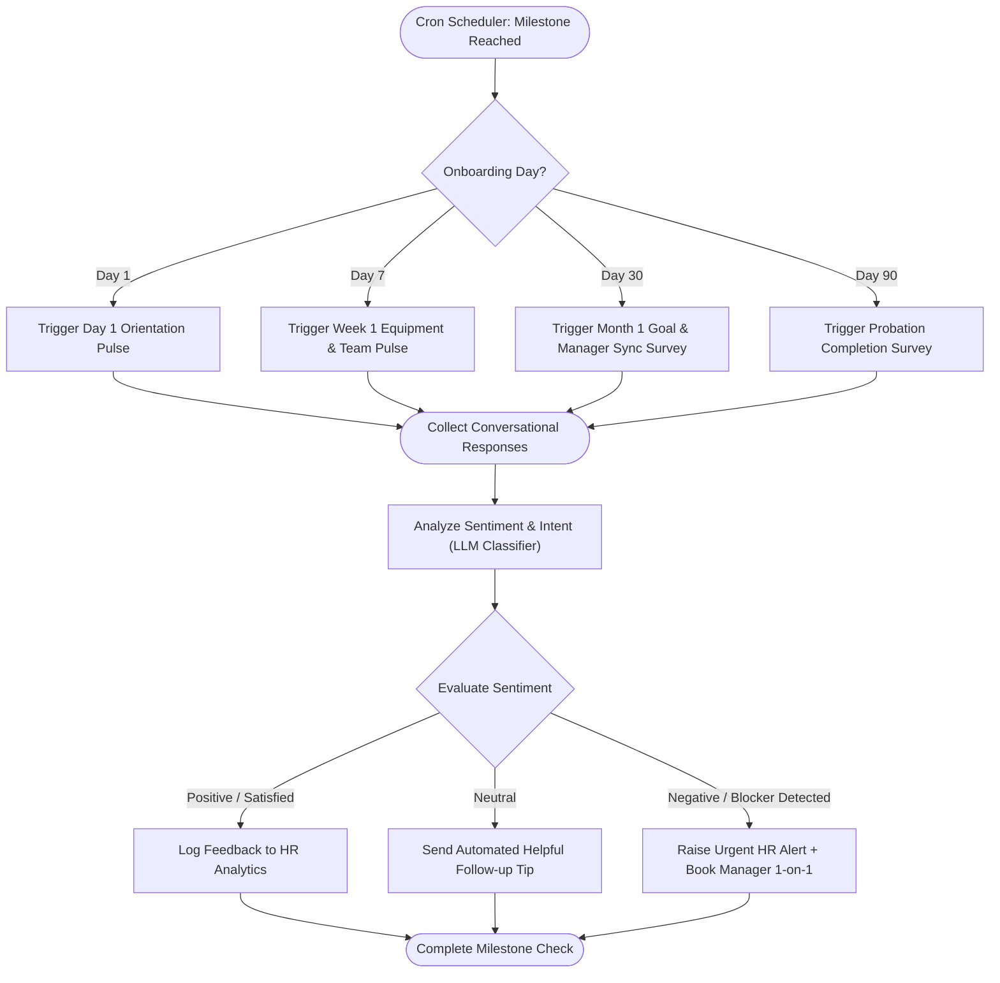
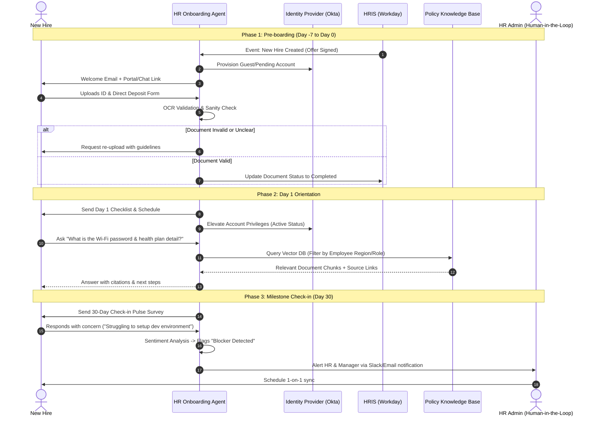
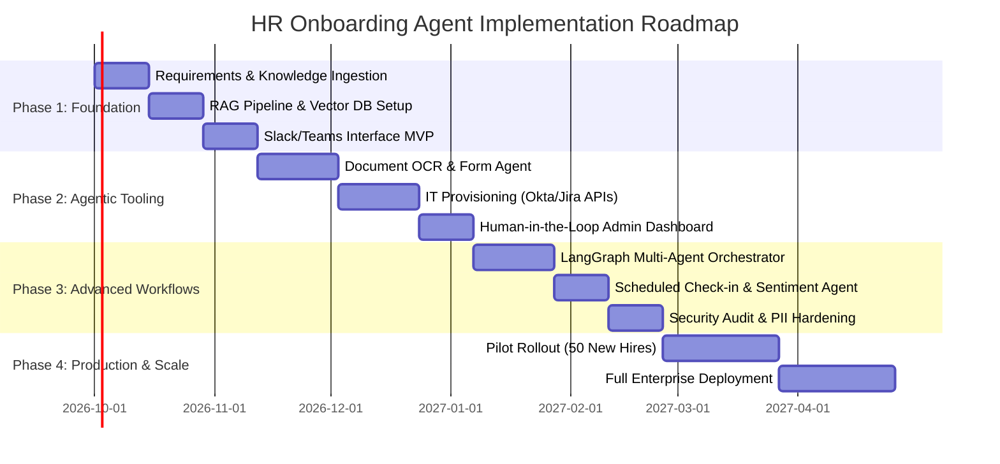

# System Design Document: Enterprise HR Onboarding AI Agent System

## 1. Executive Summary & Vision

### 1.1 Problem Statement
Traditional employee onboarding is often manual, fragmented, and time-consuming. New hires experience friction navigating disparate systems (IT provisioning, compliance document submission, HRIS registration, policy questions, and team introductions), while HR teams face significant overhead answering repetitive questions and verifying required documentation.

### 1.2 Solution Overview
The **HR Onboarding Agent** is an autonomous, multi-agent conversational platform powered by Large Language Models (LLMs), Retrieval-Augmented Generation (RAG), and API-driven tool execution. It proactively guides new hires from **Pre-boarding (Day -7)** through their **90-Day Probation Period**, automating document intake, IT system provisioning, policy Q&A, and milestone check-ins.

### 1.3 Key Objectives
- **Reduce Time-to-Productivity**: Cut new hire setup time from days to hours.
- **Lower HR Support Load**: Automate up to 80% of routine onboarding inquiries.
- **Ensure Compliance**: 100% completion tracking of mandatory tax forms, NDAs, and policy acknowledgements.
- **Enhance Employee Experience (EX)**: Deliver personalized, 24/7 conversational support via Slack/Microsoft Teams.

---

## 2. High-Level System Architecture & Flowcharts

### 2.1 Multi-Agent Architecture Overview
The system uses a **Stateful Graph Multi-Agent Architecture** (e.g., built with **LangGraph** or **AutoGen**). A central **Orchestrator Agent** manages state transitions, delegates sub-tasks to specialized domain agents, and coordinates Human-in-the-Loop (HITL) reviews.



---

### 2.2 LangGraph Orchestrator Decision Loop & State Machine

This diagram illustrates how incoming messages are evaluated by the Master Orchestrator, routed to domain agents, or escalated to HR Administrators if confidence is low.



---

## 3. Core Agent Components & Detailed Flowcharts

### 3.1 Document Verification & Compliance Workflow

Automates the collection, optical character recognition (OCR), signature check, and HRIS filing of mandatory documents (e.g., W-4, I-9, Direct Deposit, NDA).



---

### 3.2 Automated IT & System Provisioning Workflow

Triggers system account setup, software access grants, and hardware dispatch immediately after offer acceptance or pre-boarding approval.



---

### 3.3 Knowledge & Policy RAG Pipeline Workflow

Provides accurate, halluncination-free policy answers with exact document citations using a hybrid retrieval-augmented generation pipeline.



---

### 3.4 Proactive Sentiment & Check-in Milestone Workflow

Initiates scheduled milestone pulse surveys (Day 1, 7, 30, 60, 90) and automatically escalates blocker issues or negative sentiment.



---

## 4. End-to-End Onboarding Lifecycle Sequence Flow



---

## 5. Technology Stack & Technical Specifications

| Component | Technology / Library | Selection Rationale |
| :--- | :--- | :--- |
| **Agent Framework** | LangGraph / LangChain | Support for stateful multi-agent graphs, cycles, and HITL interrupts. |
| **LLM Backbone** | GPT-4o / Claude 3.5 Sonnet / Gemini 1.5 Pro | High reasoning capability, structured output generation, function calling. |
| **Vector Database** | Qdrant / Pinecone / PGVector | High throughput hybrid search (sparse + dense) with payload metadata filtering. |
| **Embeddings & Reranking** | OpenAI `text-embedding-3-large` + Cohere Rerank v3 | Superior contextual retrieval quality for enterprise policy documents. |
| **PII & Safety Guardrails** | Microsoft Presidio + NeMo Guardrails | Anonymize SSN, DOB, bank details before sending prompts to external LLMs. |
| **Chat Interfaces** | Slack Bolt SDK / Microsoft Bot Framework | Deep enterprise integration into existing employee communication channels. |
| **Backend & Orchestration** | FastAPI (Python 3.11+) / Celery / Redis | Async execution of long-running workflows and webhooks. |
| **Database & Cache** | PostgreSQL (JSONB) + Redis | Persistent state snapshotting, user session management, rate limiting. |
| **Observability** | LangSmith / Phoenix Arize / OpenTelemetry | Tracing agent step-by-step reasoning, latency, cost, and hallucination monitoring. |

---

## 6. Prompt Engineering & Agent System Prompts

### 6.1 Master Orchestrator System Prompt
```text
You are the HR Onboarding Master Orchestrator Agent for [Company Name].
Your goal is to guide new hires through a seamless onboarding experience.

CORE RULES:
1. Maintain a welcoming, professional, and helpful tone.
2. Route specific requests to specialized sub-agents:
   - Policy/Benefits/FAQs -> Knowledge & Policy Agent
   - Form submission/Tax/ID upload -> Document Verification Agent
   - Account setup/Software access -> IT Provisioning Agent
3. NEVER guess or invent company policy. Rely exclusively on the Knowledge Agent.
4. If the user expresses distress, frustration, or asks questions outside your scope, transfer control to a Human HR Representative.

CURRENT USER CONTEXT:
- Name: {user_name}
- Role: {user_role}
- Department: {user_department}
- Start Date: {start_date}
- Current Onboarding Stage: {onboarding_stage}
```

### 6.2 Knowledge & Policy RAG Prompt
```text
You are the Policy & Knowledge Expert Agent for [Company Name].
Answer the user's question using ONLY the provided context snippets below.

CONTEXT SNIPPETS:
{context_chunks}

INSTRUCTIONS:
1. Base your answer strictly on the provided context. If the information is not contained in the context, state: "I don't have this information in the official policy docs. I've flagged this for your HR Manager."
2. Always include document title and page/section references in your response.
3. Keep answers clear, structured (bullet points), and action-oriented.
4. Mask any personal data.
```

---

## 7. Security, Privacy & Compliance Architecture

### 7.1 PII Protection & Data Anonymization
- **Inbound Sanitization**: Every user message passes through an anonymization pipeline using **Microsoft Presidio**.
- **PII Scrubbing**: SSNs, Tax Identification Numbers, Banking Details, DOBs, and Phone Numbers are replaced with pseudo-tokens (e.g., `[REDACTED_SSN]`) before LLM invocation.

### 7.2 Security Control Matrix Flow

```mermaid
flowchart LR
    UserQuery["User Input"] --> PIIFilter["1. PII Redaction Filter"]
    PIIFilter --> GuardrailCheck["2. Topic & Injection Guard"]
    GuardrailCheck --> AgentCore["3. Multi-Agent Engine"]
    AgentCore --> RBACFilter["4. Role-Based Access Filter"]
    RBACFilter --> ResponseGen["5. LLM Synthesis"]
    ResponseGen --> OutputGuard["6. Safety Check"]
    OutputGuard --> FinalOutput["Delivered Response"]
```



---

## 8. Evaluation, Metrics & Governance (LLM Evals)

### 8.1 RAG Evaluation Framework (RAG Triad)
1. **Context Relevance**: Measures if retrieved document chunks match the new hire's query. Target: \( \ge 0.90 \).
2. **Groundedness (Faithfulness)**: Ensures generated answers contain zero hallucinations and originate strictly from retrieved policy documents. Target: \( \ge 0.98 \).
3. **Answer Relevance**: Evaluates whether the final response directly addresses the user's inquiry. Target: \( \ge 0.92 \).

### 8.2 Operational Success Metrics (KPIs)

| Metric | Baseline (Manual) | Target (AI Agent) | Measurement Method |
| :--- | :--- | :--- | :--- |
| **First-Day IT Readiness** | 65% ready on Day 1 | 98% ready on Day 1 | Account & privilege activation checks |
| **Average Onboarding Ticket Time** | 24 Hours | < 2 Minutes | HRIS & Slack bot resolution logs |
| **Form Completion Rate (Day 3)** | 70% | 100% | HRIS compliance tracking |
| **New Hire CSAT (Day 30)** | 3.8 / 5.0 | 4.7 / 5.0 | Automated Sentiment Check-in Agent |
| **HR Admin Hours Saved / Hire** | 0 Hours | 8 Hours saved | Time-tracking & workload metrics |

---

## 9. Implementation Roadmap & Phased Rollout



---

## 10. Summary & Conclusion
The proposed HR Onboarding Agent architecture combines stateful multi-agent orchestration with enterprise-grade RAG, automated tool execution, and strict security controls. By visualizing every stage from document verification to IT provisioning and milestone sentiment analysis, this document provides a complete blueprint for building a high-touch, error-free onboarding platform.
