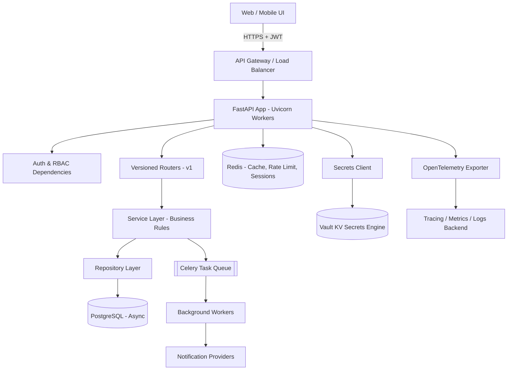
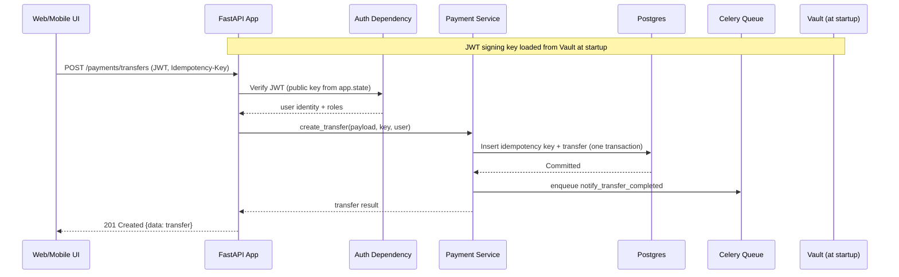

# Production-Grade FastAPI Backend: Banking Platform API

**Design Question:** *Design a production-grade FastAPI backend for a banking platform — one that a real web/mobile UI would consume — covering authentication, resource design, and secrets (database credentials, signing keys, third-party API keys) stored in a KV secrets store.*

This follows the same pattern as the earlier system design documents: build understanding gradually, introduce every piece only when a real problem demands it, use plain connected paragraphs, and explain the reasoning an interviewer or a tech lead reviewing your pull request would actually expect — not just a list of libraries. The difference this time is that "production-grade FastAPI" is partly a code-organization and implementation question, not only an infrastructure question, so several sections include real, idiomatic FastAPI code rather than just diagrams.

This naturally continues the banking conversational-assistant design from before — the "Core Banking API Layer" in that document is exactly the kind of service we are now designing in detail.

---

## 1. Problem Understanding

A tutorial FastAPI app is usually one `main.py` file with a couple of `@app.get` routes talking to a database that lives on the same machine. "Production-grade" means something very different: a UI team (web and mobile) needs a **stable, documented, versioned contract** they can build against without reading your source code; secrets like database passwords and signing keys must never sit in a config file or an environment variable that anyone with repo access can read; every request needs to be authenticated and authorized correctly, every time, with no room for "it works because I tested the happy path"; and the whole thing needs to survive a pod restarting, a secret rotating, or a downstream payment provider timing out, without silently corrupting data or leaking one customer's information to another.

So the real problem is not "write some FastAPI routes." It is: build an API that a frontend team can trust to be consistent, an operations team can trust to be observable and recoverable, and a security team can trust to never expose a secret or a stranger's account data — while still being pleasant to develop and iterate on day to day.

---

## 2. Clarifying Questions

Is this a single monolithic API serving all banking resources (accounts, cards, payments, profile), or is it one service among several microservices sitting behind a gateway? We'll assume a well-structured **modular monolith** to start — the most common and most defensible real-world choice — and show exactly where it would split later.

Who are the consumers? A web app, a mobile app, and possibly internal admin tooling — each with slightly different needs (the mobile app cares more about token refresh behavior on flaky networks; the admin tool needs broader RBAC scopes). We'll design one API that serves all three correctly rather than forking the backend per client.

Where do secrets currently live — is there already a KV secret store like HashiCorp Vault, AWS Secrets Manager, or Azure Key Vault, or are we introducing one? We'll assume a Vault-style KV secrets engine, since it's the most instructive and most widely used pattern, and note how AWS/Azure equivalents map onto the same design.

Is synchronous request/response enough, or does the UI need real-time updates (e.g., live balance updates, transaction notifications)? We'll design the request/response API as the core, and add a WebSocket/SSE channel for real-time events as a clearly separated addition, not bolted onto every endpoint.

What's the expected authentication model — session cookies, or token-based? Given a decoupled UI (SPA/mobile app) talking to a separate API, we'll use **OAuth2-style JWT access tokens plus a refresh token**, which is the standard, defensible choice for this shape of system.

---

## 3. Functional Requirements

**Core requirements for the initial version**, scoped the same disciplined way as before — enough to be genuinely production-usable, without trying to boil the ocean on day one:

- User registration is out of scope (assume onboarding/KYC happens through an existing regulated flow); the API handles **login, token refresh, logout, and password/MFA management** for already-onboarded customers.
- Resource endpoints for **Accounts** (list, detail, balance), **Transactions** (paginated history, single transaction detail), **Cards** (list, block/unblock, set limits), **Payments/Transfers** (create, status, saved payees), and **Profile** (view, update contact details).
- **Role-based access control**, because the same API also serves internal tooling: `customer`, `support_agent`, `auditor`, and `admin` roles, each scoped to different capabilities.
- **Idempotent write operations**, so a UI retry after a network blip cannot cause a duplicate transfer.
- **Consistent, typed API responses and error format**, so the frontend can build a single error-handling layer instead of special-casing each endpoint.
- **Secrets (DB credentials, JWT signing keys, payment-gateway API keys) loaded from a centralized KV secrets store**, never from plaintext config.

**Deferred deliberately:** full self-service onboarding/KYC through this API, multi-currency support, and a public third-party developer API (this is an internal-UI-facing API, which is a meaningfully different trust boundary than a public one, and conflating them early adds unneeded complexity).

---

## 4. Non-Functional Requirements

**Security** again shapes everything, for the same reason as the earlier document: real account and money data is involved. But here it's more concrete and closer to code — it means specific things like: tokens must be short-lived and verifiable without a database round-trip on every request, secrets must be fetched from a vault rather than baked into images, and every resource endpoint must independently verify that the authenticated caller actually owns (or is authorized to view) the specific resource being requested, not just that they're logged in generally.

**Performance and concurrency**: FastAPI's whole value proposition is async I/O — the API needs to handle many concurrent UI requests (dashboard loads that fan out to accounts, cards, and recent transactions at once) without blocking worker threads on network calls to the database or downstream services.

**Consistency and reliability** carry over directly from the system design: transfers and card actions need idempotency and strong consistency; reads like transaction history can tolerate a replica being a few hundred milliseconds behind.

**Developer and frontend ergonomics** is a non-functional requirement worth naming explicitly for this problem: a production-grade API is one where the OpenAPI schema is accurate enough that a frontend team can generate a typed client from it and trust the types, where errors always look the same shape, and where breaking changes are versioned rather than silently changing a response field.

**Observability and auditability** carry over as well — every secret access, every authentication attempt, and every write to a financial resource needs to be traceable.

---

## 5. Scope and Assumptions

We assume Python 3.12 with FastAPI on top of Starlette and Pydantic v2, served by Uvicorn workers behind Gunicorn (or run directly under a process manager in Kubernetes), talking to PostgreSQL through SQLAlchemy's async engine, with Redis for caching, rate limiting, and short-lived tokens, and a message broker (we'll use Celery with Redis/RabbitMQ as the broker) for background work like sending notifications.

We assume secrets are stored in a **HashiCorp Vault KV v2 secrets engine** (or an equivalent managed service like AWS Secrets Manager — the pattern is the same, only the client library changes), organized per-resource so that, for example, the database credentials, the JWT signing key, and the payment gateway's API key each live at their own path with their own access policy, rather than one giant blob of secrets that every part of the app can read.

We assume the UI is a separate application (web SPA and/or mobile app) calling this API over HTTPS — it is not server-rendered from within this same FastAPI app — which is why token-based auth, CORS configuration, and a stable versioned contract all matter as much as they do here.

---

## 6. Project Structure (the "Basic Architecture" of the Codebase)

Just like the system design documents start with the simplest possible component diagram, a production FastAPI project should start from a structure that scales in complexity gradually rather than a single 2,000-line `main.py`. Here is the layout we will build up to, and then justify piece by piece:

```
banking_api/
├── app/
│   ├── main.py                  # FastAPI() app, lifespan, router registration
│   ├── core/
│   │   ├── config.py             # Settings (non-secret) via pydantic-settings
│   │   ├── security.py           # JWT creation/verification, password hashing
│   │   ├── secrets.py            # KV secrets client + typed secret loaders
│   │   └── logging.py            # Structured logging + tracing setup
│   ├── api/
│   │   ├── deps.py               # Shared dependencies (get_db, get_current_user, RBAC)
│   │   └── v1/
│   │       ├── router.py         # Aggregates all v1 routers
│   │       ├── auth.py           # /auth/* endpoints
│   │       ├── accounts.py       # /accounts/* endpoints
│   │       ├── transactions.py   # /transactions/* endpoints
│   │       ├── cards.py          # /cards/* endpoints
│   │       ├── payments.py       # /payments/* endpoints
│   │       └── profile.py        # /profile/* endpoints
│   ├── models/                   # SQLAlchemy ORM models
│   ├── schemas/                  # Pydantic request/response models
│   ├── services/                 # Business logic, one module per resource
│   ├── repositories/             # DB access, isolated from business logic
│   ├── workers/                  # Celery tasks (notifications, reconciliation)
│   └── middleware/                # Request-id, rate-limit, error handling
├── alembic/                       # DB migrations
├── tests/
├── Dockerfile
└── pyproject.toml
```

This is not just tidiness for its own sake — each folder maps directly to a responsibility boundary we'll rely on later. **Routers** know about HTTP, not business rules. **Services** know about business rules, not SQL. **Repositories** know about SQL, not HTTP. This separation is what makes the auth and secrets design in the next sections actually enforceable, instead of scattered `if user.role == "admin"` checks buried randomly across the codebase.

---

## 7. Why This Structure Works

For a first production version, this layered structure already gives us the important property: a change to *how* we store account data (say, moving from a single Postgres instance to read replicas) only touches the repository layer; a change to *what counts as authorized* only touches `deps.py` and the service layer; and the router layer stays a thin, predictable translation between HTTP and the service layer, which is exactly what makes the OpenAPI schema (and therefore the UI contract) stable even as internals change underneath it.

It also directly supports testability: services can be unit-tested with a fake repository, with no database or HTTP involved at all, which matters a lot for a banking codebase where business-rule correctness (can this transfer happen, does this card belong to this customer) is the highest-value thing to test thoroughly.

---

## 8. Evolution as Scale and Complexity Increase

1. Start with everything in one FastAPI app, one Postgres database, synchronous request handling for reads.
2. As concurrent UI traffic grows, lean fully into `async def` route handlers and an async SQLAlchemy engine, so one worker can serve many in-flight requests instead of blocking on I/O.
3. As login traffic grows and password hashing becomes CPU-bound, move password verification to a background thread pool (FastAPI/Starlette does this automatically for sync functions, but it's worth knowing why) or a dedicated auth service.
4. As read traffic on transaction history grows, introduce Redis caching for account summaries and read replicas for the transaction table.
5. As secret usage grows across resources (DB, payment gateway, SMS provider, email provider), move from "the app reads a couple of env vars" to a proper KV secrets client with per-path policies and short-lived, auto-renewed leases.
6. As the write path (payments, card actions) needs to survive partial failures, introduce idempotency keys and an outbox pattern for reliably publishing events after a DB transaction commits.
7. As the number of resources grows, introduce API versioning (`/api/v1`, `/api/v2`) so the UI can migrate at its own pace instead of breaking on every backend change.
8. At true scale, extract the highest-risk, highest-load resource (often Payments) into its own service with its own database and its own scaling profile, while the rest stays a well-organized modular monolith — the same "extract only when there's a real reason" discipline from the system design document.

---

## 9. High-Level Architecture Diagram



Reading left to right: the UI sends an HTTPS request carrying a JWT to a load balancer, which routes it to one of several Uvicorn worker processes running the same FastAPI app. Every request first passes through auth/RBAC dependencies before reaching a versioned router; the router delegates to a service, which enforces business rules and talks to a repository, which is the only layer that knows SQL. Alongside this, the app has a secrets client that talks to Vault (never storing those secrets in the app's own code or config files), a Redis instance for caching and rate limiting, and a task queue for anything that shouldn't block the response. Traces and metrics flow out through OpenTelemetry to an observability backend.

---

## 10. Authentication and Authorization Design

### The token strategy

We use **OAuth2 password-flow-style login** producing a short-lived JWT **access token** (10–15 minutes) and a longer-lived **refresh token** (a few days, stored as an httpOnly, secure cookie for web, or in secure storage for mobile). Short access-token lifetime limits the damage of a leaked token; the refresh token lets the UI silently re-authenticate without asking the customer to log in every 15 minutes. The refresh token is also stored server-side (hashed) so it can be revoked — a stateless JWT access token cannot be revoked before it expires, but pairing it with a revocable refresh token gives us the best of both: fast, DB-free verification for every request, and a real "log this session out" capability.

```python
# app/core/security.py
from datetime import datetime, timedelta, timezone
import jwt
from passlib.context import CryptContext

pwd_context = CryptContext(schemes=["bcrypt"], deprecated="auto")

def verify_password(plain: str, hashed: str) -> bool:
    return pwd_context.verify(plain, hashed)

def create_access_token(subject: str, roles: list[str], signing_key: str) -> str:
    now = datetime.now(timezone.utc)
    payload = {
        "sub": subject,
        "roles": roles,
        "iat": now,
        "exp": now + timedelta(minutes=15),
        "type": "access",
    }
    return jwt.encode(payload, signing_key, algorithm="RS256")

def decode_token(token: str, verify_key: str) -> dict:
    return jwt.decode(token, verify_key, algorithms=["RS256"])
```

Notice this uses **RS256 (asymmetric signing)** rather than a shared HS256 secret. The private key that *signs* tokens is only needed by the auth service; the public key that *verifies* tokens can be distributed to any other internal service that needs to check a token without ever holding the ability to mint one — a meaningful security boundary if this ever splits into multiple services, and cheap to set up even in the monolith.

### The auth dependency

```python
# app/api/deps.py
from fastapi import Depends, HTTPException, status
from fastapi.security import OAuth2PasswordBearer

oauth2_scheme = OAuth2PasswordBearer(tokenUrl="/api/v1/auth/login")

async def get_current_user(
    token: str = Depends(oauth2_scheme),
    verify_key: str = Depends(get_jwt_verify_key),   # sourced from secrets client
) -> AuthenticatedUser:
    try:
        payload = decode_token(token, verify_key)
    except jwt.ExpiredSignatureError:
        raise HTTPException(status.HTTP_401_UNAUTHORIZED, "Token expired")
    except jwt.InvalidTokenError:
        raise HTTPException(status.HTTP_401_UNAUTHORIZED, "Invalid token")
    return AuthenticatedUser(id=payload["sub"], roles=payload["roles"])

def require_roles(*allowed: str):
    def checker(user: AuthenticatedUser = Depends(get_current_user)) -> AuthenticatedUser:
        if not set(user.roles) & set(allowed):
            raise HTTPException(status.HTTP_403_FORBIDDEN, "Insufficient permissions")
        return user
    return checker
```

This is the pattern that makes RBAC enforceable and testable rather than scattered: every resource endpoint simply declares `Depends(require_roles("customer", "support_agent"))`, and FastAPI's dependency injection guarantees it runs before the route body — there's no way to accidentally forget the check deep inside business logic, because the route literally cannot execute without it passing.

### Ownership checks, not just role checks

Role-based access answers "is this user allowed to view *some* account," but a banking API also needs resource-level authorization: "is this user allowed to view *this specific* account." This check belongs in the **service layer**, not the router, because it depends on data (does this account belong to this customer) that the dependency layer doesn't have:

```python
# app/services/accounts.py
async def get_account(account_id: str, current_user: AuthenticatedUser, repo: AccountRepository):
    account = await repo.get_by_id(account_id)
    if account is None:
        raise NotFoundError("Account not found")
    if "admin" not in current_user.roles and "support_agent" not in current_user.roles:
        if account.owner_id != current_user.id:
            raise ForbiddenError("Not your account")
    return account
```

This two-layer approach — role check at the dependency layer, ownership check at the service layer — is what actually prevents the classic vulnerability of one customer changing an ID in the URL and viewing another customer's account.

---

## 11. Secrets Management via a KV Store

This is the part of the question that most separates a "production-grade" API from a tutorial one. The rule is simple to state and easy to violate in practice: **no database password, signing key, or third-party API key ever lives in application code, a Dockerfile, a plain `.env` committed to git, or an unencrypted Kubernetes ConfigMap.** Everything sensitive is fetched at runtime from a KV secrets engine, using an identity the app itself proves (not a static credential baked into the image).

### Why a KV store, and how it's organized

Different resources in this API need different secrets, and they should not all be able to read each other's: the database module needs DB credentials; the payments router needs the payment gateway's API key; the auth module needs the JWT signing key; the notification worker needs SMS/email provider credentials. In Vault's KV v2 engine, this maps naturally to separate paths, each with its own access policy:

```
secret/data/banking-api/database        (db username, password, host)
secret/data/banking-api/jwt             (RS256 private/public key pair)
secret/data/banking-api/payment-gateway (API key, webhook signing secret)
secret/data/banking-api/notifications   (SMS provider key, email provider key)
```

The FastAPI app authenticates to Vault itself, not with a static token sitting in a config file, but using **Kubernetes auth** (the pod's own service-account token, which Kubernetes already manages and rotates, is exchanged for a short-lived Vault token) or an equivalent cloud-native identity (an IAM role, for AWS Secrets Manager). This closes the obvious loophole of "we moved the DB password out of the code, but now there's a Vault password sitting in the code instead."

### Secrets client and typed loaders

```python
# app/core/secrets.py
import hvac
from functools import lru_cache
from pydantic import BaseModel

class DatabaseSecret(BaseModel):
    username: str
    password: str
    host: str
    port: int
    dbname: str

class JWTSecret(BaseModel):
    private_key: str
    public_key: str

class SecretsClient:
    def __init__(self, vault_addr: str, k8s_role: str):
        self._client = hvac.Client(url=vault_addr)
        self._authenticate(k8s_role)

    def _authenticate(self, role: str) -> None:
        with open("/var/run/secrets/kubernetes.io/serviceaccount/token") as f:
            jwt_token = f.read()
        self._client.auth.kubernetes.login(role=role, jwt=jwt_token)

    def read_kv(self, path: str) -> dict:
        resp = self._client.secrets.kv.v2.read_secret_version(path=path)
        return resp["data"]["data"]

    def get_database_secret(self) -> DatabaseSecret:
        return DatabaseSecret(**self.read_kv("banking-api/database"))

    def get_jwt_secret(self) -> JWTSecret:
        return JWTSecret(**self.read_kv("banking-api/jwt"))
```

Parsing each raw KV response into a typed Pydantic model here is deliberate — it means the rest of the app never touches raw dictionaries pulled from Vault, and a missing or malformed field fails fast at startup with a clear validation error, instead of surfacing as a mysterious runtime bug three layers deep.

### Loading secrets at startup, with rotation in mind

Secrets are fetched once at application startup (via FastAPI's `lifespan` context manager) and cached in memory for the process's lifetime for anything low-churn like the JWT keypair, but the Vault client itself keeps its own token alive and renewed in the background so the app can re-fetch secrets that *do* rotate (like short-lived database credentials, if using Vault's dynamic database secrets engine) without a restart:

```python
# app/main.py
from contextlib import asynccontextmanager
from fastapi import FastAPI

@asynccontextmanager
async def lifespan(app: FastAPI):
    secrets_client = SecretsClient(settings.vault_addr, settings.vault_k8s_role)
    db_secret = secrets_client.get_database_secret()
    jwt_secret = secrets_client.get_jwt_secret()

    app.state.db_engine = create_async_engine(build_dsn(db_secret))
    app.state.jwt_public_key = jwt_secret.public_key
    app.state.jwt_private_key = jwt_secret.private_key
    app.state.secrets_client = secrets_client

    yield  # app runs here

    await app.state.db_engine.dispose()

app = FastAPI(lifespan=lifespan)
```

This pattern — fetch once at startup, store on `app.state`, inject via a dependency — means no route handler ever calls Vault directly on the hot path (which would add latency and load to every single request); Vault is only in the critical path at process startup and during scheduled credential renewal.

**What happens if Vault is unreachable at startup?** The app should fail to start rather than start with missing or default secrets — a loud, visible failure in deployment is far preferable to a banking API silently running with no valid signing key. **What happens if a secret is rotated while the app is running?** For dynamic, short-lived database credentials, the app's DB connection pool is configured with a lease-renewal callback that refreshes the connection string before the old lease expires; for the JWT keypair, a rotation is handled by supporting **two valid public keys during a transition window** so tokens signed just before rotation still verify correctly until they naturally expire.

---

## 12. Resource and Router Design (as Consumed by the UI)

Every resource endpoint follows the same shape, because consistency is what actually makes an API pleasant for a frontend team to build against: a versioned path, a Pydantic response model that becomes part of the OpenAPI schema, explicit status codes, and pagination/error conventions that don't vary resource to resource.

### Response envelope and pagination convention

```json
{
  "data": { "...": "..." },
  "meta": { "request_id": "a1b2c3", "next_cursor": "eyJpZCI6MTAwfQ==" }
}
```

```json
{
  "error": {
    "code": "ACCOUNT_NOT_FOUND",
    "message": "Account not found",
    "request_id": "a1b2c3"
  }
}
```

Using **cursor-based pagination** (rather than page numbers) for transaction history matters specifically for a banking API, because new transactions are constantly being inserted — offset-based pagination would cause the UI to see duplicate or skipped rows as a customer scrolls through history while new transactions land.

### Accounts

| Method & Path | Purpose | Auth |
|---|---|---|
| `GET /api/v1/accounts` | List the caller's accounts | customer, support_agent, admin |
| `GET /api/v1/accounts/{account_id}` | Account detail + current balance | owner or support/admin |
| `GET /api/v1/accounts/{account_id}/balance` | Lightweight, cache-friendly balance check | owner or support/admin |

```python
# app/api/v1/accounts.py
router = APIRouter(prefix="/accounts", tags=["accounts"])

@router.get("/{account_id}", response_model=AccountOut)
async def get_account(
    account_id: str,
    user: AuthenticatedUser = Depends(get_current_user),
    service: AccountService = Depends(get_account_service),
):
    account = await service.get_account(account_id, user)
    return AccountOut.model_validate(account)
```

### Transactions

| Method & Path | Purpose |
|---|---|
| `GET /api/v1/accounts/{account_id}/transactions?cursor=&limit=` | Paginated transaction history |
| `GET /api/v1/transactions/{transaction_id}` | Single transaction detail |

Transaction history is the highest-read-volume resource in the whole API, which is exactly why it's the first candidate for Redis caching (Section 14) and, at real scale, a dedicated read replica.

### Cards

| Method & Path | Purpose |
|---|---|
| `GET /api/v1/cards` | List the caller's cards |
| `POST /api/v1/cards/{card_id}/block` | Block a card (idempotent, audited) |
| `PATCH /api/v1/cards/{card_id}/limits` | Update spending limits |

### Payments / Transfers

| Method & Path | Purpose |
|---|---|
| `GET /api/v1/payees` | List saved payees |
| `POST /api/v1/payments/transfers` | Create a transfer (requires `Idempotency-Key` header) |
| `GET /api/v1/payments/transfers/{transfer_id}` | Transfer status |

```python
@router.post(
    "/transfers",
    response_model=TransferOut,
    status_code=status.HTTP_201_CREATED,
)
async def create_transfer(
    payload: TransferIn,
    idempotency_key: str = Header(..., alias="Idempotency-Key"),
    user: AuthenticatedUser = Depends(get_current_user),
    service: PaymentService = Depends(get_payment_service),
):
    transfer = await service.create_transfer(payload, idempotency_key, user)
    return TransferOut.model_validate(transfer)
```

The `Idempotency-Key` header, required (not optional) on this endpoint, is exactly the pattern from the earlier system design's fund-transfer flow, now made concrete at the API level: the UI generates a unique key per transfer attempt and resends the *same* key on retry; the service layer checks whether that key has already been processed before doing anything else, and if so, returns the original result instead of creating a second transfer.

### Profile

| Method & Path | Purpose |
|---|---|
| `GET /api/v1/profile` | Current user's profile |
| `PATCH /api/v1/profile` | Update contact details (email/phone trigger re-verification) |

---

## 13. Database Design

The ORM layer mirrors the earlier entity design (User, Account, Card, Transaction, Payment/Transfer, Payee, AuditEvent), now expressed as async SQLAlchemy models, with one addition specific to the API layer: an **IdempotencyKey** table.

```python
# app/models/idempotency.py
class IdempotencyKey(Base):
    __tablename__ = "idempotency_keys"
    key: Mapped[str] = mapped_column(String, primary_key=True)
    user_id: Mapped[str] = mapped_column(ForeignKey("users.id"), index=True)
    endpoint: Mapped[str] = mapped_column(String)
    response_body: Mapped[dict] = mapped_column(JSONB, nullable=True)
    status: Mapped[str] = mapped_column(String, default="processing")
    created_at: Mapped[datetime] = mapped_column(server_default=func.now())
```

The service checks this table inside the same database transaction as the transfer itself — insert the idempotency key row and create the transfer atomically, so a race between two nearly-simultaneous retries with the same key is resolved by the database's own unique-constraint guarantee on `key`, not by application-level locking that could itself race.

On indexing and constraints: `IdempotencyKey.key` is a primary key (enforcing uniqueness at the database level, the actual source of the safety guarantee); `Transaction` and `Payment` tables are indexed on `(account_id, created_at)` since that matches the cursor-paginated query pattern exactly; foreign keys tie every child record (CardAction, Transfer) back to an owning account, enforced by the database, not just application code.

---

## 14. Caching

Balance and transaction-list reads are the two things worth caching, and both need care specific to a banking API. **Account balance** can be cached in Redis with a very short TTL (a few seconds) — short enough that it's never meaningfully stale for a UI dashboard refresh, but long enough to absorb a burst of dashboard loads without hammering Postgres; critically, **any write that changes the balance (a completed transfer) actively invalidates that specific cache key** rather than waiting for the TTL, so a customer never sees their old balance immediately after a transfer they just made. **Transaction history pages** for older, immutable pages (anything not on the most recent page) can be cached much longer, since a transaction from three months ago never changes.

```python
async def get_balance(self, account_id: str) -> Decimal:
    cached = await self.redis.get(f"balance:{account_id}")
    if cached is not None:
        return Decimal(cached)
    balance = await self.repo.get_balance(account_id)
    await self.redis.set(f"balance:{account_id}", str(balance), ex=5)
    return balance

async def invalidate_balance(self, account_id: str) -> None:
    await self.redis.delete(f"balance:{account_id}")
```

If Redis is unavailable, every balance read simply falls through to Postgres — slower, never wrong, which is the same principle from the system design document applied at the code level.

---

## 15. Rate Limiting and Abuse Prevention

Rate limiting protects both infrastructure and the customer, and different endpoints deserve different limits: `POST /auth/login` needs a strict per-IP and per-account limit to blunt credential-stuffing attempts; `POST /payments/transfers` needs a strict per-user limit regardless of IP, since a compromised session attempting many rapid transfers is exactly the pattern we want to catch; general read endpoints can have a much looser limit.

```python
# app/middleware/rate_limit.py
async def rate_limit(request: Request, redis: Redis, key: str, limit: int, window_s: int):
    current = await redis.incr(key)
    if current == 1:
        await redis.expire(key, window_s)
    if current > limit:
        raise HTTPException(status.HTTP_429_TOO_MANY_REQUESTS, "Rate limit exceeded")
```

This is implemented as a dependency applied per-router with different `limit`/`window_s` values, rather than one global middleware value, precisely because login and transfers need much tighter limits than reading account data.

---

## 16. Consistent Error Handling (What the UI Actually Sees)

A production API needs every error, from every layer, to reach the UI in the same shape, so the frontend can write one error-handling function instead of one per endpoint.

```python
# app/main.py
@app.exception_handler(DomainError)
async def domain_error_handler(request: Request, exc: DomainError):
    return JSONResponse(
        status_code=exc.status_code,
        content={"error": {"code": exc.code, "message": exc.message,
                            "request_id": request.state.request_id}},
    )

@app.exception_handler(RequestValidationError)
async def validation_error_handler(request: Request, exc: RequestValidationError):
    return JSONResponse(
        status_code=422,
        content={"error": {"code": "VALIDATION_ERROR", "message": "Invalid request",
                            "details": exc.errors(),
                            "request_id": request.state.request_id}},
    )
```

Business errors (`NotFoundError`, `ForbiddenError`, `InsufficientFundsError`) are raised as typed exceptions from the service layer and caught here, mapped to the right HTTP status and a stable machine-readable `code` the UI can key its messaging off of — far more useful to a frontend than parsing an English sentence to decide what to show the customer.

---

## 17. Background and Asynchronous Processing

The same synchronous-for-money, asynchronous-for-side-effects rule from the system design applies at the code level: the transfer endpoint itself commits to the database and returns before anything else happens; only *after* that commit does it enqueue a Celery task for the notification.

```python
# app/services/payments.py
async def create_transfer(self, payload, idempotency_key, user):
    async with self.uow.begin():
        transfer = await self.repo.create_transfer(payload, user.id)
        await self.repo.record_idempotency_key(idempotency_key, transfer)
    notify_transfer_completed.delay(transfer.id)   # enqueued only after commit
    return transfer
```

Enqueuing *after* the transaction commits, not before or during, matters: if we enqueued before committing and the commit then failed, we'd send a notification for a transfer that never actually happened.

---

## 18. Security Hardening Checklist

Beyond authentication, authorization, and secrets already covered in depth: **CORS** is configured with an explicit allow-list of the known UI origins, never a wildcard, since this API serves authenticated, cookie-bearing requests; **security headers** (`Strict-Transport-Security`, `X-Content-Type-Options`, a strict `Content-Security-Policy` where applicable) are set via middleware; **all Pydantic input models use strict, bounded types** (a transfer amount is a `condecimal` with explicit min/max, not a bare float, both for correctness with money and to reject malformed input early); **dependency versions are pinned and scanned** for known CVEs as part of CI; and **container images run as a non-root user** with a minimal base image, since a production banking API is a realistic target for exactly the kind of container-escape attempts a hardened base image and non-root user meaningfully reduce.

---

## 19. Observability

**Structured logging** (JSON logs via `structlog`, one line per event) tagged with a `request_id` generated by middleware at the very start of each request and threaded through every downstream log line, service call, and error response — this is what makes it possible to grep one customer's one request across the whole stack. **Distributed tracing** via OpenTelemetry instruments FastAPI, SQLAlchemy, and the Redis/Celery clients automatically, so a single trace shows exactly how much time was spent in auth, in the DB query, and in the payment gateway call. **Metrics** (via `prometheus-fastapi-instrumentator` or OpenTelemetry metrics) expose request latency and error rate per route, DB pool utilization, and cache hit ratio. **Health and readiness endpoints** (`/healthz` for "is the process alive," `/readyz` for "can it actually serve traffic, including DB and secrets-client connectivity") are what Kubernetes uses to decide whether to route traffic to a given pod at all — a subtle but important production detail: liveness and readiness are different questions, and conflating them causes pods to either get killed unnecessarily or keep receiving traffic while genuinely broken.

---

## 20. Testing Strategy

**Unit tests** target the service layer with a fake or in-memory repository, so business rules (can this transfer proceed, is this card already blocked) are tested fast and without a real database. **Integration tests** use `httpx.AsyncClient` against the actual FastAPI app with a real (test) Postgres database and a real Redis, covering the full path including auth dependencies and the error-handling layer — this is where the idempotency-key behavior specifically gets tested, since it depends on real database uniqueness constraints.

```python
# tests/test_transfers.py
async def test_duplicate_idempotency_key_returns_same_transfer(client, auth_headers):
    payload = {"payee_id": "p1", "amount": "500.00"}
    headers = {**auth_headers, "Idempotency-Key": "test-key-1"}

    r1 = await client.post("/api/v1/payments/transfers", json=payload, headers=headers)
    r2 = await client.post("/api/v1/payments/transfers", json=payload, headers=headers)

    assert r1.status_code == 201
    assert r2.status_code == 201
    assert r1.json()["data"]["id"] == r2.json()["data"]["id"]
```

**Contract tests** validate that the generated OpenAPI schema matches what the frontend actually expects — often automated by generating a typed client from the schema in CI and failing the build if generation errors out, catching a broken contract before it ever reaches a deployed environment. Secrets access is tested with a mocked `SecretsClient`, never against a real Vault instance in CI.

---

## 21. API Documentation and Versioning (the UI Contract)

FastAPI's automatic OpenAPI generation is one of its strongest production advantages, but only if every route has accurate `response_model`s and every field has a real type — a route that returns `dict` defeats the entire purpose. With accurate schemas, the frontend team can generate a fully typed API client automatically (via `openapi-typescript` or similar) as part of their own build, catching a mismatched field name at compile time on the frontend instead of at runtime in production.

Versioning happens at the URL prefix level (`/api/v1`, `/api/v2`), and a breaking change to a resource's response shape means introducing a new version of that specific router rather than mutating the existing one out from under the UI teams already depending on it — additive changes (a new optional field) don't require a version bump; anything that changes or removes an existing field does.

---

## 22. Deployment and CI/CD


The Dockerfile uses a multi-stage build so build tools and dev dependencies never end up in the shipped image, and the final image runs as a non-root user with only runtime dependencies installed. Secrets are never baked into the image or passed as build args (which would leak into image layer history) — the running container authenticates to Vault using its Kubernetes service-account identity at startup, exactly as shown in Section 11. Deploys to production use a blue/green or rolling strategy so the readiness endpoint gates traffic cutover, and database migrations (via Alembic) run as a separate, explicit step before the new version receives traffic, never automatically on app startup, since an automatic migration racing against multiple starting pods is a well-known source of production incidents.

---

## 23. Reliability and Failure Handling

**Database connection lost:** the async connection pool retries with backoff; if exhausted, `/readyz` starts failing and Kubernetes stops routing traffic to that pod rather than serving 500s to real users. **Vault unreachable during a scheduled credential renewal:** the app continues using its current (not-yet-expired) lease and alerts loudly; it does not crash mid-operation over a renewal it doesn't yet need. **Payment gateway timeout during a transfer:** the transfer's status is set to `pending_confirmation` rather than assumed failed, and a reconciliation worker later checks the gateway's own status endpoint using the same idempotency key to resolve it definitively — never silently retried blindly, which could double-charge. **Duplicate UI request from a flaky mobile network:** handled entirely by the `Idempotency-Key` mechanism already covered — the second request returns the first request's actual result.

---

## 24. Final End-to-End Flow: A Transfer, Start to Finish



This ties every piece together: the signing key that verifies the JWT was fetched from Vault once at startup, never per-request; authentication and RBAC happen before any business logic runs; the idempotency key and the transfer are written atomically so retries are safe; and the notification is enqueued only after that write is durably committed, so the UI gets a fast, correct response and the customer's phone gets a confirmation a moment later.

---

## 25. How I Would Explain This to the Interviewer

"I'd treat 'production-grade' as four separate guarantees layered on top of a normal FastAPI app: a stable, typed contract the UI can build against; short-lived, verifiable authentication paired with resource-level ownership checks, not just role checks; secrets pulled at runtime from a KV store using the app's own workload identity, never baked into the image; and idempotent, auditable writes for anything that touches money.

I'd organize the codebase in layers — routers, services, repositories — specifically so authorization and business rules live in one place each, not scattered across route handlers. For secrets, I'd give each resource its own path in Vault with its own access policy, fetch them once at startup into typed Pydantic models, and design for rotation from the start rather than treating it as a later concern.

For the highest-risk endpoint, transfers, I'd require an idempotency key, write the transfer and the idempotency record in one database transaction, and only enqueue the notification after that commit succeeds — so a network retry from a flaky mobile connection can never double-charge a customer."

---

## 26. Likely Interviewer Follow-up Questions

**"Why JWT with a refresh token instead of just a server-side session?"** A stateless JWT lets any instance verify a request without a database round-trip on every call, which matters at scale; pairing it with a revocable, server-tracked refresh token gets back the one thing pure JWTs lose — the ability to actually log a session out before its natural expiry.

**"Why RS256 instead of a shared HS256 secret?"** Asymmetric signing means only the auth component needs the private key; any other internal service can verify tokens with just the public key, without ever being able to mint a valid one itself — a meaningful blast-radius reduction if any other service is compromised.

**"What if two requests with the same idempotency key arrive at the exact same instant, on two different worker processes?"** The database's unique constraint on the idempotency key, checked inside the same transaction as the insert, is the actual source of safety — the second request's insert fails on the constraint, and the service catches that and returns the first request's already-committed result, rather than relying on any in-application locking that could itself race across processes.

**"How would you rotate the JWT signing key without breaking active sessions?"** Support two valid public keys during a transition window — new tokens are signed with the new private key, but the verify step accepts tokens signed by either the new or the just-retired key until the old key's last issued token naturally expires.

**"Why fetch secrets at startup instead of on every request?"** Calling Vault on every request would add latency and load to the hot path and make the whole API's availability depend on Vault's availability for every single call; fetching once at startup, with a background renewal process for anything that actually rotates, keeps Vault in the critical path only at startup and during scheduled renewal, not on the request path.

---

## 27. Final Interview Cheat Sheet

- **Layered structure:** routers (HTTP) → services (business rules + authorization) → repositories (SQL). Keeps ownership checks and rules in one place, testable without a real DB.
- **Auth:** short-lived RS256 JWT access token + revocable refresh token; role check via `Depends(require_roles(...))`, ownership check in the service layer — two layers, not one.
- **Secrets:** per-resource KV paths in Vault, app authenticates via its own workload identity (K8s service account), fetched once at startup into typed Pydantic models, never in code/config/image layers, rotation handled via lease renewal and dual-key transition windows.
- **Idempotency:** required `Idempotency-Key` header on money-moving writes; key + result written atomically in the same DB transaction as the action.
- **Consistent contract:** every response uses the same envelope and error shape; cursor-based pagination for anything that grows (transaction history); accurate `response_model`s so the frontend can generate a typed client.
- **Async everywhere it touches I/O:** async SQLAlchemy, async Redis client, `async def` routes — this is the actual point of choosing FastAPI.
- **Fail safe, not silent:** app refuses to start if secrets can't be loaded; `/readyz` fails (not 500s to users) if the DB pool is exhausted; ambiguous payment-gateway timeouts become `pending_confirmation`, resolved by reconciliation, never blindly retried.
- **Observability:** request-id threaded through structured logs, OpenTelemetry tracing across DB/cache/queue, metrics per route, separate liveness vs. readiness checks.
