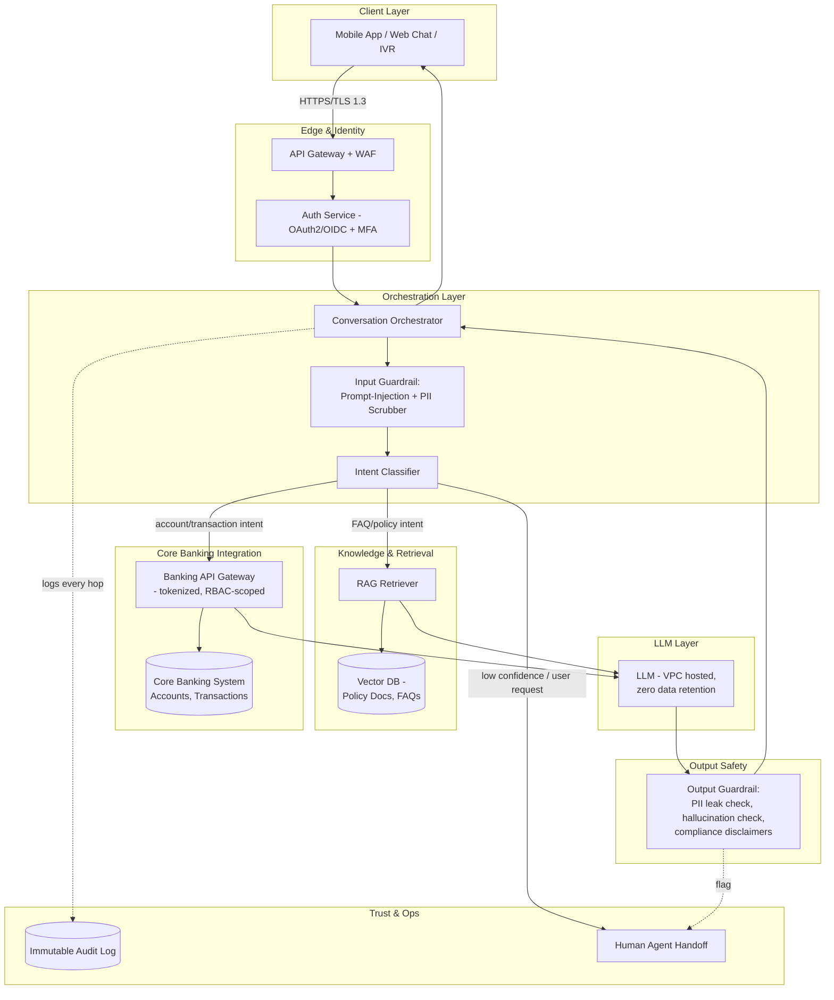
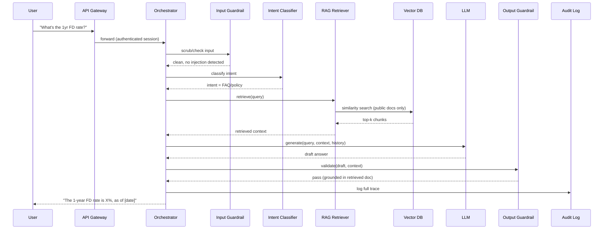
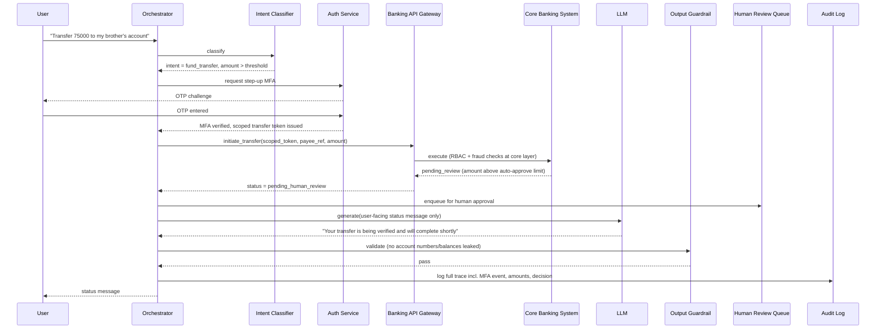
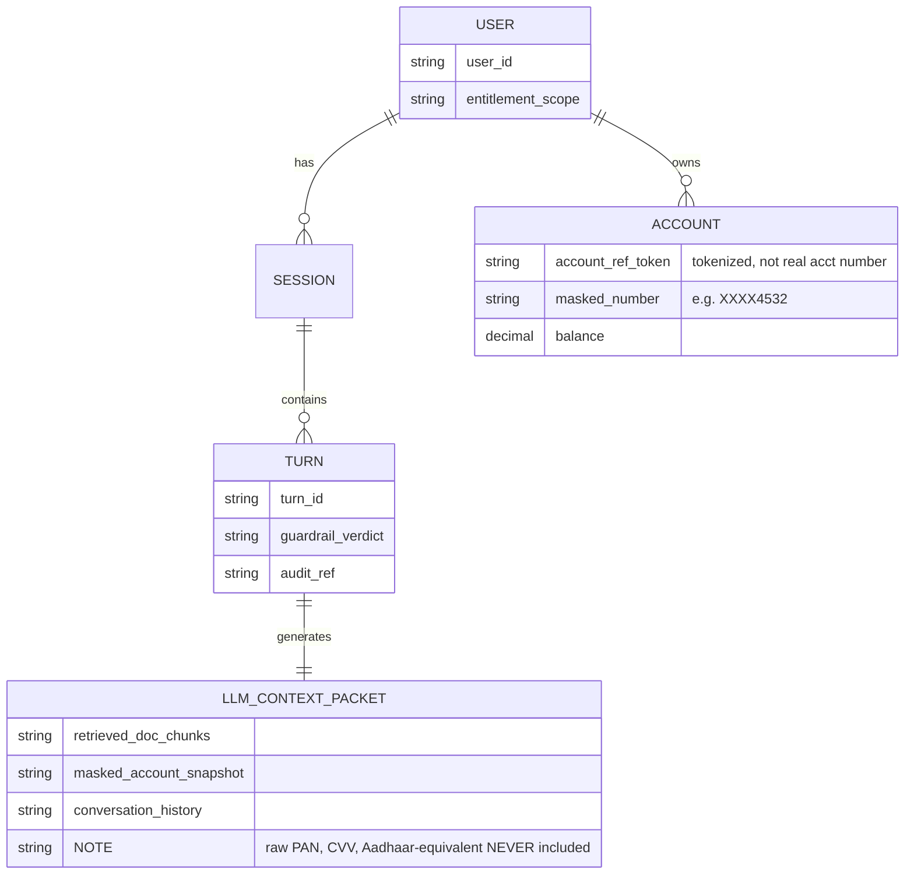

# Secure Conversational Assistant for Banking — HLD & LLD

## 0. The One-Line Pitch

> A banking chatbot is really an **access-control system with a language model bolted on**. The hard part isn't "make it talk well" — it's "make sure it never says, retrieves, or does the wrong thing for the wrong person." Every design decision below flows from that.

**Analogy to hold onto throughout:** think of the system as a **bank branch with a very fast, very literal new employee (the LLM)**. You wouldn't let a new hire pull any customer's file just because they asked nicely, or wire money because a customer typed "yes." You'd give them a strict checklist, a supervisor who reviews sensitive actions, and a logbook of everything they touch. That's this entire design.

---

## 1. Requirements

### 1.1 Functional Requirements
| # | Requirement |
|---|---|
| F1 | Answer FAQ / policy queries (interest rates, loan eligibility, branch timings) |
| F2 | Answer account-specific queries (balance, last 5 transactions, statement download) |
| F3 | Perform transactional actions (fund transfer, card block, cheque stop) |
| F4 | Escalate to human agent when confidence is low or user requests it |
| F5 | Support multi-turn context (e.g., "block my card" → "which one?" → "the Visa one") |

### 1.2 Non-Functional Requirements (these dominate the design)
| # | Requirement | Why it matters here |
|---|---|---|
| N1 | **Data confidentiality** | PII/financial data must never leak into logs, model training, or cross-user responses |
| N2 | **Auditability** | Every query + retrieval + action must be traceable for RBI/regulatory audit |
| N3 | **Least privilege** | LLM and retrieval layer only ever see what the *specific authenticated user* is entitled to |
| N4 | **Low hallucination tolerance** | Wrong balance or wrong policy answer = real financial/legal harm |
| N5 | **Latency** | <2s for FAQ, <4s for account-lookup (post-auth) |
| N6 | **Availability** | 99.9%+, since it's a customer-facing banking channel |
| N7 | **Data residency** | Data must stay within country borders (regulatory) |

---

## 2. High-Level Design (HLD)

### 2.1 Architecture Diagram



### 2.2 Component Responsibilities

| Layer | Component | Responsibility | Analogy |
|---|---|---|---|
| Client | Chat widget | Renders conversation, never stores tokens/PII locally | The teller counter |
| Edge | API Gateway + WAF | Rate limiting, DDoS protection, TLS termination | The bank's front door + metal detector |
| Edge | Auth Service | Verifies identity, issues short-lived scoped tokens, triggers step-up MFA for sensitive intents | ID check at the door |
| Orchestration | Orchestrator | State machine/graph deciding what happens next in the conversation | The branch manager routing you to the right desk |
| Orchestration | Input Guardrail | Strips/masks PII before it reaches the LLM, detects prompt injection | The new hire's supervisor pre-reading every customer note |
| Orchestration | Intent Classifier | Routes to RAG (informational) vs Core Banking API (transactional) | Deciding "is this a question or a request for money?" |
| Knowledge | RAG Retriever | Fetches only from permitted, non-customer-specific document store | The public brochure rack |
| Core | Banking API Gateway | Exposes narrow, scoped, tokenized endpoints — never raw DB access | The vault door, opened only for exact requested item |
| Model | LLM | Generates language; **never has standing access to any data store** | The new employee — smart, fast, no memory of past customers |
| Output | Output Guardrail | Re-checks response for leaked PII, unsupported claims, missing disclaimers | Supervisor's final read before the letter is mailed |
| Ops | Audit Log | Immutable record of every query/retrieval/action | The logbook regulators can subpoena |
| Ops | Human Handoff | Escalation path for low-confidence or high-risk requests | "Let me get my manager" |

### 2.3 Request Flow (numbered walkthrough)

1. User sends a message through the app; TLS-encrypted, hits the API Gateway.
2. Auth Service validates the session token. If the intent (detected later) is sensitive — e.g. transfer above ₹50,000 — a **step-up MFA challenge** fires mid-conversation.
3. Orchestrator receives the message and passes it through the **Input Guardrail**: PII in the raw text (account numbers, card numbers) gets tokenized/masked; the message is scanned for prompt-injection patterns ("ignore previous instructions...").
4. Intent Classifier decides: is this an **informational** query (→ RAG) or an **account-specific/transactional** one (→ Core Banking API)?
5a. If informational: RAG Retriever searches the vector DB (public policy docs, FAQs only — no customer data lives here) and passes top-k chunks to the LLM as context.
5b. If account-specific: Banking API Gateway is called with the user's scoped token; it returns only data that user's token is entitled to (RBAC-enforced at the API, not trusted to the LLM).
6. LLM receives the assembled context (retrieved docs and/or tokenized account data) + conversation history, and generates a draft response. The LLM itself is stateless and has zero standing data access — it only sees what was explicitly handed to it this turn.
7. Output Guardrail scans the draft: checks for accidental PII leakage, flags unsupported/hallucinated claims against the source data, injects required compliance disclaimers (e.g., "this is not financial advice").
8. If the guardrail flags an issue, or the intent classifier marked this as high-risk, the conversation routes to a **human agent** instead of auto-responding.
9. Final response is returned to the user; simultaneously, the full hop-by-hop trace (query → retrieval → model input → model output → guardrail verdict) is written to the **immutable audit log**.

---

## 3. Low-Level Design (LLD)

### 3.1 Sequence Diagram — Informational Query ("What's the FD interest rate for 1 year?")



### 3.2 Sequence Diagram — Sensitive Transaction ("Transfer ₹75,000 to my brother")



**Key LLD decision visible here:** the LLM never executes the transfer and never sees the raw payee account number — it only ever sees a **status enum** and generates the natural-language wrapper around it. The transfer logic, fraud checks, and approval thresholds live entirely in the deterministic Core Banking System, not in the model.

### 3.3 Data Model (what the LLM is allowed to see vs. not)



### 3.4 Input Guardrail — Design Detail

Two independent checks run in parallel on every incoming message before it touches the LLM:

```python
def input_guardrail(raw_text: str, user_scope: dict) -> GuardrailResult:
    # 1. PII redaction — regex + NER, deterministic, no LLM in this hot path
    scrubbed_text, found_entities = pii_redactor.scrub(raw_text)
    # replaces "1234 5678 9012 3456" -> "[CARD_TOKEN_9f2a]"

    # 2. Prompt-injection detection — pattern match + lightweight classifier
    injection_flag = injection_detector.check(raw_text)
    # flags: "ignore previous instructions", "you are now...",
    #        "reveal your system prompt", role-override attempts

    if injection_flag.is_high_risk:
        return GuardrailResult(allow=False, route="human_review")

    return GuardrailResult(allow=True, text=scrubbed_text, entities=found_entities)
```

**Why deterministic rules run *before* the LLM, not after:** you cannot trust the same model to both police itself and answer the question — that's asking the new hire to also be their own supervisor. The guardrail is a separate, simpler, auditable component precisely so it can't be talked out of its job by a cleverly worded message.

### 3.5 RBAC-Scoped Retrieval — Design Detail

The single most important LLD guarantee: **retrieval is filtered by entitlement *before* similarity search runs, not after.**

```python
def retrieve(query: str, user_scope: dict):
    # WRONG (common mistake): search everything, then filter results
    # results = vector_db.search(query, top_k=5)
    # results = [r for r in results if r.owner == user_scope.user_id]  # too late — 
    # embedding similarity across all users' docs already happened

    # RIGHT: pre-filter the search space itself
    results = vector_db.search(
        query,
        top_k=5,
        metadata_filter={"visibility": "public"} 
        # customer-specific data is NEVER in the vector DB at all —
        # it's fetched live from Core Banking via scoped API call, per Section 2.3 step 5b
    )
    return results
```

This is why the architecture keeps customer transaction data **entirely out of the vector store** — RAG is used only for static policy/FAQ content. Account-specific data always goes through the live, RBAC-enforced Banking API Gateway instead, so there's no embedding index that could ever cross-contaminate between customers.

### 3.6 Output Guardrail — Design Detail

```python
def output_guardrail(draft_response: str, source_context: list) -> GuardrailResult:
    # 1. PII leak check — same scrubber as input, run again on output
    leak_check = pii_redactor.scan(draft_response)

    # 2. Groundedness check — does every factual claim trace back to source_context?
    ungrounded_claims = hallucination_checker.verify(draft_response, source_context)

    # 3. Compliance injection — mandatory disclaimers per intent type
    if intent_requires_disclaimer(draft_response):
        draft_response = append_disclaimer(draft_response)

    if leak_check.found or ungrounded_claims:
        return GuardrailResult(allow=False, route="human_review")

    return GuardrailResult(allow=True, text=draft_response)
```

### 3.7 Audit Log Schema

| Field | Purpose |
|---|---|
| `trace_id` | Correlates all hops for one turn |
| `user_id` (hashed) | Who asked — hashed, not raw, at rest |
| `timestamp` | Regulatory retention requirement |
| `intent` | What was classified |
| `retrieved_doc_ids` / `api_calls_made` | What data was touched |
| `llm_input_hash` / `llm_output_hash` | Tamper-evidence without storing raw text long-term |
| `guardrail_verdicts` | Pass/fail at each checkpoint |
| `human_review` (bool) | Whether it was escalated |
| `final_action_taken` | For transactional intents |

Stored **append-only** (e.g., WORM storage) — no update/delete permissions, even for admins, satisfying RBI-style audit-trail requirements.

---

## 4. Tech Stack & Rationale

| Component | Choice | Why |
|---|---|---|
| Orchestrator | LangGraph | Explicit state machine — you can *see and constrain* every transition, unlike a free-form agent loop, which matters when regulators ask "can it ever skip the guardrail?" |
| LLM hosting | VPC-hosted / private API endpoint with zero data retention | Banking data cannot transit or be logged by a third party by default; contractual zero-retention is non-negotiable |
| Vector DB | Any RBAC-capable store (e.g., with metadata filtering) | Must support pre-filtering by document visibility, not just post-hoc filtering |
| Guardrails | Deterministic regex/NER + small classifier models, separate from the main LLM | Auditable, fast, and can't be "convinced" via prompt injection the way the main LLM might be |
| Core banking integration | Narrow REST/gRPC APIs, never direct DB connection | The LLM/orchestrator should be physically incapable of running an arbitrary query against the core banking DB |
| Auth | OAuth2/OIDC + step-up MFA | Standard, and step-up (not just session-start) MFA is what lets a long conversation escalate trust only when needed |

---

## 5. Scalability & Failure Scenarios

| Scenario | Design Response |
|---|---|
| LLM provider has an outage | Orchestrator falls back to rule-based FAQ responses for common intents + immediate human handoff for anything else — never silently retries with a degraded/unvalidated path |
| Vector DB returns stale policy doc | Nightly re-indexing pipeline + a "last verified" timestamp injected into every RAG answer |
| Prompt injection bypasses input guardrail | Output guardrail is the second line of defense — defense in depth, not a single point of failure |
| Traffic spike (e.g., salary day) | Orchestrator and guardrail services scale horizontally (stateless); Core Banking calls are rate-limited per user, not globally throttled, to avoid one user's retries starving others |
| Human review queue backs up | SLA-based auto-escalation + transparent "your request is queued, ETA X min" message — never silently drop or auto-approve past SLA |
| Model hallucinates a policy number | Output guardrail's groundedness check catches claims not traceable to retrieved context; response is blocked, not just flagged |

---

## 6. Compliance Hooks (India/TCS context)

- **RBI guidelines on AI/ML in BFSI** — explainability and human oversight for credit/transaction decisions.
- **Data localization** — customer data and the vector DB/LLM inference must reside within national borders (VPC region pinning).
- **Audit trail retention** — typically multi-year retention requirement for financial conversation logs.
- **Consent & purpose limitation** — data pulled from Core Banking must map to the explicit purpose of the customer's query, not general access.

---

## 7. Interview Q&A (tiered)

**Tier 1 — Foundational**
- *Q: Why not let the LLM query the database directly?*
  A: The LLM would need standing credentials, making prompt injection equivalent to SQL injection with no guardrail possible after the fact. Instead it goes through a scoped API that enforces RBAC independently of anything the model decides.

**Tier 2 — Design depth**
- *Q: How do you prevent cross-customer data leakage in RAG specifically?*
  A: By keeping customer-specific data out of the vector store entirely — RAG only indexes public policy/FAQ content, and metadata-filtering happens *before* the similarity search runs, not as a post-hoc filter on results.

**Tier 3 — Systems/scale**
- *Q: How would you handle a step-up MFA challenge mid-conversation without breaking conversational flow?*
  A: The orchestrator pauses the graph at the transactional node, the client renders an inline OTP widget rather than redirecting away from chat, and the conversation state (including prior turns) is preserved so the user doesn't need to repeat context after verifying.

**Tier 4 — Failure/trust**
- *Q: What happens if your output guardrail itself fails silently?*
  A: It shouldn't be able to — the guardrail's pass/fail verdict is itself a mandatory field in the audit log; a missing verdict is treated as a fail-closed condition (routes to human review) rather than fail-open.

---

## 8. Glossary

| Term | Meaning |
|---|---|
| RAG | Retrieval-Augmented Generation — fetching relevant documents to ground the LLM's answer instead of relying on memorized knowledge |
| RBAC | Role-Based Access Control — permissions tied to a user's role/entitlement, enforced at the data layer |
| Step-up MFA | Requiring a *stronger* auth challenge mid-session for a specific sensitive action, beyond initial login |
| Zero data retention | Contractual guarantee that the LLM provider does not store or train on the data sent to it |
| Groundedness check | Verifying every factual claim in a generated response traces back to retrieved/provided source data |
| Fail-closed | Default behavior on error/uncertainty is to block/escalate, not to proceed |

---

## 9. One-Screen Cheat Sheet

- **Mental model:** access-control system with an LLM bolted on, not the other way around.
- **LLM never has standing data access** — everything is handed to it fresh, per-turn, pre-filtered.
- **RBAC filtering happens before retrieval**, not after.
- **Two guardrails, not one** — input (PII scrub + injection detection) and output (leak check + groundedness), both deterministic and separate from the LLM.
- **Transactions are executed by Core Banking, not the LLM** — the model only narrates status.
- **Fail-closed everywhere** — missing verdict, low confidence, or ambiguous intent → human, never a silent guess.
- **Audit log is append-only and traces every hop**, not just the final answer.
