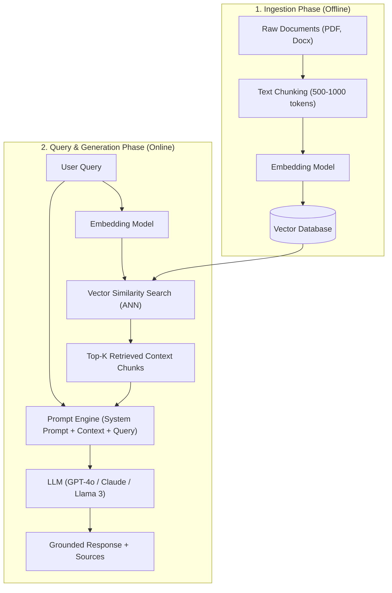

# Comprehensive GenAI & Technical Leadership Interview Guide

A dedicated interview preparation guide focusing on GenAI Architecture, Vector Databases, RAG Optimization, LLM Evaluation Metrics, Fine-Tuning (PEFT/LoRA), and Managerial Problem-Solving.

> 📌 **Looking for Core Python, GIL, Async, Pydantic & OOP Q&A?**  
> Check the dedicated guide: [`Python/PYTHON_INTERVIEW_QA.md`](file:///c:/Users/ervik/source/repos/interview_prep/Python/PYTHON_INTERVIEW_QA.md)

---

## Table of Contents
1. [Core GenAI Topics](#1-core-genai-topics)
   - [Q1. What is a Vector Database?](#q1-what-is-a-vector-database)
   - [Q2. Explain RAG (Retrieval-Augmented Generation) Architecture & Flow](#q2-explain-rag-retrieval-augmented-generation-architecture--flow)
   - [Q3. Similarity Metrics: Cosine vs Dot Product vs Euclidean Distance](#q3-similarity-metrics-cosine-vs-dot-product-vs-euclidean-distance)
   - [Q4. Vector Databases Comparison (FAISS, Chroma, Weaviate, Pinecone)](#q4-vector-databases-comparison-faiss-chroma-weaviate-pinecone)
   - [Q5. How do you improve a RAG-based QA Chatbot?](#q5-how-do-you-improve-a-rag-based-qa-chatbot)
2. [Managerial & Technical Leadership Round](#2-managerial--technical-leadership-round)
   - [Q6. How do you structure a detailed GenAI project walkthrough?](#q6-how-do-you-structure-a-detailed-genai-project-walkthrough)
   - [Q7. LangChain Core Concepts: Chains, Memory, Tools, and Agents](#q7-langchain-core-concepts-chains-memory-tools-and-agents)
   - [Q8. LLM Evaluation Metrics: BLEU, ROUGE, Perplexity, F1 & RAG Triad](#q8-llm-evaluation-metrics-bleu-rouge-perplexity-f1--rag-triad)
   - [Q9. RAG vs Fine-Tuning: When to use which?](#q9-rag-vs-fine-tuning-when-to-use-which)
   - [Q10. How to Fine-Tune an LLM (LoRA & QLoRA Workflow)](#q10-how-to-fine-tune-an-llm-lora--qlora-workflow)
   - [Q11. Real-World Challenges: Hallucination, Context Limits & Grounding](#q11-real-world-challenges-hallucination-context-limits--grounding)
   - [Q12. Key Challenge Deep Dive: Mitigating Prompt Hallucination](#q12-key-challenge-deep-dive-mitigating-prompt-hallucination)
   - [Q13. Leadership, Ownership & Continuous Learning in AI](#q13-leadership-ownership--continuous-learning-in-ai)

---

# 1. Core GenAI Topics

---

### Q1. What is a Vector Database?

#### 💡 Simple Explanation
Imagine a traditional database like a digital filing cabinet where you search using exact keywords (e.g., finding all rows where `city = 'New York'`). If you search for "automobile", a traditional database won't find rows containing "car" unless explicitly told they are synonyms.

A **Vector Database** stores data as **numerical vectors (embeddings)** in a multi-dimensional space. An embedding is a list of numbers (e.g., `[0.12, -0.43, 0.88, ...]`) that captures the **semantic meaning** of text, images, or audio. 

In a Vector DB, "car", "automobile", and "vehicle" end up close to each other in vector space. Searching a Vector DB means asking: *"Which vectors are closest in meaning to my search query vector?"*

```
          [Semantic Vector Space]
               
         (car) •    • (automobile)
                     
                      • (bicycle)
                      
   • (banana)
```

#### 🔑 Key Concepts to Mention in an Interview
1. **Embeddings**: Generated by embedding models (e.g., OpenAI `text-embedding-3-small`, HuggingFace `all-MiniLM-L6-v2`).
2. **ANN (Approximate Nearest Neighbors)**: Algorithms like **HNSW** (Hierarchical Navigable Small World) or **IVF** (Inverted File Index) that allow ultra-fast similarity searches across millions of vectors without scanning every single vector.
3. **Metadata Filtering**: Filtering vectors by non-vector attributes (e.g., `department = 'HR'` and `created_year >= 2024`) before or during vector search.

---

### Q2. Explain RAG (Retrieval-Augmented Generation) Architecture & Flow

#### 💡 Simple Explanation
LLMs are like open-book students. Without RAG, an LLM answers questions purely from memory (pre-training data), which might be outdated or missing your company's private files. 

**RAG** gives the LLM a search engine. When a user asks a question, the system first **retrieves** relevant excerpts from your private documents, attaches them to the prompt as context, and then lets the LLM **generate** an answer grounded in that exact context.

#### 🔄 Architecture & Data Flow



#### 🧩 Main Components
1. **Ingestion Pipeline**: Document Loader $\rightarrow$ Text Splitter $\rightarrow$ Embedding Generator $\rightarrow$ Vector Database.
2. **Retrieval Pipeline**: User Query $\rightarrow$ Query Embedding $\rightarrow$ Similarity Search $\rightarrow$ Top-K Chunks.
3. **Generation Pipeline**: Context + User Prompt $\rightarrow$ LLM $\rightarrow$ Final Response.

---

### Q3. Similarity Metrics: Cosine vs Dot Product vs Euclidean Distance

When comparing two vectors $\vec{A}$ and $\vec{B}$, we need a mathematical formula to measure how similar or close they are.

| Metric | Formula Concept | What it Measures | Best Used When... |
| :--- | :--- | :--- | :--- |
| **Cosine Similarity** | $\cos(\theta) = \frac{\vec{A} \cdot \vec{B}}{\|\vec{A}\| \|\vec{B}\|}$ | The **angle** between two vectors, ignoring their length (magnitude). Ranges from -1 to +1. | Text embeddings where document length varies, but semantic direction matters. |
| **Dot Product (Inner Product)** | $\vec{A} \cdot \vec{B} = \sum A_i B_i$ | Combines both **angle** and **length/magnitude**. | Vectors are already **normalized** to length 1 (where Dot Product == Cosine Similarity, but faster!). |
| **Euclidean Distance ($L_2$)** | $d = \sqrt{\sum (A_i - B_i)^2}$ | The **straight-line distance** between two vector points in space. | Spatial data, image embeddings, or when absolute magnitude difference matters. |

#### 💡 Quick Interview Takeaway Rule:
- **Normalized vectors?** Use **Dot Product** (fastest execution).
- **Un-normalized text vectors of varying length?** Use **Cosine Similarity**.
- **Dense numerical/spatial features?** Use **Euclidean Distance ($L_2$)**.

---

### Q4. Vector Databases Comparison (FAISS, Chroma, Weaviate, Pinecone)

| Vector DB | Type | Key Advantages | Disadvantages / Drawbacks | Best Use Case |
| :--- | :--- | :--- | :--- | :--- |
| **FAISS** (Meta) | In-memory Library | Extremely fast, lightweight, open-source C++ core with Python bindings. | No built-in storage persistence or metadata filtering out of the box. | Local prototyping, batch evaluation scripts, embedded mobile apps. |
| **Chroma DB** | Open-Source Embedded DB | Easy setup (`pip install chromadb`), local persistence, pythonic API. | Not built for multi-node enterprise clustering out of the box. | Developer MVPs, local RAG applications, small to medium datasets. |
| **Pinecone** | Fully Managed Cloud DB | Zero infrastructure management, auto-scaling, low latency, rich metadata filtering. | Closed source, vendor lock-in, recurring cloud cost. | Enterprise SaaS apps requiring managed 24/7 reliability & scale. |
| **Weaviate** | Open-Source / Cloud Hybrid | Native GraphQL support, built-in vectorizer modules, hybrid search (BM25 + Vector). | Steeper learning curve, requires running docker/K8s for self-hosting. | Complex enterprise applications needing rich schema & hybrid search. |

---

### Q5. How do you improve a RAG-based QA Chatbot?

If a basic RAG system yields poor results, you optimize it across **Retrieval**, **Context Quality**, and **Generation**:

#### 1. Advanced Chunking Strategies
- **Semantic Chunking**: Split text based on sentence embeddings/meaning changes instead of arbitrary character counts.
- **Parent-Child / Small-to-Big Retrieval**: Retrieve small chunks (100 tokens) for accurate embedding matching, but feed the larger surrounding parent chunk (500 tokens) to the LLM for context.

#### 2. Hybrid Search + Re-ranking (Huge Impact!)
- **Hybrid Search**: Combine **Dense Vector Search** (semantic) with **Sparse BM25 Keyword Search** (exact matching for product IDs, names, codes).
- **Re-ranking**: Pass top-20 retrieved chunks through a cross-encoder model (e.g., **Cohere Rerank** or `bge-reranker`) to select the top-3 truly relevant chunks.

#### 3. Query Transformations
- **HyDE (Hypothetical Document Embeddings)**: Ask the LLM to generate a hypothetical answer first, embed that answer, and use it to search the Vector DB.
- **Multi-Query Expansion**: Rewrite a user query into 3 variations to capture different phrasing.

#### 4. Prompt Engineering & Grounding
- Add strict system rules: *"Answer ONLY based on the context. If not present, say 'I don't know'."*
- Provide few-shot examples of correct grounded responses.

---

# 2. Managerial & Technical Leadership Round

---

### Q6. How do you structure a detailed GenAI project walkthrough?

Use the **STAR / CAR Framework** tailored for Senior AI Role interviews:

1. **Context & Business Impact (C)**:
   - *"At my company, customer support agents spent 15 minutes per ticket manually searching technical PDFs, leading to high MTTR (Mean Time to Resolution) and \$200K annual support overhead."*
2. **Action & System Architecture (A)**:
   - *"I architected an enterprise RAG system using LangGraph, Qdrant Vector DB, and OpenAI GPT-4o with Cohere Rerank."*
   - *"Designed a PII redaction layer (Presidio) to ensure compliance with SOC2/GDPR."*
3. **Results & Metrics (R)**:
   - *"Reduced ticket resolution time by 75% (15 mins to 3.5 mins)."*
   - *"Achieved 96% groundedness score on RAG evaluation and saved \$140K/year."*

---

### Q7. LangChain Core Concepts: Chains, Memory, Tools, and Agents

- **Chains**: Sequential linkage of components (e.g., Prompt + LLM + Output Parser). Modern LangChain uses LCEL (LangChain Expression Language: `prompt | llm | parser`).
- **Memory**: Mechanism to store and retrieve conversation context across turns (e.g., `ConversationBufferMemory`, `VectorStoreRetrieverMemory`).
- **Tools**: Executable functions wrapped with schema descriptions that an LLM can invoke via function calling (e.g., Calculator tool, SQL Database query tool, Search API).
- **Agents**: Autonomous LLMs that dynamically decide *which tools to call* and *in what sequence* to solve a complex multi-step user goal (e.g., ReAct / LangGraph agents).

---

### Q8. LLM Evaluation Metrics: BLEU, ROUGE, Perplexity, F1 & RAG Triad

#### Traditional NLP Metrics
- **BLEU**: Measures n-gram precision compared to reference translations. Good for machine translation; poor for open-ended generation.
- **ROUGE (e.g., ROUGE-L)**: Measures n-gram recall (overlap of long common subsequences). Standard metric for text summarization.
- **Perplexity**: Measures how "surprised" a language model is by a sequence of words. Lower perplexity = model is more confident.

#### Modern LLM & RAG Evaluation (RAG Triad)
1. **Context Relevance**: Did the vector search retrieve chunks relevant to the user query?
2. **Groundedness / Faithfulness**: Is the LLM's answer strictly derived from the retrieved context without hallucinating external facts?
3. **Answer Relevance**: Did the LLM actually answer the user's question?

---

### Q9. RAG vs Fine-Tuning: When to use which?

| Dimension | RAG (Retrieval-Augmented Generation) | Fine-Tuning (LoRA / SFT) |
| :--- | :--- | :--- |
| **Primary Goal** | **Dynamic Knowledge Access** (adding new/private facts). | **Style, Format, Tone & Syntax Adaptation** (teaching a new skill/style). |
| **Data Freshness** | Real-time (instant update by inserting files into DB). | Static (requires re-training when data changes). |
| **Hallucination** | Low (grounded with verifiable source citations). | Higher risk of hallucinating facts if relied on for static memory. |
| **Cost & Effort** | Low to Medium upfront cost; ongoing vector DB operational cost. | High compute cost for training; GPU infrastructure needed. |

#### 💡 Rule of Thumb:
- Need **new facts / knowledge retrieval / citations**? $\rightarrow$ **Choose RAG**.
- Need **custom output style / JSON format / specialized medical tone**? $\rightarrow$ **Choose Fine-Tuning**.
- Best Enterprise Solution? $\rightarrow$ **Hybrid (Fine-Tuned Model + RAG)**.

---

### Q10. How to Fine-Tune an LLM (LoRA & QLoRA Workflow)

#### What is PEFT (Parameter-Efficient Fine-Tuning)?
Instead of updating all 70 billion parameters of an LLM (which requires cluster GPUs), **PEFT** freezes the base model weights and trains a tiny set of additive parameters.

#### LoRA (Low-Rank Adaptation)
- Injects small, trainable rank-decomposition matrix pairs ($W + \Delta W = W + A \cdot B$) into transformer attention layers.
- Reduces trainable parameters by **99%**, cutting memory requirements dramatically.

#### QLoRA (Quantized LoRA)
- Quantizes the base model parameters down to **4-bit NormalFloat (NF4)** precision while keeping LoRA matrices in 16-bit float.
- Allows fine-tuning a 7B parameter LLM on a **single consumer GPU (e.g., RTX 4090 or T4)**!

#### Step-by-Step Workflow:
1. **Prepare Dataset**: Format instruction-response pairs into JSONL (`{"instruction": "...", "input": "...", "output": "..."}`).
2. **Load Quantized Base Model**: Use `bitsandbytes` to load model in 4-bit (`load_in_4bit=True`).
3. **Attach LoRA Adapter**: Use HuggingFace `peft` library (`LoraConfig(r=8, lora_alpha=16, target_modules=["q_proj", "v_proj"])`).
4. **Train**: Run SFTTrainer from HuggingFace `trl` library.
5. **Merge & Save**: Merge LoRA adapter weights back into base model for deployment.

---

### Q11. Real-World Challenges: Hallucination, Context Limits & Grounding

| Challenge | Root Cause | Engineering Mitigation Strategy |
| :--- | :--- | :--- |
| **Hallucination** | LLM tries to fill knowledge gaps probabilistically when context is missing. | - Strict system prompts ("Say I don't know").<br>- Re-ranking chunks.<br>- Grounding validation check before rendering output. |
| **Context Window Overflow** | Input text exceeds LLM max token limit (e.g., 8K / 128K). | - Summarization memory.<br>- Map-Reduce / Refine chaining.<br>- Smaller chunk sizes with top-k selection. |
| **Lost in the Middle** | LLMs attend well to beginning and end of long prompts, but ignore middle context. | - Re-rank retrieved chunks so highest scoring chunks are at top and bottom of prompt context. |

---

### Q12. Key Challenge Deep Dive: Mitigating Prompt Hallucination

> **Interview Highlight Scenario**: *"In my recent GenAI deployment, our primary challenge was prompt hallucination where the bot fabricated policy details for corner-case user questions. Here is how I solved it:"*

#### 1. Context Chunk Optimization
- Discarded fixed-character splitting (which cut sentences in half) in favor of **Semantic Recursive Chunking** with 15% overlap.
- Applied **Cohere Reranker v3** to filter out low-relevance vector results ($< 0.65$ score threshold).

#### 2. Strict Prompt Grounding & System Constraints
- Implemented a 2-stage prompt structure:
  ```text
  You are an enterprise assistant. Answer the user question strictly using ONLY the context snippets below.
  If the answer cannot be directly derived from the context, state: "I cannot find this information in the official docs." Do NOT use internal knowledge.
  ```

#### 3. Automated Faithfulness Guardrails
- Added a lightweight evaluator model pass (or NeMo Guardrails) that checks:
  $$\text{Faithfulness Score} = \frac{\text{Number of Claims Supported by Context}}{\text{Total Claims in Answer}}$$
- If Faithfulness $< 0.95$, the output is blocked and safely routed to human support.

---

### Q13. Leadership, Ownership & Continuous Learning in AI

- **Problem-Solving & Initiative**: Proactively identifying business friction (e.g., high support ticket volume) and championing GenAI POCs that demonstrate measurable ROI.
- **Cross-Functional Collaboration**: Bridging the gap between Product Managers, Security/Compliance teams, and Data Engineers.
- **Continuous Learning**: Staying up to date with fast-evolving GenAI research (reading ArXiv papers, testing new open-source models like Llama 3 / Mistral, and tracking agent frameworks like LangGraph and AutoGen).
