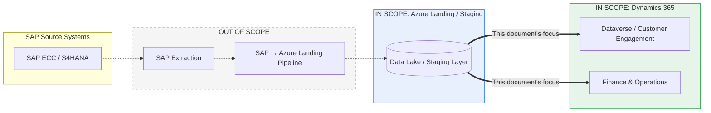
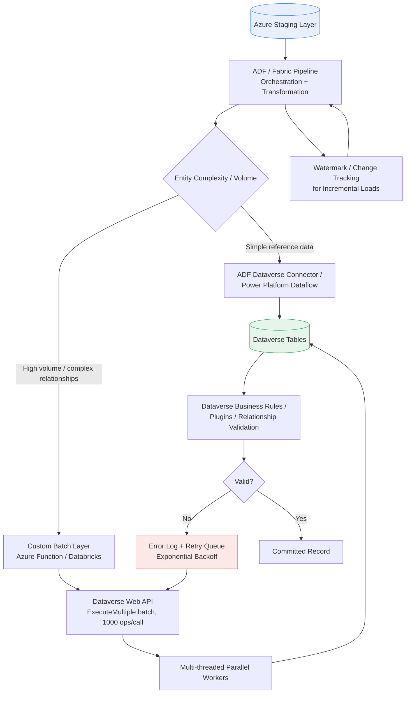
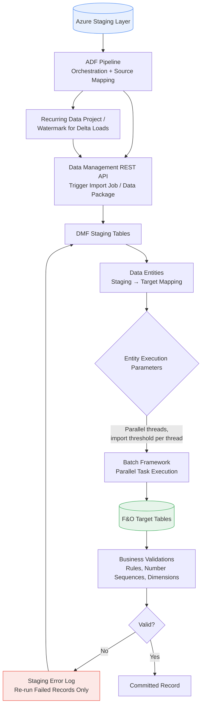
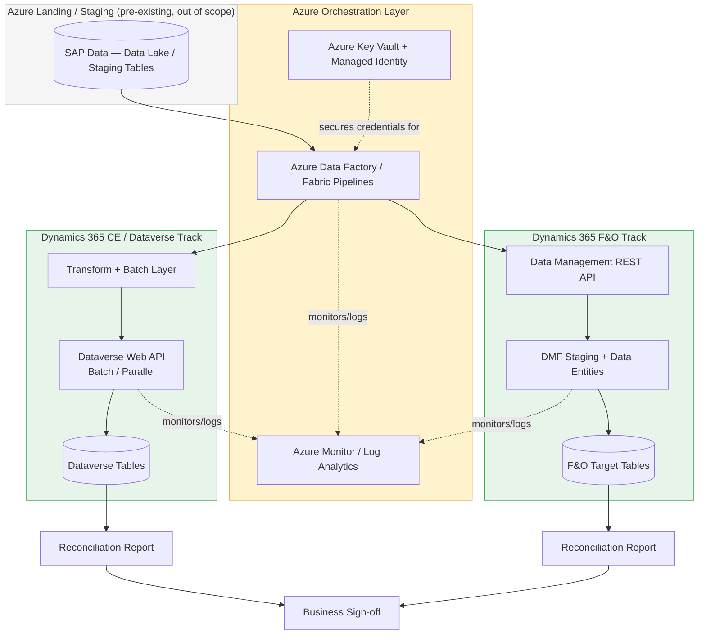
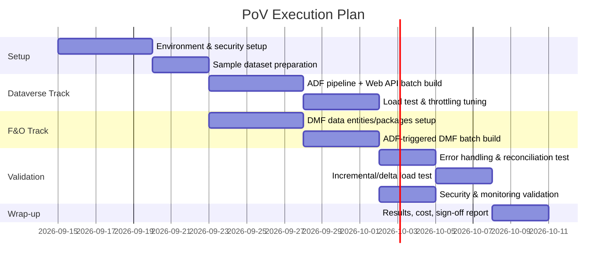

# Azure Staging → Dynamics 365 Migration: Solution Architecture & PoV Approach

**Scenario:** SAP data has already landed in Azure (Data Lake / staging layer). This document covers only the next hop — moving that data into the appropriate Dynamics 365 application at enterprise scale.

---

## 1. Executive Summary

The ask, in one sentence: **identify and validate the best Microsoft-supported way to move already-landed SAP data from Azure into Dynamics 365 — covering both Dataverse/Customer Engagement and Finance & Operations — while proving scalability, security, performance, transformation, validation, and operational readiness.**

This document:
- Fixes the scope boundary (SAP extraction is explicitly out of scope).
- Evaluates the top 3 Microsoft-supported approaches for each Dynamics 365 track.
- Recommends one primary approach per track, with justification against volume, complexity, security, performance, and validation criteria.
- Defines what the Proof of Value (PoV) must demonstrate, and how.
- Lays out the end-to-end target architecture and a phased PoV execution plan.

---

## 2. Scope & Assumptions

| | |
|---|---|
| **In scope** | Azure staging/Data Lake → Dynamics 365 (Dataverse/CE and F&O) migration design, tooling evaluation, and PoV |
| **Out of scope** | SAP-side extraction, SAP → Azure Data Lake/staging pipeline (assumed to already exist and deliver clean, landed data) |
| **Assumption** | SAP data is available in Azure landing/staging (Data Lake / Azure SQL / Synapse staging tables) in a consumable, reasonably structured form before this pipeline begins |
| **Assumption** | Target Dynamics 365 environments (Dataverse/CE and/or F&O) are provisioned and schema/entity design is either finalized or in parallel workstream |
| **Assumption** | Data volumes are enterprise-scale (hundreds of thousands to millions of records across master and transactional entities), not a small config-only load |

---

## 3. Microsoft's Own Framing of the Problem

Microsoft does not prescribe a single migration tool. Guidance for Dataverse explicitly splits approaches by **volume and complexity** (simple / medium / complex), and for Finance & Operations it points to the **Data Management Framework (DMF)** as the primary, purpose-built mechanism for Finance, Supply Chain Management, and Commerce data. That split is why this evaluation treats Dataverse/CE and F&O as two separate tracks rather than one generic "Azure-to-Dynamics" pipeline — the two apps have fundamentally different data platforms (Dataverse tables + Web API vs. an X++/SQL-backed AOS with entity-based staging).

---

## 4. Track 1 — Dynamics 365 Customer Engagement / Dataverse

### 4.1 Candidate Approaches

**A. Dataverse Native Import (Import Wizard / Configuration Migration Tool / Package Deployer)**
Point-and-click, no-code import directly into Dataverse. Suited to small volumes and reference/config data.

**B. Azure Data Factory (or Power Platform Dataflows) → Dataverse Connector**
Low/no-code ETL: ADF or Dataflows read from the Azure staging layer, map fields, and write into Dataverse using the built-in Dataverse connector. Good middle-ground for moderate volume and moderate relational complexity.

**C. ADF/Fabric-Orchestrated Pipeline Using the Dataverse Web API in Batch Mode**
ADF (or Fabric pipelines) orchestrate a custom write layer that calls the Dataverse Web API using `ExecuteMultiple`/batch requests, multi-threaded parallel execution, and elastic tables where high write throughput is needed. This is the pattern Microsoft's own architecture guidance points to once volume crosses roughly 50 GB / 500,000 records or the data has deep relational complexity (multiple interdependent tables, option sets, polymorphic lookups, hierarchies).

### 4.2 Comparison Matrix

| Criterion | A. Native Import | B. ADF/Dataflows → Connector | C. ADF/Fabric + Web API Batch |
|---|---|---|---|
| **Throughput** | Low — manual, single-threaded | Medium — connector-managed batching | High — tunable batch size + parallel threads |
| **API limits / throttling** | N/A (UI-based) | Connector abstracts it, limited control | Full control: `ExecuteMultiple` (up to 1000 ops/call), exponential backoff on 429s |
| **Parallel processing** | None | Limited | Yes — configurable multi-threaded workers |
| **Relationships / mappings** | Manual, error-prone at scale | Declarative mapping in ADF/Dataflow | Full custom control — needed for polymorphic lookups, hierarchies, option sets |
| **Validation** | Basic, pre-import only | Pipeline-level validation | Custom pre/post validation + Dataverse plugin/business-rule enforcement |
| **Error handling** | Manual re-upload | Pipeline retry policies | Row-level retry, dead-letter queue, reconciliation reports |
| **Incremental loads** | Not designed for this | Supported via watermarking | Fully supported — upsert via alternate keys |
| **Microsoft support** | Fully supported | Fully supported | Fully supported (standard Dataverse Web API + ADF) |
| **Best fit** | Config/reference data, <1 GB / <50K records | 1–50 GB / 50K–500K records, moderate complexity | >50 GB / >500K records, high relational complexity — **our scenario** |

### 4.3 Recommendation — Track 1

**Recommended: Approach C** (ADF/Fabric orchestration + Dataverse Web API batch/parallel), with **Approach B** used for smaller, simpler reference entities where full custom control isn't needed. Approach A is retained only for one-off config/lookup data, not for SAP master or transactional data.

---

## 5. Track 2 — Dynamics 365 Finance & Operations

### 5.1 Candidate Approaches

**A. Azure Data Factory → D365 F&O via the Data Management REST API**
ADF orchestrates the overall pipeline and calls F&O's Data Management REST API to trigger import jobs, keeping F&O migration inside the same Azure orchestration/monitoring plane as everything else.

**B. F&O Data Management Framework (DMF) — Data Entities & Data Packages (native)**
The purpose-built mechanism Microsoft ships specifically for Finance, Supply Chain Management, and Commerce. Data is staged into DMF staging tables, validated, and moved into target tables through Data Entities, using Data Packages for structured, repeatable jobs. Supports parallel entity execution via entity execution parameters (thread count, import threshold per thread).

**C. Data Integrator / OData Endpoints / Business Events**
Designed for **ongoing, often near-real-time** integration rather than bulk historical migration — e.g., a live sales order feed. OData is synchronous and lower-throughput; Business Events push change notifications. Useful post-migration for steady-state integration, not for the initial bulk load.

### 5.2 Comparison Matrix

| Criterion | A. ADF → Data Management API | B. Native DMF (Entities/Packages) | C. Data Integrator / OData / Business Events |
|---|---|---|---|
| **Throughput** | High (async batch API) | High — this is the engine A ultimately calls | Low–medium — designed for transactional/event volumes, not bulk |
| **Parallel processing** | Inherits DMF's parallelism | Native: configurable threads + import threshold per entity | Limited |
| **Staging & validation** | Delegates to DMF staging tables | Native staging tables, business validations before target commit | Minimal staging; validated at transaction time |
| **Transformation** | ADF handles source-side mapping | Data Entity mapping (source→staging→target) | Minimal — expects near-final shape |
| **Error handling** | ADF retry + DMF execution logs | Native execution history, per-record error reporting, re-run failed records | Per-transaction error handling only |
| **Incremental loads** | Supported via ADF watermarking + DMF recurring data projects | Supported via recurring data projects | Natively real-time/event-driven |
| **Microsoft support** | Fully supported (this *is* the Microsoft-recommended pattern for orchestrated bulk loads) | Fully supported — Microsoft's primary migration mechanism for F&O | Fully supported, but for a different use case |
| **Best fit** | One-time/phased bulk migration orchestrated centrally — **our scenario** | The actual execution engine for the migration, regardless of what triggers it | Post-migration steady-state integration |

### 5.3 Recommendation — Track 2

**Recommended: Approach B (native DMF with Data Entities/Data Packages) as the execution engine, invoked and orchestrated by Approach A (ADF calling the Data Management REST API).** This keeps F&O migration inside the same Azure-orchestrated pipeline as the Dataverse track (unified scheduling, monitoring, and alerting) while using the framework Microsoft explicitly built and tuned for F&O-scale data movement. Approach C is scoped for **after** migration, as the ongoing integration pattern once D365 is live.

---

## 6. Combined End-to-End Target Architecture

---

## 7. What the PoV Must Prove

The PoV is not "we can connect Azure to Dynamics 365." It must prove operational readiness at enterprise scale:

| Area | What We Need to Prove | How the PoV Demonstrates It |
|---|---|---|
| **Connectivity** | Microsoft-supported connectivity from Azure to the target D365 application | Live ADF pipeline successfully authenticating and writing to both Dataverse and F&O |
| **Volume** | Handles expected data volume within the migration window | Load test with representative record counts against the migration window SLA |
| **Performance** | Throughput, batch/parallel processing, scalability | Measure records/minute at varying thread counts and batch sizes; identify the scaling ceiling |
| **Transformation** | Where/how source-to-target mapping happens | Documented mapping layer (ADF Data Flow / staging SQL) with sample transformation rules executed end-to-end |
| **Data validation** | D365 validations, relationships, business rules handled correctly | Test cases covering required fields, lookups/relationships, number sequences, duplicate detection |
| **Security** | Entra ID, managed identity, RBAC, encryption | Pipeline runs under managed identity, no embedded secrets, TLS in transit, encryption at rest confirmed |
| **Error handling** | Failed records, retries, reconciliation, restartability | Inject deliberate bad records; confirm retry, dead-letter capture, and clean re-run without duplicating good records |
| **Monitoring** | Pipeline- and Dynamics-side monitoring/auditing | ADF/Fabric run history + Log Analytics dashboards + Dataverse audit logs / F&O DMF execution history |
| **Incremental migration** | Delta/changed records handled | Run a second load with a mix of new/changed/unchanged records; confirm correct upsert behavior |
| **Microsoft support** | Approach is officially supported/recommended | Each chosen component (ADF, Dataverse Web API, DMF) is a first-party, documented Microsoft capability |
| **Cost** | Azure + Dynamics/Dataverse consumption implications | Capture ADF integration runtime cost, Dataverse API call consumption, F&O batch/AOS load during test runs |
| **Maintainability** | Ease of operating after migration | Pipeline is parameterized/reusable per entity, with documented runbooks for re-runs and failure recovery |

---

## 8. Non-Functional Design Considerations

### 8.1 Security
- **Authentication:** Microsoft Entra ID (Azure AD) service principals / managed identities for ADF-to-Dataverse and ADF-to-F&O connections — no static credentials in pipelines.
- **Authorization:** Least-privilege RBAC — dedicated Dataverse application user with scoped security roles; dedicated F&O integration user restricted to required data entities.
- **Secrets:** Azure Key Vault for any remaining connection secrets, referenced by ADF linked services, never hard-coded.
- **Encryption:** TLS in transit; encryption at rest via Azure Storage/SQL and Dataverse/F&O platform-managed encryption.

### 8.2 Error Handling & Reconciliation
- Staging tables act as a checkpoint/buffer so failed loads can be re-run without re-pulling from source.
- Row-level error capture (Dataverse Web API error codes / DMF staging error columns) written to a dedicated error log table.
- Reconciliation step comparing source record counts/checksums against target committed counts per entity, per run.
- Idempotent, restartable design: re-running a failed batch must not create duplicates (achieved via alternate keys / natural keys + upsert semantics).

### 8.3 Monitoring & Auditing
- Pipeline-level: ADF/Fabric run monitoring, alerts on failure, integration with Azure Monitor/Log Analytics.
- Dataverse-side: Dataverse audit logs for record creation/updates during migration.
- F&O-side: DMF execution history per data project/entity, with drill-down to failed records.

### 8.4 Incremental / Delta Handling
- Watermark columns (last-modified timestamp / change-tracking key) maintained in the Azure staging layer.
- Dataverse: upsert via alternate keys through the Web API.
- F&O: recurring data projects / scheduled Data Management jobs picking up only delta records from staging.

### 8.5 Cost
- ADF: pipeline orchestration + Data Flow compute (pay-as-you-go, scales with data volume and parallelism).
- Dataverse: API call consumption counts against tenant API limits/entitlements — batching reduces call count materially versus record-by-record calls.
- F&O: DMF jobs run on the existing AOS/batch infrastructure — no separate consumption unit, but batch server capacity should be sized for the migration window.

### 8.6 Maintainability
- Metadata-driven pipeline design (entity list, mapping, and batch-size parameters externalized, not hard-coded) so new entities/waves can be onboarded without pipeline rewrites.
- Clear separation between orchestration (ADF), transformation (staging/Data Flow), and load (Dataverse Web API / DMF) layers so each can be tuned or replaced independently.

---

## 9. Risks & Mitigations

| Risk | Mitigation |
|---|---|
| Dataverse API throttling under high parallel load | Tune thread count/batch size in PoV; implement exponential backoff and adaptive throttling |
| F&O AOS/batch contention with live business processes during migration window | Schedule bulk loads in dedicated batch groups/off-peak windows; size batch server capacity for migration |
| Relational integrity breaks (parent loaded after child, broken lookups) | Enforce entity load sequencing (levels) in both Dataverse and F&O batch execution |
| Data quality issues surfacing only at D365 validation time | Add pre-validation checks in the Azure staging layer before attempting D365 load |
| Migration window overrun on very high volumes | Validate throughput ceiling early in PoV against actual volume/window math, not assumptions |

---

## 10. PoV Execution Plan

**Phase summary:**
1. **Setup** — provision environments, Entra ID service principals/managed identities, sample dataset drawn from the Azure staging layer.
2. **Build (parallel tracks)** — Dataverse Web API batch pipeline; DMF-based F&O pipeline triggered via ADF.
3. **Validate** — throughput/scale, error handling and restartability, incremental loads, security and monitoring.
4. **Report** — consolidated PoV results against the validation matrix in Section 7, with a cost and maintainability summary, feeding the go/no-go decision for full migration build.

---

## 11. Final Recommendation Summary

| Track | Recommended Approach | Why |
|---|---|---|
| **Dynamics 365 CE / Dataverse** | ADF/Fabric orchestration + Dataverse Web API in batch/parallel mode (`ExecuteMultiple`, multi-threaded), with ADF/Dataflow connector reserved for simple reference data | Only approach that meets enterprise volume/complexity while staying fully Microsoft-native and giving full control over throttling, retries, and relationship sequencing |
| **Dynamics 365 F&O** | Native Data Management Framework (Data Entities/Data Packages) as the execution engine, triggered and orchestrated by ADF via the Data Management REST API | Uses Microsoft's purpose-built F&O migration mechanism while keeping scheduling/monitoring unified with the Dataverse track in Azure |
| **Post-migration integration** | Data Integrator / OData / Business Events (F&O) and standard Dataverse APIs (CE) | Right-sized for ongoing, lower-volume, real-time integration once the bulk historical migration is complete — not used for the initial load |

Both tracks share the same Azure orchestration, security (Entra ID/managed identity), monitoring (Azure Monitor/Log Analytics), and reconciliation pattern — giving a single operating model for the migration even though Dataverse and F&O use different underlying execution engines.

---

## 12. Key Microsoft Reference Areas (for further reading)
- Power Platform architecture guidance on data migration approaches (simple/medium/complex tiers)
- Dataverse Web API batch operations (`ExecuteMultiple`) and service protection limits
- Dynamics 365 Finance & Operations Data Management Framework (Data Entities, Data Packages, Import/Export jobs)
- F&O batch framework parallelism and entity execution parameters
- Azure Data Factory data migration guidance (online vs. offline, integration runtime scaling)
