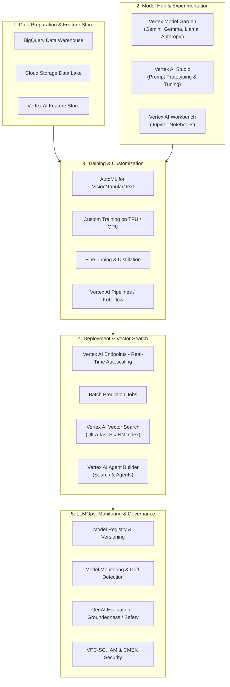
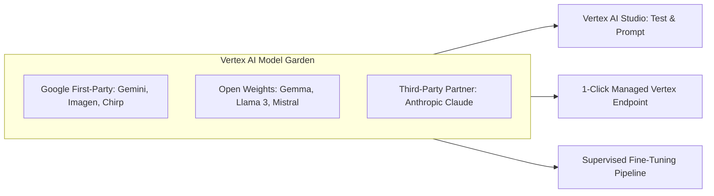
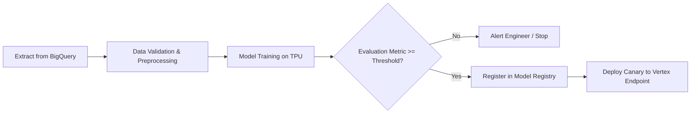
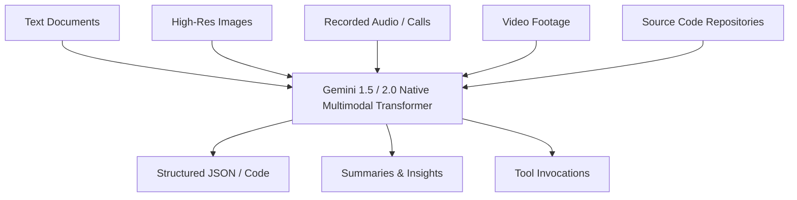
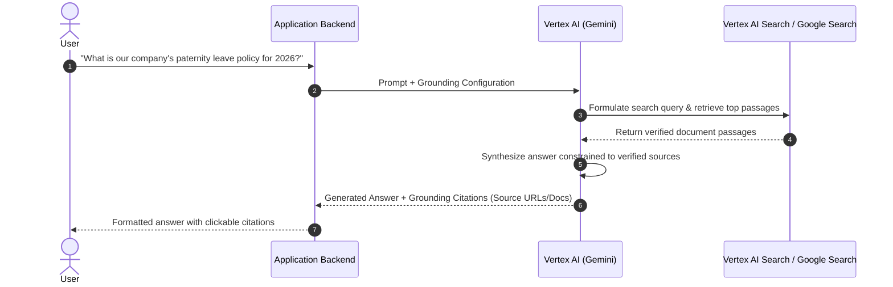
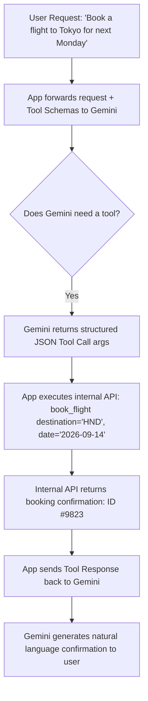
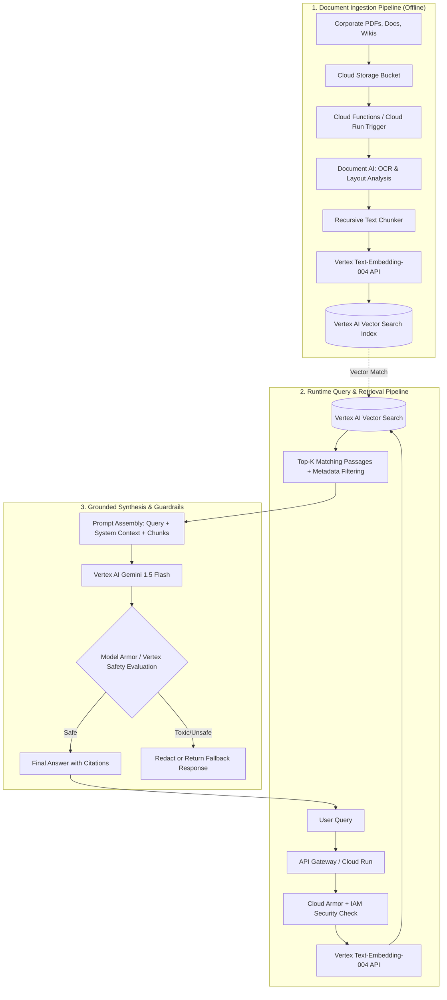
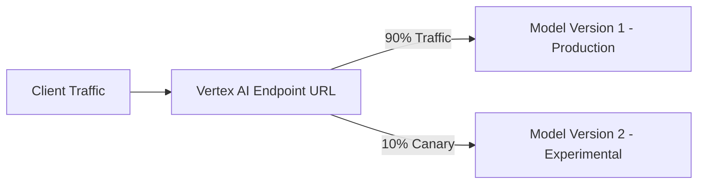
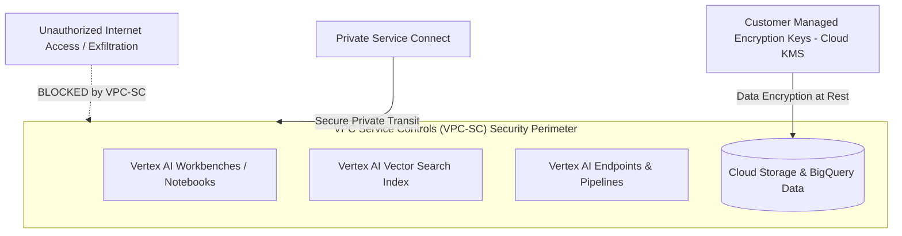

# Vertex AI: The Complete Beginner to Expert Guide

Welcome to the comprehensive, step-by-step technical guide to **Google Cloud Vertex AI**. This guide is written in clear, accessible language, designed both as a deep technical handbook and as an interview-ready reference. It covers everything from absolute basics to advanced enterprise production architectures (LLMOps, RAG, Agent Builder, and Security).

---

## Table of Contents
1. [What is Vertex AI? (Beginner Level)](#1-what-is-vertex-ai-beginner-level)
   - [The Problem it Solves](#the-problem-it-solves)
   - [The "Smart Factory" Analogy](#the-smart-factory-analogy)
   - [Vertex AI High-Level Architecture](#vertex-ai-high-level-architecture)
2. [Traditional ML vs. Generative AI on Vertex AI](#2-traditional-ml-vs-generative-ai-on-vertex-ai)
3. [Core Pillars of Vertex AI (Intermediate Level)](#3-core-pillars-of-vertex-ai-intermediate-level)
   - [Model Garden](#model-garden)
   - [Vertex AI Studio](#vertex-ai-studio)
   - [Vertex AI Vector Search (Matching Engine)](#vertex-ai-vector-search-matching-engine)
   - [Vertex AI Search and Conversation (Agent Builder)](#vertex-ai-search-and-conversation-agent-builder)
   - [Vertex AI Pipelines (Kubeflow)](#vertex-ai-pipelines-kubeflow)
4. [Generative AI Workflows on Vertex AI (Intermediate to Advanced)](#4-generative-ai-workflows-on-vertex-ai-intermediate-to-advanced)
   - [Gemini Foundation Models](#gemini-foundation-models)
   - [Grounding (Search & Enterprise Datastores)](#grounding-search--enterprise-datastores)
   - [Function Calling & Tool Execution](#function-calling--tool-execution)
   - [End-to-End Enterprise RAG Architecture](#end-to-end-enterprise-rag-architecture)
5. [Model Customization: Fine-Tuning & Distillation (Advanced Level)](#5-model-customization-fine-tuning--distillation-advanced-level)
   - [Prompt Engineering vs. RAG vs. Fine-Tuning](#prompt-engineering-vs-rag-vs-fine-tuning)
   - [PEFT (LoRA) & Supervised Fine-Tuning (SFT)](#peft-lora--supervised-fine-tuning-sft)
   - [Model Distillation (Teacher to Student)](#model-distillation-teacher-to-student)
6. [Production MLOps & LLMOps (Expert Level)](#6-production-mlops--llmops-expert-level)
   - [Model Registry & Lineage Tracking](#model-registry--lineage-tracking)
   - [Endpoints, Serving & Autoscaling](#endpoints-serving--autoscaling)
   - [Canary Deployments & Traffic Splitting](#canary-deployments--traffic-splitting)
   - [Model Monitoring & GenAI Evaluation](#model-monitoring--genai-evaluation)
   - [Enterprise Security, VPC-SC, CMEK & Data Governance](#enterprise-security-vpc-sc-cmek--data-governance)
7. [Hands-on Code Examples (Python SDK)](#7-hands-on-code-examples-python-sdk)
   - [Gemini Text & Multimodal Generation](#gemini-text--multimodal-generation)
   - [Function Calling with Tool Execution](#function-calling-with-tool-execution)
   - [Grounding with Google Search](#grounding-with-google-search)
8. [Vertex AI vs. Other Cloud Platforms](#8-vertex-ai-vs-other-cloud-platforms)
9. [Top Vertex AI Interview Questions & Architectural Scenarios](#9-top-vertex-ai-interview-questions--architectural-scenarios)

---

## 1. What is Vertex AI? (Beginner Level)

### The Problem it Solves
In the past, building machine learning and AI applications on the cloud was messy and fragmented:
* You used **one tool** for labeling data.
* A **different server/VM** for training models with PyTorch or TensorFlow.
* A **separate database** for tracking experiment metrics.
* A **third service** for deploying the model to an API endpoint.
* **Manual scripts** to detect whether incoming real-world data had drifted from the training distribution.

Data scientists and ML engineers spent **80% of their time stitching tools together** rather than improving their models.

### The "Smart Factory" Analogy
Think of Vertex AI as an **end-to-end automated manufacturing plant** for AI:
1. **Raw Material Intake:** Imports and prepares data (images, text, tables, audio).
2. **Assembly Line:** Trains models automatically (AutoML) or runs your custom code on GPUs/TPUs.
3. **Showroom (Model Garden):** Lets you pick pre-built state-of-the-art models (like Gemini, Claude, or open models like Gemma and Llama) without building them from scratch.
4. **Dispatch Center:** Deploys models to production API endpoints with 1-click autoscaling.
5. **Quality Control Inspector:** Continuously monitors the model for drift, accuracy, hallucinations, and safety.

> **Definition:** **Google Cloud Vertex AI** is a fully managed, unified AI/ML platform that allows developers and enterprises to build, train, deploy, customize, and govern both traditional Machine Learning models and Generative AI applications at scale.

---

### Vertex AI High-Level Architecture



---

## 2. Traditional ML vs. Generative AI on Vertex AI

Vertex AI supports two distinct yet converging AI paradigms:

| Feature | Traditional ML (Predictive AI) | Generative AI |
| :--- | :--- | :--- |
| **Typical Problem** | Predict house prices, classify churn, fraud detection, object detection in images. | Document summarization, conversational AI, code generation, reasoning, multimodal analysis. |
| **Vertex AI Components** | AutoML (Tabular, Vision, Text), Custom Training containers, Feature Store, BigQuery ML. | Model Garden, Gemini 1.5/2.0, Vertex AI Studio, Vector Search, Agent Builder. |
| **Output Type** | Discrete numbers, labels, probabilities, bounding boxes. | Natural language text, code, structured JSON, synthesized images/audio. |
| **Customization Method** | Train from scratch on labeled data using XGBoost, TensorFlow, PyTorch. | Prompt engineering, Grounding (RAG), Parameter-Efficient Fine-Tuning (PEFT / LoRA). |
| **Evaluation Metrics** | Accuracy, Precision, Recall, F1-Score, ROC-AUC, RMSE. | Groundedness, Hallucination rate, Semantic coherence, Task completion, ROUGE, BLEU. |

---

## 3. Core Pillars of Vertex AI (Intermediate Level)

### Model Garden
The **Model Garden** is a curated enterprise catalog of foundational models:
1. **Google First-Party Models:**
   * **Gemini Family (Gemini 1.5 Pro, 1.5 Flash, 2.0):** Multimodal foundation models supporting huge context windows (up to 2 million tokens), reasoning, and audio/video understanding.
   * **Imagen:** Text-to-image generation and image editing.
   * **Chirp / Speech-to-Text:** Enterprise voice transcription and synthesis.
   * **Codey / Gemini Code Assist:** Code generation and completion.
2. **Open-Source / Open-Weights Models:**
   * **Gemma & CodeGemma:** Google's lightweight open models.
   * **Meta Llama (Llama 3 / 3.1):** Available with 1-click deployment on Vertex Endpoints.
   * **Mistral AI:** Mistral Large, Mixtral 8x7B.
3. **Third-Party Commercial Models:**
   * **Anthropic Claude (Claude 3.5 Sonnet, Haiku, Opus):** Hosted within Google Cloud infrastructure to meet enterprise compliance without data leaving your perimeter.



---

### Vertex AI Studio
The visual playground in the Google Cloud Console for rapid experimentation:
* **Prompt Prototyping:** Test zero-shot, few-shot, and chain-of-thought prompts.
* **Hyperparameter Tuning:**
  * **Temperature (0.0 - 2.0):** Lower = factual and deterministic; Higher = creative and diverse.
  * **Top-P (Nucleus Sampling):** Samples tokens from the cumulative probability cutoff.
  * **Top-K:** Limits candidate tokens to the top $K$ most likely choices.
* **Safety Filters:** Configure thresholds for Hate Speech, Harassment, Sexual Content, and Dangerous Content (Block None, Block Few, Block Some, Block Most).
* **Export Code:** Generates equivalent Python, Node.js, cURL, or REST code with one click.

---

### Vertex AI Vector Search (Matching Engine)
When building RAG (Retrieval-Augmented Generation) or recommendation systems, you convert text, images, or products into dense vectors (embeddings). **Vertex AI Vector Search** is Google's vector database solution:
* **Algorithm:** Based on Google's proprietary **ScaNN** (Scalable Nearest Neighbors).
* **Speed:** Delivers sub-millisecond retrieval latencies even across **billions of vectors**.
* **Filtering:** Supports metadata filtering (e.g., retrieve vector chunks where `department == 'legal'` and `year >= 2024`).
* **Deployment Modes:**
  * *Public / Private Endpoints (via VPC peering / Private Service Connect).*
  * *Index Updates:* Batch rebuilds or streaming real-time upserts.

---

### Vertex AI Search and Conversation (Agent Builder)
For teams that do not want to handcraft vector databases, chunking algorithms, and retrieval pipelines, Google provides **Vertex AI Agent Builder**:
* **Out-of-the-Box Enterprise RAG:** Point it at Google Drive, Cloud Storage, BigQuery, Jira, or Confluence. It automatically parses, chunks, embeds, indexes, and grounds answers.
* **Multi-Turn Chatbots:** Built-in session state, dialog management, and human agent handoff.
* **Reasoning Engine:** Supports autonomous agent planning, tool calling, and step-by-step execution.

---

### Vertex AI Pipelines (Kubeflow)
Production AI requires automated workflows. Vertex AI Pipelines runs serverless **Kubeflow Pipelines (KFP)** or **TensorFlow Extended (TFX)**:
* **Pay-per-second:** No need to manage or pay for an active Kubernetes cluster 24/7.
* **Artifact Tracking:** Every step produces versioned artifacts (datasets, metrics, models) stored automatically in Cloud Storage and indexed in Vertex ML Metadata.
* **Auditing & Reproducibility:** Recreate the exact dataset, hyperparameters, and code that produced any model version.



---

## 4. Generative AI Workflows on Vertex AI (Intermediate to Advanced)

### Gemini Foundation Models
Gemini represents Google's native multimodal foundation model family. Unlike older pipelines that used separate models for speech-to-text, computer vision, and language, Gemini was pre-trained natively on multimodal tokens:



* **Gemini 1.5 Pro:** Best for complex reasoning, long codebases, and massive multi-document analysis (up to 2,000,000 token context window).
* **Gemini 1.5 Flash:** High-speed, cost-efficient, sub-second latency model ideal for high-throughput tasks, chatbots, and real-time summarization.

---

### Grounding (Search & Enterprise Datastores)
**Grounding** connects the model to verifiable, up-to-date sources of truth, reducing hallucinations and citing references.

Vertex AI supports two native grounding mechanisms:
1. **Grounding with Google Search:**
   * Gemini executes live web queries to access real-time world events.
   * Returns response text annotated with web citations and search entry points.
2. **Grounding with Vertex AI Search (Enterprise Data):**
   * Gemini retrieves internal enterprise documents from Cloud Storage, BigQuery, or web crawls.
   * The response provides **grounding metadata** with exact page numbers and chunk references.



---

### Function Calling & Tool Execution
Function calling enables an LLM to take actions in the real world: querying a SQL database, placing an order, or triggering an API call.



1. **Schema Declaration:** You provide function definitions using OpenAPI or JSON Schema.
2. **Deterministic Output:** Gemini does **not** run the code itself; it extracts the parameters and returns a structured call.
3. **Execution & Synthesis:** Your application executes the function securely and feeds the result back into Gemini to generate the final response.

---

### End-to-End Enterprise RAG Architecture

Here is the complete enterprise-grade RAG architecture built on Google Cloud Vertex AI:



---

## 5. Model Customization: Fine-Tuning & Distillation (Advanced Level)

### Prompt Engineering vs. RAG vs. Fine-Tuning

When should you choose which technique?

```
               LOW COST / LOW COMPLEXITY
                         │
                         ▼
        ┌──────────────────────────────────┐
        │        Prompt Engineering        │  ◄── Best for formatting, tone,
        │       (Zero/Few-Shot, CoT)       │      general instruction following.
        └────────────────┬─────────────────┘
                         │
                         ▼
        ┌──────────────────────────────────┐
        │    Retrieval-Augmented (RAG)     │  ◄── Best for dynamic, private,
        │      (Vertex Vector Search)      │      frequently changing knowledge.
        └────────────────┬─────────────────┘
                         │
                         ▼
        ┌──────────────────────────────────┐
        │      Parameter-Efficient         │  ◄── Best for teaching new vocabulary,
        │      Fine-Tuning (PEFT / LoRA)   │      specialized jargon, strict schemas.
        └────────────────┬─────────────────┘
                         │
                         ▼
        ┌──────────────────────────────────┐
        │      Full Model Pre-Training     │  ◄── Rarely needed; massive cost
        │         (From Scratch)           │      ($ millions), extreme scale.
        └──────────────────────────────────┘
                         │
                         ▼
              HIGH COST / HIGH COMPLEXITY
```

---

### PEFT (LoRA) & Supervised Fine-Tuning (SFT)
Instead of updating billions of parameters across the whole model (which is computationally prohibitive and risks catastrophic forgetting), Vertex AI uses **PEFT (Parameter-Efficient Fine-Tuning)** with **LoRA (Low-Rank Adaptation)**:
* **How it works:** Freezes the original base model weights and injects small, trainable rank-decomposition matrices into the Transformer layers.
* **Benefits:** 
  * Only trains **<1% of total parameters**.
  * Prevents catastrophic forgetting.
  * Faster training and drastically lower GPU/TPU hours.
* **Supported on Vertex AI:** Available for Gemini, Gemma, and Llama models directly through the Cloud Console or Python SDK.

---

### Model Distillation (Teacher to Student)
Vertex AI supports **Distillation** for generative models:
1. **Teacher Model:** A large, powerful model (e.g., Gemini 1.5 Pro) provides high-quality reasoning and answers.
2. **Student Model:** A smaller, faster, cheaper model (e.g., Gemini 1.5 Flash or Gemma 2B).
3. **Outcome:** The student model learns to approximate the teacher's performance on your specific enterprise domain, slashing **latency by 70%** and **cost by 85%** in production.

---

## 6. Production MLOps & LLMOps (Expert Level)

### Model Registry & Lineage Tracking
**Vertex AI Model Registry** acts as a single pane of glass for all trained and imported models:
* **Versioning:** Manage versions (e.g., `v1`, `v2`, `candidate-prod`, `rollback-safe`).
* **Lineage (Vertex ML Metadata):** Trace a model directly back to the exact training dataset version, pipeline run ID, and hyperparameter run.
* **Model Evaluation Comparison:** View side-by-side performance metrics across iterations before promoting to production.

---

### Endpoints, Serving & Autoscaling
When you deploy a model to a **Vertex AI Endpoint**, it becomes an HTTP REST/gRPC service:
* **Autoscaling:** Automatically scales GPU/CPU nodes from a minimum count (e.g., 0 to save money, or 1 to prevent cold starts) up to a defined maximum based on CPU/GPU utilization or request queues.
* **Hardware Accelerators:** Easily configure NVIDIA GPUs (L4, A100, H100) or Google Cloud TPUs (v5e, v5p).

---

### Canary Deployments & Traffic Splitting
To safely deploy new model versions without risking downtime:



* Deploy both models behind the **same unified endpoint**.
* Specify traffic percentages (e.g., `{"v1": 90, "v2": 10}`).
* If error rates or latency spike on `v2`, instantly roll back traffic to `v1` with zero downtime.

---

### Model Monitoring & GenAI Evaluation

Vertex AI provides two levels of observability:

#### 1. Predictive ML Monitoring
* **Feature Skew (Training-Serving Skew):** Real-world input features deviate from the distribution seen during training.
* **Feature Drift:** The statistical properties of features shift gradually over time.

#### 2. Generative AI Evaluation (LLMOps)
Vertex AI GenAI Evaluation Service calculates automated metrics using both algorithmic scoring and **LLM-as-a-judge**:
* **Groundedness:** Does every claim in the response map directly to a passage in the retrieved context? (Flags hallucinations).
* **Question Answering Quality:** Measures how accurately the response satisfies the user's explicit question.
* **Fluency & Coherence:** Evaluates linguistic quality and logical structure.
* **Safety Violations:** Tracks hate speech, self-harm, cyberattacks, or PII leakage attempts.

---

### Enterprise Security, VPC-SC, CMEK & Data Governance

Enterprise AI architecture requires robust security boundaries:



1. **Data Governance & Privacy:** Google guarantees that customer prompts, generated responses, and uploaded training data are **NOT used to train or improve Google's foundation models**.
2. **VPC Service Controls (VPC-SC):** Isolates Vertex AI services inside a private perimeter, preventing data exfiltration to unauthorized networks.
3. **Private Service Connect (PSC):** Access Vertex AI Endpoints and Vector Search over private IP addresses within your enterprise VPC.
4. **Customer-Managed Encryption Keys (CMEK):** Encrypt datasets, vector indexes, and model weights using keys managed in your own Google Cloud KMS.

---

## 7. Hands-on Code Examples (Python SDK)

### Gemini Text & Multimodal Generation

```python
import vertexai
from vertexai.generative_models import GenerativeModel, Part, SafetySetting

# 1. Initialize Vertex AI
vertexai.init(project="your-gcp-project-id", location="us-central1")

# 2. Load Gemini 1.5 Flash
model = GenerativeModel("gemini-1.5-flash-002")

# 3. Multimodal Prompt (Image + Text)
image_part = Part.from_uri(
    uri="gs://your-bucket-name/inventory_shelf.jpg",
    mime_type="image/jpeg"
)

prompt = [
    image_part,
    "Count the number of soda cans on each shelf and output a valid JSON list."
]

response = model.generate_content(
    prompt,
    generation_config={
        "temperature": 0.2,
        "max_output_tokens": 1024,
        "response_mime_type": "application/json"
    }
)

print(response.text)
```

---

### Function Calling with Tool Execution

```python
import vertexai
from vertexai.generative_models import GenerativeModel, FunctionDeclaration, Tool

vertexai.init(project="your-gcp-project-id", location="us-central1")

# 1. Define Function Schema
get_exchange_rate_func = FunctionDeclaration(
    name="get_exchange_rate",
    description="Get the live foreign currency exchange rate between two currencies.",
    parameters={
        "type": "object",
        "properties": {
            "from_currency": {"type": "string", "description": "Currency code e.g. USD"},
            "to_currency": {"type": "string", "description": "Currency code e.g. EUR"}
        },
        "required": ["from_currency", "to_currency"]
    }
)

currency_tool = Tool(function_declarations=[get_exchange_rate_func])

# 2. Provide tool to Gemini
model = GenerativeModel(
    model_name="gemini-1.5-flash-002",
    tools=[currency_tool]
)

# 3. Ask a question requiring tool invocation
response = model.generate_content("How many Euros will I get for 150 US Dollars today?")

# 4. Check if Gemini triggered the function call
tool_call = response.candidates[0].function_calls[0]
print(f"Function requested: {tool_call.name}")
print(f"Arguments generated: {dict(tool_call.args)}")
# Output: Function requested: get_exchange_rate
#         Arguments generated: {'from_currency': 'USD', 'to_currency': 'EUR'}
```

---

### Grounding with Google Search

```python
import vertexai
from vertexai.generative_models import GenerativeModel, Tool

vertexai.init(project="your-gcp-project-id", location="us-central1")

# 1. Enable Google Search Grounding Tool
google_search_tool = Tool.from_google_search_retrieval(grounding_tool=Tool.GroundingTool())

model = GenerativeModel(
    model_name="gemini-1.5-pro-002",
    tools=[google_search_tool]
)

# 2. Query asking for real-time information
response = model.generate_content("Who won the most recent Men's Wimbledon tournament and what was the score?")

print(response.text)

# 3. Access Grounding Metadata (Citations)
grounding_metadata = response.candidates[0].grounding_metadata
print("Web Search Queries Executed:", grounding_metadata.web_search_queries)
for chunk in grounding_metadata.grounding_chunks:
    print(f"Source Title: {chunk.web.title} | URL: {chunk.web.uri}")
```

---

## 8. Vertex AI vs. Other Cloud Platforms

| Dimension | Google Cloud Vertex AI | AWS SageMaker / Bedrock | Azure AI Foundry (Azure OpenAI) |
| :--- | :--- | :--- | :--- |
| **Flagship Foundation Model** | **Gemini** (Native Multimodal, 2M context) | Anthropic Claude, Amazon Titan | OpenAI GPT-4o, o1, o3 |
| **Model Catalog** | **Model Garden** (Google, Open-Source, Anthropic) | **Bedrock** & SageMaker JumpStart | **Azure AI Model Catalog** |
| **Vector Database** | **Vertex Vector Search** (ScaNN - ultra low latency) | OpenSearch / Pinecone / Bedrock KB | Azure AI Search (Hybrid + Vectors) |
| **Agent / RAG Framework** | **Vertex AI Agent Builder** | Amazon Bedrock Agents & Knowledge Bases | Azure AI Agent Service |
| **Pipeline Orchestration** | **Vertex Pipelines** (Kubeflow serverless) | SageMaker Pipelines | Azure Machine Learning Pipelines |
| **Hardware Strengths** | Google TPUs (v5e, v5p) + NVIDIA GPUs | AWS Trainium / Inferentia + NVIDIA GPUs | NVIDIA GPUs |
| **Context Window Size** | Up to **2,000,000 tokens** | 200,000 tokens (Claude 3.5) | 128,000 tokens (GPT-4o) |

---

## 9. Top Vertex AI Interview Questions & Architectural Scenarios

### Q1: How do you choose between Vertex AI Search (Agent Builder) and a custom Vector Search RAG pipeline?
* **Use Vertex AI Search when:** You need rapid time-to-market, out-of-the-box connectors (Google Drive, BigQuery, Jira), automatic chunking, native citation handling, and no dedicated infrastructure management.
* **Use Custom Vector Search when:** You need bespoke multi-modal embeddings, custom chunking algorithms, low-level control over vector distance metrics (Cosine, Dot Product, Euclidean), or sub-millisecond retrieval latencies across 100M+ vectors with custom metadata pre-filtering.

---

### Q2: What causes high latency in Gemini endpoints and how do you optimize it?
* **Model Selection:** Switch from `gemini-1.5-pro` to `gemini-1.5-flash` for high-throughput user-facing apps.
* **Context Caching:** If sending repetitive documents, instructions, or codebases (>32k tokens), enable **Vertex AI Context Caching**. This reduces latency by up to 80% and costs by up to 75% by reusing pre-computed KV-cache.
* **Streaming Responses:** Use `generate_content_stream()` to stream chunks back to the client immediately instead of waiting for the full response to finish.
* **Max Output Tokens:** Restrict `max_output_tokens` so the model halts generation immediately upon completing the required answer.

---

### Q3: How do you prevent hallucination in an enterprise customer support agent?
1. **Grounding:** Bind the model to an enterprise datastore with high similarity retrieval thresholds.
2. **System Prompt Guardrails:** Explicitly command the model: *"Answer strictly using the provided context. If the answer is not present in the context, respond with 'I do not have enough information to answer that'."*
3. **Temperature:** Set temperature to `0.0` or `0.1` for deterministic, grounded outputs.
4. **GenAI Evaluation / Model Armor:** Run real-time Groundedness checks on responses before returning them to the customer.

---

### Q4: How do you handle cold starts on Vertex AI custom endpoints?
* Set `min_replica_count >= 1` in the deployment configuration so that at least one GPU/CPU node is warm and serving traffic 24/7.
* Optimize the custom serving container image size by removing unnecessary packages and pre-baking model weights into the container image or mounting them via Cloud Storage FUSE.

---

### Q5: How does Google ensure enterprise data privacy with Vertex AI foundation models?
* Customer data (prompts, queries, responses, embeddings, and uploaded files) is **strictly isolated within the customer's Google Cloud project boundary**.
* Google explicitly contracts that customer data is **never used to train base foundation models** or shared with third parties.
* Customer data is encrypted in transit and at rest by default, with optional Customer-Managed Encryption Keys (CMEK) and VPC Service Controls (VPC-SC) perimeters.
