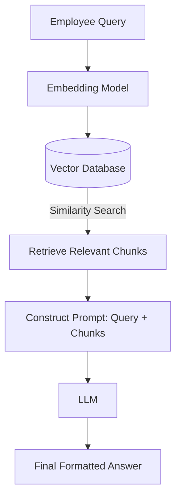
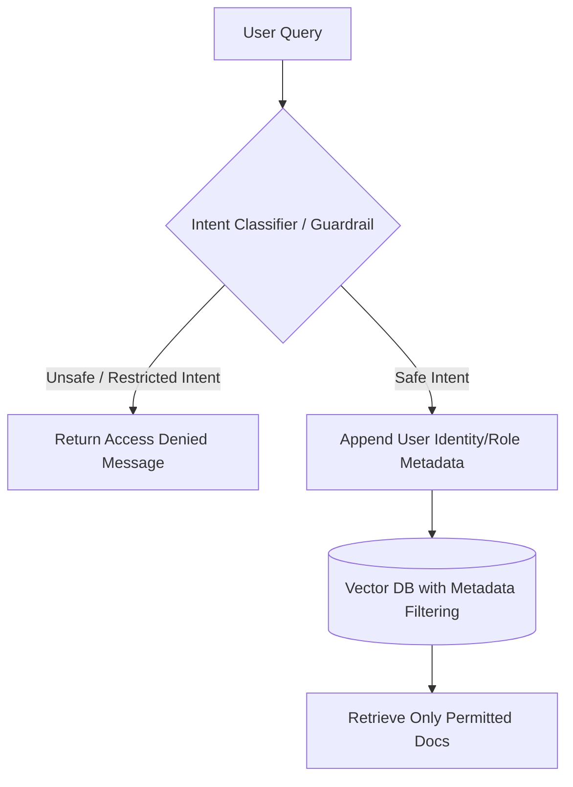
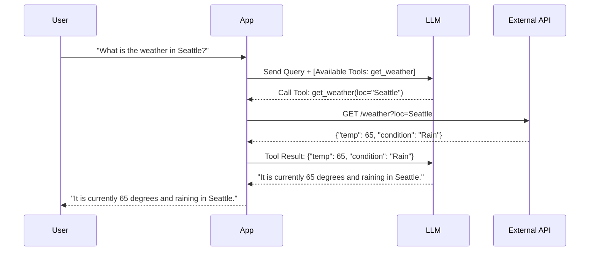

# Comprehensive Guide: LLMs, RAG, and System Design

Welcome to this detailed guide on Large Language Models (LLMs), Retrieval-Augmented Generation (RAG), Function Calling, and Evaluation. The concepts are broken down into plain, easy-to-understand language, explaining not just *what* these things are, but *why* we use them.

---

## 1. Core LLM Concepts

### What is Temperature in LLMs?
**What it is:** Temperature is a setting (usually between 0.0 and 2.0) that controls the randomness or "creativity" of the AI's responses. 
*   **Low Temperature (e.g., 0.1):** The LLM is highly predictable, focused, and deterministic. It will almost always pick the most likely next word.
*   **High Temperature (e.g., 0.8+):** The LLM takes more risks, introducing randomness. It might pick less likely words, resulting in more creative or varied outputs.

**Why it matters:** 
If you are asking an LLM to write Python code or give a factual summary, you want a low temperature so it doesn't hallucinate or invent syntax. If you are asking it to write a poem or brainstorm marketing slogans, a high temperature helps generate fresh, diverse ideas.

### What are Top-K and Top-P? (Difference and Use Cases)
When an LLM generates a word, it calculates a probability for *every possible word* in its vocabulary. Top-K and Top-P are filters applied before Temperature to narrow down the choices.

*   **Top-K:** Limits the AI to choose only from the top *K* most probable next words. (e.g., Top-K = 50 means it ignores everything below the 50th most likely word).
    *   *Why use it:* It acts as a hard cutoff to prevent the AI from generating complete gibberish by cutting off the "long tail" of highly unlikely words.
*   **Top-P (Nucleus Sampling):** Limits the AI to choose from a dynamic pool of words whose combined probabilities add up to *P* (e.g., Top-P = 0.90 means the top words that together make up 90% of the probability mass).
    *   *Why use it:* It adapts to context. If the AI is highly confident, the pool might just be 2 words. If the AI is uncertain, the pool might be 20 words. 

**Difference & Use Cases:**
*   **Top-K** is a fixed number of words; **Top-P** is a dynamic number based on probability.
*   *Use Case:* Top-P is generally preferred in modern systems because it dynamically adjusts to how "certain" the model is. Use low Top-P (0.1) for strict factual answers (like querying a database), and higher Top-P (0.9) for chat bots or story generation.

---

## 2. RAG & System Design

### Employee RAG System Design
**Scenario:** An employee asks a question to an internal HR or Engineering RAG system.

**How to design it:**
1.  **Ingestion:** Take company documents (PDFs, wikis), chunk them into smaller text blocks, convert them to vectors (embeddings), and store them in a Vector Database.
2.  **Retrieval:** When the employee asks a query, convert their query into an embedding, search the Vector Database for the most similar chunks.
3.  **Generation:** Pass the retrieved chunks + the employee's original query to the LLM to generate a plain-text answer.

### Handling Restricted vs. Unrestricted Questions
**The Problem:** You don't want an intern accessing the CEO's salary details just because they asked a RAG bot.

**How to handle it before retrieval:**
1.  **Role-Based Access Control (RBAC) at the Vector DB Level:** Every document chunk in the Vector DB should have metadata tags (e.g., `access_level: public`, `access_level: HR_only`). When querying the DB, automatically append a hard filter based on the user's login credentials.
2.  **Intent Classification (Guardrails):** Pass the query through a lightweight classifier or smaller LLM to detect intent. If the query asks for restricted topics (e.g., "How to hack the server", "Who is getting fired?"), the system immediately returns a canned refusal response without even hitting the Vector DB.

### Handling Large Chunks in a RAG Pipeline
**The Problem:** If chunks are too large, they exceed the LLM's context window or dilute the specific answer with irrelevant noise.

**Solutions:**
*   **Recursive Character Text Splitting:** Break large documents down iteratively (by paragraphs, then sentences) to keep chunk sizes manageable (e.g., 500 tokens).
*   **Overlap:** Maintain a 10-20% overlap between chunks so context isn't lost if a sentence is split down the middle.
*   **Parent-Child Retrieval (Advanced):** Store small chunks (children) in the database for highly accurate search. When a match is found, retrieve the larger surrounding section (parent) to give the LLM full context.

### Ensuring Fixed Format Outputs (JSON/CSV)
**How to enforce it:**
1.  **System Prompts:** Explicitly tell the model: "You are an API. Output ONLY valid JSON. Do not include markdown formatting or conversational text."
2.  **JSON Mode / Structured Outputs:** Modern APIs (like OpenAI, Gemini) have parameters like `response_format={ "type": "json_object" }` that force the model to output valid JSON.
3.  **Parsing Libraries (Pydantic / Instructor):** Use Python libraries to define the exact schema (e.g., a User object with `name: str` and `age: int`). The library forces the LLM to adhere to this schema and automatically retries if the LLM makes a mistake.

---

## 3. Function Calling (LLM)

### What is Function Calling?
Function calling (or Tool Use) gives an LLM the ability to interact with the outside world. Instead of just replying with text, the LLM replies with a structured command (like `get_weather(location="New York")`). The application runs that command and feeds the result back to the LLM.

### How does an LLM decide which function to call?
1.  You provide the LLM with a list of available functions, including their names, descriptions, and required parameters (usually in JSON schema).
2.  The LLM's attention mechanism looks at the user's prompt (e.g., "What's the weather in Tokyo?") and compares it against the descriptions of the provided functions.
3.  If it determines a function is needed to fulfill the user's request, it halts text generation and outputs the JSON arguments needed to trigger that specific tool.

### Handling Incorrect or Partial Function Responses
*   **Validation:** Always run the LLM's output through a schema validator (like Pydantic).
*   **Self-Correction Loop:** If the LLM omits a required parameter (e.g., calls `get_weather()` without a location), your app should catch the error and send a message back to the LLM saying: *"Error: Missing required parameter 'location'. Please try again."*
*   **Fallbacks:** Wrap function execution in `try/except` blocks. If an API is down, feed a message back to the LLM so it can politely tell the user the service is unavailable, rather than crashing the system.

---

## 4. Evaluation & Metrics

### Evaluating Retrieved Chunks (Before Generation)
Before evaluating the LLM's final answer, you must ensure the retrieval engine (Vector DB) is actually fetching the right documents. If the retrieved documents are wrong, the LLM's answer will be wrong (Garbage In, Garbage Out).

*   **Human Annotation:** Have domain experts label which documents *should* be retrieved for a set of test questions.
*   **LLM-as-a-Judge:** Use a powerful model (like GPT-4 or Gemini 1.5 Pro) to score the relevance of the retrieved chunks against the original user query on a scale of 1-5.

### Which Evaluation Metrics to Use?
When evaluating the **Retrieval** stage, we borrow metrics from search engine engineering:

*   **Recall@K:** Out of all the relevant documents that exist in our database, what percentage did we find in our top *K* results?
    *   *Why use it:* Crucial for RAG. If the correct document isn't in the context window, the LLM can't answer. High recall is priority #1.
*   **Precision@K:** Out of the *K* documents we retrieved, what percentage are actually relevant?
    *   *Why use it:* Important for cost and context limits. If we retrieve 10 docs and only 1 is useful, we are wasting tokens and confusing the LLM with noise.
*   **MRR (Mean Reciprocal Rank):** Looks at where the *first* relevant document appeared in the search results. 
    *   *Why use it:* If the right answer is always the 10th result, the LLM might ignore it (due to "lost in the middle" phenomena). MRR ensures good docs are at the very top.
*   **NDCG (Normalized Discounted Cumulative Gain):** Evaluates the entire ranking order. It gives higher scores if highly relevant documents appear before somewhat relevant ones.

