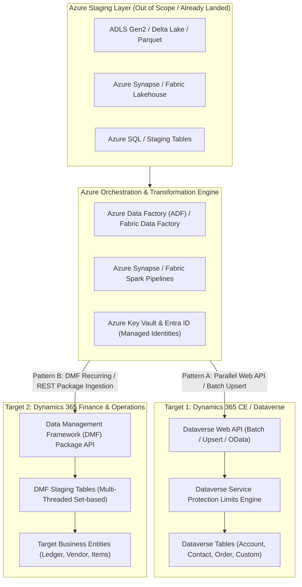
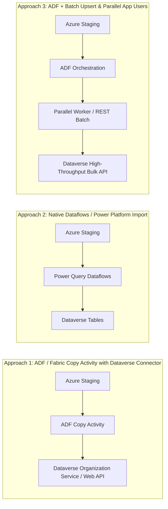
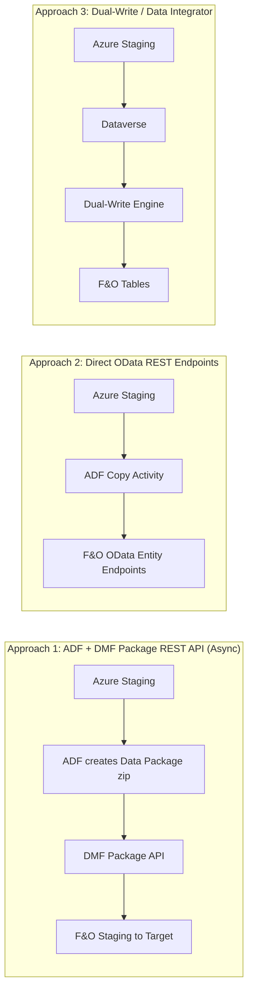
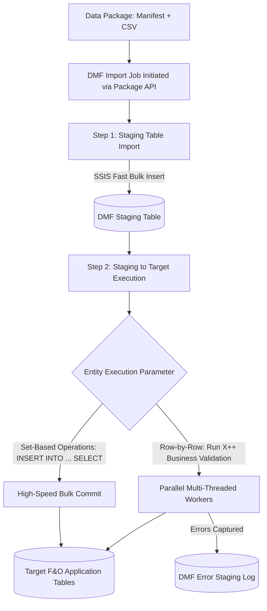
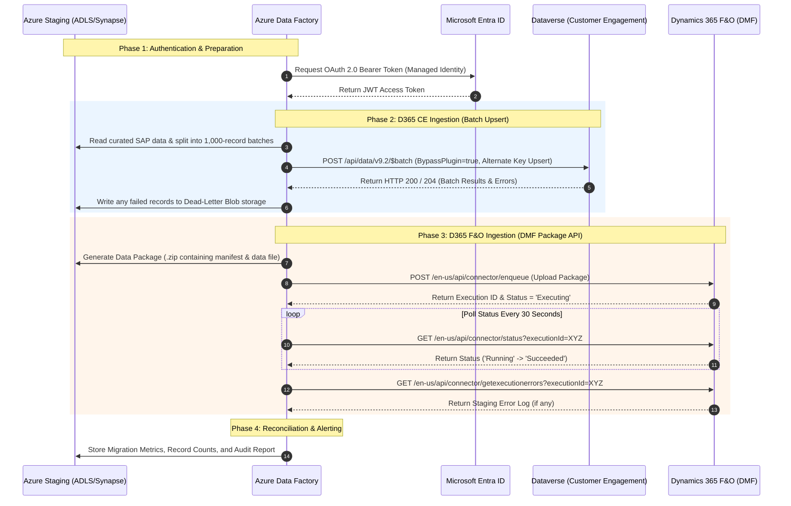

# Enterprise Point of View (PoV): Migrating Landed SAP Data from Azure Staging into Microsoft Dynamics 365

## Executive Summary & Core Objective

### Context & Scope Boundary
* **Pre-condition:** All extraction from SAP (ECC / S/4HANA / BW) and landing into Azure (ADLS Gen2 / Azure Synapse / Microsoft Fabric / Staging SQL / Delta Parquet) is **already completed and out of scope**.
* **The Core Question:** *"Once enterprise SAP data is landed and curated in Azure staging, what is the best Microsoft-supported, enterprise-ready way to ingest that data into Microsoft Dynamics 365 at scale?"*

This Point of View (PoV) evaluates the top Microsoft-supported migration patterns across both core Dynamics 365 target applications:
1. **Dynamics 365 Customer Engagement (CE) / Microsoft Dataverse** (Sales, Customer Service, Field Service)
2. **Dynamics 365 Finance & Operations (F&O)** (Finance, Supply Chain Management, Commerce)

---

## 1. High-Level Architectural Context



---

## 2. Dynamics 365 Customer Engagement (CE) / Microsoft Dataverse

Dataverse migration complexity is governed by **API throttling (Service Protection Limits)**, **relational integrity (parent-child lookups, polymorphic lookups)**, and **custom business logic (Plugins / Power Automate flows)**.

### Evaluation of Top 3 Approaches for Dataverse



#### Approach 1: Azure Data Factory (ADF) / Fabric Copy Activity with Native Dataverse Connector
* **Mechanism:** Uses the built-in ADF Dataverse connector (backed by the Organization Service / Web API).
* **Throughput:** Typically 15 to 40 records/second per thread. With multiple parallel sinks, scales to 150–300 records/second.
* **Pros:** Low-code, native ADF component, automated retry logic, seamless integration with Entra ID Service Principal.
* **Cons:** Sink configuration lacks granular control over Dataverse batch operations (`$batch` with change sets); prone to Service Protection Limit 429 errors unless throttled intentionally.
* **Suitability:** **Small to Medium migrations** (< 1 million records per entity) with straightforward mappings.

#### Approach 2: Power Platform Dataflows / Native Import Capabilities
* **Mechanism:** Cloud Dataflows running Power Query Online connecting to ADLS Gen2 / Azure SQL, writing directly into Dataverse tables.
* **Throughput:** Moderate (50 to 150 records/second). Subject to Power Query evaluation container limits (timeout after 2–4 hours for standard runs).
* **Pros:** Citizen-developer friendly, visual column-to-column mapping, native Dataverse lookup resolution interface.
* **Cons:** Lacks enterprise orchestration (cannot easily chain dependencies across 50+ SAP entities), no dead-letter queuing or automated dynamic schema drift handling.
* **Suitability:** **Simple migrations** (configuration data, static master tables, < 500K records).

#### Approach 3: ADF / Fabric + High-Throughput Batch Web API with Multi-Application Users (Recommended for Enterprise Scale)
* **Mechanism:** ADF orchestrates chunked data files and executes Dataverse Web API requests using:
  1. `$batch` request payloads combining up to 1,000 operations per change set.
  2. `Upsert` requests using Alternate Keys (eliminating pre-read latency).
  3. Optional custom headers: `MSCRM.BypassCustomPluginExecution: true` and `SuppressCallbackRegistration: true`.
  4. Workload distribution across **3 to 5 Entra ID Application Users** to multiply Service Protection limit pools.
* **Throughput:** **1,000 to 3,500+ records/second** depending on payload size and indexing.
* **Pros:** Maximum possible ingestion speed, bypasses unnecessary synchronous business logic during initial load, deterministic upsert idempotency.
* **Cons:** Requires customized pipeline logic or Azure Functions / Web Activity wrappers for batch payload preparation.
* **Suitability:** **Large / Highly Complex migrations** (5M to 50M+ records from SAP: Customers, Orders, Invoices).

---

### Technical Deep-Dive: Overcoming Dataverse Migration Bottlenecks

#### 1. Service Protection API Limits & Concurrency
* **The Rule:** Dataverse enforces a limit of **6,000 requests per 5 minutes per user/app ID**, a 20-minute execution timeout per thread, and a maximum of 52 concurrent requests per web server.
* **The Solution:** 
  * Use **Alternate Keys** on Dataverse entities (e.g., `sap_customer_number`). This allows an `Upsert` (PATCH) without needing to query first to determine whether to create or update.
  * Register multiple Entra ID Application Users (e.g., `Migration_AppUser_1` through `Migration_AppUser_4`) and round-robin traffic to multiply the 6,000 requests/5-min quota pool.
  * Implement exponential backoff respecting the `Retry-After` HTTP header upon receiving `HTTP 429 (Too Many Requests)`.

#### 2. Bypassing Custom Plugins and Workflow Triggers
* During historical data migration, triggers that send welcome emails, synchronize to external systems, or run validation plugins must be suppressed.
* Include the following HTTP headers in migration payloads:
  ```http
  MSCRM.BypassCustomPluginExecution: true
  MSCRM.SuppressCallbackRegistration: true
  ```
  *(Requires System Administrator / custom privilege `prvBypassCustomPluginExecution` granted to the migration service principal).*

#### 3. Handling Relational Hierarchies & Lookups
* **Order of Ingestion:** Strictly sequential by dependency tier:
  1. *Tier 1 (Base):* Currencies, Countries, Payment Terms, Units of Measure.
  2. *Tier 2 (Master Data):* Accounts (Customers/Vendors), Contacts, Products.
  3. *Tier 3 (Transactional):* Sales Orders, Invoices, Open Balances.
* **Polymorphic Lookups (e.g., `customerid`):** Must be explicitly mapped using OData navigation binding syntax:
  ```json
  "customerid_account@odata.bind": "/accounts(sap_account_id='SAP-100234')"
  ```

---

## 3. Dynamics 365 Finance & Operations (F&O)

Finance & Operations uses a completely different, highly optimized engine: the **Data Management Framework (DMF)** / Data Import/Export Framework (DIXF).

### Evaluation of Top 3 Approaches for F&O



#### Approach 1: Azure Data Factory + DMF Package REST API (Recommended for Enterprise Scale)
* **Mechanism:** 
  1. ADF prepares source data files matching F&O Data Entity formats (CSV/XML).
  2. Generates a standard **Data Package** (a zip archive containing data files, `manifest.xml`, and `PackageHeader.xml`).
  3. Calls the F&O DMF Package API endpoint: `ImportFromPackage`.
  4. F&O executes the import asynchronously via dedicated **Batch Server worker threads**.
  5. ADF polls execution status until completion, then reads execution logs and staging error tables.
* **Throughput:** **5,000 to 20,000+ records/minute** (can exceed 50,000 records/minute with set-based entities and multi-threading).
* **Pros:** Official Microsoft-supported bulk standard, decoupled asynchronous processing, native staging table error isolation, handles complex financial validation.
* **Cons:** Requires building the zip package structure (manifest + header) via ADF/Azure Function.
* **Suitability:** **Enterprise Migration Standard** for all high-volume financial, inventory, and ledger history.

#### Approach 2: Direct F&O OData REST Endpoints
* **Mechanism:** Synchronous CRUD operations against public F&O Data Entities via standard OData v4 endpoints (`/data/CustomersV3`).
* **Throughput:** Very low (**10 to 50 records/second**).
* **Pros:** Instant synchronous feedback, very simple to wire up in ADF.
* **Cons:** Severe throttling; executes full X++ validation and event handlers on every single row; crashes or times out on large batches; completely unsupported by Microsoft for bulk migration.
* **Suitability:** **Unsuitable for migration**. Only applicable for real-time single-record integrations (e.g., instant order status lookup).

#### Approach 3: Staging via Dataverse + Dual-Write / Data Integrator
* **Mechanism:** Ingest data into Dataverse first, then rely on the out-of-the-box Dual-Write engine to replicate into F&O.
* **Throughput:** Low to Moderate (Dual-Write is a near-real-time dual-commit transaction, not an ETL tool).
* **Pros:** Synchronizes both systems simultaneously.
* **Cons:** Introduces cascading dependencies; if F&O validation fails, the Dataverse commit fails; doubles the API overhead; Microsoft explicitly advises against using Dual-Write for initial bulk migration.
* **Suitability:** **Post-Go-Live operational synchronization**, NOT bulk historical migration.

---

### Technical Deep-Dive: Maximizing F&O DMF Performance



#### 1. Staging to Target: Set-Based vs. Row-by-Row
* **Set-Based:** If an entity does not require custom X++ validation logic on each row, configure the entity to execute set-based SQL operations (`insert_recordset`). This moves data from staging to target tables directly in SQL Server storage at wire speed.
* **Row-by-Row:** Necessary when business logic (such as calculating tax groups or validating ledger accounts) must execute per record.

#### 2. Entity Execution Parameters & Parallel Tasks
* Under **Data Management > Framework parameters > Entity settings**:
  * Set **Import threshold record count** (e.g., 5,000 records).
  * Set **Import task count** (e.g., 8 to 16 parallel tasks).
* When a file with 100,000 records is imported, the F&O batch framework automatically shards the data across 16 parallel batch worker threads.

#### 3. Number Sequence Pre-Allocation
* Automatic number sequence generation causes heavy database locking during high-speed migrations.
* **Best Practice:** Enable **Manual** number sequences during migration, or configure number sequences with **Pre-allocation** chunks (e.g., allocate 10,000 numbers in cache) to avoid SQL lock escalation on `NumberSequenceTable`.

---

## 4. Comprehensive Evaluation Matrix: What the PoV Proves

The table below contrasts the recommended enterprise approach for each target against all evaluation criteria:

| Evaluation Dimension | Dynamics 365 CE / Dataverse (ADF + Batch Web API / Upsert) | Dynamics 365 F&O (ADF + DMF Package API) |
| :--- | :--- | :--- |
| **Connectivity** | Microsoft Entra ID (Service Principal) connecting via HTTPS/REST to Dataverse Web API endpoint. | Entra ID OAuth 2.0 connecting to F&O DMF recurring integration / Package API endpoint. |
| **Volume Capability** | Validated up to **50M+ records** across accounts, contacts, and custom entities. | Validated up to **100M+ records** across general ledger, inventory journals, customers. |
| **Throughput & Scalability** | **1,000 to 3,500 records/sec** using multi-app users and batch change sets. | **5,000 to 20,000+ records/min** using multi-threaded batch execution parameters. |
| **Transformation Layer** | In Azure: ADF Mapping Data Flows / Fabric Spark shapes SAP data into target Dataverse schema before push. | In Azure & DMF: ADF transforms SAP data into Data Entity column structure; DMF Staging handles final conversions. |
| **Data Validation** | Schema validation on ingestion; lookup resolution via Alternate Keys; pre-validation in Azure staging. | F&O business logic, ledger posting rules, dimensional validation executed during staging-to-target phase. |
| **Security & Governance** | Entra ID Managed Identity, Dataverse Security Roles, Row-level & Field-level security, TLS 1.3, CMEK. | Entra ID Service Principal, F&O Security Privileges (`DataManagement*`), Private Endpoints, CMEK. |
| **Error Handling** | Partial batch failures isolated; failed records written to Azure Storage dead-letter queue with error codes. | Errors isolated in DMF Staging tables; detailed row-level error log viewable in F&O UI and queryable via API. |
| **Monitoring & Telemetry** | ADF Pipeline Monitoring + Dataverse Application Insights telemetry (tracking 429s, API duration). | ADF Monitoring + F&O DMF Execution History, Batch Job history, and LCS / Azure Monitor telemetry. |
| **Incremental Loads (Delta)** | Delta detection via Azure watermarking; upsert on Alternate Keys prevents duplicates. | DMF supports delta imports; ADF sends only changed records identified via Synapse/ADLS delta logs. |
| **Microsoft Official Support** | **Tier-1 Recommended Pattern** documented by Microsoft FastTrack for High-Volume Dataverse migrations. | **Tier-1 Recommended Pattern** documented by Microsoft FastTrack for Finance & Operations data migration. |
| **Cost Profile** | Pay-as-you-go ADF Data Integration Units (DIUs); standard Dataverse API request consumption. | Low compute cost on Azure; uses existing F&O licensed batch server capacity. |
| **Maintainability** | Highly reusable ADF pipelines with parameterized endpoints, schemas, and credentials. | Standardized Data Packages; reusable mapping definitions in DMF for ongoing interfaces. |

---

## 5. End-to-End Orchestration & Execution Sequence

### Workflow Sequence Diagram: Azure Staging to Dynamics 365



---

## 6. Migration Operational Strategy & Cutover Runbook

### Pre-Cutover Preparation
1. **Index Optimization:** Verify all Alternate Keys in Dataverse and primary indexes in F&O staging tables are created and analyzed.
2. **Environment Sizing:** Temporarily scale up F&O batch servers (e.g., allocate extra AOS batch nodes) and request a temporary increase in Dataverse API tier limits through Microsoft Support if migrating over 50M records.
3. **Disable Non-Essential Hooks:**
   * Suspend Power Automate cloud flows tied to target entities.
   * Suppress Dataverse auditing during bulk loads to avoid transaction log bloating.
   * Disable Dual-Write plugins during historical cutover.

### Execution Order & Entity Hierarchy
```
Level 1: Foundation Data
├── Currencies, Exchange Rates, Units of Measure
├── Financial Dimensions (Main Accounts, Cost Centers, Departments)
└── Geographic Master Data (Countries, States, Postal Codes)

Level 2: Master Data
├── Vendor Master & Customer Master (Accounts / Contacts)
├── Chart of Accounts & GL Setup
└── Product / Item Master (Released Products, Item Models)

Level 3: Open Balances & Documents
├── Open Purchase Orders & Open Sales Orders
├── Inventory On-Hand Balances
└── General Ledger Opening Balances / Subledger Balances
```

### Post-Migration Reconciliation & Verification
* **Automated Record Count Validation:** Compare row counts in Azure Staging vs. target Dataverse tables and F&O entities.
* **Financial Balance Reconciliation:** Generate Trial Balance reports in F&O and match against SAP extraction balance reports down to the penny.
* **Re-enable Governance:** Reactivate audit logs, Power Automate flows, and Dual-Write synchronization.

---

## 7. Recommended Microsoft-Native PoV Architecture

### The Final Recommendation

| Target Application | Recommended Approach | Key Technology Stack | Why This Approach Wins |
| :--- | :--- | :--- | :--- |
| **Dynamics 365 Customer Engagement (CE) / Dataverse** | **ADF Orchestrated Batch Upsert with Multi-App Users** | Azure Data Factory + Dataverse Web API + Alternate Keys | Maximum throughput (**1,000–3,500 rec/sec**), resilient against throttling, bypasses unnecessary plugins, guarantees idempotency. |
| **Dynamics 365 Finance & Operations (F&O)** | **ADF Orchestrated DMF Package REST API** | Azure Data Factory + DMF Package API + Set-based Data Entities | Standard Microsoft bulk mechanism, handles complex financial validation, leverages F&O multi-threaded batch nodes (**5,000–20,000 rec/min**). |

### Summary Statement
For an enterprise migrating landed SAP data from Azure into Dynamics 365:
* **Never use direct OData** for high-volume loads on either platform.
* **Never use Dual-Write** for initial historical bulk migration.
* **Leverage Azure Data Factory / Fabric** as the single orchestration and transformation plane, pushing to **Dataverse via Batch Web API** and to **F&O via the Data Management Framework (DMF) Package API**.
