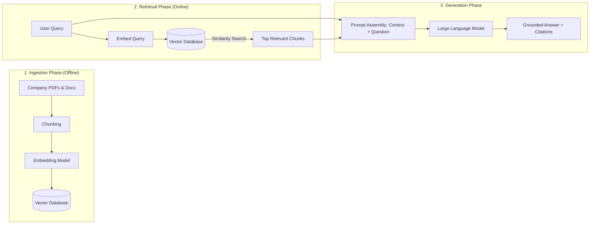
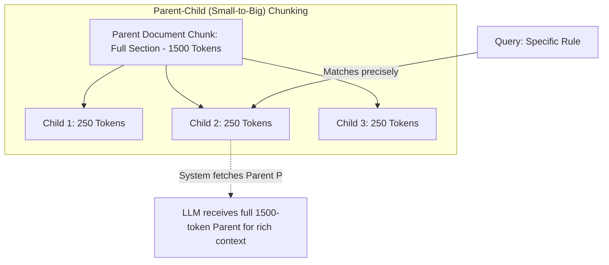
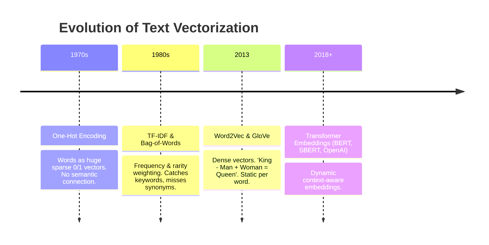
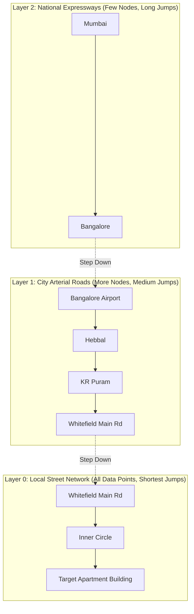
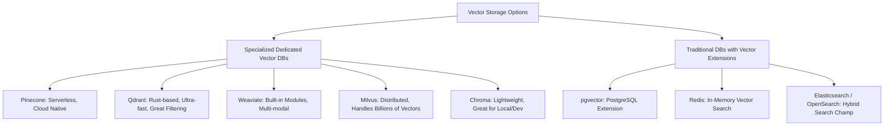
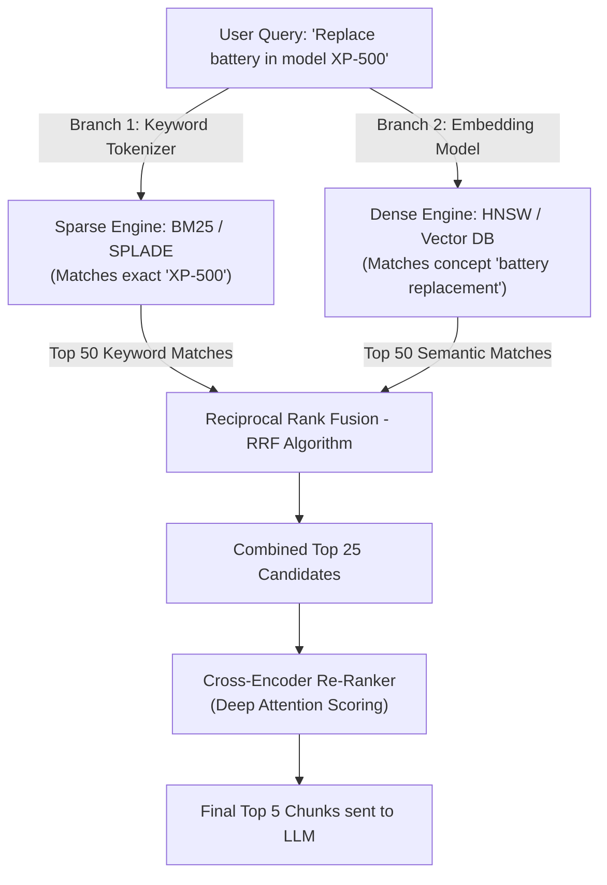
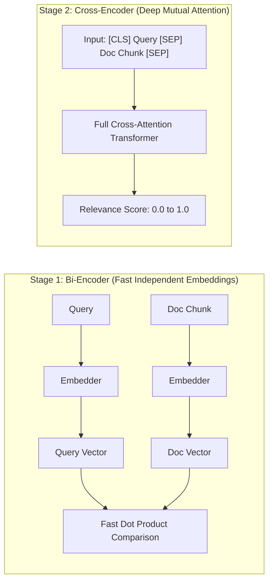
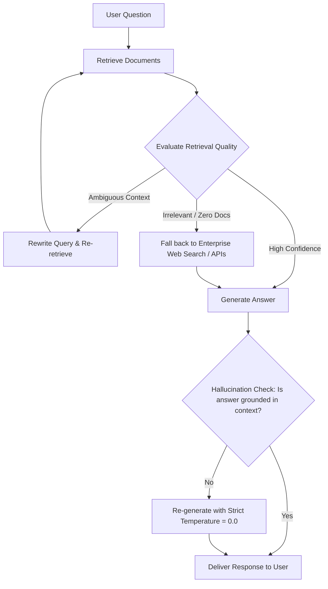
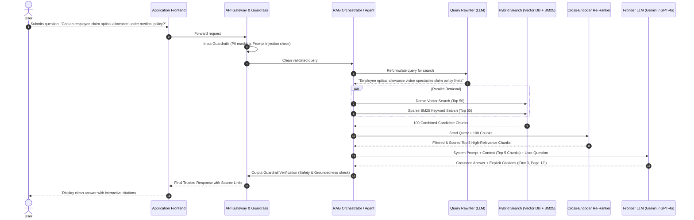
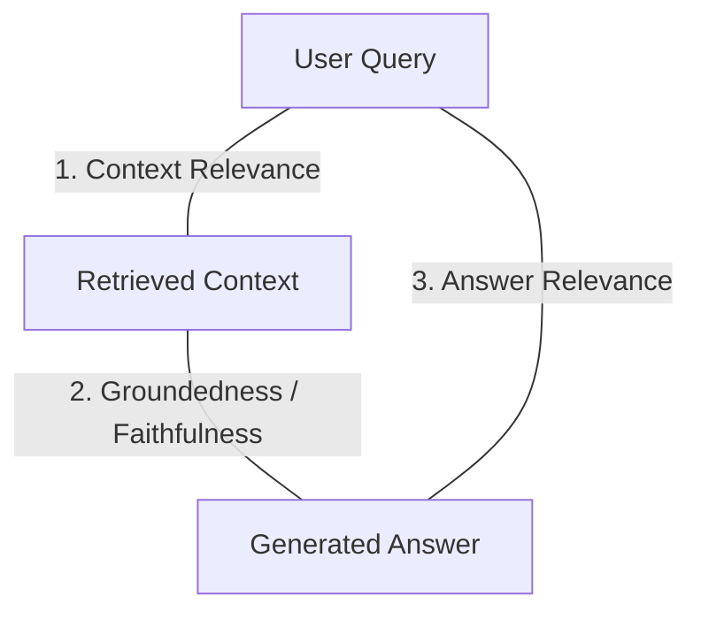

# The Ultimate Masterclass on RAG, Vectorization, Embeddings & Hybrid Search

> **Welcome!** If you have ever wondered how ChatGPT or enterprise AI bots can search through millions of confidential company PDFs, legal documents, or medical records and answer your questions accurately without making things up (hallucinating), this guide is for you.
> 
> We explain everything from ground zero to the most advanced production techniques using crystal-clear concepts, practical real-world Indian analogies (from college libraries to Mumbai local train routes), and detailed architecture diagrams.

---

## Table of Contents
1. [The "Why": What is RAG and Why Do We Need It?](#1-the-why-what-is-rag-and-why-do-we-need-it)
   - [The Closed-Book vs. Open-Book Exam Analogy](#the-closed-book-vs-open-book-exam-analogy)
   - [The 3 Core Problems of Plain LLMs](#the-3-core-problems-of-plain-llms)
   - [High-Level 3-Step Flow: Ingestion, Retrieval, Generation](#high-level-3-step-flow-ingestion-retrieval-generation)
2. [Phase 1: The Ingestion Pipeline (From Raw Documents to Searchable Units)](#2-phase-1-the-ingestion-pipeline-from-raw-documents-to-searchable-units)
   - [Document Parsing & Extraction](#document-parsing--extraction)
   - [Chunking Strategies Demystified](#chunking-strategies-demystified)
   - [Advanced Chunking: Parent-Child & Semantic Chunking](#advanced-chunking-parent-child--semantic-chunking)
3. [Demystifying Vectorization & Embeddings (How Words Become Math)](#3-demystifying-vectorization--embeddings-how-words-become-math)
   - [What is a Vector?](#what-is-a-vector)
   - [The Evolution: One-Hot -> TF-IDF -> Word2Vec -> Transformers](#the-evolution-one-hot---tf-idf---word2vec---transformers)
   - [Why Transformer Embeddings are Magical: The Context Revolution](#why-transformer-embeddings-are-magical-the-context-revolution)
   - [Token Embeddings vs. Sentence/Document Embeddings (Pooling)](#token-embeddings-vs-sentencedocument-embeddings-pooling)
4. [Vector Distance & Similarity Metrics (How to Measure Closeness)](#4-vector-distance--similarity-metrics-how-to-measure-closeness)
   - [Cosine Similarity (The Angle)](#cosine-similarity-the-angle)
   - [Dot Product (The Projection)](#dot-product-the-projection)
   - [Euclidean Distance (The Straight Line / L2)](#euclidean-distance-the-straight-line--l2)
   - [Cheat Sheet: Which Metric to Use When?](#cheat-sheet-which-metric-to-use-when)
5. [Vector Search & Approximate Nearest Neighbor (ANN) Algorithms](#5-vector-search--approximate-nearest-neighbor-ann-algorithms)
   - [The Problem with Exact Search (k-NN / Brute Force)](#the-problem-with-exact-search-k-nn--brute-force)
   - [The ANN Breakthrough](#the-ann-breakthrough)
   - [Algorithm 1: HNSW (Hierarchical Navigable Small World)](#algorithm-1-hnsw-hierarchical-navigable-small-world)
   - [Algorithm 2: IVF (Inverted File Index / Voronoi Cells)](#algorithm-2-ivf-inverted-file-index--voronoi-cells)
   - [Algorithm 3: Product Quantization (PQ & IVF-PQ)](#algorithm-3-product-quantization-pq--ivf-pq)
   - [Algorithm 4: ScaNN (Google) & Annoy (Spotify)](#algorithm-4-scann-google--annoy-spotify)
   - [Vector Database Landscape Overview](#vector-database-landscape-overview)
6. [Hybrid Search (Dense + Sparse) & Re-Ranking](#6-hybrid-search-dense--sparse--re-ranking)
   - [Why Pure Vector Search Fails in the Real World](#why-pure-vector-search-fails-in-the-real-world)
   - [Sparse Search (BM25 / Keyword Search)](#sparse-search-bm25--keyword-search)
   - [Dense Search (Semantic Vector Search)](#dense-search-semantic-vector-search)
   - [Combining Both: Reciprocal Rank Fusion (RRF)](#combining-both-reciprocal-rank-fusion-rrf)
   - [The 2-Stage Retrieval Pattern: Bi-Encoder + Cross-Encoder Re-ranker](#the-2-stage-retrieval-pattern-bi-encoder--cross-encoder-re-ranker)
7. [Advanced RAG Techniques (Production Grade)](#7-advanced-rag-techniques-production-grade)
   - [Query Transformation: Multi-Query, Sub-Question & HyDE](#query-transformation-multi-query-sub-question--hyde)
   - [Solving the "Lost in the Middle" Problem](#solving-the-lost-in-the-middle-problem)
   - [Agentic & Corrective RAG (Self-RAG / CRAG)](#agentic--corrective-rag-self-rag--crag)
8. [End-to-End Enterprise RAG Architecture Diagram](#8-end-to-end-enterprise-rag-architecture-diagram)
9. [How to Evaluate a RAG Pipeline (The RAG Triad)](#9-how-to-evaluate-a-rag-pipeline-the-rag-triad)
10. [Summary & Quick Reference Cheat Sheet](#10-summary--quick-reference-cheat-sheet)
11. [Top 15 RAG & Vector Search Interview Questions & Answers](#11-top-15-rag--vector-search-interview-questions--answers)

---

## 1. The "Why": What is RAG and Why Do We Need It?

### The Closed-Book vs. Open-Book Exam Analogy

Imagine you are sitting for a university engineering exam:

* **Pure LLM (Without RAG) = A Closed-Book Exam.**  
  The student has studied for years and has a huge brain (weights and parameters). But once they walk into the exam hall, they can only rely on what they memorized in the past. If the question asks:
  > *"What was Company X's revenue in the latest quarter of 2026?"* or  
  > *"What is the private leave policy in my company's HR portal?"*  
  The student either says *"I don't know"* or worse, **confidently invents a believable answer** because they want to sound smart. This is called **Hallucination**.

* **RAG (Retrieval-Augmented Generation) = An Open-Book Exam.**  
  Before answering, the student is allowed to walk over to the library shelf, pick the exact 3 reference books and pages relevant to the question, read those paragraphs, and then write down a clean, concise, cited summary.

> **Definition:** **RAG (Retrieval-Augmented Generation)** is an architecture where an AI system first **retrieves** relevant factual snippets from an external knowledge base (databases, PDFs, wikis) based on the user's prompt, and then passes those snippets as context to an **LLM** to **generate** an accurate, grounded answer.

---

### The 3 Core Problems of Plain LLMs

```
┌────────────────────────────────────────────────────────────────────────┐
│                        Why Pure LLMs Struggle                          │
├──────────────────────┬─────────────────────────┬───────────────────────┤
│ 1. Knowledge Cutoff  │ 2. Private Data Blind   │ 3. Hallucinations     │
│ The model only knows │ Your company's policy,  │ When the model doesn't│
│ what it was trained  │ database, code, or      │ know a fact, it makes │
│ on up to its training│ client contracts were   │ up plausible-sounding │
│ cutoff date.         │ never on the public web.│ untruths.             │
└──────────────────────┴─────────────────────────┴───────────────────────┘
```

---

### High-Level 3-Step Flow: Ingestion, Retrieval, Generation



---

## 2. Phase 1: The Ingestion Pipeline (From Raw Documents to Searchable Units)

Before you can search through thousands of documents, you must break them down into digestible bites and index them.

### Document Parsing & Extraction
Real-world data is messy: scanned PDFs, Word files with multi-column layouts, Excel sheets, and presentations:
* **Text Extraction:** Tools like `PyMuPDF`, `pdfplumber`, or OCR tools (`Tesseract`, `AWS Textract`, `Google Document AI`).
* **Structure Preservation:** Keeping headings, sub-headings, bullet lists, and tables intact is crucial because splitting a table in half destroys its meaning.

---

### Chunking Strategies Demystified

Why can't we just embed an entire 100-page PDF into a single vector?
1. **Context Window Limits:** Embedding models can typically only take 512, 1024, or 8192 tokens at a time.
2. **Dilution of Meaning:** If you compress an entire 100-page book into one vector, the vector becomes an average of everything and matches nothing specifically.
3. **LLM Precision:** The LLM needs the exact 2 paragraphs containing the answer, not 50 irrelevant pages.

#### 1. Fixed-Size Chunking with Overlap
You cut the text strictly every $N$ characters or tokens, with an overlap between consecutive chunks.

```
Original: [ "Sachin Tendulkar scored his 100th international century at Dhaka." ]

Chunk 1: [ Sachin Tendulkar scored his 100th international ]
Chunk 2:                [ scored his 100th international century at Dhaka. ]
                                ↑ Overlap window (Prevents sentence tearing)
```
* **Typical Settings:** Chunk size = 500 to 1000 tokens; Overlap = 10% to 20% (50 to 150 tokens).
* **Analogy:** Like watching a movie reel where consecutive frames share an edge so you don't miss action happening on the boundary.

#### 2. Recursive Character Text Splitting (Recommended Default)
Instead of cutting blindly at word 500, it attempts to split by paragraphs (`\n\n`) first. If a paragraph is still too big, it tries splitting by sentences (`\n` or `. `). If still too big, it splits by spaces (` `).  
This preserves natural semantic boundaries.

---

### Advanced Chunking: Parent-Child & Semantic Chunking



#### Why Parent-Child Chunking is a Game Changer:
* **The Dilemma:** Small chunks are great for **search accuracy** (they match specific keywords/facts without noise). But large chunks are great for **LLM generation** (the LLM needs the surrounding context to understand the full picture).
* **The Solution:** Embed and search across the tiny **child chunks** (e.g., 200 tokens). But when a child matches, retrieve its larger **parent chunk** (e.g., 1,500 tokens) and send that to the LLM!

#### Semantic Chunking
Instead of arbitrary token counts, semantic chunking calculates the embedding similarity between sentence 1 and sentence 2. If the topic shifts drastically (cosine similarity drops below a threshold), it makes a cut.

---

## 3. Demystifying Vectorization & Embeddings (How Words Become Math)

Computers cannot understand the emotion or meaning in words like *"delicious"*, *"Biryani"*, or *"cricket"*. They only understand numbers. Vectorization is the bridge between human language and machine mathematics.

### What is a Vector?

A vector is simply **an array of numbers representing coordinates in space**.
* In 2D space, you have $(x, y)$ coordinates (like Latitude & Longitude on Google Maps).
* In 3D space, you have $(x, y, z)$ coordinates (Latitude, Longitude, Altitude).
* In AI embedding space, you have **768, 1536, or 3072 coordinates**!

Each dimension represents an abstract learned concept (e.g., gender, royalty, sportiness, cuisine type, geography).

```
Word               Dimension 1 (Food?)   Dimension 2 (Sport?)   Dimension 3 (Royalty?)
"Biryani"       ──>     +0.95                 -0.88                  +0.12
"Dosa"          ──>     +0.92                 -0.85                  -0.05
"Cricket"       ──>     -0.89                 +0.96                  -0.20
"Maharaja"      ──>     +0.05                 -0.10                  +0.98
```

Notice how `"Biryani"` and `"Dosa"` have almost identical coordinates along Dimension 1 and Dimension 2. **In vector space, words with similar meanings sit close together!**

---

### The Evolution: One-Hot -> TF-IDF -> Word2Vec -> Transformers



#### 1. One-Hot Encoding (The Naive Way)
If your dictionary has 50,000 words, every word is an array of 50,000 zeros with a single `1` at its index:
* `"Apple"` = `[1, 0, 0, 0, ... 0]`
* `"Banana"` = `[0, 1, 0, 0, ... 0]`
* **Flaw:** Massive memory waste. The dot product between any two words is always `0`. The computer has no clue that an Apple and a Banana are both fruits!

#### 2. TF-IDF (Term Frequency - Inverse Document Frequency)
* **Term Frequency (TF):** How often does word $W$ appear in this document? (More often = more relevant).
* **Inverse Document Frequency (IDF):** How rare is word $W$ across *all* documents in the library? Common words like *"the"*, *"is"*, *"aur"* get penalized; rare words like *"pneumonia"* or *"demonetization"* get high weight.
* **Flaw:** Still keyword-based. If user searches *"automobile"*, a document containing *"car"* gets zero credit.

#### 3. Word2Vec (The Semantic Awakening - 2013)
Mikolov et al. at Google showed that words could be mapped to dense 300-dimensional vectors based on the company they keep:
$$\vec{King} - \vec{Man} + \vec{Woman} \approx \vec{Queen}$$

**Indian Analogy:**
$$\vec{Virat\ Kohli} - \vec{Cricket} + \vec{Football} \approx \vec{Lionel\ Messi}$$

* **Flaw of Word2Vec:** **Static embeddings**. The word *"Bank"* had the exact same vector whether it meant *State Bank of India* or *the bank of the Ganga river*.

---

### Why Transformer Embeddings are Magical: The Context Revolution

Modern embedding models (like BERT, `text-embedding-3-small`, `bge-large-en`, `e5-mistral`) use **self-attention**:

```
Sentence A: "I deposited money into my State Bank of India account."
Sentence B: "We sat on the river bank watching the sunset."
```

* In Sentence A, the attention mechanism looks at *"money"*, *"deposited"*, and *"account"*, pulling the vector of *"bank"* into the financial neighborhood.
* In Sentence B, it looks at *"river"*, *"sunset"*, and *"water"*, pulling *"bank"* into the geography neighborhood.
* **Result:** The same word has different, dynamic vectors depending on context!

---

### Token Embeddings vs. Sentence/Document Embeddings (Pooling)

A transformer model outputs a separate vector for every single token in the sentence. How do we turn 50 token vectors into **one single vector** representing the entire sentence?

```
Tokens:      [CLS]    "Sachin"    "loves"    "Cricket"    [SEP]
               │         │           │           │          │
Transformers: [ V0 ]    [ V1 ]      [ V2 ]      [ V3 ]     [ V4 ]
               └─────────┴───────────┴───────────┴──────────┘
                                     │
                          Pooling Strategy Applied
                                     │
                                     ▼
                      [ Final 1536-dim Sentence Vector ]
```

1. **Mean Pooling (Most Common & Recommended):** Calculates the mathematical average across all token vectors. Captures balanced representation of the whole sentence.
2. **[CLS] Token Pooling:** Uses the vector of the special classification token prepended to the start.
3. **Max Pooling:** Takes the maximum value across each coordinate dimension.

---

## 4. Vector Distance & Similarity Metrics (How to Measure Closeness)

Once user query and document chunks are converted to vectors, how does the computer determine which chunks are the most similar?

```
               Y-Axis (Concept: Mobile Tech)
                 ▲
                 │        • Doc 1: "iPhone 16 launch" (0.8, 0.9)
                 │       /
                 │ θ    /  • Doc 2: "Android flagship smartphone" (0.75, 0.85)
                 │    /
                 │  / 
                 │ /
                 │/______________________• Doc 3: "Masala Dosa Recipe" (0.9, 0.1)
                 └──────────────────────────────► X-Axis (Concept: Indian Food)
```

---

### Cosine Similarity (The Angle)

Cosine similarity measures the **cosine of the angle ($\theta$) between two vectors**, regardless of their length/magnitude.

$$\text{Cosine Similarity} = \cos(\theta) = \frac{\vec{A} \cdot \vec{B}}{\|\vec{A}\| \|\vec{B}\|} = \frac{\sum_{i=1}^{n} A_i B_i}{\sqrt{\sum_{i=1}^{n} A_i^2} \sqrt{\sum_{i=1}^{n} B_i^2}}$$

* **Range:** Between **-1** and **+1** (for normalized text embeddings, usually between **0.0 and 1.0**).
* **Value = 1.0:** Angle is $0^\circ$. Vectors point in the exact same direction (Identical meaning).
* **Value = 0.0:** Angle is $90^\circ$. Vectors are orthogonal (Completely unrelated).
* **Why it shines:** A 10-word summary and a 500-word essay on the same topic will point in the same direction even though the essay has a much larger vector magnitude. Cosine similarity ignores document length!

---

### Dot Product (The Projection)

$$\vec{A} \cdot \vec{B} = \sum_{i=1}^{n} A_i B_i = \|\vec{A}\| \|\vec{B}\| \cos(\theta)$$

* Measures both **direction and magnitude**.
* **Pro-Tip:** If your vectors are **L2-normalized** (length = 1.0, meaning $\|\vec{A}\| = 1$ and $\|\vec{B}\| = 1$), then:
$$\text{Dot Product} = \text{Cosine Similarity}!$$
* Modern vector databases prefer normalized dot product because calculating dot product is just simple multiplication and addition—**blazing fast on modern GPUs and CPUs (AVX-512 / SIMD instructions)**.

---

### Euclidean Distance (The Straight Line / L2)

$$\text{Euclidean Distance} = d(\vec{A}, \vec{B}) = \sqrt{\sum_{i=1}^{n} (A_i - B_i)^2}$$

* Measures the physical geometric straight-line distance between two points in space.
* **Smaller distance = greater similarity** ($0$ means identical).

---

### Cheat Sheet: Which Metric to Use When?

| Metric | What it Measures | Robust to Document Length Differences? | Speed | When to Choose |
| :--- | :--- | :--- | :--- | :--- |
| **Cosine Similarity** | Angle / Direction | **Yes** (Ideal for text) | Moderate | General text search, documents of varying lengths. |
| **Dot Product** | Angle + Magnitude | No (unless vectors are normalized) | **Fastest** | When embedding model produces unit-normalized vectors (OpenAI, Cohere). |
| **Euclidean (L2)** | Straight-line distance | No | Fast | Computer vision, clustering, image embeddings. |

---

## 5. Vector Search & Approximate Nearest Neighbor (ANN) Algorithms

### The Problem with Exact Search (k-NN / Brute Force)

Suppose your company has **10,000,000 document chunks** stored in your database, each with 1,536 dimensions.
* When a user asks a question, a brute-force search (**Flat k-NN**) calculates the dot product between the query vector and **all 10 million vectors**, one by one.
* **Complexity:** $\mathcal{O}(N \cdot D)$.
* **Result:** A single query takes 3 to 5 seconds! If 1,000 users query at the same time, your server catches fire.

---

### The ANN Breakthrough

In real life, you don't need the absolute 100.000% mathematical closest vector if it takes 5 seconds. You are very happy with **99% accuracy if you can get the result in 2 milliseconds**!  
This is called **ANN (Approximate Nearest Neighbor)** search.

---

### Algorithm 1: HNSW (Hierarchical Navigable Small World)

HNSW is currently the **gold standard** algorithm used by high-performance vector databases (Pinecone, Qdrant, Weaviate, Milvus).

#### The Indian Highway Analogy:
Imagine you want to travel from your house in **Andheri (Mumbai)** to an address in **Whitefield (Bangalore)**:
1. You don't take narrow local street alleys all the way from Mumbai to Bangalore!
2. You first take the **National Highway / Flight (Top Layer)** to quickly cover massive distance and reach Bangalore city.
3. Then you take the **Ring Road / Outer Flyover (Middle Layer)** to reach the Whitefield area.
4. Finally, you enter the **Local Galli / Street (Bottom Layer)** to locate the exact house.



* **How HNSW Works:** It builds a multi-layer geometric graph.
  * **Top Layers:** Sparse nodes. The search algorithm takes giant leaps across vector space in $\mathcal{O}(\log N)$ time.
  * **Bottom Layer:** Dense graph with all data points. Performs localized greedy search to find the nearest neighbors.
* **Why Everyone Loves HNSW:** Incredibly fast retrieval (sub-millisecond), outstanding recall (>98%).
* **Trade-off:** High RAM consumption (the graph structure must sit in memory).

---

### Algorithm 2: IVF (Inverted File Index / Voronoi Cells)

#### The Postal PIN Code Analogy:
If a postman has a letter for someone in **Indiranagar, Bangalore (PIN 560038)**, he doesn't check every mailbox in India. He immediately sorts it into the `560038` bucket and only checks the houses in that cluster.

```
       [ Voronoi Cluster 1 ]              [ Voronoi Cluster 2 ]
          • Doc 1   • Doc 2                  • Doc 5    • Doc 6
             (Centroid C1)                      (Centroid C2)
                   \                                /
                    \                              /
                     \    ★ Query Vector          /
                      \         \                /
                       \         ▼              /
                        [ Voronoi Cluster 3 ]
                           • Doc 3   • Doc 4
                              (Centroid C3)
```

1. During indexing, IVF uses **K-Means clustering** to divide the vector space into $K$ Voronoi partitions with centroids.
2. At query time, it finds which centroid the query is closest to.
3. It **only searches within that cluster** (and a few neighboring clusters specified by parameter `nprobe`), skipping 95% of the database!

---

### Algorithm 3: Product Quantization (PQ & IVF-PQ)

What if you have 100 million vectors and cannot afford 500 GB of RAM?
* A standard 1536-dimensional vector stored as 32-bit floating point numbers requires:
  $$1536 \times 4 \text{ bytes} \approx 6 \text{ KB per vector}$$
  $$100,000,000 \times 6 \text{ KB} \approx 600 \text{ GB of RAM!}$$
* **Product Quantization (PQ)** chops the 1536-dim vector into 8 or 16 sub-vectors and maps each to a discrete codebook (clustering index).
* **Compression:** Compresses 32-bit floats into **8-bit bytes**. Cuts memory footprint by **90% to 95%**!
* **IVF-PQ:** Combines the clustering speed of IVF with the memory compression of PQ.

---

### Algorithm 4: ScaNN (Google) & Annoy (Spotify)
* **ScaNN (Scalable Nearest Neighbors):** Google's open-source vector search algorithm (powers Google Search & Vertex AI Vector Search). Uses anisotropic quantization which prioritizes preserving the parallel component of vectors rather than orthogonal noise.
* **Annoy (Approximate Nearest Neighbors Oh Yeah):** Developed by Spotify for music recommendations. Builds a forest of random projection trees by repeatedly drawing random hyperplanes to split space.

---

### Vector Database Landscape Overview



---

## 6. Hybrid Search (Dense + Sparse) & Re-Ranking

### Why Pure Vector Search Fails in the Real World

Many developers build a pure vector search RAG and are shocked when users complain it gives bad answers. Here is why:

```
Scenario 1: User queries an exact product code:
Query: "Show me specs for part SKU-TX-99420"
Vector Search Result: Returns generic documentation for "TX Series Electronic Parts"
Why? The embedding model treated 'SKU-TX-99420' as random sub-words with no semantic concept!

Scenario 2: User queries a specific name or error code:
Query: "How to fix ExceptionCode 0xC0000005 in Windows"
Vector Search Result: "How to resolve general Windows memory allocation errors"
```

* **Vector Search (Dense):** Amazing at **concepts, synonyms, and themes** (*"How to stay healthy"* $\leftrightarrow$ *"Nutritious diet tips"*). Terrible at exact product IDs, serial numbers, legal case numbers, and acronyms.
* **Keyword Search (Sparse / BM25):** Amazing at **exact keywords, codes, and rare terms**. Terrible at understanding synonyms or concept meaning.

---

### The Solution: Hybrid Search (Dense + Sparse)



---

### Combining Both: Reciprocal Rank Fusion (RRF)

How do you combine a BM25 score (which can be any number like 14.8) with a Cosine Similarity score (which is between 0.0 and 1.0)? You can't just add them directly!

Instead of combining raw scores, **RRF (Reciprocal Rank Fusion)** combines their **rankings**:

$$RRF\_Score(d \in D) = \sum_{m \in M} \frac{1}{k + r_m(d)}$$

Where:
* $r_m(d)$ is the rank position of document $d$ in search system $m$ (1st, 2nd, 3rd, etc.).
* $k$ is a smoothing constant (typically $60$).

#### Concrete Worked Example:
Suppose we have a document **Doc A**:
* In BM25 Keyword search, **Doc A** ranked **1st** ($r_1 = 1$).
* In Vector search, **Doc A** ranked **4th** ($r_2 = 4$).
* With $k = 60$:
$$RRF\_Score = \frac{1}{60 + 1} + \frac{1}{60 + 4} = \frac{1}{61} + \frac{1}{64} = 0.01639 + 0.01562 = \mathbf{0.03201}$$

Any document that ranks highly across **both** systems gets pushed straight to the top of the combined list!

---

### The 2-Stage Retrieval Pattern: Bi-Encoder + Cross-Encoder Re-ranker

In production enterprise RAG, search is always handled in **two stages**:

```
Stage 1: Retrieval (Bi-Encoder)           Stage 2: Re-Ranking (Cross-Encoder)
Fast, Broad Candidate Generation          Slow, Deep Precision Scoring
─────────────────────────────────         ───────────────────────────────────
• Compares Query Vector with Millions     • Passes (Query + Chunk) TOGETHER
  of pre-computed chunk vectors.            through full transformer attention.
• Speed: ~5 milliseconds.                 • Speed: ~100 milliseconds for 25 items.
• Fetches: Top 50 candidates.             • Outputs: Top 5 pristine, highly relevant chunks.
```



Popular production re-rankers include **Cohere Rerank v3**, **BGE-Reranker-Large**, and **ColBERT v2**.

---

## 7. Advanced RAG Techniques (Production Grade)

### Query Transformation: Multi-Query, Sub-Question & HyDE

Users often type vague, poorly phrased queries. Before hitting the vector database, we rewrite them!

#### 1. Multi-Query Expansion
A small, fast LLM generates 3 to 4 alternative phrasings of the user's question to capture different synonyms:
* *User:* *"How to fix slow Python code?"*
* *Generated Queries:*
  1. *"Python performance optimization profiling techniques"*
  2. *"Speeding up slow loops in Python with NumPy"*
  3. *"Concurrency and multiprocessing in Python"*

#### 2. Sub-Question Decomposition
For multi-part comparative queries:
* *User:* *"Compare TCS and Infosys Q3 profit growth and margin expansion."*
* *Sub-Queries:*
  1. *"What was TCS Q3 profit growth and operating margin?"*
  2. *"What was Infosys Q3 profit growth and operating margin?"*
* The system executes both queries in parallel and merges the retrieved context!

#### 3. HyDE (Hypothetical Document Embeddings)
Sometimes the question and the answer don't share vocabulary.
* **The Magic Trick:** Ask an LLM: *"Write a hypothetical, ideal paragraph that answers this question."*
* Even if the hypothetical answer has fake numbers, **its vector sits in the exact neighborhood of true answers!**
* You embed that hypothetical paragraph and use it to search your vector database.

---

### Solving the "Lost in the Middle" Problem

Research (*Liu et al.*) showed that LLMs are very good at paying attention to text at the **very beginning** and **very end** of their prompt context, but frequently overlook facts placed in the **middle**!

```
┌────────────────────────────────────────────────────────┐
│ PROMPT STRUCTURE                                       │
├────────────────────────────────────────────────────────┤
│ 1. Top of Context (Rank #1 retrieved chunk)  ◄── HIGH ATTENTION
│ 2. Middle of Context (Rank #4, #5 chunks)     ◄── IGNORED / FORGOTTEN
│ 3. Bottom of Context (Rank #2 retrieved chunk)◄── HIGH ATTENTION
│ 4. User Question & Instructions               ◄── MAXIMUM ATTENTION
└────────────────────────────────────────────────────────┘
```

* **Best Practice:** When formatting the retrieved chunks into your final prompt, place your most critical chunks at the top and bottom, not in the center!

---

### Agentic & Corrective RAG (Self-RAG / CRAG)

Instead of a rigid, dumb pipeline that blindly retrieves and generates, modern systems use **Agentic loops**:



1. **Self-RAG:** The model evaluates whether retrieval is even necessary before querying.
2. **Corrective RAG (CRAG):** If the internal vector database returns low similarity scores, it automatically triggers a web search fallback.
3. **Hallucination Grader:** An evaluation step inspects the generated answer against the context. If the model claims something not supported by the context, the answer is rejected and regenerated.

---

## 8. End-to-End Enterprise RAG Architecture Diagram

Here is the complete blueprint of an enterprise-ready RAG system:



---

## 9. How to Evaluate a RAG Pipeline (The RAG Triad)

You cannot improve what you do not measure. In production, we evaluate RAG systems using frameworks like **Ragas** or **TruLens** based on the **RAG Triad**:

```
                              User Query
                             /          \
                            /            \
                           /              \
            1. Context Relevance       3. Answer Relevance
                         /                  \
                        ▼                    ▼
                Retrieved Context ──────► Generated Answer
                           2. Groundedness / Faithfulness
```

### 1. Context Relevance
* **Question:** *Did our retrieval system fetch information that is actually relevant to the user's prompt?*
* **Fix if low:** Improve chunking, upgrade embedding model, add hybrid search (BM25) or tune the re-ranker.

### 2. Groundedness / Faithfulness
* **Question:** *Is every claim in the generated answer directly supported by the retrieved context? (Did the model hallucinate?)*
* **Fix if low:** Lower temperature to `0.0`, instruct the LLM to output *"I do not know based on the provided documents"* if missing, add strict system prompt boundaries.

### 3. Answer Relevance
* **Question:** *Did the model answer what the user originally asked, or did it go off on a tangent?*
* **Fix if low:** Improve query rewriting and prompt engineering instructions.

---

## 10. Summary & Quick Reference Cheat Sheet

| Component | What It Does | Recommended Best-in-Class Choices |
| :--- | :--- | :--- |
| **Document Parser** | Extracts text, layout, and tables from raw files. | `PyMuPDF`, `Unstructured.io`, `Azure Document Intelligence`, `Marker`. |
| **Chunking Strategy** | Breaks documents into balanced semantic snippets. | **Recursive Character** (500–1000 tokens with 15% overlap) or **Parent-Child**. |
| **Embedding Model** | Converts text snippets into dense semantic vectors. | `text-embedding-3-large` (OpenAI), `bge-large-en-v1.5`, `voyage-large-2`. |
| **Distance Metric** | Calculates similarity between vector coordinates. | **Cosine Similarity** or **Normalized Dot Product**. |
| **ANN Search Algorithm** | Retrieves nearest neighbors in sub-milliseconds. | **HNSW** (Speed & Recall champion) or **IVF-PQ** (Memory efficiency). |
| **Vector Database** | Stores, indexes, and filters millions of vectors. | **Qdrant**, **Pinecone**, **Weaviate**, **Milvus**, or **pgvector** (Postgres). |
| **Hybrid Search** | Combines concept search with exact keyword search. | **Dense Vectors + Sparse BM25** fused via **Reciprocal Rank Fusion (RRF)**. |
| **Re-Ranker** | Deep cross-encoder scoring of top candidates. | **Cohere ReRank v3**, **BGE-Reranker-Large**. |
| **Evaluation Framework**| Quantifies relevance, faithfulness, and accuracy. | **Ragas**, **TruLens**, **DeepEval**. |

---

### Final Takeaway
Building a toy RAG takes 20 lines of Python. Building an **enterprise-grade RAG** that works reliably at scale requires:
1. **Clean document ingestion and thoughtful chunking** (Parent-Child).
2. **Hybrid search** combining dense embeddings with sparse BM25 keywords.
3. **Cross-encoder re-ranking** to filter out the noise.
4. **Strict groundedness guardrails** so your LLM becomes a truthful, high-precision synthesizer of your enterprise knowledge.

---

## 11. Top 15 RAG & Vector Search Interview Questions & Answers

### Q1: What is the fundamental difference between Fine-Tuning an LLM and RAG? When should you choose which?
**Answer:**
* **Analogy:** Fine-Tuning is like sending a doctor to med school to specialize in cardiology (teaching tone, style, medical terminology, and deep domain grammar). RAG is handing that doctor a patient's latest blood test report and saying *"Prescribe based on these exact numbers."*
* **Choose RAG when:**
  * Knowledge changes frequently (daily stock prices, updated company policies, real-time news).
  * You need verifiable source citations and zero tolerance for made-up facts.
  * You need strict document-level security and access control (RBAC).
* **Choose Fine-Tuning when:**
  * You need to teach the model a specialized output syntax (e.g., custom DSL, strict SQL dialect, specific JSON schemas).
  * You need to adapt tone, voice, style, or persona (e.g., brand-specific marketing voice).
  * You want to distill knowledge into a tiny, fast model (e.g., 2B Gemma running on-device).
* **Industry Standard:** In production, teams often **combine both**: Fine-tune a small model to follow enterprise JSON instructions reliably, and feed it dynamic factual context via RAG.

---

### Q2: How do you choose the optimal chunk size and chunk overlap? What happens if you get them wrong?
**Answer:**
* **Chunk Size:**
  * **Too Small (e.g., 50 tokens):** Context is fragmented. A sentence like *"The net revenue fell by 12% due to..."* gets cut off before explaining the reason. Vector search loses global meaning.
  * **Too Large (e.g., 3,000 tokens):** The embedding vector becomes an unspecific "average" of many topics. When retrieved, it dilutes the prompt with irrelevant noise and blows up token costs.
  * **Sweet Spot:** Typically **400 to 1,000 tokens** (around 250–600 words) for general prose.
* **Chunk Overlap:**
  * Typically **10% to 20%** of the chunk size (e.g., 50–100 tokens).
  * **Why it matters:** Prevents "sentence tearing." If a critical fact or relationship spans across a boundary, overlap ensures that both Chunk 1 and Chunk 2 retain the connected thought.
* **Pro Architecture:** Use **Parent-Child Chunking (Small-to-Big)**. Embed 200-token child chunks for laser-focused search accuracy, but return the 1,200-token parent chunk to the LLM for rich generation context.

---

### Q3: Why does pure Semantic Vector Search fail on queries with part numbers or exact codes? How do you resolve it?
**Answer:**
* **The Root Cause:** Dense embedding models (like OpenAI `text-embedding-3-small` or BERT) compress semantic meaning into dense vectors. Rare strings, error codes (`0x80070005`), serial numbers (`SKU-X98`), or person names (`Dr. R. K. Narayan`) get broken into subword byte-pair tokens with no meaningful semantic relationships. Their vectors match random unrelated text.
* **The Solution:** **Hybrid Search (Dense + Sparse)**:
  1. Run **Sparse BM25 Keyword Search** (lexical exact-term matching via inverted index) in parallel with **Dense Vector Search** (semantic concept matching).
  2. Fuse the rankings using **Reciprocal Rank Fusion (RRF)**:
     $$RRF(d) = \sum \frac{1}{60 + r(d)}$$
  3. BM25 guarantees exact match recall for part numbers and codes, while Vector Search captures broad conceptual synonyms.

---

### Q4: Explain the difference between Bi-Encoders and Cross-Encoders. Why can't we use Cross-Encoders for the entire search?
**Answer:**
* **Bi-Encoder (Used in Vector Search):**
  * Processes Query and Document **independently**:
    $$\vec{v}_q = \text{Embed}(q), \quad \vec{v}_d = \text{Embed}(d)$$
  * Because document vectors are computed once upfront and stored in an index, comparing a query with 10 million documents takes **~5 milliseconds** using vector dot products.
  * **Flaw:** It cannot model fine-grained token-to-token cross-attention between the query words and document words.
* **Cross-Encoder (Used in Re-Ranking):**
  * Concatenates query and document into a single sequence:
    $$\text{Input} = \text{[CLS]} + \text{Query} + \text{[SEP]} + \text{Document}$$
  * Every single word in the query attends directly to every single word in the document via full multi-head self-attention.
  * Produces a hyper-accurate relevance score between $0.0$ and $1.0$.
* **Why not use Cross-Encoder everywhere?**
  * High computational complexity: Running a full transformer forward pass on 10 million pairs would take minutes or hours per search!
* **The Production Solution (2-Stage Retrieval):**
  * Stage 1 (Bi-Encoder): Rapidly narrows 10,000,000 chunks down to **top 50** candidates in 5ms.
  * Stage 2 (Cross-Encoder): Deeply scores and sorts those **50 chunks to pick the top 5** in 50ms.

---

### Q5: Why is Cosine Similarity or Normalized Dot Product preferred over Euclidean Distance (L2) in text embeddings?
**Answer:**
* Text documents on the exact same subject can vary drastically in length (e.g., a 10-word tweet vs. a 1,000-word blog post about *"Cricket World Cup"*).
* A longer document contains more tokens, producing a vector with a significantly **larger magnitude (length)**.
* **Euclidean Distance ($L2$)** calculates physical straight-line geometric distance. Even though both texts are about cricket, their vectors sit far apart in space because of the magnitude difference.
* **Cosine Similarity** measures the **angle ($\theta$)** between the vectors, dividing by their magnitudes:
  $$\cos(\theta) = \frac{\vec{A} \cdot \vec{B}}{\|\vec{A}\| \|\vec{B}\|}$$
  It completely neutralizes length differences and evaluates pure directional topic alignment.
* When vectors are **L2-normalized** ($\|\vec{A}\| = 1$), calculating Dot Product is mathematically identical to Cosine Similarity, but runs orders of magnitude faster on hardware.

---

### Q6: Compare HNSW vs. IVF indexing in Vector Databases. What are the engineering trade-offs?
**Answer:**

| Dimension | HNSW (Hierarchical Navigable Small World) | IVF (Inverted File Index) |
| :--- | :--- | :--- |
| **Core Concept** | Multi-layer geometric skip-graph (Highways $\rightarrow$ Streets). | K-Means Voronoi clustering (Postal PIN code zones). |
| **Search Latency** | **Ultra-low (sub-millisecond)** $\mathcal{O}(\log N)$. | Low to Moderate (depends on `nprobe` parameter). |
| **Recall / Accuracy** | **Highest (>98%)**. | Good to High (90–95%), can miss boundary points. |
| **Memory (RAM) Usage** | **Very High** (must hold graph links & vectors in RAM). | **Low to Moderate** (can be paired with Product Quantization). |
| **Build / Index Time** | Slow (inserting vectors updates graph edges). | Fast (standard K-Means clustering pass). |
| **When to Choose** | Real-time user apps, conversational bots, <10M vectors. | Massive scale (100M+ vectors) where RAM budget is constrained. |

---

### Q7: What is the "Lost in the Middle" problem in RAG, and how do you resolve it?
**Answer:**
* **The Phenomenon:** Research (*Liu et al.*) demonstrated that Large Language Models exhibit a U-shaped attention curve: they pay maximum attention to context at the **very start** of the prompt and the **very end**, but frequently miss or ignore facts buried in the **middle 40%–60%** of a long context prompt.
* **Mitigation Strategies:**
  1. **Re-ordering Context:** Don't dump chunks in simple descending score order (1, 2, 3, 4, 5). Place Chunk #1 at the top, Chunk #2 at the very bottom right before the user question, and Chunks #3, #4, #5 in the middle.
  2. **Context Compression:** Use a cross-encoder or LLM summarizer to extract only the 2 relevant sentences from each chunk rather than dumping full 500-token blocks.
  3. **Strict Re-Ranking:** Never pass more than 3 to 5 highly filtered chunks unless absolutely necessary.

---

### Q8: How do you handle tables, balance sheets, and structured data in a RAG pipeline?
**Answer:**
* Standard character splitters break tables into fragmented lines, destroying row-column relationships (e.g., column headers get separated from row values).
* **Best-Practice Approaches:**
  1. **Document AI / Table Parsers:** Use tools like `Unstructured.io`, `Azure Document Intelligence`, or `LlamaParse` to extract tables as **HTML `<table>` or Markdown tables**.
  2. **Table Summarization (Multi-Vector Pattern):**
     * Use a vision or LLM model to generate a natural language summary of the table: *"This table shows Q3 revenue by department, where Cloud grew 28% to $10B."*
     * Embed the **summary** for vector search retrieval.
     * When retrieved, feed the **raw HTML/Markdown table** to the LLM for accurate synthesis.
  3. **Text-to-SQL Routing:** If the data is purely tabular (e.g., thousands of rows of transactions), do NOT put it in a Vector DB. Route the user's query to a **Text-to-SQL agent** that queries an analytical database (DuckDB / BigQuery / Snowflake) directly.

---

### Q9: What is HyDE (Hypothetical Document Embeddings) and when should you avoid using it?
**Answer:**
* **How it Works:**
  1. User asks an abstract question: *"What are the tax implications of Section 80C under the old tax regime?"*
  2. A fast LLM generates a **hypothetical answer** (even if factually hallucinated).
  3. The hypothetical answer is embedded and used to search the vector database.
  4. **Why it works:** In vector space, an *answer* is closer in semantic coordinates to other *answers* than a *question* is to an *answer*.
* **When to Avoid HyDE:**
  * **Open-ended or factual queries** where the model's hypothetical hallucination points the vector in completely the wrong direction.
  * **Latency-sensitive applications:** Adds an extra LLM generation step (200–500ms) before search can even begin.
  * **Exact identifier searches** (part numbers, legal citation codes).

---

### Q10: How do you implement Role-Based Access Control (RBAC) and document-level security in RAG?
**Answer:**
* You must prevent an intern from retrieving executive payroll documents just because they asked the RAG bot.
* **The 2 Approaches:**
  1. **Metadata Pre-Filtering (Gold Standard):**
     * During document ingestion, tag every chunk with user/group access metadata:
       ```json
       {
         "chunk_id": "chunk_982",
         "text": "Executive severance bonus structure...",
         "allowed_roles": ["HR_EXEC", "C_LEVEL"],
         "department": "Finance"
       }
       ```
     * At query time, extract the authenticated user's Entra ID / Okta JWT claims.
     * Pass a hard filter to the Vector DB:
       `Filter: allowed_roles IN (user.roles)`.
     * The Vector DB restricts the ANN search space strictly to authorized vectors before computing similarities.
  2. **Post-Retrieval Filtering (Anti-Pattern):**
     * Searching the entire DB and discarding unauthorized chunks after retrieval is dangerous: if top 10 matches are all executive documents, discarding them leaves the user with zero results. Always use **pre-filtering**!

---

### Q11: How do you detect and prevent hallucinations in a production RAG system?
**Answer:**
* **Layer 1: Deterministic Prompt Framing:**
  * *"Answer the question strictly using ONLY the facts provided in the context below. If the context does not contain enough information, reply with 'I cannot find that information in the authorized documents.' Do not extrapolate."*
  * Set `temperature = 0.0` for maximum determinism.
* **Layer 2: Groundedness Verification (LLM-as-a-judge / Guardrail):**
  * Before sending the generated answer to the client, pass (Context + Answer) to a lightweight evaluation model (e.g., Gemini 1.5 Flash or Llama-Guard).
  * Prompt: *"Extract all factual claims from the answer. Check if each claim is directly supported by the context. Output True/False."*
* **Layer 3: Explicit Citation Enforcing:**
  * Force the model to cite chunk indices: *"Revenue increased by 14% [Doc 2, Page 4]."*
  * Parse and verify citations programmatically against the retrieved IDs.

---

### Q12: What is Product Quantization (PQ) and how does it compress vector dimensions?
**Answer:**
* **Problem:** Storing 50 million vectors (1536 floats each) requires ~300 GB of pure high-speed RAM, which is very expensive.
* **Mechanism of PQ:**
  1. **Split:** A 1536-dimensional vector is divided into $M$ sub-vectors (e.g., 16 chunks of 96 dimensions each).
  2. **Cluster (Quantize):** For each sub-vector space, K-Means clustering finds 256 representative centroids (numbered 0 to 255).
  3. **Encode:** Each 96-dim float slice is replaced by the 1-byte ID (0–255) of its closest centroid.
* **Result:**
  * Original: $1536 \times 4 \text{ bytes} = 6144 \text{ bytes}$.
  * Quantized: $16 \text{ sub-vectors} \times 1 \text{ byte} = 16 \text{ bytes}$!
  * **Over 97% reduction in memory footprint**, allowing 100M vectors to run comfortably on a single budget cloud server.

---

### Q13: Explain the "RAG Triad" metrics. How do you evaluate a RAG pipeline objectively?
**Answer:**
Frameworks like **Ragas** and **TruLens** decompose evaluation into 3 orthogonal axes:



1. **Context Relevance (Retrieval Metric):**
   * *Formula:* $\frac{\text{Relevant sentences in retrieved context}}{\text{Total sentences in retrieved context}}$
   * Did we fetch clean signal or bloated noise?
2. **Groundedness / Faithfulness (Generation Metric):**
   * *Formula:* $\frac{\text{Factual claims in answer supported by context}}{\text{Total factual claims in answer}}$
   * Did the model make things up (hallucination)?
3. **Answer Relevance (End-to-End Metric):**
   * *Formula:* Semantic similarity between user query and generated response.
   * Did the model actually answer what was asked?

---

### Q14: What is Corrective RAG (CRAG) and how does it improve upon standard Naive RAG?
**Answer:**
* **Naive RAG:** Retrieves top $K$ documents and blindly feeds them to the LLM. If the retrieval is irrelevant or empty, the LLM hallucinates or gives poor answers.
* **Corrective RAG (CRAG):**
  1. Introduces a lightweight **Retrieval Evaluator** between the Vector DB and the LLM.
  2. Computes a confidence score for the retrieved documents:
     * **Confidence > 0.8 (Correct):** Documents are compressed and sent straight to the generator.
     * **Confidence < 0.3 (Incorrect / Zero Matches):** System automatically triggers an external enterprise search or web query fallback.
     * **0.3 to 0.8 (Ambiguous):** Combines internal documents with web search, performing query rewriting before generation.
* **Benefit:** Self-healing pipeline that guarantees resilient, high-quality answers even for edge-case queries.

---

### Q15: A user query takes 4.5 seconds in your RAG pipeline. How do you systematically profile and reduce latency under 800ms?
**Answer:**
Break down the latency budget across the 4 stages:

```
[API Gateway: 20ms] ──► [Embed Query: 150ms] ──► [Vector Search: 300ms] ──► [LLM Generation: 4000ms]
```

**Step-by-Step Latency Optimization:**
1. **Time-to-First-Token (TTFT) & Streaming:**
   * Don't wait for the full LLM answer to complete. Enable **streaming (`stream=True`)**. The user perceives an instant response within **300ms**.
2. **Semantic Caching:**
   * Use **GPTCache** or Redis vector cache. If a user asks a question semantically identical to one asked 5 minutes ago, serve the cached answer in **<20ms** with zero LLM/Vector DB cost.
3. **Switch to Faster Frontier Models:**
   * Replace slow heavyweight models (e.g., GPT-4 / Gemini 1.5 Pro) with sub-second models like **Gemini 1.5 Flash** or **Claude 3.5 Haiku**.
4. **Vector DB Index Tuning:**
   * Ensure the index is loaded into RAM (HNSW). Check if `efSearch` is set too high (e.g., lower `efSearch` from 256 to 64 to cut search time from 200ms to 8ms with <1% recall loss).
5. **Parallelize Hybrid Search:**
   * Run BM25 keyword search and Dense vector search **concurrently in parallel threads / `asyncio`**, rather than sequentially.
6. **Limit Token Output:**
   * Restrict `max_output_tokens = 300` to prevent unnecessary verbosity.
