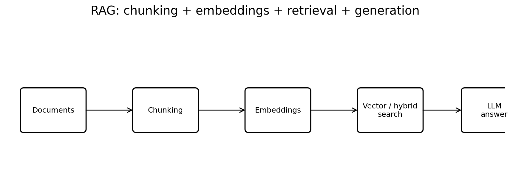
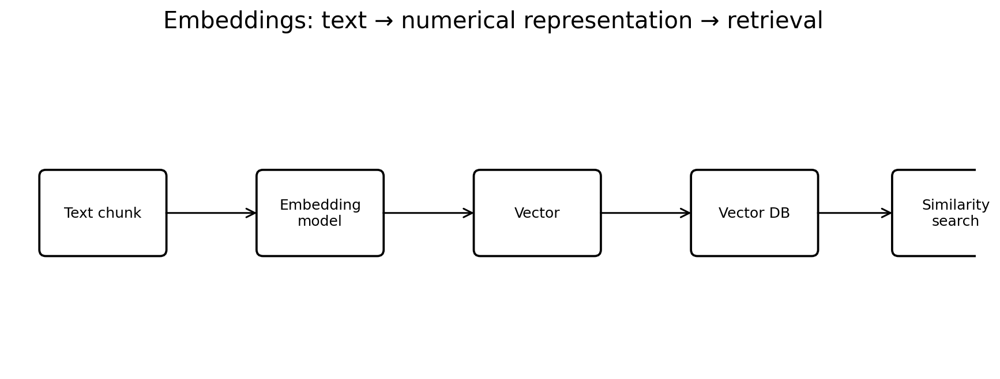

# GenAI Interview Preparation: Chunking and Embeddings

## Purpose

This guide is designed for a GenAI / Agentic AI interview, especially for an enterprise role where you may be expected to explain:

- RAG
- Chunking strategies
- Embeddings
- Vector databases
- Similarity search
- Hybrid search
- Reranking
- Metadata filtering
- Retrieval quality
- Production considerations
- Evaluation
- Common failure scenarios

The language is intentionally simple. The goal is to help you **understand the concept first and then explain it confidently in an interview**.

---

# Part 1 — The Big Picture

Before learning chunking and embeddings separately, understand where they fit.



A typical RAG system looks like:

```text
                 INGESTION
                    |
                    v
             Documents / PDFs
                    |
                    v
                 Parsing
                    |
                    v
                Chunking
                    |
                    v
               Embeddings
                    |
                    v
              Vector Store
                    |
                    |
                    |       QUERY
                    |         |
                    |         v
                    |      User Question
                    |         |
                    |         v
                    |      Embedding
                    |         |
                    +---------+
                              |
                              v
                       Similarity Search
                              |
                              v
                         Top-K Chunks
                              |
                              v
                           Reranker
                              |
                              v
                       Context + Question
                              |
                              v
                             LLM
                              |
                              v
                       Final Answer
```

The two topics in this guide are:

1. **Chunking** — deciding how to divide documents into useful pieces.
2. **Embeddings** — converting those pieces into vectors so that we can search by meaning.

---

# Part 2 — Chunking

## 2.1 What is chunking?

Chunking means dividing a large document into smaller pieces called **chunks**.

Suppose we have:

```text
Company Remote Work Policy

Employees can work remotely up to three days per week.
Remote work requires manager approval.
Employees must remain available during normal working hours.
Company data must only be accessed using approved devices and VPN.
```

Instead of embedding the entire document as one large piece, we might divide it:

```text
Chunk 1:
Employees can work remotely up to three days per week.

Chunk 2:
Remote work requires manager approval.

Chunk 3:
Employees must remain available during normal working hours.

Chunk 4:
Company data must only be accessed using approved devices and VPN.
```

Each chunk can then be embedded and stored for retrieval.

---

## 2.2 Why do we need chunking?

Chunking helps because:

### 1. Better retrieval

If the user asks:

> How many days can employees work remotely?

We want to retrieve the small piece that says:

> Employees can work remotely up to three days per week.

Not an entire 100-page HR document.

### 2. Lower cost

Sending unnecessary text to the LLM increases token usage.

### 3. Lower latency

Less context generally means less processing.

### 4. Better relevance

Smaller meaningful units can improve retrieval precision.

### 5. Fits embedding/model limits

Embedding models and LLMs have input limits.

---

## 2.3 The main challenge with chunking

The goal is **not simply to make small chunks**.

The goal is:

> Create chunks that are small enough for accurate retrieval but large enough to preserve the meaning required to answer a question.

This is the most important idea to remember.

---

## 2.4 Fixed-size chunking

The simplest strategy is to split text by a fixed number of characters or tokens.

Example:

```text
Chunk size = 500 tokens
Overlap = 50 tokens
```

Conceptually:

```text
Tokens:

1 -------- 500
          |
          | overlap
          v
451 ------ 950
          |
          v
901 ------ 1400
```

### Advantages

- Very simple
- Fast
- Predictable
- Easy to implement

### Disadvantages

- May cut sentences
- May split tables
- May split a logical section
- Does not understand document structure

### Good use cases

- Simple plain-text documents
- Large collections where predictable processing is important
- Initial prototypes

---

## 2.5 Character-based chunking

Example:

```python
chunk_size = 2000
```

Split every 2,000 characters.

This is simple but characters do not necessarily represent semantic units.

For example:

```text
...employee benefits are available
to all permanent employees...
```

A character boundary could split the sentence awkwardly.

---

## 2.6 Token-based chunking

Token-based chunking uses the tokenizer associated with the model.

Example:

```text
Chunk size = 500 tokens
Overlap = 50 tokens
```

Example Python:

```python
import tiktoken

encoding = tiktoken.get_encoding("cl100k_base")

def chunk_text(text, chunk_size=500, overlap=50):
    tokens = encoding.encode(text)

    chunks = []

    start = 0

    while start < len(tokens):
        end = start + chunk_size

        chunk = encoding.decode(tokens[start:end])

        chunks.append(chunk)

        start += chunk_size - overlap

    return chunks
```

---

## 2.7 Sentence-based chunking

Instead of cutting at an arbitrary token count, split at sentence boundaries.

Example:

```text
Sentence 1
Sentence 2
Sentence 3
Sentence 4
Sentence 5
```

Possible chunks:

```text
Chunk 1:
Sentence 1
Sentence 2
Sentence 3

Chunk 2:
Sentence 4
Sentence 5
```

### Advantage

The chunk usually remains grammatically meaningful.

### Disadvantage

Some sentences can be extremely long or short, so chunk sizes can become inconsistent.

---

## 2.8 Paragraph-based chunking

Split based on paragraphs.

Example:

```text
Paragraph 1 → Chunk 1
Paragraph 2 → Chunk 2
Paragraph 3 → Chunk 3
```

This works well when the document author has already organized information logically.

### Good for

- Policies
- Articles
- Documentation
- Knowledge-base pages

---

## 2.9 Recursive chunking

Recursive chunking tries to preserve larger logical boundaries first.

A typical hierarchy might be:

```text
Document
   ↓
Section
   ↓
Paragraph
   ↓
Sentence
   ↓
Words
```

The splitter first tries to split at a large boundary.

For example:

```text
1. Section
2. Paragraph
3. Sentence
4. Word
```

If a section is too large:

```text
Section
   ↓
Paragraphs
```

If a paragraph is still too large:

```text
Paragraph
   ↓
Sentences
```

This is often a better general-purpose strategy than blindly splitting every N characters.

---

## 2.10 Semantic chunking

Semantic chunking tries to identify where the **topic changes**.

Imagine:

```text
Paragraph 1:
The printer supports Wi-Fi 6 and Bluetooth connectivity.

Paragraph 2:
The device supports automatic firmware updates.

Paragraph 3:
Employees can work remotely three days per week.
```

A semantic chunker may detect that Paragraphs 1 and 2 are related to the printer, while Paragraph 3 is about HR policy.

So:

```text
Chunk A:
Printer connectivity + firmware

Chunk B:
Remote work policy
```

### Advantages

- More meaningful chunks
- Can improve retrieval quality

### Disadvantages

- More computationally expensive
- More complex
- Requires tuning/evaluation

---

## 2.11 Structure-aware chunking

For enterprise RAG, this is extremely important.

Do not treat every document as plain text.

A PDF may contain:

```text
Title
   ↓
Section
   ↓
Subsection
   ↓
Paragraph
   ↓
Table
   ↓
Image
```

A good ingestion pipeline tries to preserve this structure.

Example:

```json
{
  "text": "Remote employees must obtain manager approval.",
  "document_id": "HR-001",
  "page": 12,
  "section": "Remote Work",
  "source": "Employee Handbook"
}
```

This metadata becomes extremely useful during retrieval.

---

## 2.12 Parent-child chunking

This is a useful advanced technique.

```text
Parent chunk:
Large section containing complete business context

        |
        +---- Child chunk 1
        +---- Child chunk 2
        +---- Child chunk 3
```

Search is performed using smaller child chunks.

But when a child is selected, we can provide the larger parent context to the LLM.

### Why?

Small chunks:

- improve retrieval precision

Large parent context:

- improves generation context

This gives us a balance between retrieval precision and contextual completeness.

---

## 2.13 Chunk overlap

Overlap means repeating a portion of the previous chunk in the next chunk.

Example:

```text
Chunk 1
-----------------------------
A B C D E F G H I J

Chunk 2
-----------------------------
              H I J K L M N O
              ^^^^^
              overlap
```

If an important statement crosses the boundary, overlap helps preserve it.

### But don't overdo it.

Too much overlap causes:

- More chunks
- More embeddings
- More storage
- More retrieval duplicates
- Higher cost

---

## 2.14 How do you choose chunk size?

There is no universal number.

Consider:

### Document type

A technical manual may need different chunking from a short FAQ.

### Question type

If users ask highly specific questions, smaller chunks may work better.

If questions require multiple pieces of context, larger chunks may be better.

### Structure

A structured policy may be better chunked by sections rather than fixed token counts.

### Model

Embedding and LLM context limits matter.

### Evaluation

Ultimately, chunk size should be selected using an evaluation dataset.

A good interview answer:

> "I wouldn't blindly choose 500 tokens. I would start with a reasonable baseline, such as 300–800 tokens depending on the document type, then evaluate retrieval recall, precision, answer correctness and context relevance."

---

## 2.15 Example: Bad vs good chunking

### Bad

```text
Chunk 1:
The printer can connect to Wi-Fi. The maximum print speed is 40 ppm.
The supported paper sizes are A4, Letter, Legal. The printer uses...

Chunk 2:
...a 250-sheet tray. Firmware updates can be performed automatically.
```

This may mix unrelated concepts.

### Better

```text
Chunk 1:
Printer Connectivity

The printer supports Wi-Fi 6 and Bluetooth.

Chunk 2:
Printer Performance

The maximum print speed is 40 pages per minute.

Chunk 3:
Paper Handling

The printer supports A4, Letter and Legal paper.
```

---

## 2.16 Chunking for different document types

| Document | Recommended approach |
|---|---|
| FAQ | Question-answer based chunks |
| Policy | Section/paragraph based |
| Technical manual | Heading + section aware |
| API documentation | Endpoint/operation based |
| Legal document | Clause/section based |
| Financial report | Section + table aware |
| PDF | Structure/page/section aware |
| Source code | Function/class/module based |
| Emails | Thread/message based |
| Web pages | Heading + paragraph based |

---

# Part 3 — Embeddings

## 3.1 What is an embedding?

An embedding is a numerical representation of text.

```text
"How do I reset my password?"
                  |
                  v
       Embedding Model
                  |
                  v
[0.21, -0.13, 0.82, 0.44, ...]
```

The vector may contain hundreds or thousands of dimensions.

The important idea is:

> Similar meanings should produce vectors that are relatively close to each other.

---

## 3.2 Simple example

Consider:

```text
Text A:
How do I reset my password?

Text B:
I forgot my password. How can I change it?

Text C:
What is the weather today?
```

After embedding:

```text
A → [0.12, 0.80, 0.31, ...]
B → [0.15, 0.78, 0.29, ...]
C → [-0.62, 0.10, 0.91, ...]
```

A and B should be much more similar than A and C.

---

## 3.3 Why embeddings are important for RAG

Suppose our knowledge base contains:

```text
Employees can work remotely up to three days per week.
```

The user asks:

```text
Can I work from home three days a week?
```

There may be very little exact word overlap.

Keyword search might struggle.

Embedding search understands the semantic relationship.

```text
Knowledge:
"Employees can work remotely up to three days per week."

             ↕ semantic similarity

Question:
"Can I work from home three days a week?"
```

---

## 3.4 Embedding pipeline



```text
Text
  ↓
Embedding Model
  ↓
Vector
  ↓
Vector Database
  ↓
Similarity Search
```

During ingestion:

```text
Chunk 1 → Embedding → Vector 1
Chunk 2 → Embedding → Vector 2
Chunk 3 → Embedding → Vector 3
```

During a query:

```text
Question → Embedding → Query Vector
                         |
                         v
                  Compare against
                  stored vectors
                         |
                         v
                    Top results
```

---

## 3.5 OpenAI embeddings example

```python
from openai import OpenAI

client = OpenAI()

response = client.embeddings.create(
    model="text-embedding-3-small",
    input="How do I reset my password?"
)

vector = response.data[0].embedding

print(len(vector))
print(vector[:10])
```

Conceptually:

```text
Input text
    ↓
text-embedding-3-small
    ↓
[0.012, -0.43, 0.77, ...]
```

---

## 3.6 Embedding dimensions

A vector has a number of dimensions.

```text
Vector =
[
  0.12,
 -0.45,
  0.78,
  0.32,
  ...
]
```

The number of values is its dimensionality.

Different embedding models can produce different dimensions.

### Interview point

> "The vector dimension is determined by the embedding model or its supported configuration. The vector database index must be configured with the corresponding dimension."

---

## 3.7 Similarity search

After generating embeddings, we need to determine how similar two vectors are.

Common methods include:

1. Cosine similarity
2. Dot product / inner product
3. Euclidean distance

---

## 3.8 Cosine similarity

Cosine similarity measures the angle between two vectors.

```text
             Vector A
                /
               /
              /
             /
            /  angle
           /
----------/------------ Vector B
```

If the vectors point in similar directions:

```text
Similarity → high
```

If they point in very different directions:

```text
Similarity → low
```

A common interview explanation:

> "Cosine similarity measures how closely two vectors point in the same direction. It is widely used for comparing text embeddings."

---

## 3.9 Dot product

For vectors:

```text
A = [a1, a2, a3]

B = [b1, b2, b3]
```

Dot product:

```text
A · B =
a1*b1 + a2*b2 + a3*b3
```

The exact interpretation depends on vector normalization and the embedding model.

---

## 3.10 Euclidean distance

Euclidean distance measures the straight-line distance between vectors.

```text
A ---------------- B
       distance
```

Smaller distance means more similar.

The choice of metric should match the embedding model and vector database configuration.

---

# Part 4 — Vector Databases

## 4.1 What does a vector database store?

A typical record may look like:

```json
{
  "id": "chunk-001",
  "text": "Employees can work remotely up to three days per week.",
  "embedding": [0.12, -0.33, 0.81],
  "metadata": {
    "document": "employee_handbook.pdf",
    "page": 12,
    "section": "Remote Work"
  }
}
```

It can store:

- Text/chunk
- Vector
- Metadata
- Document ID
- Other application information

---

## 4.2 Examples

Common technologies include:

- FAISS
- Chroma
- Pinecone
- Azure AI Search
- Elasticsearch / OpenSearch
- PostgreSQL with pgvector
- Weaviate
- Milvus

---

## 4.3 Is Azure AI Search a vector database?

A strong interview answer:

> "Azure AI Search is a search service that supports vector search. It isn't limited to being a traditional vector database. It can combine keyword search, vector search, hybrid search, filtering and semantic ranking, which makes it very useful for enterprise RAG."

---

# Part 5 — Complete RAG Example

Suppose we have:

```text
company_policy.txt
```

Content:

```text
Employees can work remotely up to three days per week.

Remote work requires manager approval.

Employees must be available during normal working hours.
```

## Step 1 — Read document

```python
from pathlib import Path

text = Path("company_policy.txt").read_text(
    encoding="utf-8"
)
```

## Step 2 — Chunk

```python
chunks = chunk_text(
    text,
    chunk_size=500,
    overlap=50
)
```

## Step 3 — Create embeddings

```python
response = client.embeddings.create(
    model="text-embedding-3-small",
    input=chunks
)

embeddings = [
    item.embedding
    for item in response.data
]
```

## Step 4 — Store vectors

For a simple prototype:

```text
FAISS
```

For an enterprise system:

```text
Azure AI Search
Pinecone
PostgreSQL + pgvector
etc.
```

## Step 5 — Embed user query

```python
question = "Can I work from home three days a week?"

response = client.embeddings.create(
    model="text-embedding-3-small",
    input=question
)

query_vector = response.data[0].embedding
```

## Step 6 — Search

Retrieve the top 3 most similar chunks.

```text
Question
   ↓
Embedding
   ↓
Vector Search
   ↓
Top 3 chunks
```

## Step 7 — Send context to LLM

```python
prompt = f"""
Answer using only the provided context.

Context:
{context}

Question:
{question}
"""

response = client.responses.create(
    model="gpt-5",
    input=prompt
)

print(response.output_text)
```

Possible result:

```text
Yes. Employees can work remotely up to three days per week,
subject to manager approval.
```

---

# Part 6 — Metadata Filtering

This is an important enterprise concept.

Suppose we have:

```text
Document A → HR
Document B → Finance
Document C → Engineering
```

The user belongs to Engineering.

We shouldn't simply retrieve everything and hope the LLM hides restricted information.

Instead, apply authorization/filtering **before or during retrieval**.

Example metadata:

```json
{
  "department": "engineering",
  "classification": "internal"
}
```

Then:

```text
User
 ↓
Identity
 ↓
Authorization
 ↓
Metadata filter
 ↓
Vector search
 ↓
Relevant authorized chunks
```

### Interview answer

> "Access control should be enforced outside the LLM. The retrieval layer should respect document permissions so that unauthorized content isn't even passed into the model."

---

# Part 7 — Hybrid Search

Pure vector search is not always enough.

Consider:

```text
Error code: HP-ERR-49281
```

Keyword search can be extremely useful for exact identifiers.

Vector search is useful for semantic meaning.

Therefore:

```text
                User Query
                    |
          +---------+---------+
          |                   |
          v                   v
     Keyword Search      Vector Search
          |                   |
          +---------+---------+
                    |
                    v
              Combine results
                    |
                    v
                 Reranker
                    |
                    v
                Top chunks
```

This is called **hybrid search**.

---

# Part 8 — Reranking

Initial vector search may return:

```text
1. Score 0.91
2. Score 0.89
3. Score 0.88
4. Score 0.87
5. Score 0.86
```

But similarity score doesn't always mean the result is the best answer.

A reranker can evaluate:

```text
Question + Candidate Chunk
```

and produce a more accurate ranking.

Typical pipeline:

```text
Query
 ↓
Retrieve Top 20
 ↓
Reranker
 ↓
Select Top 5
 ↓
LLM
```

This is often better than retrieving only 5 candidates initially.

---

# Part 9 — Common RAG Problems

## Problem 1: Wrong chunk retrieved

Possible causes:

- Bad chunking
- Poor embedding model
- Poor query
- Wrong metadata filter
- Incorrect top-K
- Need hybrid search
- Need reranking

## Problem 2: Correct chunk retrieved but wrong answer

This is a generation/grounding problem.

Possible causes:

- Poor prompt
- Too much context
- Conflicting documents
- LLM hallucination
- Weak grounding instruction

## Problem 3: Answer requires multiple chunks

Possible solutions:

- Larger chunks
- Parent-child retrieval
- Retrieve multiple chunks
- Query decomposition
- Reranking
- Agentic retrieval

## Problem 4: Duplicate chunks

Often caused by excessive overlap.

Solutions:

- Reduce overlap
- Deduplicate retrieved chunks
- Tune chunk size

---

# Part 10 — Chunking vs Embeddings

| Topic | Chunking | Embeddings |
|---|---|---|
| Purpose | Divide documents | Represent meaning numerically |
| Input | Large document | Text/chunk |
| Output | Smaller text pieces | Vectors |
| Main concern | Context boundaries | Semantic representation |
| Main tuning | Size/overlap | Model/dimensions/metric |
| Used during | Ingestion | Ingestion + query |
| Common failure | Bad boundaries | Poor semantic retrieval |

Remember:

> **Chunking decides what unit you search. Embeddings decide how that unit is represented for semantic search.**

---

# Part 11 — Interview Questions and Answers

## Q1. What is chunking?

> Chunking is the process of dividing a large document into smaller meaningful pieces so that each piece can be independently indexed, embedded and retrieved.

## Q2. Why is chunking required in RAG?

> We don't want to retrieve and send an entire document for every question. Chunking allows the retrieval system to identify the specific pieces relevant to the question. It improves relevance, reduces context size and helps control cost and latency.

## Q3. What chunk size do you use?

> There is no universal chunk size. I start with a reasonable baseline based on the document type, often a few hundred tokens, and then evaluate retrieval quality. For technical or structured documents I may prefer structure-aware chunking instead of a fixed token size.

## Q4. What is chunk overlap?

> Chunk overlap means repeating some content between adjacent chunks. It helps preserve context when an important sentence or concept crosses a chunk boundary.

## Q5. What happens if overlap is too high?

> It increases the number of chunks, storage and embedding cost, and can produce duplicate retrieval results. Therefore overlap should be tuned rather than maximized.

## Q6. What are the different chunking strategies?

> Fixed-size, token-based, sentence-based, paragraph-based, recursive, semantic, structure-aware and parent-child chunking are common approaches.

## Q7. Which chunking strategy would you choose for a technical manual?

> I would prefer structure-aware chunking. I would preserve headings, sections, subsections and tables where possible. I might combine this with recursive splitting when individual sections become too large.

## Q8. What is semantic chunking?

> Semantic chunking attempts to identify topic boundaries rather than using only character or token counts. When the topic changes significantly, it can create a new chunk.

## Q9. What is an embedding?

> An embedding is a numerical vector representation of text that captures semantic information. Similar meanings tend to produce vectors that are close according to a chosen similarity metric.

## Q10. Why do we need embeddings?

> Embeddings allow us to perform semantic search. A user's question doesn't have to use the exact words contained in the document. The system can retrieve content with a similar meaning.

## Q11. What is cosine similarity?

> Cosine similarity measures the angle between two vectors. If two vectors point in similar directions, their cosine similarity is high. It is commonly used for comparing text embeddings.

## Q12. Cosine similarity vs Euclidean distance?

> Cosine similarity measures directional similarity, while Euclidean distance measures geometric distance. For text embeddings, cosine similarity or dot product is commonly used depending on the embedding model and vector database configuration.

## Q13. What is a vector database?

> A vector database or vector-capable search system stores embeddings and allows efficient similarity search against them. It can also store metadata for filtering and document references.

## Q14. What is hybrid search?

> Hybrid search combines keyword search and vector search. Vector search is strong for semantic similarity, while keyword search is often strong for exact terms such as product IDs, error codes and version numbers.

## Q15. What is reranking?

> Reranking takes the initial retrieved candidates and applies a more precise relevance model to reorder them. For example, we might retrieve 20 candidates and rerank them to select the best 5 for the LLM.

## Q16. How do you decide Top-K?

> I wouldn't choose K arbitrarily. I would evaluate different values using retrieval recall, precision, context relevance and final answer quality. A larger K increases recall but can introduce irrelevant context and increase LLM cost.

## Q17. What if the correct document is not retrieved?

> I would classify it as a retrieval problem and investigate chunking, embeddings, query formulation, metadata filters, top-K, hybrid search and reranking. I would use a labeled evaluation dataset rather than tuning based only on individual examples.

## Q18. What if the correct document is retrieved but the LLM gives the wrong answer?

> Then I would investigate prompt instructions, context formatting, conflicting evidence, context size, grounding and model behavior. I would also check whether the model should have refused to answer because the evidence was insufficient.

## Q19. Can embeddings eliminate hallucinations?

> No. Embeddings improve retrieval, but they don't guarantee factual answers. The LLM can still hallucinate even when the correct context is retrieved. We need grounding instructions, citations, evaluation and appropriate guardrails.

## Q20. RAG vs fine-tuning?

> RAG is mainly for providing external or changing knowledge to the model. Fine-tuning is mainly for changing model behavior or improving performance on a particular task or style. If the problem is frequently changing company information, I would normally start with RAG rather than fine-tuning.

## Q21. How would you secure enterprise RAG?

> I would enforce identity and authorization before retrieval, apply metadata-based access filtering, encrypt data, protect secrets, log access and ensure unauthorized documents are not passed into the LLM. I would never depend on the LLM itself to enforce authorization.

## Q22. How would you evaluate a RAG system?

> I would evaluate retrieval and generation separately. Retrieval metrics can include recall@K and ranking metrics. Generation evaluation can include faithfulness, answer relevance and correctness. Frameworks such as RAGAS, DeepEval or custom evaluation pipelines can automate this.

## Q23. What metadata would you store with chunks?

Typical metadata:

```text
document_id
document_name
page_number
section
source
created_date
updated_date
document_type
tenant
department
access_permissions
chunk_id
parent_chunk_id
```

## Q24. How do you handle document updates?

> I would track document versions or hashes. When a document changes, I would identify affected chunks and re-embed them rather than blindly rebuilding the entire index. I would also maintain document and chunk IDs so stale versions can be removed or deactivated.

## Q25. How would you handle a 1-million-document RAG system?

> I would use scalable storage and a managed search/vector platform, partition or index appropriately, use metadata filtering to reduce the search space, use hybrid retrieval where appropriate, retrieve a reasonable candidate set and rerank it. I would also design incremental ingestion instead of reprocessing all documents for every change.

---

# Part 12 — Advanced Interview Scenarios

## Scenario 1: Users say the chatbot gives irrelevant answers.

First determine:

```text
Is the right document retrieved?
        |
   +----+----+
   |         |
  No        Yes
   |         |
Retrieval   Generation
problem     problem
```

If retrieval is wrong:

```text
Check:
- Chunking
- Embedding
- Query
- Metadata
- Top-K
- Hybrid search
- Reranking
```

If retrieval is correct:

```text
Check:
- Prompt
- Context
- Grounding
- Conflicting information
- Model
```

---

## Scenario 2: Search works for normal questions but fails for product IDs.

Use:

> **Hybrid Search**

Why?

```text
Semantic query
       +
Exact keyword/product identifier
       ↓
Better retrieval
```

---

## Scenario 3: A 100-page document is retrieved for every query.

Problem:

> The retrieval unit is too large.

Solution:

> Introduce appropriate chunking and retrieve only relevant sections.

---

## Scenario 4: A sentence is split across two chunks.

Possible solution:

> Use overlap or structure-aware/sentence-aware chunking.

---

## Scenario 5: The LLM answers using an older version of a document.

Investigate:

```text
Document version
      ↓
Chunk metadata
      ↓
Index update
      ↓
Filtering
      ↓
Retrieval
```

A production system should make document freshness/versioning explicit.

---

# Part 13 — Production RAG Architecture

```text
                    User
                     |
                     v
               API Gateway
                     |
                     v
              Authentication
                     |
                     v
               RAG Service
                     |
            +--------+--------+
            |                 |
            v                 v
        Query Rewrite      Metadata
            |              Filtering
            +--------+--------+
                     |
                     v
              Hybrid Retrieval
               /           \
              /             \
       Keyword Search    Vector Search
              \             /
               \           /
                  Reranker
                     |
                     v
                 Top Chunks
                     |
                     v
             Context Builder
                     |
                     v
                    LLM
                     |
                     v
          Grounding / Guardrails
                     |
                     v
             Answer + Citations
```

---

# Part 14 — Interview Answer: Explain Your RAG Implementation

A strong answer is:

> "I start with document ingestion and parsing. I don't immediately split every document using a fixed number of characters. I first understand the document structure and choose an appropriate chunking strategy. For structured enterprise documents, I prefer section-aware or recursive chunking, with overlap where required.
>
> Each chunk is stored with metadata such as document ID, page, section, source and access information. I then generate embeddings using an embedding model and store the vectors in a vector-capable search system.
>
> At query time, I embed the user query and perform similarity search. For enterprise applications, I prefer hybrid search when exact identifiers such as product numbers or error codes are important. I can then rerank the candidate chunks and send only the most relevant context to the LLM.
>
> Finally, I apply grounding and safety controls and return the answer with citations. I evaluate the system separately for retrieval quality and generation quality rather than treating the LLM output alone as the measure of RAG quality."

---

# Part 15 — Quick Revision Sheet

## Chunking

```text
Chunking =
Large document → smaller meaningful pieces
```

Remember:

```text
Fixed
Token
Sentence
Paragraph
Recursive
Semantic
Structure-aware
Parent-child
```

Key parameters:

```text
Chunk size
Overlap
Boundary
Metadata
```

## Embeddings

```text
Text → Embedding Model → Vector
```

Purpose:

```text
Semantic representation
        ↓
Similarity search
```

Remember:

```text
Cosine similarity
Dot product
Euclidean distance
Vector dimension
Embedding model
```

## RAG

```text
Documents
 ↓
Chunk
 ↓
Embed
 ↓
Index
 ↓
Retrieve
 ↓
Rerank
 ↓
LLM
 ↓
Answer
```

## Production RAG

Remember:

```text
Security
Authorization
Metadata
Hybrid Search
Reranking
Evaluation
Observability
Cost
Latency
Versioning
Citations
Guardrails
```

---

# Part 16 — 30-Second Interview Answer

If the interviewer asks:

> **"What is the relationship between chunking and embeddings?"**

Say:

> "Chunking determines how we divide a document into retrieval units. Embeddings then convert each of those chunks into vectors representing their semantic meaning. During a user query, we embed the query as well and compare it with the stored chunk vectors to retrieve the most relevant information. So chunking determines the quality and granularity of what we retrieve, while embeddings determine how effectively we can perform semantic matching."

---

# Final Mental Model

```text
             DOCUMENT
                |
                v
            CHUNKING
        "What should I search?"
                |
                v
             CHUNKS
                |
                v
            EMBEDDING
        "How do I represent it?"
                |
                v
             VECTORS
                |
                v
          VECTOR / HYBRID
             SEARCH
        "Which chunks matter?"
                |
                v
           RERANKING
        "Which are best?"
                |
                v
              LLM
        "Generate the answer"
                |
                v
       ANSWER + EVIDENCE
```

**One sentence to remember:**

> **Chunking controls the retrieval unit; embeddings enable semantic retrieval; reranking improves relevance; and the LLM uses the retrieved evidence to generate the final answer.**
