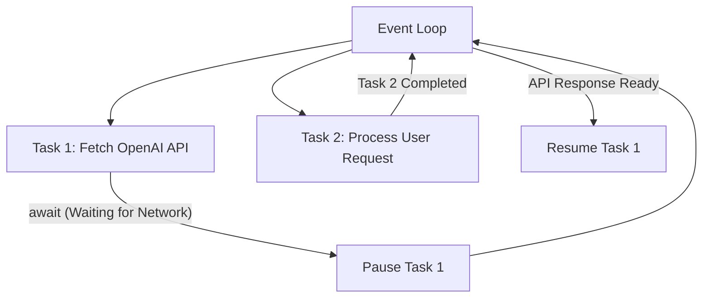

# Comprehensive Python Interview Q&A Guide

A detailed, easy-to-understand interview preparation guide covering Core Python, Async Programming, GIL, Pydantic, Decorators, OOP with executable code snippets, and Memory Management. Every code snippet includes a step-by-step explanatory paragraph on how it works and how to explain it in an interview.

---

## Table of Contents
1. [Global Interpreter Lock (GIL)](#1-global-interpreter-lock-gil)
2. [Asynchronous Programming (`asyncio`)](#2-asynchronous-programming-asyncio)
3. [Pydantic & Data Validation](#3-pydantic--data-validation)
4. [Decorators Deep Dive](#4-decorators-deep-dive)
5. [Object-Oriented Programming (OOP) Code Snippets](#5-object-oriented-programming-oop-code-snippets)
6. [Core Python Concepts & Interview Pitfalls](#6-core-python-concepts--interview-pitfalls)

---

# 1. Global Interpreter Lock (GIL)

### Q1. What is the GIL and why does Python have it?

#### 💡 Simple Explanation
The **Global Interpreter Lock (GIL)** is a mutex (mutual exclusion lock) used by CPython (the standard Python interpreter). It permits **only one thread to execute Python bytecode at any given time**, even on multi-core processors.

```
       Multi-Core CPU (4 Cores)
       ┌────────┬────────┬────────┬────────┐
       │ Core 1 │ Core 2 │ Core 3 │ Core 4 │
       └───┬────┴────────┴────────┴────────┘
           │
           ▼  (Only 1 thread allowed at a time!)
   🔒 [ GIL Lock ]
           │
           ▼
     CPython Bytecode Interpreter
```

#### Why does Python have the GIL?
1. **Memory Management Safety**: CPython uses **reference counting** for memory management. Without a global lock, concurrent threads could race to increment/decrement reference counts, causing memory leaks or freeing objects while still in use (dangling pointers).
2. **Legacy C Extension Support**: GIL makes it very easy to integrate C libraries, as C extensions don't need thread-safety guarantees by default.
3. **Single-threaded Speed**: Single-threaded Python programs run faster because there's no fine-grained locking overhead per object.

---

### Q2. How does the GIL affect Multithreading vs Multiprocessing?

| Task Type | Multithreading (`threading`) | Multiprocessing (`multiprocessing`) |
| :--- | :--- | :--- |
| **I/O-Bound** (Network requests, File reads, DB queries) | **High Performance** (GIL is released during I/O wait times). | Works well, but higher memory overhead due to multiple process forks. |
| **CPU-Bound** (LLM embedding math, image matrix ops, loops) | **Poor Performance** (Threads fight for GIL, running slower than 1 thread!). | **High Performance** (Spawns separate Python processes, each with its own GIL on separate CPU cores). |

---

### Q3. How do you bypass or work around the GIL?

1. **Use `multiprocessing`**: Spawns multiple OS processes instead of threads. Each process gets its own Python interpreter and memory space.
2. **C/C++ Extensions (e.g., NumPy, PyTorch)**: Heavy numerical computations release the GIL in C before running calculations across multiple CPU cores.
3. **Use Async IO (`asyncio`)**: Ideal for high-concurrency I/O without the overhead of threads.
4. **Python 3.13+ Free-Threaded Build (PEP 703)**: Experimental feature allowing CPython to run without the GIL!

---

# 2. Asynchronous Programming (`asyncio`)

### Q4. What is `asyncio` and how does the Event Loop work?

#### 💡 Simple Explanation
Traditional code is **synchronous (blocking)**: line 2 waits for line 1 to finish. If line 1 is a 2-second web request, the entire program freezes for 2 seconds.

**`asyncio`** uses a single-threaded **Event Loop**. When an asynchronous function reaches an `await` point (like waiting for an HTTP API response), it hands control back to the Event Loop, allowing other tasks to run in the meantime.



---

### Q5. Concurrent Async Code Snippet (`asyncio.gather`)

#### 📝 Code Example: Fetching Multiple LLM APIs Concurrently

```python
import asyncio
import time

async def fetch_llm_response(prompt: str, delay: int) -> str:
    print(f"🛫 Starting prompt: '{prompt}'")
    await asyncio.sleep(delay)  # Simulates non-blocking async network request
    print(f"🛬 Completed prompt: '{prompt}'")
    return f"Response for '{prompt}'"

async def main():
    start_time = time.time()
    
    # Run 3 LLM API calls concurrently using asyncio.gather
    prompts = ["Summarize Doc A", "Analyze Doc B", "Translate Doc C"]
    results = await asyncio.gather(
        fetch_llm_response(prompts[0], 2),
        fetch_llm_response(prompts[1], 3),
        fetch_llm_response(prompts[2], 1),
    )
    
    print(f"Results: {results}")
    print(f"⏱️ Total time elapsed: {time.time() - start_time:.2f}s")

if __name__ == "__main__":
    asyncio.run(main())
```

#### 📖 Code Explanation & Verbal Walkthrough
In this snippet, `fetch_llm_response` is defined as a coroutine using `async def`. Instead of standard `time.sleep()`, we use `await asyncio.sleep(delay)`. The `await` keyword explicitly tells the Python Event Loop: *"I am going to wait for a network IO operation now; yield control back to the event loop so other tasks can execute."*

Inside `main()`, `asyncio.gather()` schedules all 3 tasks onto the event loop simultaneously. The task with the shortest delay (1s) finishes first, followed by the 2s task, and lastly the 3s task. Instead of taking $2 + 3 + 1 = 6$ seconds sequentially, the total execution time is determined by the **maximum single delay (~3.0 seconds)**. `asyncio.run(main())` initializes the event loop, executes `main()`, and cleans up afterwards.

#### 🖨️ Execution Output:
```text
🛫 Starting prompt: 'Summarize Doc A'
🛫 Starting prompt: 'Analyze Doc B'
🛫 Starting prompt: 'Translate Doc C'
🛬 Completed prompt: 'Translate Doc C'
🛬 Completed prompt: 'Summarize Doc A'
🛬 Completed prompt: 'Analyze Doc B'
Results: ["Response for 'Summarize Doc A'", "Response for 'Analyze Doc B'", "Response for 'Translate Doc C'"]
⏱️ Total time elapsed: 3.00s
```

---

# 3. Pydantic & Data Validation

### Q6. What is Pydantic and why use it over dicts/dataclasses?

**Pydantic** is a data validation library using Python type annotations.
- **Strict Parsing & Type Coercion**: Converts incoming JSON/dicts into validated Python objects (e.g., string `"123"` becomes integer `123`).
- **Detailed Error Messages**: Raises clear `ValidationError` when data types or bounds fail.
- **Rust Core (Pydantic V2)**: High-speed validation written in Rust.
- **FastAPI & GenAI Standard**: Used extensively in FastAPI request bodies and LLM **Structured Output** generation.

---

### Q7. Complete Pydantic V2 Code Example: Validators & Structured Output

```python
from pydantic import BaseModel, Field, field_validator, model_validator
from typing import List

class CandidateProfile(BaseModel):
    name: str = Field(..., description="Full name of candidate")
    years_experience: int = Field(..., ge=0, le=50, description="Years of experience (0 to 50)")
    skills: List[str] = Field(default_factory=list)
    email: str

    # 1. Field Validator (Validates a single field)
    @field_validator("email")
    @classmethod
    def validate_email_domain(cls, value: str) -> str:
        if "@" not in value:
            raise ValueError("Invalid email format: must contain '@'")
        return value.lower()

    # 2. Model Validator (Validates relationships across multiple fields)
    @model_validator(mode="after")
    def check_seniority_skills(self) -> "CandidateProfile":
        if self.years_experience >= 5 and len(self.skills) == 0:
            raise ValueError("Senior candidates (5+ years) must list at least one skill!")
        return self

# Usage Example
raw_data = {
    "name": "Alice Smith",
    "years_experience": 6,
    "skills": ["Python", "FastAPI", "LangChain"],
    "email": "ALICE.SMITH@Example.com"
}

# Parse & Validate
candidate = CandidateProfile.model_validate(raw_data)
print("Validated Model:", candidate)
print("Email lowered automatically:", candidate.email)

# Serialize back to JSON
json_output = candidate.model_dump_json(indent=2)
print("JSON Output:\n", json_output)
```

#### 📖 Code Explanation & Verbal Walkthrough
1. **`BaseModel` & `Field`**: We inherit from `BaseModel`. `Field(...)` specifies validation rules (such as `ge=0, le=50` to guarantee experience is between 0 and 50 years). `default_factory=list` ensures each instance gets a fresh list instead of a shared reference.
2. **`@field_validator("email")`**: Runs specifically on the `email` field. It verifies the presence of `"@"` and normalizes the email string to lowercase before storing it.
3. **`@model_validator(mode="after")`**: Runs after all individual fields have been validated. This allows cross-field logic: if a candidate has 5+ years of experience but 0 skills listed, it raises a custom `ValueError`.
4. **Data Methods**: `.model_validate(raw_data)` parses raw dictionary data, performing type coercion (e.g. string numbers to ints). `.model_dump_json()` converts the validated Python object cleanly into a JSON string.

#### 🖨️ Execution Output:
```text
Validated Model: name='Alice Smith' years_experience=6 skills=['Python', 'FastAPI', 'LangChain'] email='alice.smith@example.com'
Email lowered automatically: alice.smith@example.com
JSON Output:
 {
  "name": "Alice Smith",
  "years_experience": 6,
  "skills": [
    "Python",
    "FastAPI",
    "LangChain"
  ],
  "email": "alice.smith@example.com"
}
```

---

# 4. Decorators Deep Dive

### Q8. How do Decorators work in Python?

A **decorator** is a function that accepts another function as an argument, wraps or extends its behavior, and returns the modified function. Because functions in Python are **first-class objects**, they can be passed as arguments, assigned to variables, and returned from other functions.

---

### Q9. Comprehensive Decorator Code Examples

#### 1. Parametrized Function Decorator with `@wraps`

```python
import time
from functools import wraps

def retry(max_retries: int = 3, delay: int = 1):
    """Parametrized decorator that retries a function upon exception."""
    def decorator(func):
        @wraps(func)
        def wrapper(*args, **kwargs):
            attempts = 0
            while attempts < max_retries:
                try:
                    return func(*args, **kwargs)
                except Exception as e:
                    attempts += 1
                    print(f"⚠️ Attempt {attempts} failed with error: '{e}'. Retrying in {delay}s...")
                    time.sleep(delay)
            raise RuntimeError(f"Function '{func.__name__}' failed after {max_retries} retries.")
        return wrapper
    return decorator

@retry(max_retries=3, delay=1)
def unstable_api_call():
    import random
    if random.random() < 0.7:
        raise ConnectionError("503 Service Unavailable")
    return "API Success Payload"

# Usage
try:
    result = unstable_api_call()
    print("Result:", result)
except RuntimeError as err:
    print("Final Failure:", err)
```

#### 📖 Code Explanation & Verbal Walkthrough
This example demonstrates a **3-tier nested decorator** because it takes custom arguments (`max_retries`, `delay`).
- **Outer function (`retry`)**: Accepts configuration parameters (`max_retries=3`, `delay=1`).
- **Middle function (`decorator`)**: Accepts the target function (`func`) being decorated.
- **Inner function (`wrapper`)**: Intercepts the positional (`*args`) and keyword (`**kwargs`) arguments passed to `func`. It runs a `while` loop, catching exceptions and retrying until success or exceeding `max_retries`.
- **`@wraps(func)`**: Extremely important! Preserves the original function's name (`func.__name__`), docstring, and annotations. Without `@wraps`, the decorated function's name would be overwritten to `'wrapper'`.

---

#### 2. Class-Based Decorator

```python
from functools import wraps

class CountCalls:
    """Class-based decorator that tracks how many times a function is called."""
    def __init__(self, func):
        self.func = func
        self.num_calls = 0
        wraps(func)(self)  # Preserve function metadata

    def __call__(self, *args, **kwargs):
        self.num_calls += 1
        print(f"📊 [Call Counter] Function '{self.func.__name__}' called {self.num_calls} time(s).")
        return self.func(*args, **kwargs)

@CountCalls
def process_user_query(query: str):
    return f"Processed query: {query}"

# Usage
print(process_user_query("What is RAG?"))
print(process_user_query("How does vector search work?"))
```

#### 📖 Code Explanation & Verbal Walkthrough
A class can act as a decorator by implementing the **`__init__`** and **`__call__`** dunder methods.
- When `@CountCalls` decorates `process_user_query`, Python calls `CountCalls(process_user_query)`, storing the target function in `self.func` and initializing `self.num_calls = 0`.
- Whenever `process_user_query(...)` is invoked later, the **`__call__`** method is executed. It increments `self.num_calls` by 1, logs the count, and executes `self.func(*args, **kwargs)`. This is ideal for stateful decorators (such as rate limiters or metrics collectors).

#### 🖨️ Execution Output:
```text
📊 [Call Counter] Function 'process_user_query' called 1 time(s).
Processed query: What is RAG?
📊 [Call Counter] Function 'process_user_query' called 2 time(s).
Processed query: How does vector search work?
```

---

# 5. Object-Oriented Programming (OOP) Code Snippets

---

### Q10. Inheritance & `super()` with MRO (Method Resolution Order)

```python
class BaseAgent:
    def __init__(self, agent_name: str):
        self.agent_name = agent_name

    def execute_task(self, task: str) -> str:
        return f"[{self.agent_name}] Executing task: {task}"

class RAGAgent(BaseAgent):
    def __init__(self, agent_name: str, vector_db: str):
        # Call parent class constructor using super()
        super().__init__(agent_name)
        self.vector_db = vector_db

    def execute_task(self, task: str) -> str:
        # Extend parent method behavior using super()
        base_msg = super().execute_task(task)
        return f"{base_msg} via Vector Database ({self.vector_db})"

# Usage
rag_agent = RAGAgent(agent_name="DocsBot", vector_db="Qdrant")
print(rag_agent.execute_task("Retrieve HR Policy"))
print("Method Resolution Order (MRO):", RAGAgent.__mro__)
```

#### 📖 Code Explanation & Verbal Walkthrough
`RAGAgent` inherits from `BaseAgent`. Inside `__init__`, we call `super().__init__(agent_name)` to delegate initialization of parent attributes (`agent_name`) to the parent class constructor. In `execute_task`, we call `super().execute_task(task)` to reuse the parent's base logic and append extra information specific to `RAGAgent`. `RAGAgent.__mro__` shows the **Method Resolution Order** (the exact sequence Python searches when calling a method: `RAGAgent` $\rightarrow$ `BaseAgent` $\rightarrow$ `object`).

#### 🖨️ Execution Output:
```text
[DocsBot] Executing task: Retrieve HR Policy via Vector Database (Qdrant)
Method Resolution Order (MRO): (<class '__main__.RAGAgent'>, <class '__main__.BaseAgent'>, <class 'object'>)
```

---

### Q11. Polymorphism & Abstract Base Classes (`abc.ABC`)

```python
from abc import ABC, abstractmethod

class LLMProvider(ABC):
    """Abstract Base Class defining an interface contract."""
    
    @abstractmethod
    def generate(self, prompt: str) -> str:
        """Abstract method: MUST be implemented by any concrete subclass."""
        pass

class OpenAIModel(LLMProvider):
    def generate(self, prompt: str) -> str:
        return f"GPT-4o response for: '{prompt}'"

class AnthropicModel(LLMProvider):
    def generate(self, prompt: str) -> str:
        return f"Claude 3.5 response for: '{prompt}'"

# Polymorphic Helper Function
def run_prompt_on_provider(provider: LLMProvider, prompt: str):
    # Polymorphism: calls .generate() regardless of exact concrete model class!
    return provider.generate(prompt)

# Usage
print(run_prompt_on_provider(OpenAIModel(), "Explain Polymorphism"))
print(run_prompt_on_provider(AnthropicModel(), "Explain Polymorphism"))
```

#### 📖 Code Explanation & Verbal Walkthrough
1. **Abstract Base Class (`ABC`)**: `LLMProvider` inherits from `ABC` and decorates `generate` with `@abstractmethod`. Attempting to instantiate `LLMProvider()` directly will raise `TypeError: Can't instantiate abstract class`.
2. **Polymorphism**: The `run_prompt_on_provider` function accepts any object that conforms to the `LLMProvider` interface. At runtime, calling `provider.generate(prompt)` dynamically executes `OpenAIModel.generate` or `AnthropicModel.generate` without needing `if/else` checks for specific classes.

#### 🖨️ Execution Output:
```text
GPT-4o response for: 'Explain Polymorphism'
Claude 3.5 response for: 'Explain Polymorphism'
```

---

### Q12. Encapsulation: Private/Protected Attributes & `@property`

```python
class UserAccount:
    def __init__(self, username: str, initial_balance: float):
        self.username = username                  # Public attribute
        self._account_type = "Standard"           # Protected attribute (convention)
        self.__balance = initial_balance          # Private attribute (name-mangled)

    # Getter property
    @property
    def balance(self) -> float:
        """Getter: Allows reading __balance safely."""
        return self.__balance

    # Setter property with validation logic
    @balance.setter
    def balance(self, new_amount: float):
        """Setter: Enforces rules before modifying private __balance."""
        if new_amount < 0:
            raise ValueError("Account balance cannot be negative!")
        self.__balance = new_amount

# Usage
acc = UserAccount("john_doe", 500.0)
print(f"Current Balance: ${acc.balance}")  # Calls getter method

acc.balance = 750.0                        # Calls setter method
print(f"Updated Balance: ${acc.balance}")

# Trying to set negative balance raises an error:
try:
    acc.balance = -100.0
except ValueError as err:
    print("Validation Caught Error:", err)
```

#### 📖 Code Explanation & Verbal Walkthrough
- **Private Attribute (`__balance`)**: Double underscore triggers Python's **Name Mangling** (`_UserAccount__balance`), preventing direct external access (`acc.__balance` throws `AttributeError`).
- **`@property` Getter**: Allows reading `acc.balance` cleanly like an attribute while executing method logic behind the scenes.
- **`@balance.setter`**: Intercepts assignments (`acc.balance = 750.0`) to validate incoming data before updating the internal private variable, protecting internal state integrity.

---

### Q13. `@classmethod` vs `@staticmethod` vs Instance Method

```python
class DateParser:
    default_timezone = "UTC"

    def __init__(self, date_string: str):
        self.date_string = date_string  # Instance attribute

    def display(self):
        """1. Instance Method: Receives self, accesses instance state."""
        print(f"Date: {self.date_string} (TZ: {self.default_timezone})")

    @classmethod
    def from_timestamp(cls, timestamp: float) -> "DateParser":
        """2. Class Method: Receives cls, used as an Alternative Factory Constructor."""
        import datetime
        formatted = datetime.datetime.fromtimestamp(timestamp, datetime.timezone.utc).strftime("%Y-%m-%d")
        return cls(formatted)  # Instantiates class dynamically using cls

    @staticmethod
    def is_valid_year(year: int) -> bool:
        """3. Static Method: Utility function requiring NO access to self or cls."""
        return 1900 <= year <= 2100

# Usage
dp1 = DateParser("2026-09-02")                # Standard constructor
dp1.display()

dp2 = DateParser.from_timestamp(1700000000)   # Classmethod factory constructor
dp2.display()

print("Is 2026 valid?", DateParser.is_valid_year(2026))  # Staticmethod utility call
```

#### 📖 Code Explanation & Verbal Walkthrough
- **Instance Method (`display`)**: Takes `self` as first parameter. Has access to both instance attributes (`self.date_string`) and class variables (`self.default_timezone`).
- **Class Method (`from_timestamp`)**: Takes `cls` as first parameter. Used as an **Alternative Constructor** to instantiate objects from different formats (e.g. UNIX timestamps). If `DateParser` is subclassed, `cls(formatted)` correctly creates an instance of the subclass!
- **Static Method (`is_valid_year`)**: Uses `@staticmethod` and receives neither `self` nor `cls`. It is a pure helper function logically namespaced under the class.

---

### Q14. Dunder (Magic) Methods & Custom Context Manager

```python
class Vector2D:
    """Demonstrates __str__, __repr__, __eq__, __add__ magic methods."""
    def __init__(self, x: float, y: float):
        self.x = x
        self.y = y

    def __str__(self) -> str:
        return f"Vector({self.x}, {self.y})"

    def __repr__(self) -> str:
        return f"Vector2D(x={self.x}, y={self.y})"

    def __eq__(self, other: object) -> bool:
        if not isinstance(other, Vector2D):
            return False
        return self.x == other.x and self.y == other.y

    def __add__(self, other: "Vector2D") -> "Vector2D":
        return Vector2D(self.x + other.x, self.y + other.y)

# Context Manager Dunder Methods (__enter__ / __exit__)
class DatabaseSession:
    """Custom Context Manager for 'with' statement management."""
    def __enter__(self):
        print("🔌 [Context Manager] Opening DB connection...")
        return self

    def query(self, sql: str):
        print(f"🔍 Executing Query: {sql}")

    def __exit__(self, exc_type, exc_val, exc_tb):
        print("🚪 [Context Manager] Closing DB connection automatically.")
        if exc_type:
            print(f"⚠️ Handled exception inside context: {exc_val}")
        return True  # Suppress exception if needed

# Usage
v1 = Vector2D(2, 3)
v2 = Vector2D(4, 5)
print("Vector Addition (v1 + v2):", v1 + v2)  # Calls __add__ -> Vector(6, 8)
print("Vector Equality (v1 == v2):", v1 == v2)  # Calls __eq__ -> False

with DatabaseSession() as db:
    db.query("SELECT * FROM employees")
```

#### 📖 Code Explanation & Verbal Walkthrough
- **Dunder Methods**: Double-underscore methods let custom classes tap into native Python operators (`+` calls `__add__`, `==` calls `__eq__`, `str()` calls `__str__`, developer debugging calls `__repr__`).
- **Context Manager (`__enter__` / `__exit__`)**: When using the `with` statement:
  1. `__enter__()` is called first (acquires resources, opens DB connection, locks file).
  2. The code block inside `with` executes.
  3. `__exit__()` is guaranteed to execute afterwards, even if an exception is raised inside the block (releasing resources, closing DB connections).

---

# 6. Core Python Concepts & Interview Pitfalls

---

### Q15. Generators & Memory Efficiency (`yield`)

```python
# ❌ List Comprehension (Loads ALL 10 Million items into RAM immediately)
# big_list = [x * 2 for x in range(10_000_000)] # Consumes ~400 Megabytes RAM!

# ✅ Generator Expression (Lazy Evaluation: produces 1 item at a time)
big_generator = (x * 2 for x in range(10_000_000)) # Consumes ~120 Bytes RAM!

# Generator Function with yield
def count_stream(max_count: int):
    current = 1
    while current <= max_count:
        yield current  # Pauses function execution and returns current value
        current += 1

stream = count_stream(3)
print(next(stream))  # Output: 1
print(next(stream))  # Output: 2
print(next(stream))  # Output: 3
```

#### 📖 Code Explanation & Verbal Walkthrough
A **generator** uses **lazy evaluation**. Instead of computing a million-element array in memory, it computes the next element only when requested via `next()` or inside a `for` loop. The `yield` keyword inside `count_stream` freezes the function state (preserving local variables) and yields the value to the caller. When `next()` is called again, execution resumes immediately after `yield`.

---

### Q16. Shallow Copy vs Deep Copy (`copy.copy` vs `copy.deepcopy`)

```python
import copy

original_data = [[1, 2, 3], [4, 5, 6]]

# 1. Shallow Copy
shallow_data = copy.copy(original_data)
shallow_data[0][0] = 999
print("Original after shallow modification:", original_data[0][0])  # 999 (MUTATED!)

# 2. Deep Copy
original_data2 = [[1, 2, 3], [4, 5, 6]]
deep_data = copy.deepcopy(original_data2)
deep_data[0][0] = 777
print("Original after deep modification:", original_data2[0][0])    # 1 (UNTOUCHED!)
```

#### 📖 Code Explanation & Verbal Walkthrough
- **Shallow Copy (`copy.copy`)**: Creates a new outer list container, but copies **references** to nested objects inside. Modifying `shallow_data[0][0]` mutates `original_data` because both lists point to the exact same inner list in memory.
- **Deep Copy (`copy.deepcopy`)**: Recursively copies all nested objects into entirely new memory addresses. Modifying `deep_data` leaves `original_data2` completely untouched.

---

### Q17. Default Mutable Argument Trap

```python
# ❌ INCORRECT: Default argument is initialized ONCE when function is defined!
def add_item_buggy(item: str, target_list=[]):
    target_list.append(item)
    return target_list

print(add_item_buggy("Apple"))   # ['Apple']
print(add_item_buggy("Banana"))  # ['Apple', 'Banana'] <-- BUG! 'target_list' persists across calls!

# ✅ CORRECT: Use None as default and instantiate list inside function
def add_item_correct(item: str, target_list=None):
    if target_list is None:
        target_list = []
    target_list.append(item)
    return target_list

print(add_item_correct("Apple"))   # ['Apple']
print(add_item_correct("Banana"))  # ['Banana'] (FIXED!)
```

#### 📖 Code Explanation & Verbal Walkthrough
In Python, default parameter values are evaluated **once when the function is defined at import time**, not every time the function is called. If a default argument is a mutable object (like `list`, `dict`, or `set`), all function calls that omit that argument will share the **exact same object in memory**. To fix this, always use `target_list=None` as the default value and initialize `target_list = []` inside the function body.
