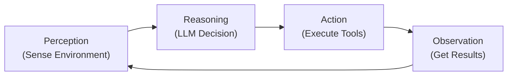
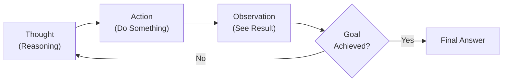
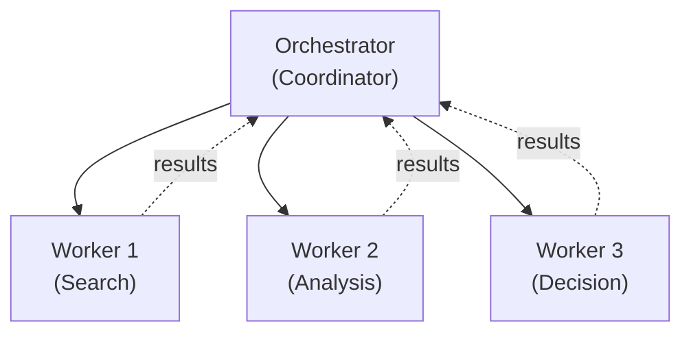
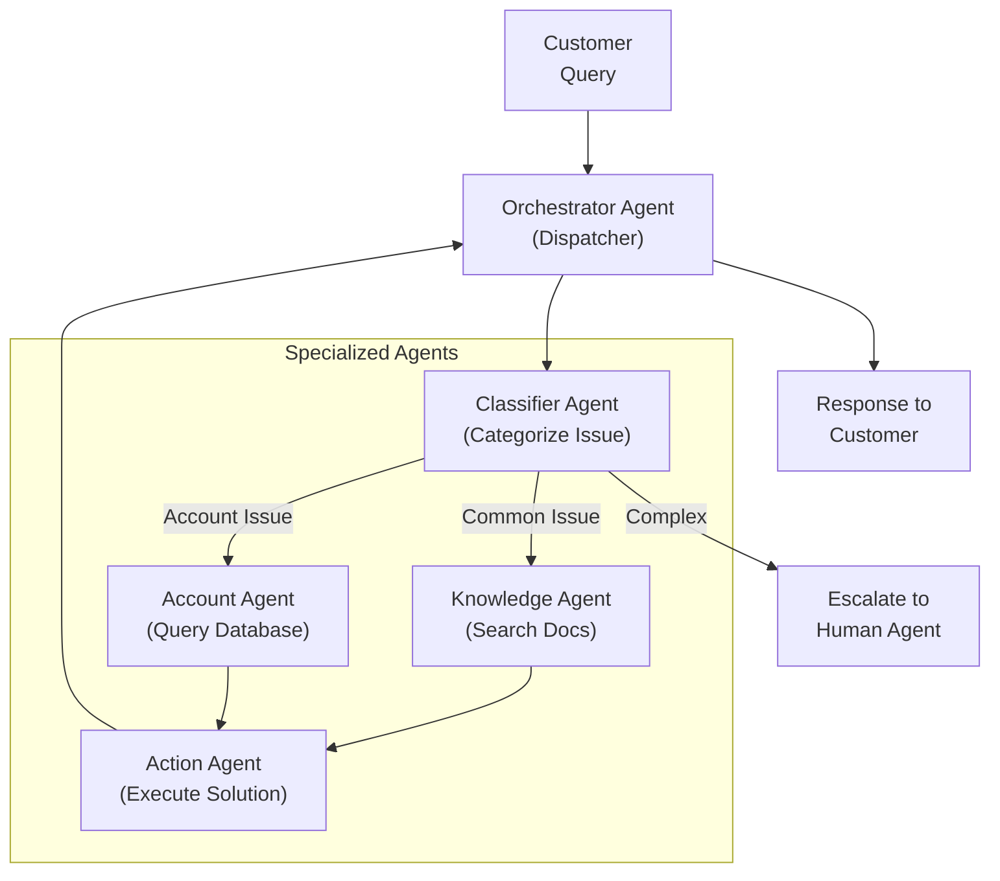

# Agentic AI Interview Questions & Answers

## Table of Contents
1. [What is Agentic AI?](#1-what-is-agentic-ai)
2. [Agent vs Traditional AI](#2-agent-vs-traditional-ai)
3. [ReAct Framework](#3-react-framework)
4. [Tools & Memory](#4-tools--memory)
5. [Multi-Agent Systems](#5-multi-agent-systems)
6. [Real-World Use Cases](#6-real-world-use-cases)
7. [Frameworks (LangChain, LangGraph, CrewAI, AutoGen)](#7-frameworks)
8. [Interview Tips](#8-interview-tips)

---

# 1. What is Agentic AI?

## Q1: What is Agentic AI? Explain with an analogy.

**Answer:**

Agentic AI refers to AI systems that can autonomously perceive their environment, make decisions, take actions, and adapt based on feedback to achieve specific goals.

**3 Key Superpowers:**

1. **Autonomy** - Acts independently without explicit instructions for every step
   - Traditional AI systems require step-by-step instructions for every action. They cannot make decisions on their own. In contrast, Agentic AI systems can observe a situation, understand the context, and decide what needs to be done without waiting for external commands. This independence is crucial for systems that need to operate in dynamic environments where pre-planning isn't feasible.
   
2. **Adaptability** - Learns from results and adjusts strategy
   - As an agent executes tasks and receives feedback, it doesn't just move forward with a fixed plan. Instead, it evaluates the outcomes, recognizes what worked and what didn't, and adjusts its approach accordingly. This learning loop enables agents to handle unexpected situations gracefully and improve their performance over time. For example, if a preferred tool fails, the agent should automatically try an alternative approach.
   
3. **Goal-Orientation** - Focuses on achieving objectives, not just responding
   - While traditional AI systems respond to queries and produce outputs, Agentic AI systems maintain focus on a specific goal and work persistently toward it. They understand that there might be multiple steps, setbacks, or requirements along the way, and they keep working until the goal is achieved. This is the difference between answering a question and solving a problem.

**Personal Assistant Analogy:**

**Traditional AI** - A personal assistant who only follows exact instructions:
- You say: "Book me a flight to NYC on Friday"
- AI responds: "I need specific departure time, airline preference, budget..."
- The assistant cannot take initiative or use context. It needs every single detail spelled out. It's like hiring someone who has zero judgment and must be told exactly what to do at every step. This works for simple, well-defined tasks, but breaks down in real-world scenarios where context matters.

**Agentic AI** - A smart personal assistant who understands your context and takes initiative:
- You say: "Book me a flight to NYC on Friday"
- The agent springs into action with intelligence:
  - Checks your calendar to understand what "Friday" means (this Friday? next Friday?)
  - Realizes you're free Friday afternoon based on meetings
  - Looks at your past booking history to understand your budget preferences
  - Checks weather in NYC to see if there are any travel disruptions
  - Searches for flights that match your typical preferences
  - Autonomously books the best option that matches your profile
  - Sends you a confirmation with helpful context (weather, traffic from airport, hotel suggestions)
  
The key difference is that the Agentic AI gathers context, makes intelligent decisions, takes action, and adapts all without you needing to give detailed step-by-step instructions. It acts more like a seasoned executive assistant rather than a robot following orders.

---

## Q2: What are the key differences between Agentic AI and LLM-only systems?

**Answer:**

| Aspect | LLM-Only | Agentic AI |
|--------|----------|-----------|
| **Decision Making** | Based on prompt only | Based on environment + tools |
| **Iteration** | Single response | Multiple steps with feedback |
| **Tool Use** | Cannot use external tools | Uses tools actively |
| **Memory** | Context window only | Persistent memory |
| **Error Handling** | Stops on error | Retries/adapts strategy |
| **Real-world Tasks** | Limited | Complex, multi-step |

**Example:**
```
Question: "What's the latest stock price of Apple?"

LLM-Only:
→ "Apple's stock was $150 as of my training data cutoff"

Agentic AI:
→ Identifies need for real-time data
→ Uses finance API tool to fetch current price
→ Returns: "Apple is currently trading at $172.50"
```

---

## Q3: What are the core components of an Agentic AI system?

**Answer:**



**4 Core Components:**

1. **Perception** - Understand current state\n   Perception is how an agent gathers information about its environment and the problem at hand. This isn't just passive listening—it's actively collecting the right data. An agent must understand what information is available, what's relevant to the current task, and what context might be important. For example, if a user asks \"Book me a flight,\" the perception phase identifies that we need to know: departure city, destination, date, budget, and preferences. Without good perception, an agent would miss critical information and make poor decisions.

2. **Reasoning** - Process information and make decisions using LLM\n   Once the agent perceives the situation, it needs to think through the best course of action. This is where the LLM comes in—it analyzes the gathered information, considers multiple options, and decides what to do next. Reasoning is about not just reacting, but actually thinking through the problem. The LLM might think \"I have the flight requirements, but I need real-time pricing. I should call the flight search API. I also need to consider the user's budget constraint, so I should filter options accordingly.\" This thoughtful process is what makes Agentic AI different from just running predetermined scripts.

3. **Action** - Execute decisions and interact with tools\n   Reasoning is useless without action. Once the agent decides what to do, it needs to actually do it—whether that's calling an API, querying a database, sending an email, or executing code. Actions are how agents interact with the outside world. If the agent decides \"I need current flight prices,\" it must actually call the airline API. If it decides \"I need to check the user's budget,\" it must query the user database. These actions produce real results that feed back into the system.

4. **Observation** - Analyze results and update understanding\n   After each action, the agent observes the results. Did the API call succeed? Did the database query return data? Is the returned data what we expected? Observation is the critical feedback loop. If a flight search API returned no results, the agent should observe this and adjust—maybe try different dates, or notify the user that no flights are available. Observation closes the loop and creates continuous improvement. The agent learns what works, what doesn't, and updates its mental model accordingly.

---

# 2. Agent vs Traditional AI

## Q4: Explain the difference between Stateless and Stateful AI with an example.

**Answer:**

### Stateless AI (Traditional)
- No memory between requests
- Each query treated independently
- Like a calculator

```python
# Stateless Example
response = llm.invoke("What is 2 + 2?")
# Answer: 4

response = llm.invoke("What is the sum of those numbers?")
# Answer: I don't know, you didn't tell me what "those" refers to
```

### Stateful AI (Agentic)
- Maintains conversation history and context
- Learns from previous interactions
- Like an accountant keeping records

```python
# Stateful Example
messages = []

# First query
response1 = llm.invoke([{"role": "user", "content": "Calculate 2 + 2"}])
messages.append({"role": "user", "content": "Calculate 2 + 2"})
messages.append({"role": "assistant", "content": "4"})

# Second query (context preserved)
response2 = llm.invoke(messages + [{"role": "user", "content": "What is the sum of those numbers?"}])
# Answer: The sum is 4 (remembers previous context)
```

**Key Difference Table:**

| Feature | Stateless | Stateful |
|---------|-----------|----------|
| **Memory** | No | Yes |
| **Context** | Lost after each call | Preserved |
| **Use Case** | Single queries | Conversations |
| **Cost** | Lower tokens | Higher tokens |
| **Complexity** | Simple | Complex |

---

## Q5: What's the difference between a calculator and an accountant? How does this relate to AI agents?

**Answer:**

### Calculator (Stateless AI)
```
Input: "What is 50 - 10?"
Output: 40
Input: "What is the result minus 5?"
Output: ??? (Doesn't know previous result)
```

### Accountant (Stateful/Agentic AI)
```
Transaction 1: Deposit $100
Transaction 2: Withdraw $30
Query: "How much do I have?"
Response: $70 (Remembers all transactions, considers context)

Can also:
- Project future balances
- Identify spending patterns
- Suggest optimizations
- Adapt to changing rules
```

**AI Perspective:**
- **Calculator AI** = Responds to prompts only
- **Accountant AI** = Maintains state, learns patterns, makes proactive decisions

---

# 3. ReAct Framework

## Q6: Explain the ReAct Framework. What does ReAct stand for?

**Answer:**

**ReAct = Reasoning + Acting**

A framework that improves LLM decision-making by breaking tasks into three parts: Thought → Action → Observation



---

## Q7: Walk through a ReAct example like Sherlock Holmes solving a mystery.

**Answer:**

**Problem:** "Who stole the jewels from the museum?"

### Sherlock's ReAct Process:

**Iteration 1:**
```
Thought: I need to examine the crime scene first.
         What evidence is available?

Action: Visit the museum and examine the safe.
        Check for fingerprints, tool marks.

Observation: Found tool marks on the safe.
             Guard reported 2 people at night.
             Security camera shows masked figure at 2:30 AM.
```

**Iteration 2:**
```
Thought: Tool marks suggest professional thief.
         Multiple people involved indicates inside job.
         Need to check employee records.

Action: Interview guards.
        Check employee timesheets.
        Review past criminal records.

Observation: Guard #3 (John) called in sick that night.
             John has prior locksmith experience.
             Found John's name in theft database.
```

**Iteration 3:**
```
Thought: John is the primary suspect.
         But need to confirm he worked with accomplice.
         Need motive - check financial records.

Action: Check John's bank transactions.
        Identify who else was seen on camera.

Observation: John received $50K payment the day after theft.
             Camera shows accomplice was John's brother.
```

**Final Answer:**
John and his brother stole the jewels for $50K payment.

---

## Q8: How does ReAct improve accuracy compared to direct LLM responses?

**Answer:**

### Without ReAct (Direct Answer):
```
Query: "What's the average salary in tech in 2024?"
LLM: "$120,000" (Based on training data, potentially outdated)
Problem: No verification, could be wrong
```

### With ReAct:
```
Thought: Need current 2024 data. Training data is outdated.
         Should search for recent reports.

Action: Use web search tool to find 2024 tech salary surveys.
        Query: "average tech salary 2024"

Observation: Found Bureau of Labor Statistics report.
             Shows median: $135,000
             San Francisco: $180,000
             New York: $165,000
             Midwest: $105,000

Final Answer: Average tech salary in 2024 is $135,000 nationally,
              but varies by location ($105K-$180K range).
```

**Benefits of ReAct:**
1. ✅ Uses latest data (tools)
2. ✅ Shows reasoning steps
3. ✅ More verifiable/transparent
4. ✅ Handles complex problems
5. ✅ Can correct mistakes mid-process

---

# 4. Tools & Memory

## Q9: What are tools in the context of Agentic AI? List 6 common tools.

**Answer:**

**Tools** are functions/APIs that AI agents can call to interact with the outside world. Think of tools as the agent's hands and eyes—without tools, the agent can only think but can't act. An LLM is powerful at reasoning, but it's limited by its training data and can't interact with live systems. Tools bridge this gap by giving agents the ability to access real-time information, perform precise operations, and interact with external systems. Without tools, an agent would be like a brilliant consultant who can only offer advice but can't execute anything.

**6 Common Tools:**

1. **Web Search** - Access real-time, current information\n   Most LLMs have a knowledge cutoff date (e.g., April 2024). When users ask about current events, latest prices, or recent news, the LLM's training data is outdated. Web search tools solve this by letting agents search the internet for fresh information. For example, if a user asks \"What's Apple's stock price today?\" the agent can't rely on training data—it must search for live prices from financial APIs.
   ```python
   result = search_tool("Apple stock price 2024")
   # Returns current price, not training data
   ```

2. **Calculator/Math** - Precise numerical computations\n   While LLMs can do basic math, they're surprisingly prone to errors in complex calculations, especially with large numbers. Tools that provide exact mathematical computation ensure accuracy. A calculator tool handles sqrt, trigonometry, statistical operations, and complex arithmetic that would be error-prone if left to the LLM's reasoning alone.
   ```python
   result = calculator("sqrt(16) * 3 + 5")
   # Returns exactly 17, not an approximation
   ```

3. **Database Query** - Retrieve structured data from systems\n   Most businesses have critical data in databases (customer records, inventory, financial data). An LLM can't directly query databases, so this tool lets agents fetch specific information. For instance, a customer support agent needs to query \"Get order history for customer X\" to provide accurate support.
   ```python
   result = db_query("SELECT * FROM users WHERE age > 18")
   # Returns actual database records
   ```

4. **API Calls** - Integrate with external services\n   Modern business runs on APIs (Weather, Maps, Stripe payments, etc.). API tools let agents interact with these services. A travel planning agent might call weather APIs, hotel booking APIs, flight APIs, and currency conversion APIs in sequence to plan a complete trip.
   ```python
   result = weather_api("New York")
   # Returns actual weather data, not prediction
   ```

5. **File Operations** - Read and process local documents\n   Agents often need to read files (PDFs, Excel sheets, documents) to access information that's stored locally. File tools enable agents to process documents, extract information, and make decisions based on file content. For example, an HR agent might read a PDF resume to extract candidate information.
   ```python
   result = read_file("document.pdf")
   # Reads and parses file content
   ```

6. **Send Email/Notifications** - Communicate actions to users and systems\n   Sometimes the agent's decisions need to be communicated to external parties. Email tools let agents send confirmations, alerts, or summaries to users. An HR system might email a job candidate about their interview schedule, or a financial system might email a user about a transaction alert. This closes the loop between decision-making and real-world communication.
   ```python
   result = send_email(to="user@email.com", subject="Update")
   # Actually sends email, agent doesn't just think about it
   ```

---

## Q10: Explain the 3 types of memory in Agentic AI systems.

**Answer:**

### 1. Short-Term Memory (Working Memory)

**What it is:** The conversation context currently in active use—like your mental workspace during a conversation.

- **Duration:** Only the current session. Once the conversation ends, this memory is cleared (unless explicitly saved).
- **Capacity:** Limited by the LLM's context window (typically 4K-128K tokens depending on model)
- **Use:** Maintaining the active conversation flow, understanding current context
- **Speed:** Extremely fast because it's in RAM
- **Example:** In a chat, the system remembers that you said your name is "Alice" so it can respond "Nice to meet you, Alice" in the next turn.

Short-term memory is essential for natural conversation, but it's volatile. If your session ends, all this memory vanishes. This is why you sometimes see ChatGPT forget things when you start a new conversation thread. It's like the difference between talking to someone face-to-face (they remember your context for that conversation) versus emailing them (each email is somewhat isolated unless you provide context).

```python
messages = [
    {"role": "user", "content": "My name is Alice"},
    {"role": "assistant", "content": "Nice to meet you, Alice"},
    {"role": "user", "content": "What's my name?"},
    {"role": "assistant", "content": "Your name is Alice"}
]
# Works because messages are in context
# If you close this conversation and start fresh, it forgets
```

### 2. Long-Term Memory (Episodic Memory)

**What it is:** Persistent memory that survives across sessions—like a personal journal or database of your interactions.

- **Duration:** Persistent across sessions and days/weeks/months
- **Capacity:** Can store gigabytes of data (much larger than context window)
- **Use:** Remember past interactions, build user profiles, track history
- **Storage:** Saved in databases or files (not in RAM)
- **Speed:** Slower than short-term (requires database queries)
- **Example:** A support chatbot remembers your past issues from months ago when you return.

Long-term memory creates continuity in relationships with the user. When a user returns after a week, the system can say "Welcome back! I see you previously had an issue with your WiFi—did we resolve that?" This personal continuity is what makes systems feel intelligent rather than starting fresh every time. Think of long-term memory as a CRM system for AI—it maintains a profile of each user with their history, preferences, and past interactions.

```python
# User comes back after 1 week
previous_messages = db.get_user_messages(user_id)
# Retrieves all past conversations for this user
current_context = f"User history: {previous_messages}"
# Use history to inform current conversation
```

### 3. Semantic Memory (Knowledge Base / Vector DB)

**What it is:** General knowledge and facts about the domain—like an encyclopedia or knowledge base.

- **Duration:** Permanent, not specific to any one user
- **Capacity:** Can be extremely large (terabytes for large companies)
- **Use:** Store company docs, FAQs, product info, general knowledge
- **Storage:** Vector Database (stores meaning, not just keywords)
- **Speed:** Moderate (requires similarity search across embeddings)
- **Example:** All your company's product documentation, policies, FAQs stored so any agent can access them.

Semantic memory is what makes an AI system knowledgeable about a domain. Without semantic memory, every agent would only know what was in its training data. With semantic memory (especially a good vector database), an agent can instantly access any relevant company document or knowledge base article when needed. A vector database is crucial here because it searches by meaning, not keywords. If a customer asks "How do I reset my password?" the system can find answers to "Password recovery" or "Account access troubleshooting" even if those exact words weren't used.

```python
# User asks about product features
query = "What features does our product have?"
results = vector_db.search(query, top_k=5)
# Returns most relevant product documentation
# Vector DB finds semantic similarity, not just keyword matches
```

**Memory Comparison Table:**

| Type | Duration | Capacity | Speed | Use Case |
|------|----------|----------|-------|----------|
| **Short-term** | Minutes | ~4K tokens | Fast | Current chat |
| **Long-term** | Weeks/Months | GB | Medium | Past context |
| **Semantic** | Permanent | TB | Slow | Knowledge |

---

## Q11: What is a Vector Database and why is it important for AI agents?

**Answer:**

### What is a Vector Database?

A vector database is a specialized database that stores and retrieves data based on semantic similarity (meaning) rather than exact keyword matches. It's a fundamental technology that enables AI systems to understand context and find relevant information intelligently.

Traditional databases (like SQL) work with exact matches—you search for "apple" and get results containing exactly "apple," missing results with "fruit", "produce", or related terms. Vector databases work with semantic meaning—you search for a concept and get anything semantically related, even if different words are used. This is the key difference that makes modern AI systems feel intelligent.

### How It Works (Three Phases):

**Phase 1: Embedding** (Convert meaning to numbers)\n
Every text is converted to a numerical vector that captures its semantic meaning. This is like creating a fingerprint of meaning. Two documents about similar topics will have similar vectors, even if they use completely different words.

```
"How do I reset my password?" → [0.234, -0.891, 0.456, ..., 0.123]
"I forgot my account login info" → [0.245, -0.879, 0.468, ..., 0.129]

These vectors are very similar because the meanings are similar!
```

**Phase 2: Storage** (Save vectors with metadata)\n
Vectors are stored in a database indexed for fast retrieval. Each vector is linked back to the original document so the system can return the source when needed.

**Phase 3: Retrieval** (Find similar vectors)\n
When a new query comes in, it's also converted to a vector. The database then finds all stored vectors that are "close" to this query vector, returning documents that are semantically similar.

```
Customer question: "How do I fix my WiFi connection?"
↓
Convert to vector representation
↓
Find similar vectors in database
↓
Return associated documents ranked by similarity
```

### Why It's Essential for AI Agents:

**Scenario 1: Without Vector DB (Keyword Search)**
```
Customer: "My app keeps crashing"
Search: Look for exact phrase "app crashes"
Result: Maybe 1-2 exact matches
Miss: "Application stability issues", "Memory errors", "Performance problems"
Outcome: Customer doesn't find the help they need
```

**Scenario 2: With Vector DB (Semantic Search)**
```
Customer: "My app keeps crashing"  
Search: Find semantically similar content
Found:
1. "App crashes troubleshooting" (0.96 similarity)
2. "Common app errors" (0.91 similarity)  
3. "Memory issues" (0.88 similarity)
4. "Application stability" (0.85 similarity)
Outcome: Customer gets multiple relevant solutions instantly
```

The difference between a system that helps 30% of customers and one that helps 90% often comes down to vector database implementation. This is why every modern AI customer support system, research assistant, and recommendation engine uses semantic search underneath.

### Real-World Application Example:

Imagine a bank with 50,000 compliance documents. A customer asks: "What's the process for adding a beneficiary to my account?" A keyword-only system might find 0 relevant documents because none use the exact phrase "add beneficiary." But a vector database would find:
- "Beneficiary Management Guide" (0.98 similarity)
- "Account Modifications and Changes" (0.89 similarity)
- "Adding authorized persons" (0.86 similarity)
- "Account holder privileges" (0.82 similarity)

The agent can answer confidently with accurate information from the knowledge base.

### Common Vector Database Solutions:
- **Pinecone** - Fully managed cloud service, easiest to set up, best for quick prototypes
- **Weaviate** - Open-source, powerful filtering, good for enterprises
- **Milvus** - High-performance, self-hosted option for large-scale deployments
- **Chroma** - Lightweight, perfect for learning and small projects
- **Qdrant** - Fast Russian-made option, focused on performance and filtering capabilities

---

# 5. Multi-Agent Systems

## Q12: What is a Multi-Agent System? How do agents communicate?

**Answer:**

### What are Multi-Agent Systems?

A **Multi-Agent System** is multiple AI agents working together to solve complex problems, each with specialized roles. The key insight is that complex problems are often better solved by teams than by single agents. Just like a company has specialists (HR, Finance, Engineering), a multi-agent system divides work across specialized agents.

Why use multiple agents instead of one big agent?
- **Specialization**: Each agent becomes an expert at one thing (searching, analyzing, deciding)
- **Scalability**: You can process multiple tasks in parallel instead of sequentially
- **Maintainability**: Easier to fix or update one agent's behavior
- **Error Recovery**: If one agent fails, others can compensate or retry
- **Transparency**: Each agent's contribution is clear and auditable



### Communication Patterns:

**1. Direct Communication** (Agent-to-Agent)\n
Agents talk directly to each other. This is simpler for small teams but can become chaotic as the system grows. Imagine a company where every person talks to every other person—lots of noise, lots of missed messages.

```
Agent A → [Request] → Agent B
Agent B → [Response] → Agent A
Pros: Simple, fast
Cons: Hard to scale, confusing with many agents
```

**2. Message Queue** (Asynchronous)\n
Agents don't talk directly. Instead, they put messages in a shared queue. Other agents read from the queue when they're ready. This is like an email system where messages are stored until read. Useful for high-volume, asynchronous work.

```
Agent A → [Message Queue] ← Agent B
           ↓
        Agent C reads from queue
Pros: Decoupled, can handle volume
Cons: Harder to coordinate, messages might get lost
```

**3. Orchestrator Pattern** (Most Common) - Centralized Coordination\n
One master agent (the Orchestrator) directs all communication. Workers don't talk to each other—they talk only to the Orchestrator. This is like a conductor coordinating an orchestra. The conductor decides who plays when.

```
Orchestrator: Central decision maker
      ↓
    [Broadcasts task]
      ↓
Workers: Execute and report back
This is the most scalable and maintainable approach
```

---

## Q13: Explain Orchestrator, Workers, and CrewAI.

**Answer:**

### The Orchestrator Pattern

The Orchestrator pattern is the most effective way to structure multi-agent systems. It follows the principle of divide-and-conquer with centralized coordination.

**Orchestrator (The Manager):**
- Acts as the central decision-maker and coordinator
- Decides which worker should do what task
- Receives results from all workers
- Combines results into a final solution
- Handles task sequencing and dependencies
- Can retry or escalate if a worker fails

Think of the Orchestrator as a project manager. The PM doesn't do all the work—the PM delegates to specialists, coordinates their efforts, and synthesizes their contributions into a final deliverable.

**Workers (The Specialists):**
- Each handles a specific domain or capability
- Execute assigned tasks without worrying about the big picture
- Report results back to the Orchestrator
- Can be specialized with different models or expertise
- Often can work in parallel (if tasks don't depend on each other)

Workers are like team members—a researcher focuses on research, an analyst focuses on analysis. Each is expert in their domain and doesn't need to think about work outside their scope.

### Concrete Example: Research Paper Analysis

Let's say you want to analyze a complex research paper. A single agent could do it, but it would need to be good at everything. A better approach:

```
1. Orchestrator receives: "Analyze this paper on quantum computing"
   ↓
2. Orchestrator dispatches tasks to specialists:
   
   ├─ Researcher Agent: "Extract key findings and methodology"
   │  └─ Uses search tools, reads thoroughly
   │  └─ Returns: "Main findings are X, methodology is Y"
   │
   ├─ Methodology Analyst: "Verify the methodology is sound"
   │  └─ Uses domain knowledge, checks for errors
   │  └─ Returns: "Methodology is valid BUT missing statistical power"
   │
   ├─ Summarizer Agent: "Create a 1-page executive summary"
   │  └─ Takes input from above agents
   │  └─ Returns: "Executive summary..."
   │
   └─ Critic Agent: "Identify limitations and future work"
      └─ Uses critical thinking tools
      └─ Returns: "Limitations: small sample size, needs replication"

3. Orchestrator receives all results and synthesizes:
   → Final comprehensive analysis document
```

This is much better than one agent trying to do everything, because each agent can be optimized for its specific task, agents can work in parallel for speed, results are more thorough due to specialization, and it's easy to add/remove agents for different analyses.

### CrewAI Framework

**What is CrewAI?**

CrewAI is an open-source Python framework that makes building multi-agent systems easy. It abstracts away the complexity of orchestration and lets you focus on defining agents and tasks.

**Key Concepts:**

- **Crew:** The team of agents working together (like your company)
- **Agent:** Individual team member with a specific role and goal (e.g., "Senior Researcher")
- **Task:** A specific piece of work assigned to an agent
- **Tool:** Functions the agent can call (search, calculate, query databases, etc.)

**CrewAI Code Example:**
```python
from crewai import Agent, Task, Crew

# Define specialized agents
researcher = Agent(
    role="Senior Researcher",
    goal="Find and summarize the latest information",
    tools=[search_tool, web_scraper_tool]
)

analyzer = Agent(
    role="Data Analyst",
    goal="Analyze data and extract insights",
    tools=[calculator_tool, database_tool]
)

writer = Agent(
    role="Content Writer",
    goal="Write clear, engaging reports",
    tools=[document_tool]
)

# Define tasks
research_task = Task(
    description="Research AI in healthcare",
    agent=researcher
)

analysis_task = Task(
    description="Analyze research findings",
    agent=analyzer
)

writing_task = Task(
    description="Write comprehensive report",
    agent=writer
)

# Create crew and run (automatically orchestrates)
crew = Crew(
    agents=[researcher, analyzer, writer],
    tasks=[research_task, analysis_task, writing_task]
)

result = crew.kickoff()  # Runs orchestration automatically
```

**Why CrewAI Works Well:**
- Handles orchestration automatically so you don't have to
- Tasks run in the correct sequence
- One agent's output becomes another's input
- Built-in memory and context management
- Perfect for complex workflows
- Easy to extend with new agents or tasks

**CrewAI Example:**
```python
from crewai import Agent, Task, Crew

# Define agents
researcher = Agent(
    role="Researcher",
    goal="Find latest information",
    tools=[search_tool, web_tool]
)

analyzer = Agent(
    role="Data Analyst",
    goal="Analyze findings",
    tools=[calculator, db_tool]
)

# Define tasks
research_task = Task(
    description="Research latest AI trends",
    agent=researcher
)

analysis_task = Task(
    description="Analyze the research data",
    agent=analyzer
)

# Create crew
crew = Crew(
    agents=[researcher, analyzer],
    tasks=[research_task, analysis_task]
)

result = crew.kickoff()
```

**Benefits of Multi-Agent Systems:**
- ✅ Divide complex problems
- ✅ Specialize expertise
- ✅ Parallel processing
- ✅ Better accuracy
- ✅ Easier debugging

---

# 6. Real-World Use Cases

## Q14: Describe 5 real-world industries using Agentic AI.

**Answer:**

Agentic AI is transforming industries by enabling autonomous systems that can handle complex, multi-step processes without human intervention for every decision. The key is that these systems observe environments, make decisions, execute actions, and adapt based on outcomes. Here's how leading industries are applying this:

### 1. **Finance & Banking** - Automated Decision-Making at Scale

**The Challenge:** Financial institutions manage trillions of dollars. Manual decision-making doesn't scale. Markets move in milliseconds. Fraud patterns evolve constantly. Regulations change frequently. You need systems that can respond faster than humans and analyze more data than any person could.

**Agentic Solution:**
An autonomous financial agent continuously monitors the environment and makes decisions:
- **Monitoring Phase:** Real-time stock prices, customer transactions, regulatory announcements, risk indicators
- **Analysis Phase:** The LLM evaluates patterns. Is this transaction fraudulent? Is this portfolio over-weighted in tech? Did regulations change?
- **Action Phase:** Execute automatically - buy/sell securities, flag suspicious accounts, generate compliance reports, alert human advisors
- **Learning Phase:** Track outcomes. Did this trade succeed? Did fraud detection work? Improve for next time.

**Real Example:** A robo-advisor (automated investment agent) manages $100B by continuously rebalancing portfolios based on market conditions. No humans needed for daily decisions.

---

### 2. **Healthcare** - Diagnosis and Treatment Support

**The Challenge:** Doctors have limited time. Medical knowledge grows exponentially (thousands of new research papers weekly). Diagnosis requires integrating patient history, lab results, imaging data, drug interactions, and current medical literature. A single doctor can't keep up with all this information.

**Agentic Solution:**
A diagnostic agent augments a doctor's capability:
- **Perception:** Gathers patient history, current symptoms, recent lab work, family history
- **Reasoning:** Queries medical knowledge bases, checks latest research, identifies possible diagnoses
- **Verification:** Suggests drug interactions to check, recommends additional tests
- **Action:** Schedules follow-ups, alerts specialists if needed, documents everything

**Real Example:** A diagnostic agent in a hospital helped identify a rare autoimmune disease by connecting symptom patterns from the medical literature that the attending doctor had missed, leading to correct treatment and recovery.

---

### 3. **E-commerce** - Personalized Shopping Automation

**The Challenge:** E-commerce platforms serve millions of customers. Each has different needs, preferences, and budgets. Managing inventory, recommendations, and customer support at scale requires intelligent automation.

**Agentic Solution:**
A shopping assistant agent handles end-to-end customer interactions:
- **Understanding:** Interprets what the customer actually wants (not just what they typed)
- **Search & Discovery:** Checks real-time inventory, compares prices, finds alternatives in stock
- **Personalization:** Recommends products based on past behavior and current needs
- **Transaction:** Processes orders, applies optimal pricing/discounts, ensures payment security
- **Tracking:** Monitors shipment, handles exceptions (delays, damages), manages returns

**Real Example:** Amazon's recommendation engine is essentially a multi-agent system that increased their retail sales by 30% through personalized suggestions. Without agents, recommendations would be generic and miss sales opportunities.

---

### 4. **Software Development** - Autonomous Code Quality

**The Challenge:** Code review is time-consuming and error-prone. Developers need feedback on PRs within hours, not days. Testing coverage must be comprehensive. Documentation must stay current. This creates bottlenecks in development velocity.

**Agentic Solution:**
A code review agent works autonomously:
- **Analysis:** Reviews pull requests, checks code quality, identifies potential bugs
- **Testing:** Runs test suites, checks code coverage, identifies gaps
- **Research:** Searches codebase for similar patterns, checks for breaking changes
- **Suggestions:** Proposes refactorings, documents reasoning, ranks issues by severity
- **Enforcement:** Blocks merges if security issues found, requires fixes before approval

**Real Example:** GitHub Copilot and similar systems already help developers write code faster. Agents go further—they review code, suggest optimizations, and catch bugs before they reach production.

---

### 5. **Human Resources** - Recruitment and Compliance Automation

**The Challenge:** HR departments are flooded with resumes, policy questions, and administrative tasks. A recruiter can screen maybe 50 resumes per day. Hundreds of employees have similar questions about benefits and leave policies. Compliance violations are costly.

**Agentic Solution:**
An HR agent handles routine processes autonomously:
- **Screening:** Analyzes resumes against job requirements, predicts candidate fit, ranks candidates
- **Communication:** Answers employee questions about policies, benefits, leave entitlements
- **Compliance:** Tracks regulatory requirements, flags compliance risks, suggests mitigations
- **Scheduling:** Coordinates interview schedules, sends reminders, collects feedback
- **Onboarding:** Creates checklists, assigns training, tracks progress

**Real Example:** Large tech companies using HR agents reduced time-to-hire from 45 days to 20 days, and reduced policy-related support tickets by 60%. The agents free human HR managers to focus on strategic work instead of repetitive tasks.

## Q15: Design an Agentic AI system for a real-world problem.

**Answer:**

Let me walk through designing a complete customer support system using Agentic AI principles. This is a great interview example because it shows architectural thinking, tool selection, and multi-agent coordination.

### The Problem We're Solving

**Current State:** Manual customer support is expensive and slow
- Customers wait hours for responses
- Support agents spend time on repetitive questions
- Inconsistent answers depending on which agent responds
- Many issues could be resolved automatically (account resets, policy questions, status checks)

**Goal:** Build an autonomous system that handles 80% of customer issues without human intervention

### System Architecture



### Detailed Step-by-Step Process

**Step 1: Customer Issue Received**
```
Customer: "I can't log into my account. I've tried 5 times and now it's locked."
```

The Orchestrator agent receives this query. It's the central coordinator that will decide how to handle this.

**Step 2: Classification** (What kind of issue is this?)

The Classifier Agent analyzes the customer's message:
- **Input:** The customer's complaint
- **Process:** The LLM categorizes based on keywords and context
- **Reasoning:** 
  - Keyword "can't login" → Category: Authentication
  - Phrase "locked" → Subcategory: Account Locked
  - Severity: High (customer is frustrated)
  - Confidence: 95%
- **Output:** `{category: "Authentication", subcategory: "Account Locked", severity: "high"}`

This classification is crucial because it routes the issue to the right agents and determines the response path.

**Step 3: Parallel Information Gathering**

Now the Orchestrator dispatches multiple agents in parallel:

**3A. Knowledge Search Agent:**
```
Task: "Find troubleshooting steps for locked accounts"

Process:
1. Convert to vector: "How to unlock account after failed login attempts"
2. Search vector DB for similar documents
3. Find top 3 matching knowledge articles:
   - "Account Locked: Why and What to Do" (0.98 similarity)
   - "Password Reset Process" (0.92 similarity)
   - "Account Security Overview" (0.87 similarity)

Result: Returns best matching help articles with step-by-step solutions
```

Why parallel? The next agent also needs information at the same time. If we wait sequentially, response time doubles.

**3B. Account Status Agent:**
```
Task: "Check account status for this customer"

Process:
1. Query customer database: 
   SELECT * FROM customers WHERE email = 'user@email.com'
   
2. Check account_locks table:
   SELECT * FROM account_locks WHERE user_id = X ORDER BY created_at DESC
   
3. Analyze login_attempts table:
   SELECT * FROM login_attempts WHERE user_id = X AND created_at > NOW() - '1 hour'
   
Result: 
{
  account_status: "locked",
  lock_reason: "5 failed login attempts",
  locked_since: "2 minutes ago",
  unlock_available_at: "in 30 minutes",
  recent_attempts: 5,
  ip_addresses: ["192.168.1.1", "192.168.1.1", "192.168.1.1", "192.168.1.1", "192.168.1.1"]
}
```

All logins from the same IP → likely legitimate user, not a hacker. This affects our response.

**Step 4: Decision Making** (What should we do?)

The Orchestrator receives results and reasons:
```
Information Available:
- Knowledge base has step-by-step unlock guide
- Account is locked due to 5 failed attempts  
- All attempts from same IP (likely legitimate user)
- Account will auto-unlock in 30 minutes
- But customer is frustrated NOW

Decision Logic:
- Is it a security risk? No (same IP, likely password forgotten)
- Can we solve it automatically? Yes, we can send reset email
- Should we escalate? No, this is a common issue
- Action: Send password reset email + provide knowledge article

Decision: Take immediate action
```

**Step 5: Execute Action** (Do the solution)

The Action Agent executes:
```python
# Step 1: Send password reset email
send_password_reset_email(
    email="user@email.com",
    token=generate_secure_token(),
    expires_in="24 hours"
)

# Step 2: Log the incident for analytics
log_incident(
    user_id=X,
    issue_type="Account Locked",
    resolution="Automatic password reset sent",
    resolution_time="2 minutes",
    required_human_interaction=False
)

# Step 3: Optional: Clear one failed attempt to speed up unlock
# (Some systems do this for better UX)
clear_oldest_failed_attempt(user_id=X)
```

**Step 6: Respond to Customer**

Based on all the gathered information, generate a helpful response:
```
"Hi! I see your account is locked after failed login attempts. This is 
a security feature to protect your account.

✅ I've sent a password reset link to your email. Click it to reset 
   your password and regain access immediately.

❓ Here's the step-by-step guide: [Link to knowledge article]

⏱️ Your account will also automatically unlock in 30 minutes.

🔒 For security tips on strong passwords, see: [Link]

If you continue to have issues, reply with 'human' and I'll connect 
you with a support specialist."
```

### Tools Used by This System

| Tool | Agent | Purpose |
|------|-------|---------|
| **Vector Database** | Knowledge Agent | Search help articles by semantic similarity |
| **SQL Database** | Account Agent | Query customer and account data |
| **Email Service** | Action Agent | Send password reset links |
| **Logging Service** | Action Agent | Track what happened for future improvement |
| **NLP/Classification** | Classifier | Understand issue type and urgency |

### Why This Design Works

**For Customers:**
- 24/7 instant response (no waiting for human)
- Problem solved in 2 minutes vs typical 24-48 hours
- Personalized help (not generic responses)
- Option to escalate if needed

**For Support Team:**
- 80% of issues handled automatically
- Humans only handle complex/unique issues
- Better job satisfaction (no more repetitive tickets)
- Time to focus on relationship-building, not tire-fire fighting

**For Business:**
- 60-80% cost reduction in support
- Higher customer satisfaction (faster resolution)
- Better data (you know exactly what issues occur)
- Competitive advantage

### Common Variations

**Variation 1:** If Knowledge Search fails (no matching articles), fallback to human escalation
**Variation 2:** If action fails (email service down), queue for retry and notify human
**Variation 3:** If customer responds aggressively, escalate to specialized empathy-trained agent
**Variation 4:** After resolution, send survey to rate satisfaction and improve next time

### Metrics to Track

- **Resolution Rate:** % of issues handled without human (target: 80%+)
- **Response Time:** Average time to first response (target: <2 min)
- **Customer Satisfaction:** CSAT score (target: >4.5/5)
- **Cost Per Ticket:** $ spent per resolved issue (target: reduction by 70%)
- **Escalation Rate:** % that need human intervention (target: <20%)

---

# 7. Frameworks

## Q16: Compare LangChain, LangGraph, CrewAI, and AutoGen.

**Answer:**

These four frameworks represent different levels of complexity and different philosophies for building AI applications. Choosing the right one is crucial for project success.

| Framework | Purpose | Best For | Complexity | Learning Curve |
|-----------|---------|----------|-----------|-----------------|
| **LangChain** | LLM orchestration | Simple chains, RAG pipelines | Low-Medium | Easy |
| **LangGraph** | State machine workflows | Complex multi-step processes | Medium-High | Steeper |
| **CrewAI** | Multi-agent teams | Collaborative problem solving | Medium | Medium |
| **AutoGen** | Autonomous agent conversations | Fully self-directed agents | Medium-High | Medium |

### Detailed Comparison:

### 1. **LangChain** - The Simplest Starting Point

**Philosophy:** "Let's make LLM building blocks easy to compose"

**What it does:** Provides pre-built components (Prompt Templates, LLMs, Output Parsers, Memory) that you chain together. Think of it as LEGO blocks for LLM applications.

**Real-World Analogy:** LangChain is like having a toolbox of carpentry tools. You have a hammer, nails, wood—you can build something simple like a shelf, but building a whole house requires more planning.

**Good For:**
- RAG (Retrieval-Augmented Generation) systems - "Question → Search → Answer"
- Simple chatbots with memory
- Prompt engineering and templating
- Multi-step workflows with clear linear flow

**Example:**
```python
from langchain_openai import ChatOpenAI
from langchain.prompts import ChatPromptTemplate
from langchain.schema import StrOutputParser

# LangChain makes this simple
llm = ChatOpenAI(model="gpt-4")
prompt = ChatPromptTemplate.from_template("Summarize: {text}")
chain = prompt | llm | StrOutputParser()
result = chain.invoke({"text": "Long article..."})
```

**Pros:** 
- ✅ Easy to learn
- ✅ Great documentation
- ✅ Perfect for prototypes
- ✅ Fast to get something working

**Cons:** 
- ❌ Limited for complex agent logic
- ❌ Doesn't handle complex state management
- ❌ Not designed for multi-agent systems
- ❌ Can get messy with lots of if/else branching

---

### 2. **LangGraph** - For Complex Logic

**Philosophy:** "State machines with memory and control flow"

**What it does:** Treats your agent as a state machine. You define nodes (states), edges (transitions), and conditions. The agent can loop, retry, and make complex decisions based on state.

**Real-World Analogy:** LangGraph is like a flowchart where you can go forward, backward, loop, or take different paths based on conditions. Perfect for handling complex business logic.

**Good For:**
- Complex decision trees and branching logic
- Multi-step processes with loops (retry logic)
- Agent loops (Thought → Action → Observation → repeat)
- Human-in-the-loop workflows
- Situations where you need fine-grained control

**Example:**
```python
from langgraph.graph import StateGraph

# Define your state
class AgentState:
    query: str
    thought: str
    action: str
    observation: str
    final_answer: str

# Build state machine
workflow = StateGraph(AgentState)

# Add nodes (functions that do something)
workflow.add_node("agent", agent_node)      # LLM makes decisions
workflow.add_node("tools", tools_node)      # Agents call tools
workflow.add_node("decide", decide_node)    # Should we continue?

# Add edges (when to go from one node to another)
workflow.add_edge("agent", "decide")
workflow.add_conditional_edge(
    "decide",
    should_continue,  # Function that returns next node
    {"continue": "tools", "end": "final"}
)
workflow.add_edge("tools", "agent")

# This creates a loop: agent → tools → agent → tools → ... → final
```

**Pros:**
- ✅ Precise control over logic
- ✅ Handles complex workflows
- ✅ Great for agent loops
- ✅ Excellent debugging (clear state at each step)

**Cons:**
- ❌ Steeper learning curve
- ❌ More boilerplate code
- ❌ Requires thinking in state machine terms
- ❌ Not as beginner-friendly as LangChain

---

### 3. **CrewAI** - For Team-Based Problems

**Philosophy:** "Let's make it easy to define teams of specialized agents"

**What it does:** Abstracts multi-agent systems into intuitive concepts: Crew (team), Agents (members), Tasks (work), Tools (capabilities). Each agent has a role, goal, and tools. Tasks are assigned to agents and run in sequence or parallel.

**Real-World Analogy:** CrewAI is like hiring a team of contractors. You specify each person's role ("electrician", "plumber", "carpenter"), what they should accomplish ("wire the house", "install pipes", "frame walls"), and what tools they can use. Then you assign them tasks and they execute.

**Good For:**
- Multi-agent systems with clear roles
- Collaborative problem solving
- Research teams that need to work together
- Content generation (researcher + writer + editor)
- Systems where agents have well-defined responsibilities

**Example:**
```python
from crewai import Agent, Task, Crew

# Create agents with roles
researcher = Agent(
    role="Senior Researcher",
    goal="Find accurate information",
    tools=[search_tool, web_scraper]
)

analyst = Agent(
    role="Data Analyst", 
    goal="Extract insights from data",
    tools=[sql_tool, statistics_tool]
)

# Create tasks assigned to agents
research_task = Task(
    description="Research market trends",
    agent=researcher,
    expected_output="Market analysis report"
)

analysis_task = Task(
    description="Analyze the research findings",
    agent=analyst,
    expected_output="Data-driven insights"
)

# Create crew and run
crew = Crew(
    agents=[researcher, analyst],
    tasks=[research_task, analysis_task]  # Runs sequentially
)

result = crew.kickoff()
```

**Pros:**
- ✅ Intuitive team metaphor
- ✅ Easy to define and manage multiple agents
- ✅ Great documentation for common use cases
- ✅ Handles task dependencies automatically

**Cons:**
- ❌ Less flexible than LangGraph
- ❌ Team-based paradigm might not fit all problems
- ❌ Harder to implement complex agent interactions
- ❌ Newer framework (less proven at scale)

---

### 4. **AutoGen** - For Fully Autonomous Systems

**Philosophy:** "Let agents talk to each other and solve problems autonomously"

**What it does:** Creates agents that can converse with each other and execute code. Agents can propose solutions, critique others, and iteratively solve complex problems through conversation.

**Real-World Analogy:** AutoGen is like having a brainstorm session with a team of experts. Each expert can propose ideas, others critique them, they argue back and forth, and eventually they reach a solution together.

**Good For:**
- Fully autonomous problem solving
- Code generation and execution
- Complex reasoning through agent discussion
- Systems where you don't know the exact steps upfront
- Creative problem solving

**Example:**
```python
import autogen

# Create assistant (like a programmer)
assistant = autogen.AssistantAgent(
    name="assistant",
    llm_config={"model": "gpt-4"}
)

# Create user proxy (like a project manager)
user_proxy = autogen.UserProxyAgent(
    name="user_proxy",
    human_input_mode="NEVER",  # Fully autonomous
    code_execution_config={"work_dir": "code"}
)

# They talk to solve the problem
user_proxy.initiate_chat(
    assistant,
    message="Write Python code to analyze stock prices"
)

# The assistant and user_proxy converse:
# Assistant: "I'll write code to fetch and analyze stock prices"
# User: "Good, run it"
# Assistant: "Code executed successfully. Results: ..."
```

**Pros:**
- ✅ Highly autonomous (minimal steering needed)
- ✅ Great for code generation and execution
- ✅ Novel approach to agent reasoning
- ✅ Powerful for complex problems

**Cons:**
- ❌ Harder to control and predict
- ❌ Can be verbose (lots of back-and-forth)
- ❌ Newer and less battle-tested
- ❌ Can get expensive (many LLM calls)

---

## Q17: When would you use each framework? Provide scenarios.

**Answer:**

This is one of the most important questions in your career because choosing the wrong framework wastes months of development. Let me give you a decision framework to help choose.

**Decision Tree:**
```
Does your problem require multiple agents working together?
├─ YES → Do you need fine-grained control over agent communication?
│        ├─ YES → Use LangGraph (control over every step)
│        └─ NO → Is it clearly a team structure (researcher, analyst, etc.)?
│                 ├─ YES → Use CrewAI (team-based, intuitive)
│                 └─ NO → Use AutoGen (fully autonomous agents talking)
│
└─ NO → Is it a simple linear workflow?
        ├─ YES → Use LangChain (RAG, chat, simple chains)
        └─ NO → Use LangGraph (complex single agent with loops)
```

### Scenario 1: Simple RAG Chatbot
**Use: LangChain**

**Why:** This is exactly what LangChain was designed for—simple, linear workflows.

```
User Question
    ↓
Search Vector DB for relevant documents
    ↓
Combine documents + question into prompt
    ↓
Send to LLM
    ↓
Parse response
    ↓
Return answer
```

**Code:**
```python
from langchain_openai import ChatOpenAI
from langchain.vectorstores import Chroma
from langchain.prompts import ChatPromptTemplate
from langchain.chains import RetrievalQA

# Simple pipeline
retriever = vector_db.as_retriever()
llm = ChatOpenAI(model="gpt-4")
qa = RetrievalQA.from_chain_type(llm=llm, retriever=retriever)
answer = qa.run("What is machine learning?")
```

**Why Not Others:**
- LangGraph: Overkill complexity for a simple pipeline
- CrewAI: Doesn't need multiple agents
- AutoGen: Way too heavy for a chatbot

---

### Scenario 2: Multi-Step Workflow with Retries and Loops
**Use: LangGraph**

**Why:** You need precise control over when to loop, retry, or branch.

```
1. Parse the question
2. Decide: Do I need to search?
   ├─ YES → Search and analyze
   │         Did I find answer? 
   │         ├─ YES → Go to step 4
   │         └─ NO → Try different search → Loop back to step 2
   └─ NO → Use my training knowledge
3. Synthesize answer
4. Format response
```

This requires state management and conditional logic that LangChain can't handle well, but LangGraph handles perfectly.

**Code:**
```python
from langgraph.graph import StateGraph, END
from typing import TypedDict

class State(TypedDict):
    question: str
    search_query: str
    search_results: list
    answer: str
    attempts: int

workflow = StateGraph(State)

def should_retry(state):
    # Return "retry" if we need to search again, "answer" if we have result
    return "retry" if len(state["search_results"]) == 0 else "answer"

workflow.add_node("parse", parse_question)
workflow.add_node("search", search_documents)
workflow.add_node("synthesize", synthesize_answer)

workflow.set_entry_point("parse")
workflow.add_edge("parse", "search")
workflow.add_conditional_edge("search", should_retry, {
    "retry": "search",    # Loop back
    "answer": "synthesize"
})
workflow.add_edge("synthesize", END)
```

**Why Not Others:**
- LangChain: Can't handle complex conditionals and loops cleanly
- CrewAI: This isn't a team problem, it's one agent with complex logic
- AutoGen: Overkill autonomous conversation for deterministic logic

---

### Scenario 3: Research Team Analysis
**Use: CrewAI**

**Why:** Clear team structure with specialized roles working in sequence.

**The Team:**
```
Research Team Analyzing a Business:

1. Researcher Agent
   - Role: Senior Researcher
   - Goal: Find latest information about the company
   - Tools: Web search, financial databases
   - Produces: Raw research findings

2. Analyst Agent  
   - Role: Financial Analyst
   - Goal: Extract insights from research
   - Tools: Calculator, financial models
   - Produces: Analysis and projections

3. Writer Agent
   - Role: Executive Writer
   - Goal: Create comprehensive report
   - Tools: Document tools
   - Input: From Researcher and Analyst
   - Produces: Final professional report
```

**Code:**
```python
from crewai import Agent, Task, Crew

researcher = Agent(
    role="Senior Industry Researcher",
    goal="Uncover latest market trends",
    tools=[google_search, financial_api],
    model="gpt-4"
)

analyst = Agent(
    role="Financial Analyst",
    goal="Provide actionable insights",
    tools=[calculator, valuation_model],
    model="gpt-4"
)

writer = Agent(
    role="Business Report Writer",
    goal="Synthesize findings into clear report",
    tools=[document_formatter],
    model="gpt-4"
)

# Define workflow as tasks
research_task = Task(
    description="Research Acme Corp's market position, revenue, competitors",
    agent=researcher,
    expected_output="Comprehensive research findings"
)

analysis_task = Task(
    description="Analyze the research and provide business insights",
    agent=analyst,
    expected_output="Financial analysis and valuation"
)

report_task = Task(
    description="Write executive report combining research and analysis",
    agent=writer,
    expected_output="Professional business report"
)

crew = Crew(
    agents=[researcher, analyst, writer],
    tasks=[research_task, analysis_task, report_task]
)

report = crew.kickoff()  # Automatically handles orchestration
```

**Why This is Perfect:**
- Natural team metaphor matches the problem
- Each agent focuses on their expertise
- Tasks run in sequence automatically
- Easy to understand and modify

**Why Not Others:**
- LangChain: Not designed for multi-agent coordination
- LangGraph: Could do it but way too much boilerplate
- AutoGen: Would work but CrewAI is simpler and more natural

---

### Scenario 4: Fully Autonomous Problem Solving
**Use: AutoGen**

**Why:** Problem complexity is unknown. Agents need to figure it out through discussion.

**The Problem:** "Write a Python program to optimize a 3D Ackley function"

This is too complex to specify step-by-step. But agents can work it out:
- One agent (programmer) tries to implement
- Another agent (reviewer) critiques the code
- They discuss trade-offs
- They arrive at working solution

```python
import autogen

programmer = autogen.AssistantAgent(
    name="programmer",
    system_message="You are an expert Python programmer. Write efficient code.",
    llm_config={"model": "gpt-4"}
)

reviewer = autogen.AssistantAgent(
    name="reviewer",
    system_message="You are a code reviewer. Critique code for bugs and efficiency.",
    llm_config={"model": "gpt-4"}
)

user = autogen.UserProxyAgent(
    name="user",
    human_input_mode="NEVER",
    code_execution_config={"work_dir": "work", "use_docker": False},
    system_message="Execute approved code and report results"
)

# Agents have autonomouschat
groupchat = autogen.GroupChat(
    agents=[user, programmer, reviewer],
    messages=[],
    max_round=10
)

manager = autogen.GroupChatManager(groupchat=groupchat, llm_config={"model": "gpt-4"})

user.initiate_chat(
    manager,
    message="Optimize the 3D Ackley function. Use scipy.optimize."
)

# Programmer writes code → Reviewer critiques → Programmer refines → User runs → Repeat
```

**Why This Works:**
- Problem is too complex to pre-script
- Agents can have productive conversation
- Code gets tested and refined iteratively
- Final result is better than any single approach

**Why Not Others:**
- LangChain: Not designed for agent autonomy
- LangGraph: Could work but would need every step scripted upfront
- CrewAI: Team metaphor doesn't fit "brainstorming partners"

---

## Quick Decision Guide

| I want to... | Use... | Why |
|---|---|---|
| Build a chatbot that searches my docs | LangChain | Simple pipeline, linear flow |
| Create agent with complex retry logic | LangGraph | Fine control over state and flow |
| Build research team with roles | CrewAI | Natural team metaphor |
| Solve unknown complexity problems | AutoGen | Agents figure it out together |
| Multi-agent trading system | LangGraph | Need precise control over trades |
| Customer support chatbot | LangChain | Most questions are simple searches |
| Autonomous bug fixing | AutoGen | Requires discussion and reasoning |
| ETL pipeline with decision trees | LangGraph | Complex branching logic |

---

# 8. Interview Tips

## Q18: Common Interview Questions

### 1. Tell us about a project using Agentic AI

**Good Answer Structure:**
```
1. Problem Statement
   - What was the challenge?
   - Why Agentic AI?

2. Architecture
   - Components used
   - Frameworks chosen
   - Design decisions

3. Implementation
   - What tools did you use?
   - How did agents communicate?
   - Any challenges faced?

4. Results
   - What worked?
   - Metrics/improvements
   - Lessons learned
```

**Example Answer:**
```
"I built a customer support system using CrewAI with 3 agents:

Classifier Agent - Categorized 15+ issue types
Knowledge Agent - Searched company docs using Vector DB
Action Agent - Executed refunds, resets, etc.

Results:
- 80% of queries resolved without human
- 45% reduction in support costs
- 2-minute average resolution time

Key challenge was context loss between agents.
Solution: Implemented shared memory state.
"
```

---

### 2. What challenges did you face with Agentic AI?

**Common Challenges:**

1. **Hallucination**
   ```
   Problem: Agent makes up facts
   Solution: Provide grounded tools, fact verification
   ```

2. **Token Limits**
   ```
   Problem: Long conversations exceed context
   Solution: Use summarization, retrieve key points
   ```

3. **Cost**
   ```
   Problem: Many API calls = expensive
   Solution: Cache, use cheaper models, batch requests
   ```

4. **Latency**
   ```
   Problem: Multiple agent calls take time
   Solution: Parallel execution, optimize prompts
   ```

5. **Error Handling**
   ```
   Problem: Tools fail, agents don't know what to do
   Solution: Implement retry logic, error recovery
   ```

**Strong Answer Example:**
```
"Hallucination was our biggest challenge.
The agent would confidently make up product features.

Solution:
1. Added fact-checking tool that queries product DB
2. Implemented confidence scoring
3. If low confidence, escalate to human

Result: 99% accuracy on factual claims"
```

---

### 3. How would you optimize an Agentic AI system?

**Optimization Strategies:**

1. **Speed**
   - Parallel agent execution
   - Caching tool results
   - Use faster models for simple tasks

2. **Cost**
   - Use cheaper models (GPT-3.5 vs GPT-4)
   - Reduce tool calls
   - Batch requests

3. **Accuracy**
   - Better prompts
   - Fact verification
   - Ensemble methods

4. **Reliability**
   - Retry mechanisms
   - Fallback options
   - Error recovery

**Example:**
```
"For a customer support system:

Baseline: 2 second latency, $0.05 per query

Optimizations:
1. Parallel agent execution → 0.8s latency
2. Cache common queries → 70% cache hit
3. Use GPT-3.5 for classification → $0.01 cost
4. Vector DB filtering → 50% fewer API calls

Result: 4x faster, 80% cheaper"
```

---

### 4. What metrics would you use to evaluate an Agentic AI system?

**Answer:**

| Metric | Measures | Example |
|--------|----------|---------|
| **Accuracy** | Correct responses | 95% of answers correct |
| **Latency** | Response time | <2 seconds average |
| **Cost** | $ per query | $0.03 per request |
| **Success Rate** | Task completion | 85% queries resolved |
| **User Satisfaction** | CSAT score | 4.5/5 stars |
| **Tool Accuracy** | Right tool selection | 92% correct tools |
| **Hallucination Rate** | False info | <2% hallucinations |

**Example Dashboard:**
```
Daily Metrics:
✅ Accuracy: 93% (Target: >90%)
✅ Latency: 1.8s (Target: <2s)
⚠️  Cost: $0.04 (Target: $0.03)
✅ Satisfaction: 4.6/5

Alerts:
- Hallucination rate spiked to 3% (investigate)
- Tool failure: DB connection timing out
```

---

### 5. Explain prompt engineering for agents

**Answer:**

**Traditional LLM Prompt:**
```
"What's the capital of France?"
```

**Agentic AI Prompt:**
```
You are a helpful assistant with access to these tools:
- search_tool: Search the internet
- calculator: Perform math
- database_query: Query our database

When answering:
1. Think about what information you need
2. Use tools to gather accurate data
3. Synthesize results
4. Provide sources

User Query: What's the capital of France and its population?
```

**Key Differences:**
1. **Define Tools** - Tell agent what's available
2. **Step-by-Step** - Give reasoning instructions
3. **Context** - Explain agent's role
4. **Verification** - Ask for sources
5. **Fallbacks** - What if tools fail?

**Example Effective Prompt:**
```
System Prompt:
"You are a financial advisor AI with access to:
- Market data tool
- Historical data tool
- Calculator tool
- Compliance checker

Rules:
1. Always verify data before recommending
2. Show reasoning steps
3. Include risk disclaimers
4. Ask clarifying questions if needed
5. Never recommend without data

Provide investment advice for the user query below."
```

---

## Q19: Do's and Don'ts in Agentic AI Interviews

### ✅ DO's:

1. **Show System Design Thinking**
   - Explain architecture
   - Discuss trade-offs
   - Mention scalability

2. **Include Metrics**
   - Accuracy, latency, cost
   - Show impact of improvements

3. **Discuss Real Challenges**
   - Hallucination problems
   - Error handling
   - Cost optimization

4. **Mention Production Concerns**
   - Monitoring
   - Fallbacks
   - Human-in-loop

5. **Ask Clarifying Questions**
   - "What's the volume?"
   - "What's the latency budget?"
   - "How critical is accuracy?"

---

### ❌ DON'Ts:

1. **Don't Oversimplify**
   - "Just use GPT-4" ≠ good answer
   - Explain why that choice

2. **Don't Ignore Cost**
   - API calls add up quickly
   - Show cost awareness

3. **Don't Forget About Failures**
   - Real systems fail
   - Discuss error recovery

4. **Don't Make It Up**
   - If unsure, say so
   - Offer to think through it

5. **Don't Ignore Ethics**
   - Bias, fairness
   - User privacy
   - Responsible AI

---

## Q20: Sample Interview Project

**Problem:** Build a home automation agent

**Your Answer Template:**

```
ARCHITECTURE:
Orchestrator Agent
├─ Intent Recognizer (NLP)
├─ Device Controller (Smart Home API)
├─ Schedule Manager (Calendar)
└─ Notification Handler (SMS/Email)

TECH STACK:
- Framework: LangGraph (for state machine)
- LLM: GPT-3.5-turbo
- Vector DB: Chroma (for device configs)
- APIs: IFTTT, Smart Home SDK

WORKFLOW:
User: "Turn on lights at 30% brightness"
↓
Intent Recognizer: "light_control"
↓
Device Controller: Query Vector DB for light devices
↓
Execute: Set brightness to 30%
↓
Notification: "Lights set to 30%"

METRICS:
- Accuracy: 96% intent recognition
- Latency: 0.5s average
- Cost: $0.002 per command
- User Satisfaction: 4.8/5

CHALLENGES & SOLUTIONS:
- Ambiguous commands → Use clarification dialog
- Device offline → Graceful error & retry
- High latency → Cache common commands
```

---

## Summary: Key Takeaways

| Topic | Key Point |
|-------|-----------|
| **Agentic AI** | Autonomous + Adaptive + Goal-oriented |
| **vs Traditional** | Stateful with tools vs Stateless |
| **ReAct** | Thought → Action → Observation loop |
| **Memory** | Short-term, Long-term, Semantic |
| **Multi-Agent** | Orchestrator coordinates Workers |
| **Use Cases** | Finance, Healthcare, E-comm, Dev, HR |
| **Frameworks** | LangChain (simple), LangGraph (complex), CrewAI (teams), AutoGen (autonomous) |
| **Interview** | Show architecture, metrics, real challenges |

---

# Practice Questions

Try answering these before looking at answers:

1. Design an Agentic AI system for supply chain optimization
2. How would you handle agent hallucinations in a critical system?
3. Compare cost vs accuracy trade-offs for different model sizes
4. Design a multi-agent system for content moderation
5. How would you debug an agent that's making wrong decisions?
6. Explain prompt engineering for a finance advisor agent
7. Design monitoring/alerting for an autonomous system
8. How to implement human-in-loop for critical decisions?

---

**Good luck with your interviews! 🚀**
